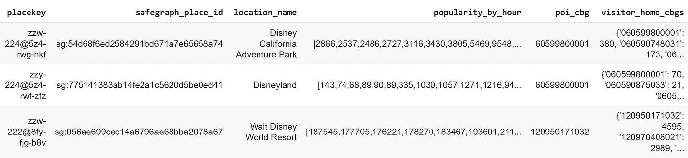
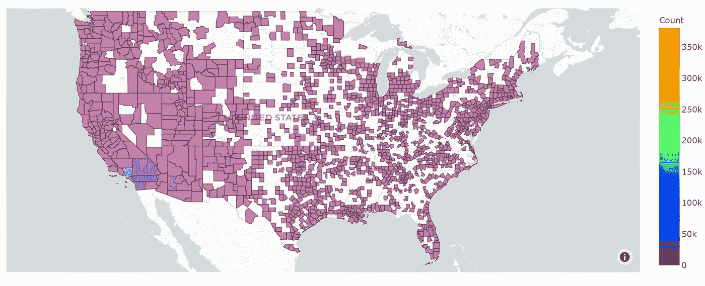
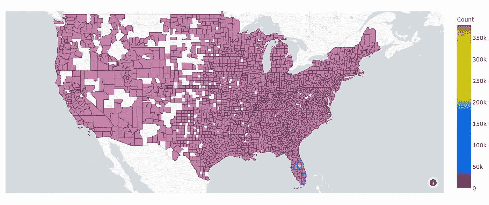
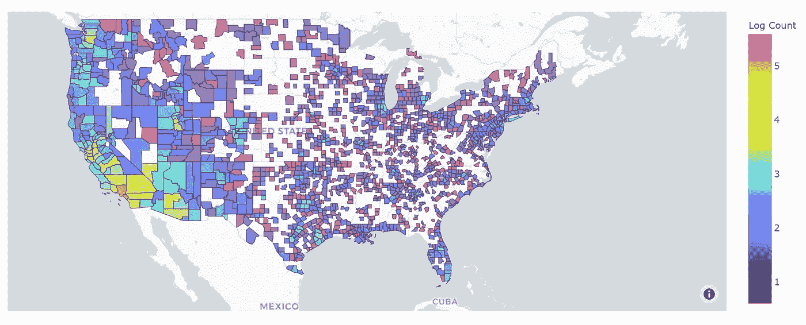
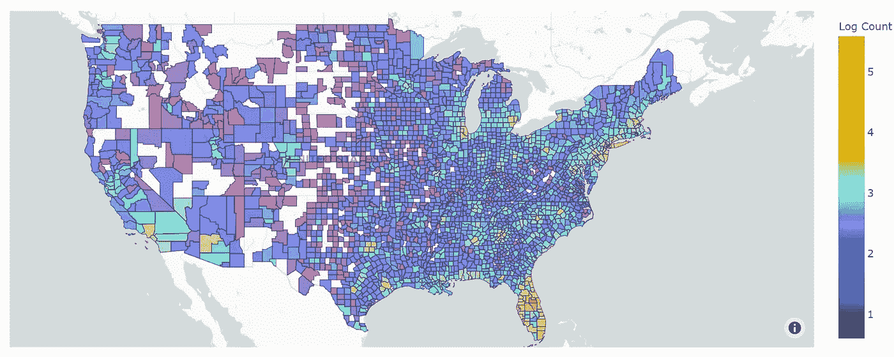

# 华特·迪士尼公司主题公园的参观模式

> 原文：<https://medium.com/codex/attendance-patterns-of-walt-disney-company-theme-parks-135dd755c6ca?source=collection_archive---------12----------------------->

Guillermo GR 在 [Unsplash](https://unsplash.com?utm_source=medium&utm_medium=referral) 上拍摄的照片

华特·迪士尼公司是世界上最大和最著名的企业集团之一。他们众多的商业冒险之一是基于他们知识产权的标志性游乐园。

世界上有许多这样的公园，但美国的两个是位于加利福尼亚州阿纳海姆的迪斯尼乐园(和它的姐妹公园加利福尼亚冒险乐园)和佛罗里达州布埃纳维斯塔湖的华特·迪士尼世界度假村。巧合的是，两者都位于一个名为奥兰治县的县。

由于这两个公园都是世界闻名的游乐园，该分析将显示每个公园接待的游客来自哪些县。在我们的分析中，我们将使用 [Safegraph](http://safegraph.com/) 混合 POI 模式数据(包含访问者家庭的人口普查区块组)以及美国各县的数据。日期范围将是 2019 年全年，因为这是数据中完全不受新冠肺炎疫情和封锁影响的最新一年。

SafeGraph 是一家数据提供商，为数千家企业和类别提供兴趣点和客流量数据。它免费提供数据，只要你注册一个[学术](https://www.safegraph.com/academics)。模式数据的模式可以在[这里](https://docs.safegraph.com/docs/monthly-patterns)找到。

有关 Colab 笔记本的链接，请点击此处:[链接](https://colab.research.google.com/drive/1vx9MxhwiBjBlVKRrvIW4s5S-_Ikv-J3t?usp=sharing)

# 设置

导入包和读取数据的过程都在上面。有关该主题的信息，请参考那里的注释和描述。

以下是华特·迪士尼世界和迪士尼乐园一个月的数据样本(也有迪士尼的加州冒险，但由于它们在同一个人口普查区块组中，本项目将两者视为一个公园)。

列描述:

*   placekey:唯一的 Safegraph Placekey，表示公园所在的特定位置……每行代表一个月。
*   safe graph _ place _ id:place key 中位置的唯一键。
*   location_name:位置的名称。
*   按小时计算的受欢迎程度:该地点在一个月内每小时的平均出席率。
*   poi_cbg:地点的人口普查区块组。
*   visitor_home_cbgs:公园游客所来自的人口普查区块组的字典。

# 分析

除了相关数据之外，模式数据的列已被删除。如上所述，这是 2019 年期间所有迪士尼乐园和迪士尼世界游客的游客家庭数据。然后提取 FIPS 县代码，然后使用该列与所有县代码的列表合并，以创建一个所有县的列表，在该列表中，公园参与者可以称自己为家，至少根据 Safegraph 的定义是这样的。

从那里，我们创建了出席模式的地图:

(注意:此数据集还包括阿拉斯加和夏威夷的数据，但缩小以查看它们会使地图变得不太有用，因此要查看这些数据，请查看笔记本。)

迪士尼乐园:

迪士尼世界:

(为了方便和易于比较，上面两张地图使用了完全相同的色标。)

乍一看，这些地图并不是非常有用，因为几乎所有县的方差都太低，颜色不会改变。我们可以推断的结论是，许多迪士尼乐园的游客来自其家乡加利福尼亚州奥兰治县以及南加州的周边县(如洛杉矶、圣贝纳迪诺、河滨和圣地亚哥县)，与迪士尼世界相比，很少有农村和人口较少的县有游客到迪士尼乐园。

迪士尼世界的游客绝对数量要多得多(其最大的县有超过 380，000 名游客，而迪士尼乐园最大的县有大约 119，000 名游客)，其最密集的客户群是佛罗里达州奥兰治县以及佛罗里达州中部和南部的其他地方。几乎美国的每个县都至少有一个迪斯尼乐园的游客，除了美国人口最稀少的县。

就数据集内全国的绝对游客人数而言，迪士尼世界预计将大幅领先:迪士尼世界在这一年内有 2，187，519 名游客，而迪士尼乐园有 556，933 名游客。迪士尼世界的游客数量略少于 4 倍，而且这只是在美国境内。迪士尼世界的外国游客很可能比迪士尼乐园多得多。

然而，如上所述，由于极少数县有大量的游客，这导致色阶向他们倾斜，导致几乎所有其他县都是紫色的。这使得地图不能提供更多的细节信息。因此，还使用以 10 为底的访问者数量的对数来创建地图，以减轻异常值的强度，并获得更具代表性的地图。

迪士尼乐园:

迪士尼世界:

(同样，为了方便和易于比较，上面两张地图使用了完全相同的色标。)

有了这个尺度，模式就更容易确定了。虽然上面提到的模式仍然是正确的，但它表明迪士尼乐园从加州(尽管没有南加州多)以及邻近的州，特别是亚利桑那州获得了很多游客。它在全国范围内也吸引了大量的游客，但只是在主要的城市地区或东北部。

对于迪斯尼世界来说，它在佛罗里达中部和南部仍然拥有最密集的游客人口。它几乎在这个国家的任何地方接待客人，更多的客人来自这个国家几乎主要的城市地区。除了南加州和周边地区之外，迪士尼世界无疑比迪士尼乐园接待了更多的游客，无论是相对游客还是绝对游客(如上所述)。

# 结论

这些结果是有意义的。迪斯尼乐园比迪斯尼世界小得多，也古老得多。它不像迪斯尼世界那样吸引人。华特·迪士尼世界度假村不仅仅是一个游乐园……它是一个巨大的综合体，占地 25，000 英亩，其中只有一半得到了实际利用。它比迪斯尼乐园大得多，也更多样化，基本上是它领域的主人。它有针对不同人群的公园和景点，吸引的游客不仅来自美国，还来自世界各地。如果有人有钱去迪斯尼乐园或迪斯尼世界，迪斯尼世界可能是更好的选择。

为了测试这个新假设(看到他们的访问者的实际人口统计和收入信息，而不仅仅是县一级)，我们将在第 2 部分对此进行调查…即将推出！

有关正在使用的数据的更多信息，请访问[安全图](https://www.safegraph.com)。任何人都可以自由使用上述数据来扩展或验证这些结论。

# 有问题吗？

我邀请你在 [SafeGraph 社区](https://www.safegraph.com/community)的 **#safegraphdata** 频道问他们，这是一个面向数据爱好者的免费 Slack 社区。获得支持、共享您的工作或与 GIS 社区中的其他人联系。通过 SafeGraph 社区，学者们可以免费访问美国、英国和加拿大 700 多万家企业的数据。