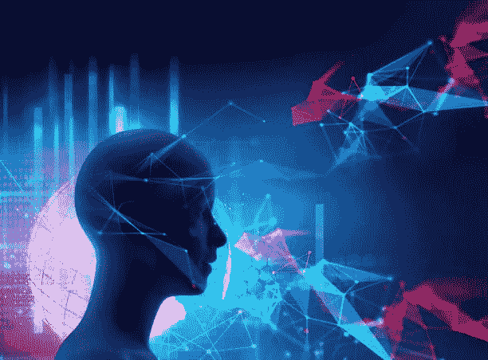
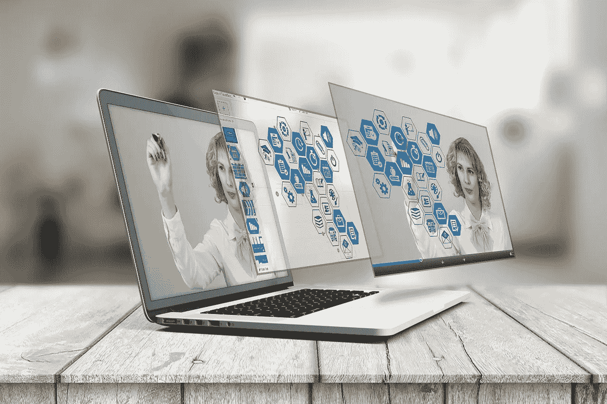
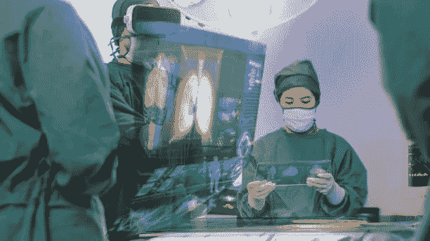

# 增强现实与虚拟现实的异同。

> 原文：<https://medium.com/codex/augmented-reality-vs-virtual-reality-the-similarities-and-differences-d0c84152db52?source=collection_archive---------31----------------------->

增强现实是我们物理环境的增强版本。我们可以通过数字增强层看到我们的自然物理环境。这个数字层是使用数字元素实现的，这些数字元素可以是视觉、声音或任何其他形式的使用数字手段传递的感官刺激。增强现实不同于混合现实和虚拟现实，尽管前者之间存在混淆状态。AR 的主要目的是突出我们物理环境的某些特征，并提高我们对这些特征的理解。Snap chat 是增强现实的一个例子，它有可用的过滤器，可以帮助你在拥挤的停车场定位车辆的应用程序，以及口袋妖怪应用程序。

增强现实不同于虚拟现实的地方在于，在前者中，已经存在的物理环境和虚拟信息可以获得更好的体验。另一方面，虚拟现实使用户沉浸其中，并允许他们居住在一个不同的环境中，一个在数字空间中创建的环境。也许，当今最著名的虚拟现实是元宇宙，在那里人们甚至可以购买和投资房地产，举行会议和聚会。

混合现实(MR)结合了虚拟和增强现实元素，因此数字对象可以与现实世界进行交互。

# 虚拟现实、磁共振和增强现实的心理影响

因为一个人可以创造扩展的现实，关于过去的经历和心理创伤是否可以用这些机制治愈的问题是不可避免的。有趣的是，治疗师已经开始在治疗中使用虚拟现实。治疗师将这项技术应用于暴露疗法——让患者在安全的空间体验他们害怕的事情，直到他们放弃对这种特殊体验的恐惧反应。

医生还使用虚拟现实来帮助患者通过逃避到一个更加和平的世界来处理身体疼痛。
专家对 AR 和 VR 系统的设计提出了警告，因为该技术在神经层面上影响了人们。扩展现实(AR、VR 和 MR)涉及交感神经系统，该系统负责逃跑或战斗反应，可以改变我们对物理世界的感知(我们的大脑无法区分虚拟和物理现实)。

**AR 和 VR 对当今世界的影响**

扩展现实在某些情况下被视为威胁，在其他情况下被视为机遇。一枚硬币有两面。有利有弊。以下是 AR 和 VR 对社会的影响——正面和负面

*   汽车行业:虚拟现实使工程师和设计师能够在试运行原型之前试验车辆的外观和构造。一些公司已经在应用这项技术，比如宝马和捷豹路虎。
*   医疗保健-2021 年 11 月。FDA 批准使用 VR 治疗成人疼痛减轻。虚拟现实也已经作为一种疼痛缓解机制应用于治疗烧伤。医疗专业人员还利用扩展现实来准备手术和治疗心理健康疾病的合适方法。
*   零售——元宇宙正在彻底重塑网上购物场景。使用虚拟现实，我们可以在购买衣服和鞋子之前先试穿。这节省了购物者的时间，减少了购买后退货的浪费。
*   旅游业-当我们谈论扩展现实时，这是受影响最大的行业之一。在这个场景中，封锁和流行病不能阻止你环游世界。在疫情之前，托马斯·库克在 2015 年推出了“先试后飞”活动，让游客在预订之前有一个虚拟的旅行体验。
*   Real estate- Matterport 是一家一直引领虚拟房屋探索的公司，它的 3D 相机可以对建筑物进行逼真的扫描，您可以使用 VR 进行参观。
*   建筑——有了虚拟现实，建筑师有了一种新的方式来设计和试验他们的工作。建筑师可以从看到一栋房子在现实中的样子，转移到它的感觉。
*   Sports- VR 为无法前往场馆或买不起赛事门票的球迷提供了一种开放体育赛事的方法。使用扩展现实，他们可以实时感受事件。

**扩展现实(AR、VR、MR)的弊端**

*   它的开发、部署和维护都很昂贵，而且在扩展的基于现实的应用程序方面也存在隐私问题。
*   身体上的互动将会减少，人们可能会错过面对面的重要时刻。
*   使用 AR 和 VR 需要充分的学习，学习过程漫长且代价高昂。

# 扩展现实的未来是什么样子的？

*   新的消费者体验消费者将能够进行 AR 旅行，沉浸式计算将更加普遍和容易获得，并将有更多个性化的 AR 体验。
*   体验经济——随着 AR 和 VR 能力的提高，我们消费内容的方法将会改变，从而让位于体验经济。
*   旅游公司将演变为使用 VR 和 AR 安排虚拟参观，我们将能够在实时创造新工作的过程中与虚拟人物互动——未来十年将见证一种不同的工作文化。
*   由于新技术，新的工作岗位，尤其是在技术领域，将会被创造出来。
*   弥合距离关系中的差距——技术一直在弥合时间和距离造成的差距。随着现实的扩展，我们将更加接近彼此。

**结论**

增强现实、虚拟现实和混合现实都是扩展现实的子集。这项技术前景广阔。想象一下，在虚拟现实中能够去约会，或者你在虚拟现实中的一个房地产被鬼魂缠身？我也忍不住想到我的一个虚拟现实工具会被鬼魂操纵，于是我在现实世界中变得经常出没。虽然听起来很滑稽，但这只能转化为扩展现实向我们展现的几乎无限的可能性。

这种创新需要时间来完善，它需要不断的升级，尽管有缺点，但这是一种将改变我们人类生活方式的创新。