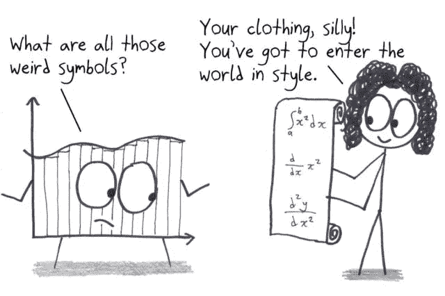
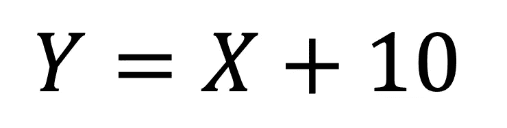
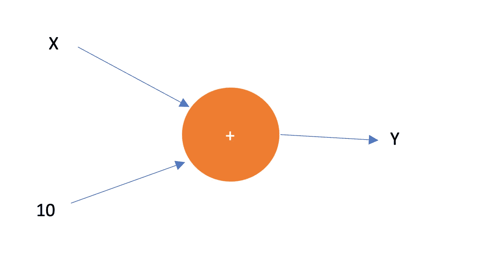
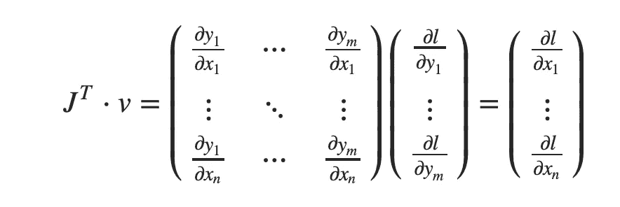

# PyTorch 亲笔签名——如何将其应用于定制功能

> 原文：<https://medium.com/codex/autograd-in-pytorch-how-to-apply-it-on-a-customised-function-4f0033430755?source=collection_archive---------8----------------------->

PyTorch 中的亲笔签名包使我们能够以友好的方式有效地实施梯度。

微分是几乎所有深度学习优化算法中的关键步骤。PyTorch 等深度学习框架可以轻松有效地计算梯度。它主要基于*计算图*，跟踪哪些数据通过哪些运算组合产生输出。这可以通过*反向传播程序实现。*这里， *backpropagate* 简单地说就是通过计算图进行追踪，填入关于每个参数的偏导数。



[微积分](https://arstechnica.com/science/2019/11/limits-schlimits-its-time-to-rethink-how-we-teach-calculus/)

# 为什么是渐变？

我们大多数人在高中都学过微积分。不管我们喜欢与否，我们都认为微积分在我们的日常决策中起着至关重要的作用。我们观察我们周围的环境，看看环境是如何以及在什么基础上变化的。这是微积分的一部分，导数主要用于描述动态环境。在机器学习算法中，特别是深度学习，我们处理大量的参数集，这些参数控制从输入到输出的映射。如果我们遵循直觉或一些随机选择，调整这些参数可能会很麻烦。这正是微积分，尤其是梯度计算拯救我们的地方。我们使用梯度来优化用于评估模型的客观指标。梯度指导我们设置模型的参数，以实现输入到输出映射的最小差异。

# 亲笔签名

Autograd 是集成在 PyTorch 中的一个包，用于方便任何类型的输入输出关系的梯度计算。这种关系甚至可以用于包含`for`和`if`语句的控制流类型函数。PyTorch 通过计算图实现自动签名功能。计算图只是一个使我们能够从输出反向传播到输入的图，输出通常是我们要计算其导数的函数，输入通常是模型中的参数。先说什么是计算图。

# 计算图形

假设我们想计算一个非常简单的增量函数的导数



递增函数

为了计算 Y 相对于 X 的导数(在特定点)，PyTorch 构建了一个计算图，如下图所示



计算图形

这个计算图是在 python 中通过将变量定义为张量自动构建的，张量是 PyToch 框架的基本构建块。下面的代码构建了前面的计算图

```
#import pytorch library
import torch # we want to calculate the derivative at point 3
X = torch.tensor(3, requires_grad=True)# define the output
Y = X + 10
print(Y)
```

输出将是

```
tensor(5., grad_fn=<AddBackward0>)
```

可以看出，Y 变量是设置了`grad_fn`的张量。为了激活给定变量的计算图，我们应该使用`requires_grad=True`，默认为`false`。

现在我们已经建立了 PyTorch 计算图，我们可以应用反向传播到 propgate 来计算 Y 相对于 x 的导数。我们可以通过在 PyTorch 中调用`backward`来完成此操作。

```
#call backpropagation
y.backward()
```

为了获得特定点的导数的值，我们应该将注意力转向推导导数所基于的预期变量。

```
#access the derivative value 
print(x.grad)
```

其输出为

```
[output]: tensor(1.)
```

因此，在点 3 处，Y 相对于 X 变量的导数的值是 1(实际上，在任意点，它都是 1，因为直线的斜率是常数)。就是这样。我们得到一个函数相对于某个特定点的一个单一值的导数。我们可以将相同的概念扩展到函数和参数的广泛范围。例如，下面的代码将渐变扩展到一个具有四个不同变量的函数。我们想计算 Y 相对于每个变量在特定点的梯度，这里是一个向量。

> 在使用带有向量输入的梯度时有一个小的注意事项。你应该给反向函数提供单位向量，以便将梯度作为一个向量来访问。

对于输入是大小为 3 的向量的情况，我们有

```
#a random vector 
X = torch.randn(3, requires_grad=True)#the output is also a vector 
Y = X + 10# a vector to be fed into backward
v = torch.tensor([1.0, 1.0, 1.0], dtype=torch.float32)Y.backward(v)
X.grad
```

输出将是

```
tensor([1., 1., 1.])
```

在梯度计算中包括单位向量是雅可比乘法的结果，其中在梯度中使用。向量-雅可比乘积计算如下:



向量雅可比乘积

如果不支持反向传播中的`v`向量，PyTorch 就不能产生渐变。

# 定制功能上的亲笔签名

我们可以将反向传播应用于定制的函数，该函数甚至没有被直接定义为现成的函数，例如加法和乘法。

假设我们有一个函数，形式为[【1】](https://d2l.ai/chapter_preliminaries/autograd.html):

```
**def** f(a):
    b = a * 2
    **while** b.norm() < 1000:
        b = b * 2
    **if** b.sum() > 0:
        c = b
    **else**:
        c = 100 * b
    **return** c
```

正如你所看到的，这个函数包含了许多循环和 if 语句。但是 PyTorch 中的自动签名功能可以轻松处理这个功能。我们可以像以前一样应用梯度计算

```
a = torch.randn(size=(), requires_grad=True)
d = f(a)
d.backward()
a.grad
```

这将给出给定随机点中定制函数的梯度。

# 脱离计算图形

有时我们希望运算不是计算图的一部分。例如，在深度学习范式中，在应用反向传播后，我们希望基于某种优化算法(如梯度下降)来更新参数。然而，我们不希望更新过程成为梯度计算的一部分，因为它显然不是目标函数的一部分。那么我们如何从计算图中排除更新过程呢？

PyTorch 为我们提供了一种从计算图中分离给定操作的能力。有三种不同的方式来满足这一愿望，如下所示:

```
#now x is part of computational graph
x = torch.randn(3, requires_grad=True)#first option
x.requires_grad_(False)#second option
y = x.detach()#last option
with torch.no_grad():
    y = x + 2
```

在上面的三个选项中，给定的变量和涉及的任何操作都与计算图分离，因此不是反向传播的一部分。

# 将梯度归零

在 PyTorch 中，默认情况下，渐变是随着更多的渐变被调用而累积的。换句话说，当前梯度的结果被加到先前调用的梯度的结果上。让我们通过一个例子来阐明这一点:

```
#the grad is accumulated
weight = torch.ones(3, requires_grad=True)
for epoch in range(4):
    model_out = (weight*3).sum()

    model_out.backward()
    print(f"The {epoch}-th round of gradeint applciation",weight.grad)
```

输出将是

```
[output]:The 0-th round of gradeint applciation tensor([3., 3., 3.])
The 1-th round of gradeint applciation tensor([6., 6., 6.])
The 2-th round of gradeint applciation tensor([9., 9., 9.])
The 3-th round of gradeint applciation tensor([12., 12., 12.])
```

模型输出是 3 和`weight.`的乘积。通过在模型输出上应用梯度，每次我们应用梯度时，结果将是 3(斜率是固定的)。我们期望看到，不管时间如何，我们应用梯度，结果将是 3。然而，由于 PyTorch 的累积，结果是累积的，因此取决于之前梯度应用的次数。为了解决这个问题，我们可以每次将梯度归零，如下所示:

```
#the grad is NOT accumulated
weight = torch.ones(3, requires_grad=True)
for epoch in range(4):
    model_out = (weight*3).sum()

    model_out.backward()
    print(f"The {epoch}-th round of gradeint applciation", weight.grad)

    #set the grad to zero
    weight.grad.zero_()
```

输出将是

```
The 0-th round of gradeint applciation tensor([3., 3., 3.])
The 1-th round of gradeint applciation tensor([3., 3., 3.])
The 2-th round of gradeint applciation tensor([3., 3., 3.])
The 3-th round of gradeint applciation tensor([3., 3., 3.])
```

正如你所看到的归零，我们将得到相同的梯度，每次我们应用梯度。

就是这样:)

# 结论

在这个简短的教程中，我们接触了 PyTorch 框架中的自签名包和渐变的概念。我们讨论了计算图以及如何将它应用于带有向量输入的函数。我们还研究了 PyTorch 中梯度的分离和累积特性以及如何解决它！