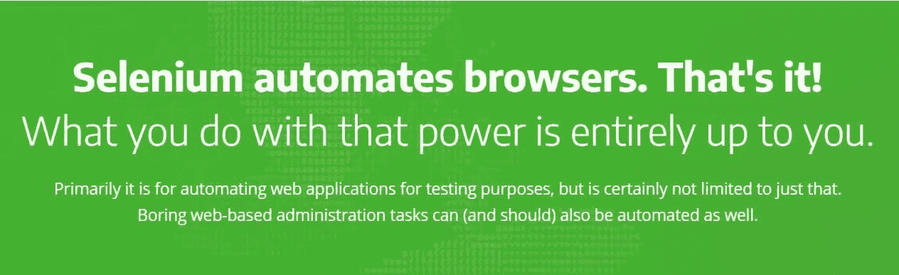

# 使用 Python Selenium 自动化枯燥的基于 web 的管理任务

> 原文：<https://medium.com/codex/automate-boring-web-based-administration-tasks-using-python-selenium-dd796adcde90?source=collection_archive---------3----------------------->

## 枯燥的基于 web 的管理任务也可以(也应该)自动化。

来自[https://www.selenium.dev/](https://www.selenium.dev/)的横幅图片

对于那些每天必须登录基于网络的工具来下载一些文件的人来说，浏览网络可能是每天的例行公事。