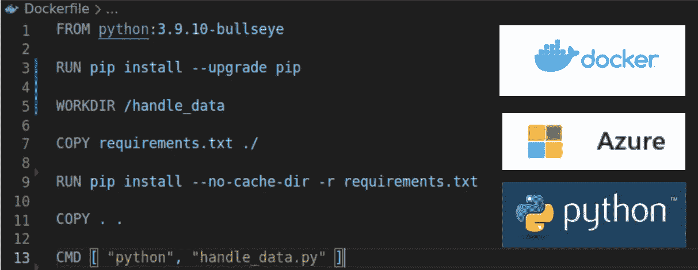
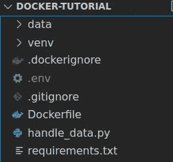
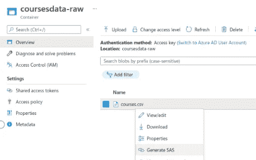
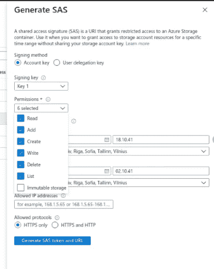
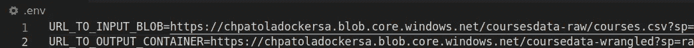

# Docker 自动化数据处理简介

> 原文：<https://medium.com/codex/automating-data-processes-with-docker-1d58576ce0c9?source=collection_archive---------4----------------------->

## -以 python、venv 和 Azure blobs 为特色



Docker logo 来自[https://www.docker.com/](https://www.docker.com/)，Azure logo 来自[https://azure.microsoft.com/](https://azure.microsoft.com/)python logo 来自[https://www.python.org/](https://www.python.org/)

# Docker 是什么？

Docker 是一个工具，可以用来为你的代码创建一个虚拟环境或者容器。如果您在本地机器上运行一段代码，例如 python 中的`print('Hello')`,该代码将在您计算机的操作系统(OS)中运行，带有您已安装的 python 和 python 包的版本，在您当前的文件结构中，并且可能使用您本地定义的环境设置。

使用 Docker，你可以定义你的代码应该在一个完全不同的环境中运行。这种环境的定义叫做形象。在 [Docker hub](https://hub.docker.com/) 上，您可以找到仅设置了操作系统的通用基础映像，但也可以找到更具体的映像。后者的一个例子是 python 基础映像。这里使用 Linux Debian 作为 OS，定义基本设置，并安装 python。基础映像用作您自己的映像(即环境定义)的起点。

任何人都可以将图像上传到 Docker Hub，并根据自己的需要使用它们，有点像 GitHub 或 GitLab。这意味着你也可以在 Docker Hub 上找到完整的项目。例如，运行整个应用程序的映像。

# 为什么要用 Docker？

使用 Docker 是解决代码在一个人的本地机器上运行却不能在另一个人的机器上运行的问题的一种方法。这些问题的出现是因为本地机器的环境不同。

> 开发人员 A 可能拥有 python 包的 2.2 版本，而开发人员 B 拥有 1.9 版本。a 使用了版本 2.2 中添加的新功能，因此，这对于 B 来说是不工作的，因为他有这个包的早期版本。如果后来更新了代码中使用的包，也会出现这种情况。新版本可能不再与使用的其他包兼容，因此代码无法编译。

使用 Docker(和 Docker compose，这是一种同时编排多个 Docker 映像运行的方法)的另一个原因是它极大地简化了开发，尤其是对于大型应用程序。如果您正在开发一个 web 应用程序，您有一个前端、一个后端和几个数据库，使用 Docker，您可以用一个命令一次性部署它们！

尽管 Docker 的好处可能在多人一起开发 web 应用程序时最为明显，但它在较小的项目中也会带来好处。Docker 可能不会使开发和运行您的代码变得更容易，但它肯定会为您省去调试环境不匹配的麻烦(这是一个不容忽视的问题！).

# 教程先决条件

要学习 docker 教程，您需要

**需要**:

1.  对您的计算机拥有管理员权限。如果您的物理计算机上没有，您可以通过 Azure/AWS/GoogleCloud 创建一个虚拟机，并使用该虚拟机
2.  安装 docker。你会在这里找到说明。如果您使用 Linux，您还应该创建一个 docker 用户组，这样您就不必在所有 docker 命令之前键入 sudo。你可以在这里找到[的说明](https://docs.docker.com/engine/install/linux-postinstall/)。

**好到有**:

3.对 python 的基本理解

4. [pip](https://pip.pypa.io/en/stable/installation) 已安装

5. [venv](https://docs.python.org/3/library/venv.html) 已安装

6.一个绑定了存储帐户的 Azure 帐户(针对演示的第 2 部分)

# 我们的演示简而言之

在本次演示中，我们将:

1.  将包含课程反馈数据的 CSV 文件读入 python
2.  向数据框添加列
3.  将数据框保存到新的 CSV 文件中
4.  让上述事情发生在 Docker 容器中，该容器从我们将要定义的图像中运行
5.  用 crontab 调度 docker 容器的运行

我们从本地读写文件开始(演示部分 1)，然后切换到从 Azure 容器读写(演示部分 2)。

# 我们项目的主要组成部分

为了将我们的新项目归档，我们需要项目目录具有以下结构:



项目目录结构

1.  我们想要运行的代码，在本例中，是一个名为 *handle_data.py* 的文件
2.  docker 文件将引用的要安装的软件包列表。在本例中，命名为 *requirements.txt* 。我们在 venv 包的帮助下创建包列表
3.  一份文件。这是我们想要运行代码的环境的定义/方法(操作系统、python 版本、python 包……)
4.  一个*数据*文件夹，用于我们的输入和输出数据
5.  答*。dockerignore* 文件，包含构建 docker 映像时不需要的文件名和文件夹名。在我们的例子中，一行带有/venv，一行带有. env。
6.  (一个*。env* 文件包含 *handle_data.py* 中引用的环境变量。)
7.  (如果使用版本控制，一个*。gitignore* 文件有一行带有/venv，一行带有。环境)

# 演示部分 1:本地文件

在演示的第一部分，我们将从本地计算机读取和写入文件。这是一种简单的开始方式，并且不需要外部源的连接器。

## 1.密码

我们在文件 *handle_data.py* 中的代码非常简单。我们从导入熊猫开始，然后读取、转换和写入数据。文件路径将在 docker 映像中创建和使用，并且在 */data* 之前的部分不一定必须对应于您的本地文件结构。

```
import pandas as pd# Read base data from local csv file
INPUT_FILEPATH= ‘./data/courses.csv’
course_feedback = pd.read_csv(INPUT_FILEPATH)# Create overall grade column
course_feedback[‘Overall’] = course_feedback.iloc[:, 4:7].mean(axis=1).round(2)# Write new data frame to CSV locally
OUTPUT_FILEPATH = ‘./data/course_feedback_finished.csv’
course_feedback.to_csv(OUTPUT_FILEPATH, encoding=’utf-8', index=False)
```

## 2.虚拟环境

接下来，我们需要上面代码使用的所有包的列表，这样我们可以确保它们在我们的 Docker 映像中都是可用的，并且代码可以顺利运行。尽管我们在代码中只导入熊猫，但这并不意味着这是唯一需要的包。熊猫有我们也需要包括在名单上的依赖。你可以谷歌一下它们是什么，最新的版本是什么。然而，更简单的方法是使用 python 虚拟环境。

虚拟环境背后的想法类似于 docker 的想法。当 docker 创建一个从操作系统开始到项目代码执行结束的独立环境时，python 虚拟环境创建一个从 python 版本开始到 python 包及其版本结束的独立环境。当我们为一个特定的项目创建一个 python 虚拟环境时，我们可以只安装该特定项目所需的 python 包(以及它们的版本)。因此，我们得到了一个苗条和干净的环境。当我们列出虚拟环境中已安装的软件包时，它比我们列出在基础环境中下载的所有软件包要短得多。如果我们安装了很多额外的包，我们的 Docker 镜像可能不会被破坏，但是它增加了镜像的大小(无论如何，镜像会很大)。

在 python 包 venv 的帮助下，我们得到了如下的精简包列表:

1.  当您在项目目录中时，运行`python -m venv ./venv`在该目录中创建一个名为 venv 的虚拟环境。
2.  运行`source venv/bin/activate`激活环境
3.  现在[装熊猫](https://pypi.org/project/pandas/)。Pip 将自动安装所需的依赖项。
4.  将包列表保存到 Docker 图像可以引用的文本文件:`pip freeze > requirements.txt`。现在，文件已经创建在项目目录的根目录下
5.  停用虚拟环境:`deactivate`
6.  (如果使用版本控制，请忽略虚拟环境目录)

## 3.Dockerfile 文件

Dockerfile 是一个文本文件，其名称(通常)没有任何扩展名。它所包含的“配方”是自上而下阅读的。食谱中每一步的类型(FROM，COPY…)都是用大写字母写的。你可以在这里找到关于文件结构[的详细信息](https://docs.docker.com/engine/reference/builder/)。

每个 Dockerfile 文件都以 FROM 子句开头。在这里，我们定义我们想要使用哪个图像作为我们的起点。因为我们将运行 python 脚本，所以我们可以使用安装了 python 的[图像。我选择的是基于 Linux Debian 的牛眼版本构建的 python 3 . 9 . 10 版本。](https://hub.docker.com/layers/python/library/python/3.9.10-bullseye/images/sha256-c59372055ab5f8f22b21964a58d5d7a2df1b7a09f10c18a687cb93f548ffe76c?context=explore https://www.debian.org/releases/bullseye/)

在用`RUN pip install —upgrade pip` 更新 pip 之后(安装是用 RUN 命令完成的)，我们创建一个工作目录在这个 Docker 映像中使用。这使得管理映像中的文件以及将它们映射到本地计算机上的文件变得更加容易(稍后将详细介绍)。我选择了路径 */handle_data* ，并将其写在 WORKDIR 子句之后。

下一步是安装我们需要的所有软件包。这是通过首先将(COPY clause)*requirements . txt*从我们的本地计算机复制到 docker 映像，然后——在运行 pip 升级后——使用 pip install 安装所有软件包来完成的。

之后，我们将本地机器上项目目录中的所有文件复制到 docker 映像中。

最后，在 CMD，即命令步骤中，我们定义当我们使用这个图像时，文件 *handle_data.py* 应该在 python 中运行。之前的所有步骤都将在我们构建映像时执行(混合各种成分)，但这一步只会在我们从映像运行容器时执行(开始使用完成的映像)。

```
FROM python:3.9.10-bullseyeRUN pip install --upgrade pipWORKDIR /handle_dataCOPY requirements.txt ./RUN pip install --no-cache-dir -r requirements.txtCOPY . .CMD [ "python", "handle_data.py" ]
```

## 4.存储输入和输出数据的地方

在演示的第一部分，我们将从本地文件中读取输入数据。因此，我们创建一个包含这个文件的数据文件夹[。](https://github.com/chpatola/docker-python-tutorial/blob/main/data/courses.csv)

## 5.行动的时间到了！

我们现在准备构建我们的 Docker 映像，然后从中运行一个容器！

我们的目标是从数据文件夹中读取输入 CSV 文件，让 handle_data.py 向数据框添加一个新列，并将结果作为新的 CSV 文件写入数据文件夹。我们从构建 Dockerfile 文件开始。在根目录中，运行这个代码`docker image build . -t <the name you want to give your image>`。我将图像命名为 *handle_data* 。

构建需要几分钟时间，您可以在终端中遵循这个过程。如果在这个过程中有任何问题，您将得到一个错误消息，并可以从那里进行调查。

我们的图像现在可以使用了。从映像运行容器的基本方式是使用命令`docker run <image name>`。然而，当运行一个容器时，我们必须意识到它是在自己的环境中运行的，独立于我们的本地机器。这些文件将在容器中被读写，我们将无法从本地机器中访问它们。这不是我们现在想要的。

幸运的是，有一种方法可以解决这个问题。我们可以将本地机器上的一个目录映射到我们在 docker 映像中设置的工作目录。这样，我们可以让输出 CSV 文件出现在本地机器上项目目录的 data 文件夹中。这是通过本地机器中的路径(如果我们直接从项目目录运行容器，我们可以使用`$(pwd)/data,` )、冒号和 docker 映像中的路径来完成的。

当从新的 docker 映像运行容器时，将 Docker 终端输出映射到我们本地机器的终端也是一个聪明的想法。这样我们可以看到信息或错误消息(如果有的话)(否则这些也只能在容器内部看到)。这是通过标志`-it`完成的。

从项目目录中运行容器的完整命令现在是:`docker run -it -v “$(pwd)/data:/handle_data/data" handle_data`。

当代码成功运行时，您应该在项目目录的 *data* 文件夹中看到输出文件*course _ feedback _ finished . CSV*。

很高兴我们现在已经成功地建立了一个基本的 docker 结构。然而，我们多久需要在本地计算机上自动读写一次文件？可能不经常。通常，我们从一个外部源读取，并向另一个外部源写入。这是我们将在本演示的第 2 部分中做的事情。

# 演示第 2 部分:Azure 容器中的文件

在演示的这一部分，我们将从一个 Azure 容器读取数据，并将其写入另一个容器。两个容器都是私有的，我们使用[共享访问签名(SAS)](https://docs.microsoft.com/en-us/azure/storage/common/storage-sas-overview)URL 进行认证。

## 1.密码

我们的代码需要一些更新来读写 Azure 容器。为了写入我们的 Azure 容器，我们需要导入 *ContainerClient* 。我们将把我们的 SAS 凭证存储为环境变量，因此需要导入 environ 来访问它们。

接下来，我们将路径更改为 *read_csv* ，以使用新环境变量 *URL_TO_INPUT_BLOB* 的值。最后，我们添加几行代码将输出文件写入 Azure 中的容器( *URL_TO_OUTPUT_CONTAINER* )。您可以在下面的**粗体**中找到所有更新。

```
**from os import environ**import pandas as pd**from azure.storage.blob import ContainerClient**# Read base data via blob sas url
course_feedback = pd.read_csv(**environ.get('URL_TO_INPUT_BLOB')**)# Create overall grade column
course_feedback['Overall'] = course_feedback.iloc[:, 4:7].mean(axis=1).round(2)# Write new dataframe to csv locally
LOCAL_FILEPATH = './data/course_feedback_finished.csv'course_feedback.to_csv(LOCAL_FILEPATH, encoding='utf-8', index=False)**#Write local csv to Azure blob
cont_cli = ContainerClient.from_container_url(environ.get('URL_TO_OUTPUT_CONTAINER'))****with open(LOCAL_FILEPATH, 'rb') as data:
cont_cli.upload_blob('course_feedback_finished.csv', data, overwrite=True)**
```

## 2.虚拟环境

由于我们刚刚在代码中导入了更多的模块，我们需要更新我们的包列表 *requirements.txt* 。通过演示第 1 部分的虚拟环境部分中的步骤 2-5 来完成，但是将`pip install pandas`换成`pip install azure-storage-blob`我们不需要安装*操作系统*，因为它已经包含在我们 docker 文件中使用的 python 基本映像中。

## 3.环境变量

正如你在我们的 *handle_data.py* 文件中看到的变化，我们将使用两个不同的 Azure 容器，一个作为输入，一个作为输出。让我们创造这些吧！

当您登录到 azureaccount 并转到您的存储帐户时，首先创建一个容器，您将在其中以 blob 的形式存储[输入数据](https://github.com/chpatola/docker-python-tutorial/blob/main/data/courses.csv)。上传文件后，左键单击该文件并选择“生成 SAS”。在弹出的菜单中，选择 sas 生效的时间范围，然后单击“生成 SAS 令牌和 URL”。不要关闭浏览器选项卡。



为 blob 生成服务协议

接下来，打开一个新的浏览器选项卡，为您的输出数据创建一个新的容器，左键单击该容器，然后再次选择“生成 SAS”。现在，请确保选择足够广泛的权限。除了“不可变存储”，我都检查了。然后，选择有效期，并再次单击“生成 SAS 令牌和 URL”。不要关闭浏览器选项卡。



SAS 选项

我们将通过名为*的文件传递环境变量。婀*。在项目目录中创建该文件，并编写一行带有**URL _ TO _ INPUT _ BLOB**=您的输入 BLOB 的 URL 的代码和一行带有**URL _ TO _ OUTPUT _ CONTAINER**=您的输出容器的 URL 的代码。



。环境文件模型

## 4.行动的时间到了！

我们的修改完成了！让我们再次构建更新后的 Docker 映像:`docker image build . -t handle_data`。

这一次，当我们从映像运行容器时，我们不需要将任何本地文件夹映射到 docker 文件夹。然而，我们需要做的是告诉 docker 它将在哪里找到我们在代码中引用的环境变量。这是通过标志`--env-file`完成的，后面是文件的路径。

`-it`标志仍然值得保留，因为这是我们第一次使用图像的更新版本，我们希望看到可能的错误消息。如果从项目目录的根目录运行它，完整的运行命令是`docker run --env-file .env -it handle_data`。

如果一切正常，您将在 Azure 输出容器中看到输出 CSV。

## 5.安排容器的自动运行

现在，当我们测试了映像并知道它可以工作时，我们可以安排容器定期运行，例如，每天晚上。为此，我们使用调度工具 crontab，它可以在 Linux 和 Mac 机器上使用。

通过写`crontab -e`在终端中打开 crontab。要在每天下午 7 点运行一次容器，请这样写:

```
0 19 * * * cd <full path to your project directory on your local computer> && docker run --env-file .env handle_data
```

如果你想了解更多关于 cron 是如何工作的，你可以看看[这个指南](https://ostechnix.com/a-beginners-guide-to-cron-jobs/)。

# 清除

如果您的系统上有一些 docker 映像，它们会很快占用您机器上的大量空间。养成经常清理你不再需要的图片的习惯是很好的。您可以使用命令`docker image ls`检查您的所有图像。用`docker image rm <image name>`命令删除不需要的图像。

移除多余的容器也是一种好的做法。你可以一个接一个地这样做，就像对图像一样，但是更快的方法是使用`docker system prune`。这将删除当前未运行的所有容器。如果您建立了缓存或未使用的网络，它们也会被删除。你可以在这里找到关于命令[的更多信息](https://docs.docker.com/engine/reference/commandline/system_prune/)。

# 结论

我们现在有办法从任何机器上按计划运行我们的代码。不管本地机器有什么操作系统、python 包或文件结构，我们的代码将总是运行在相同的操作系统上，有相同的包和相同的文件结构。

**有了这个，我们可以享受代码的可移植性和稳定性。**

如果你有兴趣了解更多关于 docker 的知识，我推荐[赫尔辛基大学的 Docker MOOC](https://devopswithdocker.com/) 。