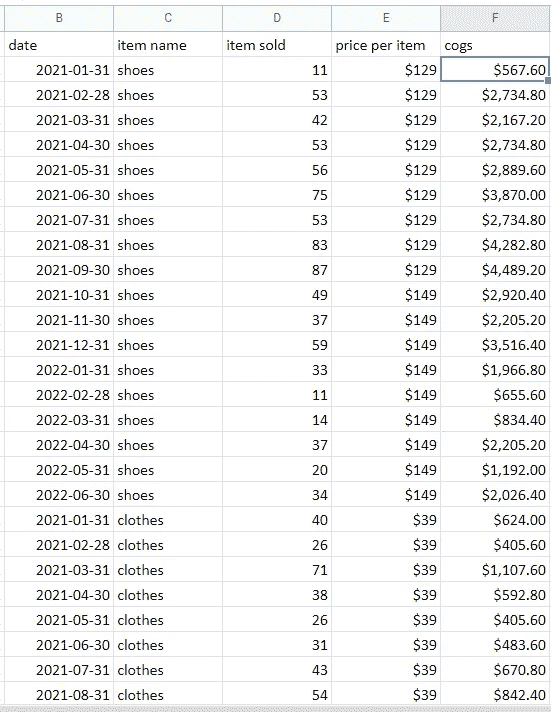
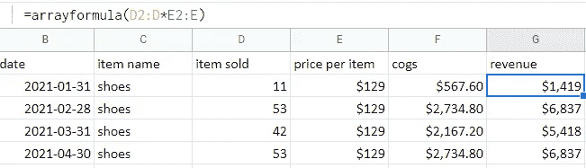
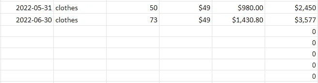
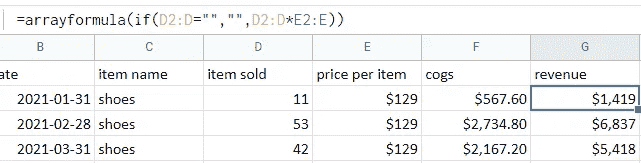
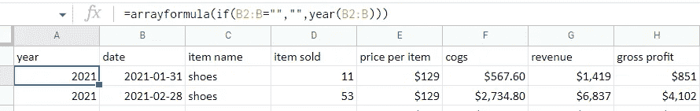
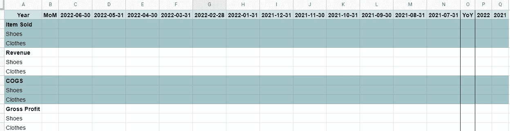
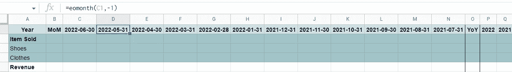
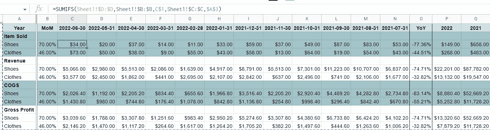
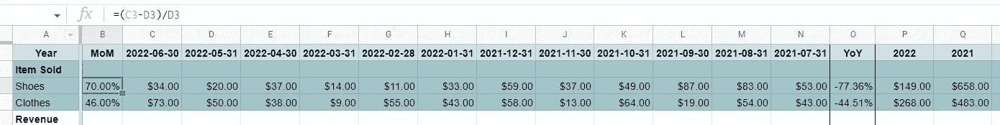
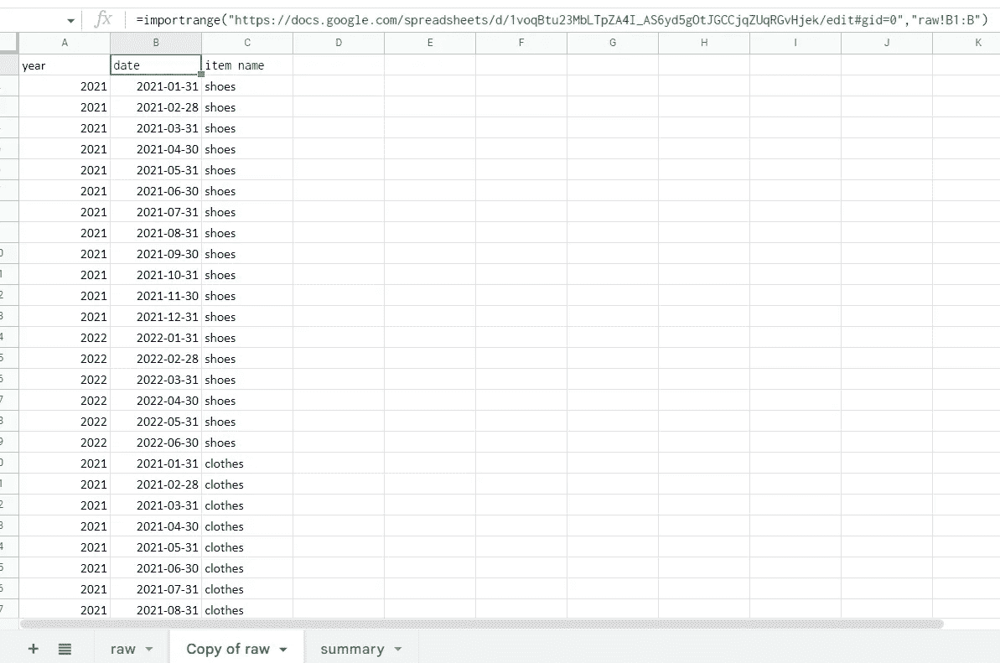

# 自动化 Google Sheets 报告

> 原文：<https://medium.com/codex/automating-google-sheets-reports-309ac1f0ed77?source=collection_archive---------3----------------------->

## 简化公式，减少繁琐的手动报告更新

这一次，我想分享一些 Google Sheets 公式，它们像魔法一样有效。让我们开始吧！

**场景:**

在下个月的每个月初，将有一个月摄取到 Excel 文件中的“原始”表，目标是有一个财务汇总表，作为自动更新的月末报告。因此，在 2022 年 1 月 1 日，2021 年 12 月的数据将被自动获取，因此我们需要一个自动化的 GSheet 报告，以避免每月初的人工操作。

**原始表单:**

作者的原始表单

下面是一个简单的原始数据示例，包含日期、商品名称、售出商品、每件商品的价格和 COGS。

1.  [**数组公式**](https://support.google.com/docs/answer/3093275?hl=en)

首先，我们想在现有数据旁边添加一个收入列，Item Sold * Price per Item 然而，如果我们使用简单的 **=D2 * E2** 公式，我们将不得不在每次有新的数据行时更新工作表。

为了自动化，我们可以在编辑第一行中的公式时按 Ctrl+Shift+Enter，并使用 [ARRAYFORMULA](https://support.google.com/docs/answer/3093275?hl=en) 函数。不要忘记在最后添加**:列**,使其成为一个数组公式而不是单个单元格公式(例如，D2:D 而不是 D2 ),它将自动用公式结果填充列中的下面单元格。

作者的数组公式示例

但是，请注意，它会用公式填充列的每个单元格，这可能会留下不需要的结果，如下面的 0:

作者对数组公式错误的说明

为了避免这种情况，我们可以添加一个 IF 条件，如下所示:

作者修改的数组公式示例

数组公式可以很好地处理大量的函数，比如 SUMIFS()、YEAR()、IF()等。所以一定要探索它们！

在这种情况下，我们还将添加年份和毛利列。

作者使用 Year 函数的数组公式示例

**2。**[**MAX**](https://support.google.com/docs/answer/3094013?hl=en)**&**[**EOMONTH**](https://support.google.com/docs/answer/3093044?hl=en)

一旦我们完成了原始数据，就该设计总结报告了。为简单起见，我们将使用下面的设计，它按项目名称、月份和年份报告所有指标。

作者设计的摘要报告

其次，我们希望更新第 1 行中显示的月份。为此，我们可以使用 [MAX](https://support.google.com/docs/answer/3094013?hl=en) ()函数从原始数据中获取最近的日期。

对于其他列，我们可以使用 [EOMONTH](https://support.google.com/docs/answer/3093044?hl=en) ()公式，因为我们希望每个月的最后一个日期落在一个月之前，因此-1 是它左边的日期。

作者的每月函数示例

**3。**

**接下来，为了填充报表，将使用 [SUMIFS](https://support.google.com/docs/answer/3238496?hl=en) ()而不是 SUM()，因为有多个条件，包括获得总和的正确月份和项目名称。例如，对于单元格 C3，我们希望仅获取 2022-06-30 和鞋类的销售项目的总和。**

****

**作者的 SUMIFS 函数示例**

**最后，我们可以添加月环比和年同比的简单计算来进行趋势分析。**

****

**作者逐月计算示例**

****加成:** [**导入范围**](https://support.google.com/docs/answer/3093340?hl=en)**

**如果您需要从另一个工作表、外部或多个 Google 工作表源获取原始数据，这个函数非常有用，因为它会导入整个列，并且与源列完全相同，因此不需要更新。**

**举例来说，日期和项目名称列从*原始表*导入到*原始表*的副本中。永远记住要加上" "，否则公式就不起作用。**

****

**作者的 Importrange 函数示例**

**手动更改和更新报告可能是非常累人和平凡的工作。因此，让我们尝试有效地减少浪费，并将其自动化。**

***如有任何疑问，可通过*[*LinkedIn*](https://www.linkedin.com/in/sharon-regina/)*联系我。希望这篇文章能帮助你减少无关紧要的浪费，并去做其他创造价值的工作:)。***