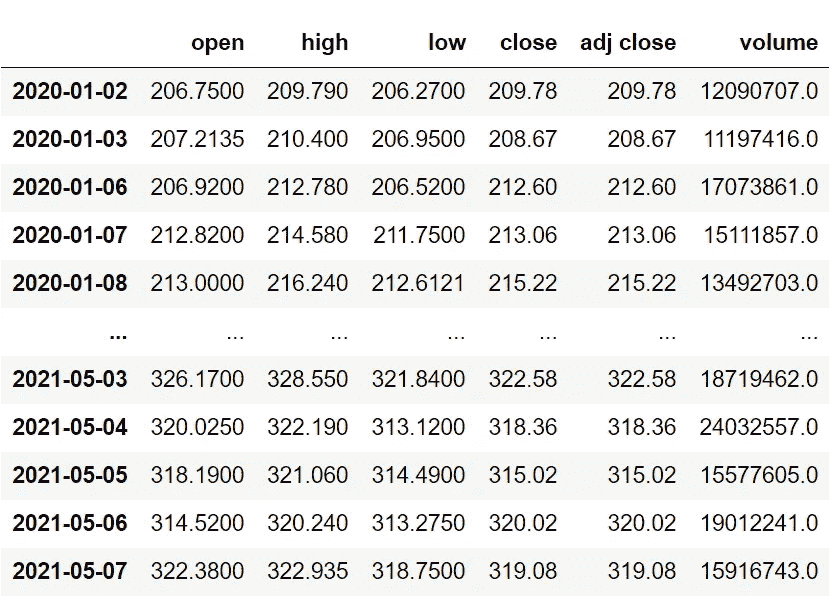
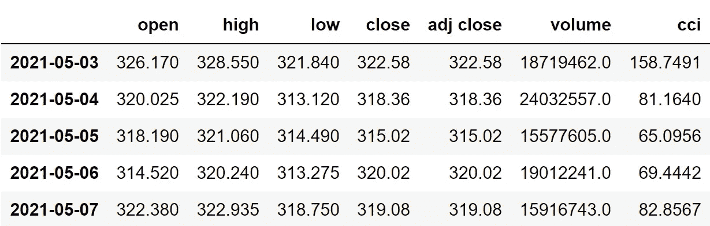
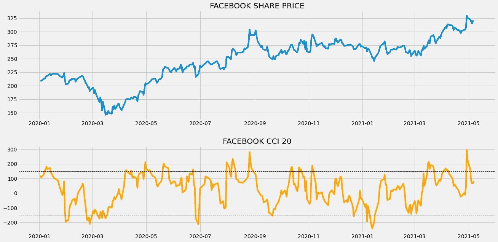
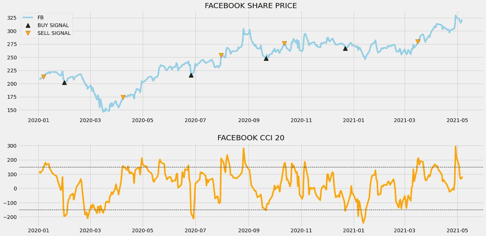
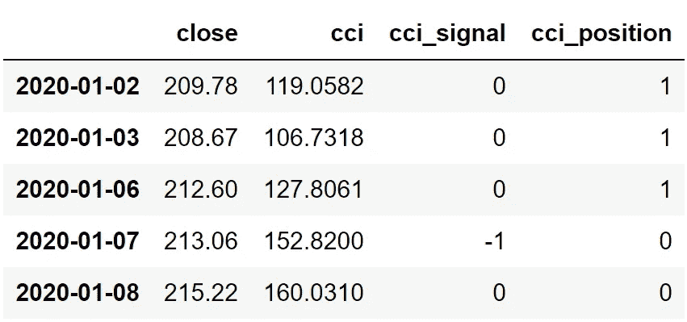

# 利用 Python 中的商品通道索引实现股票交易自动化

> 原文：<https://medium.com/codex/automating-stock-trading-with-commodity-channel-index-in-python-212a5f996de3?source=collection_archive---------1----------------------->


照片由 [Pexels](https://www.pexels.com/photo/white-and-black-magnifying-glass-on-white-paper-6120206/?utm_content=attributionCopyText&utm_medium=referral&utm_source=pexels) 的 Nataliya Vaitkevich 拍摄

## 使用 python 中强大的技术指标，通过算法交易进行无缝股票交易的分步指南

# 介绍

随着技术发明越来越多，股票交易的方法也随之演变。当我们回顾遥远的过去，比如 20 世纪 80 年代，甚至 90 年代，华尔街看起来就像是交易员们忙碌的场所。我们几乎不能理解周围发生了什么，交易者会在他们之间大喊大叫，在拍卖中购买股票。你能相信股票是在拍卖会上买的吗？感谢研究人员和工程师，他们通过将股票市场引入技术世界，建立并改革了股票市场部门。

即使像高频交易平台这样的技术在一段时间内被引入，我们作为人类认为原始因素特别是情绪会影响交易，有时会导致巨大的损失。为了掩饰交易者考虑的这些个人因素，算法交易被引入。这个概念非常有效，深受交易者的喜爱。它只不过是创造了一个机器人来实现股票交易过程的自动化。这个机器人是由交易者创建和控制的，一旦给定的技术条件得到满足，它就会执行交易。举个例子，假设你正在编写一个股票交易程序。你给机器人的条件是，当股票价格低于 250 美元时，买入，同样，当股票价格高于 400 美元时，卖出。这只是算法交易如何工作的一个例子，实际上，考虑到效率水平，这些类型的条件不会被交易者通过。

相反，他们使用一种叫做技术指标的工具来建立他们的条件或算法。有一篮子技术指标，但在本文中，我们将讨论一个特殊的指标，称为商品通道指数，简称 CCI，以及如何用 python 实现它来交易股票。事不宜迟，让我们进入文章。

在继续之前，如果你想在没有任何代码的情况下回溯测试你的交易策略，有一个解决方案。是[回测区](https://www.backtestzone.com/)。这是一个平台，可以免费对不同类型的可交易资产的任意数量的交易策略进行回溯测试，无需编码。点击这里的链接，你可以马上使用这个工具:【https://www.backtestzone.com/

# 商品频道指数(CCI)

CCI 是一个领先指标，衡量特定时期内当前价格与历史平均价格之间的差异，即当 CCI 的值显示极端正值时，则认为当前价格远高于历史平均价格。同样，当 CCI 的值显示极端负值时，则认为当前价格低于历史平均水平。从它的名字来看，人们可能会认为 CCI 只是用来交易商品的，但事实并非如此。它可以用于任何形式的市场交易，无论是股票还是外汇。CCI 最一般的设置是 20 作为指定的周期数。以 20 为周期数计算 CCI 的公式可表示如下:

```
**CCI = (TP - SMA 20 OF TP) / (0.15 * MEAN DEVIATION)**where,
**Typical Price (TP)** = (HIGH + LOW + CLOSE) / 3
**SMA 20 of TP** = Typical Price / 20
**Mean Deviation** = Absolute values of Typical Price / 20
```

该指标与其他领先指标不同，因为许多领先指标的值都在 0 到 100 之间，但 CCI 可以达到极值，就像一个无界振荡器。由于 CCI 的值不确定，交易者通过寻找价格反转的 CCI 的极值点来确定单个资产的超买和超卖水平。例如，想象外汇对欧元兑美元(EUR/USD)达到 150 的极端 CCI 水平，突然趋势发生变化(价格反转)，因此我们的欧元兑美元超买水平将是 150。类似地，想象同样的货币对达到了-150 的极端负 CCI 水平，突然趋势发生了变化，因此欧元兑美元的超卖水平将会是-150。这种确定超买和超卖水平的方法被称为反转策略。

**关于我们的交易策略:**我们的交易策略将是一个反转策略，我们将分析脸书的 CCI 价值，并确定超买和超卖的水平。当脸书的前一个 CCI 值大于超卖水平，而当前的 CCI 值小于超卖水平时，该策略将显示买入信号。同样，当脸书的前 CCI 值小于超买水平，而当前 CCI 值大于超买水平时，该策略将显示卖出信号。我们的交易策略可以表述如下:

```
**IF PREVIOUS CCI > OVERSOLD LEVEL AND CCI < COVERSOLD LEVEL = BUY
IF PREVIOUS CCI < OVERBOUGHT LEVEL AND CCI > COVERBOUGHT LEVEL = SELL**
```

现在我们已经了解了 CCI 的含义以及如何用它来建立交易策略。让我们使用 Python 来实现我们自己的基于 CCI 的交易策略，并对其进行回溯测试，看看它在现实市场中的表现如何。

在继续之前，关于免责声明的一个注意事项:本文的唯一目的是教育人们，必须被视为一个信息，而不是投资建议等。

# Python 实现

编码部分分为以下几个步骤:

```
**1\. Importing Packages
2\. Extracting Data from Alpha Vantage
3\. Extracting the CCI values from Alpha Vantage
4\. CCI Plot
5\. Creating the Trading Strategy
6\. Plotting the Trading Lists
7\. Creating our Position
8\. Backtesting**
```

我们将按照上面列表中提到的顺序，系好安全带，跟随每一个即将到来的编码部分。

## 步骤 1:导入包

将所需的包导入 python 环境是一个不可跳过的步骤。主要的包是处理数据的 Pandas，处理数组和复杂函数的 NumPy，用于绘图的 Matplotlib，以及进行 API 调用的请求。二级包是数学函数的 Math 和字体定制的 Termcolor(可选)。

**Python 实现:**

```
import pandas as pd
import numpy as np
import requests
from termcolor import colored as cl
from math import floor
import matplotlib.pyplot as pltplt.rcParams[‘figure.figsize’] = (20, 10)
plt.style.use(‘fivethirtyeight’)
```

既然我们已经将所有基本的包导入到 python 环境中。让我们用 Alpha Vantage 强大的股票 API 提取脸书的历史数据。

## 步骤 2:从 Alpha Vantage 中提取数据

在这一步，我们将使用 Alpha Vantage 提供的 API 端点提取脸书的历史数据。在此之前，关于 Alpha Vantage 的一个说明:Alpha Vantage 提供免费的股票 API，用户可以通过这些 API 访问各种数据，如实时更新，以及股票、货币和加密货币的历史数据。确保你在 Alpha Vantage 上有一个帐户，只有这样，你才能访问你的秘密 API 密匙(使用 API 提取数据的一个关键元素)。

**Python 实现:**

```
def get_historical_data(symbol, start_date = None):
    api_key = open(r'api_key.txt')
    api_url = f'https://www.alphavantage.co/query?function=TIME_SERIES_DAILY_ADJUSTED&symbol={symbol}&apikey={api_key}&outputsize=full'
    raw_df = requests.get(api_url).json()
    df = pd.DataFrame(raw_df[f'Time Series (Daily)']).T
    df = df.rename(columns = {'1\. open': 'open', '2\. high': 'high', '3\. low': 'low', '4\. close': 'close', '5\. adjusted close': 'adj close', '6\. volume': 'volume'})
    for i in df.columns:
        df[i] = df[i].astype(float)
    df.index = pd.to_datetime(df.index)
    df = df.iloc[::-1].drop(['7\. dividend amount', '8\. split coefficient'], axis = 1)
    if start_date:
        df = df[df.index >= start_date]
    return df

fb = get_historical_data('FB', '2020-01-01').iloc[:,:4]
fb
```

**输出:**



作者图片

**代码解释:**我们做的第一件事是定义一个名为‘get _ historical _ data’的函数，该函数将股票的符号(‘symbol’)作为必需参数，将历史数据的开始日期(‘start _ date’)作为可选参数。在函数内部，我们定义了 API 键和 URL，并将它们存储到各自的变量中。接下来，我们使用“get”函数提取 JSON 格式的历史数据，并将其存储到“raw_df”变量中。在对原始 JSON 数据进行清理和格式化之后，我们将以干净的 Pandas 数据帧的形式返回它。最后，我们调用创建的函数来提取脸书从 2020 年开始的历史数据，并将其存储到“fb”变量中。

## 步骤 3:提取 CCI 值

在这一步中，我们将借助 Alpha Vantage 提供的 API 端点获取脸书的商品渠道指数值。这一步和我们上一步做的差不多。

**Python 实现:**

```
def get_cci(symbol, n, start_date):
    api_key = open(r'api_key.txt')
    url = f'https://www.alphavantage.co/query?function=CCI&symbol={symbol}&interval=daily&time_period={n}&apikey={api_key}'
    raw = requests.get(url).json()
    df = pd.DataFrame(raw['Technical Analysis: CCI']).T.iloc[::-1]
    df = df[df.index >= start_date]
    df.index = pd.to_datetime(df.index)
    df = df.astype(float)
    return df

fb['cci'] = get_cci('FB', 20, '2020-01-01')
fb = fb.dropna()
fb
```

**输出:**



作者图片

**代码解释:**首先，我们定义一个名为‘get _ cci’的函数，它将股票的符号(‘symbol’)、CCI 的周期数(‘n’)和数据的开始日期(‘start _ date’)作为参数。在函数内部，我们首先分配两个名为“api_key”和“url”的变量，分别存储 api 键和 API URL。使用 Requests 包提供的“get”函数，我们调用 API 并将响应存储到“raw”变量中。在做了一些数据操作后，我们返回 CCI 值。最后，我们调用这个函数来提取脸书的商品通道指数值。

## 第四步:CCI 情节

在这一步，我们将绘制提取的脸书商品通道指数值，以使其更有意义。这一部分的主要目的不是在编码部分，而是观察情节，以获得对商品渠道指数的坚实理解。

**Python 实现:**

```
ax1 = plt.subplot2grid((10,1), (0,0), rowspan = 5, colspan = 1)
ax2 = plt.subplot2grid((10,1), (6,0), rowspan = 4, colspan = 1)
ax1.plot(fb['close'])
ax1.set_title('FACEBOOK SHARE PRICE')
ax2.plot(fb['cci'], color = 'orange')
ax2.set_title('FACEBOOK CCI 20')
ax2.axhline(150, linestyle = '--', linewidth = 1, color = 'black')
ax2.axhline(-150, linestyle = '--', linewidth = 1, color = 'black')
plt.show()
```

**输出:**



作者图片

上面的图表分为两个面板:上面的面板代表脸书的收盘价，下面的面板代表 CCI 值。作为领先指标，CCI 不能绘制在与收盘价相同的面板上，因为指标值和收盘价相差很大。因此，它与收盘价(在我们的例子中低于收盘价)分开绘制。如你所见，CCI 的值是如此的不确定，有时会达到极端值。你可以在 CCI 图上看到上下两条虚线，这是超买和超卖水平。确定波段水平是我们的选择，在我们的情况下，我们将超买水平设置为 150，超卖水平设置为-150，即当 CCI 超过 150 时，股票被认为处于超买状态，同样，当 CCI 低于-150 时，市场被认为处于超卖状态。我们将使用这些相同的水平来建立我们的交易策略。

## 步骤 5:创建交易策略

在这一步，我们将在 python 中实现讨论过的 CCI 交易策略，超买和超卖水平分别为 150 和-150。

**Python 实现:**

```
def implement_cci_strategy(prices, cci):
    buy_price = []
    sell_price = []
    cci_signal = []
    signal = 0

    lower_band = (-150)
    upper_band = 150

    for i in range(len(prices)):
        if cci[i-1] > lower_band and cci[i] < lower_band:
            if signal != 1:
                buy_price.append(prices[i])
                sell_price.append(np.nan)
                signal = 1
                cci_signal.append(signal)
            else:
                buy_price.append(np.nan)
                sell_price.append(np.nan)
                cci_signal.append(0)

        elif cci[i-1] < upper_band and cci[i] > upper_band:
            if signal != -1:
                buy_price.append(np.nan)
                sell_price.append(prices[i])
                signal = -1
                cci_signal.append(signal)
            else:
                buy_price.append(np.nan)
                sell_price.append(np.nan)
                cci_signal.append(0)

        else:
            buy_price.append(np.nan)
            sell_price.append(np.nan)
            cci_signal.append(0)

    return buy_price, sell_price, cci_signal

buy_price, sell_price, cci_signal = implement_cci_strategy(fb['close'], fb['cci'])
```

**代码解释:**首先，我们定义一个名为‘implement _ cci _ 策略’的函数，它以股票价格(‘价格’)和 CCI 值(‘CCI’)作为参数。

在这个函数中，我们创建了三个空列表(买入价格、卖出价格和 cci 信号),在创建交易策略时，这些值将被追加到这些列表中。

之后，我们通过 for 循环实施交易策略。在 for 循环内部，我们传递某些条件，如果条件得到满足，相应的值将被追加到空列表中。如果购买股票的条件得到满足，买入价将被追加到“buy_price”列表中，信号值将被追加为 1，表示购买股票。类似地，如果卖出股票的条件得到满足，卖价将被追加到“sell_price”列表中，信号值将被追加为-1，表示卖出股票。

最后，我们返回附加了值的列表。然后，我们调用创建的函数并将值存储到各自的变量中。除非我们画出这些值，否则这个列表没有任何意义。所以，让我们画出创建的交易列表的值。

## 步骤 6:绘制交易信号

在这一步，我们将绘制已创建的交易列表，以使它们有意义。

**Python 实现:**

```
ax1 = plt.subplot2grid((10,1), (0,0), rowspan = 5, colspan = 1)
ax2 = plt.subplot2grid((10,1), (6,0), rowspan = 4, colspan = 1)
ax1.plot(fb['close'], color = 'skyblue', label = 'FB')
ax1.plot(fb.index, buy_price, marker = '^', markersize = 12, linewidth = 0, label = 'BUY SIGNAL', color = 'green')
ax1.plot(fb.index, sell_price, marker = 'v', markersize = 12, linewidth = 0, label = 'SELL SIGNAL', color = 'r')
ax1.set_title('FACEBOOK SHARE PRICE')
ax1.legend()
ax2.plot(fb['cci'], color = 'orange')
ax2.set_title('FACEBOOK CCI 20')
ax2.axhline(150, linestyle = '--', linewidth = 1, color = 'black')
ax2.axhline(-150, linestyle = '--', linewidth = 1, color = 'black')
plt.show()
```

**输出:**



作者图片

**代码解释:**我们在绘制商品通道指数值，以及交易策略产生的买入和卖出信号。我们可以观察到，只要 CCI 低于超卖水平，图表中就会出现绿色的买入信号。类似地，每当 CCI 越过超买水平时，图表中就会出现红色的卖出信号。

## 步骤 7:创建我们的职位

在这一步中，我们将创建一个列表，如果我们持有股票，该列表将指示 1；如果我们不拥有或持有股票，该列表将指示 0。

**Python 实现:**

```
position = []
for i in range(len(cci_signal)):
    if cci_signal[i] > 1:
        position.append(0)
    else:
        position.append(1)

for i in range(len(fb['close'])):
    if cci_signal[i] == 1:
        position[i] = 1
    elif cci_signal[i] == -1:
        position[i] = 0
    else:
        position[i] = position[i-1]

cci = fb['cci']
close_price = fb['close']
cci_signal = pd.DataFrame(cci_signal).rename(columns = {0:'cci_signal'}).set_index(fb.index)
position = pd.DataFrame(position).rename(columns = {0:'cci_position'}).set_index(fb.index)

frames = [close_price, cci, cci_signal, position]
strategy = pd.concat(frames, join = 'inner', axis = 1)

strategy.head()
```

**输出:**



作者图片

**代码解释:**首先，我们创建一个名为‘position’的空列表。我们传递两个 for 循环，一个是为“位置”列表生成值，以匹配“信号”列表的长度。另一个 for 循环是我们用来生成实际位置值的循环。在第二个 for 循环中，我们对“signal”列表的值进行迭代，而“position”列表的值被附加到满足哪个条件上。如果我们持有股票，头寸的价值仍为 1；如果我们卖出或不持有股票，头寸的价值仍为 0。最后，我们正在进行一些数据操作，将所有创建的列表合并到一个数据帧中。

从显示的输出中，我们可以看到，在三行中，我们在股票中的头寸仍然是 1(因为 CCI 信号没有任何变化)，但是当 CCI 信号代表卖出信号(-1)时，我们的头寸突然变成了 0。我们的头寸将保持为 0，直到交易信号发生一些变化。现在是时候实现一些回溯测试过程了！

## 步骤 8:回溯测试

在继续之前，有必要知道什么是回溯测试。回溯测试是查看我们的交易策略在给定股票数据上表现如何的过程。在我们的例子中，我们将对脸书股票数据的 CCI 交易策略实施回溯测试过程。

**Python 实现:**

```
fb_ret = pd.DataFrame(np.diff(fb['close'])).rename(columns = {0:'returns'})
cci_strategy_ret = []

for i in range(len(fb_ret)):
    returns = fb_ret['returns'][i]*strategy['cci_position'][i]
    cci_strategy_ret.append(returns)

cci_strategy_ret_df = pd.DataFrame(cci_strategy_ret).rename(columns = {0:'cci_returns'})
investment_value = 100000
number_of_stocks = floor(investment_value/fb['close'][-1])
cci_investment_ret = []

for i in range(len(cci_strategy_ret_df['cci_returns'])):
    returns = number_of_stocks*cci_strategy_ret_df['cci_returns'][i]
    cci_investment_ret.append(returns)

cci_investment_ret_df = pd.DataFrame(cci_investment_ret).rename(columns = {0:'investment_returns'})
total_investment_ret = round(sum(cci_investment_ret_df['investment_returns']), 2)
profit_percentage = round((total_investment_ret/investment_value)*100, 2)
print(cl('Profit gained from the CCI strategy by investing $100k in FB : {}'.format(total_investment_ret), attrs = ['bold']))
print(cl('Profit percentage of the CCI strategy : {}%'.format(profit_percentage), attrs = ['bold']))
```

**输出:**

```
**Profit gained from the CCI strategy by investing $100k in FB : 16598.39**
**Profit percentage of the CCI strategy : 16.6%**
```

**代码解释:**首先，我们使用 NumPy 包提供的‘diff’函数计算脸书股票的回报率，并将其作为 dataframe 存储到‘FB _ ret’变量中。接下来，我们将传递一个 for 循环来迭代“fb_ret”变量的值，以计算我们从 CCI 交易策略中获得的回报，这些回报值将被追加到“fb_strategy_ret”列表中。接下来，我们将把“CCI _ 策略 _ret”列表转换成数据帧，并将其存储到“CCI _ 策略 _ret_df”变量中。

接下来是回溯测试过程。我们将通过投资 10 万美元到我们的交易策略中来回测我们的策略。首先，我们将投资金额存储到“投资值”变量中。之后，我们将使用投资金额计算我们可以购买的脸书股票数量。你可以注意到，我使用了 Math 软件包提供的“下限”函数，因为当投资金额除以脸书股票的收盘价时，它会输出一个十进制数。股票数量应该是整数，而不是小数。使用“底数”函数，我们可以去掉小数。请记住,“floor”函数比“round”函数要复杂得多。然后，我们传递一个 for 循环来寻找投资回报，随后是一些数据操作任务。

最后，我们打印了我们通过投资 10 万到我们的交易策略中得到的总回报，并且显示我们在一年中获得了大约 16500 美元的利润。那还不错！

# 最后的想法！

在前面很长的一段时间里，我们已经成功地研究了商品通道指数是什么，并且基于它的交易策略可以用 python 实现。但是，这篇文章仍有改进的空间:

*   风险管理:这是交易或投资要考虑的最重要的因素，必须采取一些措施来确保我们的交易被限制在特定的风险水平。承担风险的确是执行盈利交易的基本任务，但为了避免致命交易，在一定程度上保持这一点也同样重要。
*   **策略调整:**我们在本文中建立的交易策略可以被认为是最基本的，必须临时准备才能在现实市场中实施。使用算法交易进行股票交易的机构交易者通过结合各种相关特征和不同指标来过滤他们的策略，你也可以试试。我们没有涉及它，因为这篇文章的唯一目的只是教育人们 CCI 的含义。

还有一点我们在本文中没有给予更多的重视，那就是商品通道指数指标的数学部分。强烈建议仔细研究该指标背后的数学原理，因为这将有助于获得更多关于具体指标的知识，并将极大地帮助我们改进战略。此外，掌握指标背后的数学知识将帮助您增强信心，通过编程从头构建指标。所以，尽你最大的努力去跟进数学部分，即使我们在这篇文章中没有深入探讨。

就是这样！您已到达文章结尾。希望你能从这篇文章中学到一些有用的东西。如果您忘记了遵循任何编码部分，不要担心。我在文章末尾提供了完整的源代码。

## 完整代码:

```
import pandas as pd
import requests
import pandas_datareader as web
import datetime as dt
import numpy as np
import matplotlib.pyplot as plt
from math import floor
from termcolor import colored as cl

plt.rcParams['figure.figsize'] = (20, 10)
plt.style.use('fivethirtyeight')

def get_historical_data(symbol, start_date = None):
    api_key = open(r'api_key.txt')
    api_url = f'https://www.alphavantage.co/query?function=TIME_SERIES_DAILY_ADJUSTED&symbol={symbol}&apikey={api_key}&outputsize=full'
    raw_df = requests.get(api_url).json()
    df = pd.DataFrame(raw_df[f'Time Series (Daily)']).T
    df = df.rename(columns = {'1\. open': 'open', '2\. high': 'high', '3\. low': 'low', '4\. close': 'close', '5\. adjusted close': 'adj close', '6\. volume': 'volume'})
    for i in df.columns:
        df[i] = df[i].astype(float)
    df.index = pd.to_datetime(df.index)
    df = df.iloc[::-1].drop(['7\. dividend amount', '8\. split coefficient'], axis = 1)
    if start_date:
        df = df[df.index >= start_date]
    return df

fb = get_historical_data('FB', '2020-01-01')
print(fb)

def get_cci(symbol, n, start_date):
    api_key = open(r'api_key.txt')
    url = f'https://www.alphavantage.co/query?function=CCI&symbol={symbol}&interval=daily&time_period={n}&apikey={api_key}'
    raw = requests.get(url).json()
    df = pd.DataFrame(raw['Technical Analysis: CCI']).T.iloc[::-1]
    df = df[df.index >= start_date]
    df.index = pd.to_datetime(df.index)
    df = df.astype(float)
    return df

fb['cci'] = get_cci('FB', 20, '2020-01-01')
fb = fb.dropna()
print(fb.tail())

ax1 = plt.subplot2grid((10,1), (0,0), rowspan = 5, colspan = 1)
ax2 = plt.subplot2grid((10,1), (6,0), rowspan = 4, colspan = 1)
ax1.plot(fb['close'])
ax1.set_title('FACEBOOK SHARE PRICE')
ax2.plot(fb['cci'], color = 'orange')
ax2.set_title('FACEBOOK CCI 20')
ax2.axhline(150, linestyle = '--', linewidth = 1, color = 'black')
ax2.axhline(-150, linestyle = '--', linewidth = 1, color = 'black')
plt.show()

def implement_cci_strategy(prices, cci):
    buy_price = []
    sell_price = []
    cci_signal = []
    signal = 0

    lower_band = (-150)
    upper_band = 150

    for i in range(len(prices)):
        if cci[i-1] > lower_band and cci[i] < lower_band:
            if signal != 1:
                buy_price.append(prices[i])
                sell_price.append(np.nan)
                signal = 1
                cci_signal.append(signal)
            else:
                buy_price.append(np.nan)
                sell_price.append(np.nan)
                cci_signal.append(0)

        elif cci[i-1] < upper_band and cci[i] > upper_band:
            if signal != -1:
                buy_price.append(np.nan)
                sell_price.append(prices[i])
                signal = -1
                cci_signal.append(signal)
            else:
                buy_price.append(np.nan)
                sell_price.append(np.nan)
                cci_signal.append(0)

        else:
            buy_price.append(np.nan)
            sell_price.append(np.nan)
            cci_signal.append(0)

    return buy_price, sell_price, cci_signal

buy_price, sell_price, cci_signal = implement_cci_strategy(fb['close'], fb['cci'])

ax1 = plt.subplot2grid((10,1), (0,0), rowspan = 5, colspan = 1)
ax2 = plt.subplot2grid((10,1), (6,0), rowspan = 4, colspan = 1)
ax1.plot(fb['close'], color = 'skyblue', label = 'FB')
ax1.plot(fb.index, buy_price, marker = '^', markersize = 12, linewidth = 0, label = 'BUY SIGNAL', color = 'green')
ax1.plot(fb.index, sell_price, marker = 'v', markersize = 12, linewidth = 0, label = 'SELL SIGNAL', color = 'r')
ax1.set_title('FACEBOOK SHARE PRICE')
ax1.legend()
ax2.plot(fb['cci'], color = 'orange')
ax2.set_title('FACEBOOK CCI 20')
ax2.axhline(150, linestyle = '--', linewidth = 1, color = 'black')
ax2.axhline(-150, linestyle = '--', linewidth = 1, color = 'black')
plt.show()

position = []
for i in range(len(cci_signal)):
    if cci_signal[i] > 1:
        position.append(0)
    else:
        position.append(1)

for i in range(len(fb['close'])):
    if cci_signal[i] == 1:
        position[i] = 1
    elif cci_signal[i] == -1:
        position[i] = 0
    else:
        position[i] = position[i-1]

cci = fb['cci']
close_price = fb['close']
cci_signal = pd.DataFrame(cci_signal).rename(columns = {0:'cci_signal'}).set_index(fb.index)
position = pd.DataFrame(position).rename(columns = {0:'cci_position'}).set_index(fb.index)

frames = [close_price, cci, cci_signal, position]
strategy = pd.concat(frames, join = 'inner', axis = 1)

print(strategy.head())

fb_ret = pd.DataFrame(np.diff(fb['close'])).rename(columns = {0:'returns'})
cci_strategy_ret = []

for i in range(len(fb_ret)):
    returns = fb_ret['returns'][i]*strategy['cci_position'][i]
    cci_strategy_ret.append(returns)

cci_strategy_ret_df = pd.DataFrame(cci_strategy_ret).rename(columns = {0:'cci_returns'})
investment_value = 100000
number_of_stocks = floor(investment_value/fb['close'][-1])

cci_investment_ret = []

for i in range(len(cci_strategy_ret_df['cci_returns'])):
    returns = number_of_stocks*cci_strategy_ret_df['cci_returns'][i]
    cci_investment_ret.append(returns)

cci_investment_ret_df = pd.DataFrame(cci_investment_ret).rename(columns = {0:'investment_returns'})
total_investment_ret = round(sum(cci_investment_ret_df['investment_returns']), 2)
profit_percentage = round((total_investment_ret/investment_value)*100, 2)

print(cl('Profit gained from the CCI strategy by investing $100k in FB : {}'.format(total_investment_ret), attrs = ['bold']))
print(cl('Profit percentage of the CCI strategy : {}%'.format(profit_percentage), attrs = ['bold']))
```