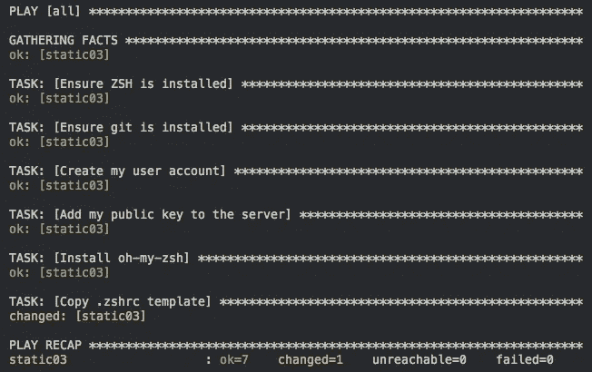
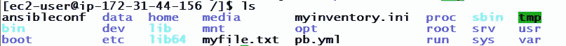
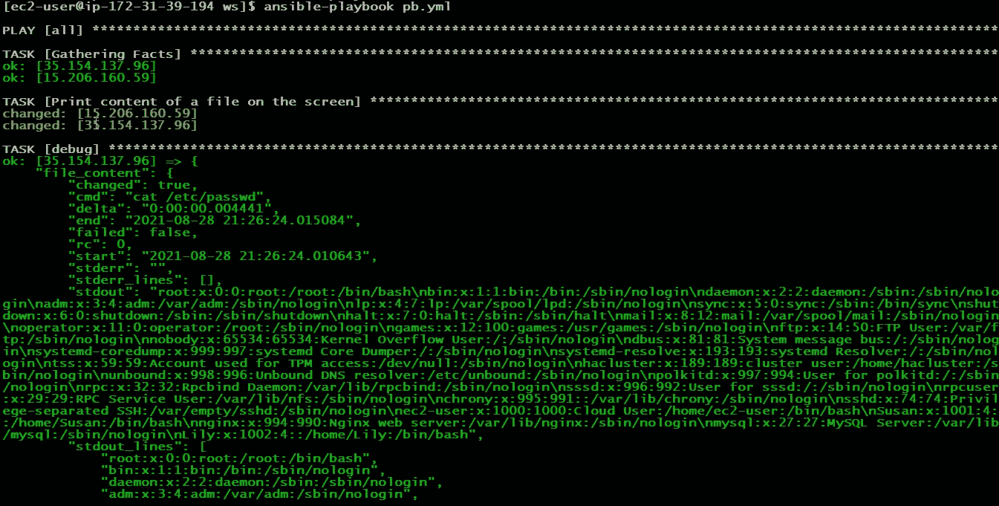

# Ansible 自动化

> 原文：<https://medium.com/codex/automation-with-ansible-b39706ff777?source=collection_archive---------6----------------------->

IT 自动化是创建软件和系统的一种方式，可以替代重复性任务并减少人工干预。这种方法加快了 IT 基础架构的交付，显著节约了成本，并使 IT 员工能够将更多精力放在战略工作上，而不是管理工作上。

Ansible 是一个开源工具，让 IT 自动化非常顺利。它使用 Python 编写的标记语言。它对我们的工作流产生了非常大的影响，因为它使我们能够自动化配置管理、云供应、应用部署、内部服务协调以及许多其他 It 需求。Ansible 由 Michael DeHaan 创建，2015 年被红帽收购。


图片提供

# Ansible 如何在⚙️工作

Ansible 安装在控制器节点中。在数据中心中，控制器节点是控制或管理其他节点的节点。被管理的节点称为被管理节点或目标节点。控制器节点通过 SSH 之类的网络协议管理目标节点(在 Ansible 脚本的帮助下)。


[图片由](https://intellipaat.com/blog/tutorial/devops-tutorial/ansible-tutorial/)提供

# 特色✨

## ⚡️ **声明式**

在 Ansible、SQL 这样的声明性语言中，我们只需要指定****要做什么****，而不是****怎么做****剩下的一切都是自动为我们管理的。因此，我们可以在不同的环境中运行相同的 Ansible 代码。例如，在 Ubuntu 中安装软件包的命令与在 Red Hat 中的命令不同。在 Ubuntu 中，我们使用 apt 包管理器，在 Red Hat 中，我们使用 yum。但是由于 Ansible 的声明性，它使我们能够用相同的命令在两种环境中安装所需的包。****

***像 python 和 ruby 这样的语言不提供这种类型的功能，因为它们本质上是命令式的。在命令式语言中，我们必须指定*“要做什么”*和*“如何做”*。***

## **⚡️简单**

**Ansible 为其开发者提供了丰富的**模块**(我们也可以创建自己的模块)。这些模块用于在目标节点上执行特定的任务。可以在命令或脚本的帮助下引用它们。这些任务包括安装包、重启系统、与 AWS、Gmail 等其他技术集成。**

**Ansible 的声明性来自这些模块。出于同样的目的，许多不同类型环境(Red Hat、Debian、Windows…)的模块都是可用的。每当我们在目标节点上执行 Ansible 脚本时，Ansible 首先收集关于它的所有必要信息(它的操作系统、版本……)。这些信息存储在一个变量中，称为**ansi ble**T2【Facts】T3。Ansible 然后在目标节点上执行适当的模块(针对该 OS/版本)。我们只需要在这里指定模块名和所需的参数，其余的一切都由 Ansible 自动管理。**

## **⚡️无代理**

**Ansible 使我们能够管理目标节点，而不必在它们上面安装任何额外的软件。**

## **⚡️幂等的**

**在数学中，幂等运算，除了最初的第一次，无论何时应用于一组特定的操作数，都不会改变结果。例如取一个数的绝对值，乘以 1。类似地，在同一代码的可预见执行中，在目标节点上多次执行(没有任何介入操作)与执行一次具有相同的效果。**

**我们编写可行的代码时，要记住和目标节点的期望状态，而不是它们的当前状态。Ansible 从事实中推断出系统的当前状态。则只在目标节点上执行与其所需状态不匹配的那部分脚本。这种方法节省了不必要的计算资源。**

****

**[图片由](https://ryaneschinger.com/blog/ensuring-command-module-task-is-repeatable-with-ansible/)提供**

**上图显示了执行 Ansible 脚本后获得的输出。这里，与所需状态不匹配的部分已被 Ansible 修改，并以琥珀色显示。与所需状态匹配的部分不会被 Ansible 触及，并且用绿色表示。**

## **⚡️平行度**

**默认情况下，Ansible 在五台主机上并行运行相同的任务。该设置也可以修改。**

## **⚡️集成**

**Ansible 可以很容易地与不同的技术集成。**

****

**[图片由](https://www.slideshare.net/JurajHantak/red-hat-ansible-automation-technical-deck)提供**

# **装置📥**

```
**pip3 install ansible**
```

****注意:** Ansible 不能直接安装在 Windows 中。在那里，你必须使用 Cygwin，或者 WSL，或者 Linux VM 来安装它。**

# **配置 Ansible**

**要配置 Ansible，我们需要创建它的清单和配置文件。清单文件是存储目标节点或主机详细信息的文本文件。它存储他们的 IP 地址和其他登录信息。每当 Ansible 必须与目标节点连接时，它都会引用这个文件。**

```
**mkdir /etc/ansible
touch /etc/ansible/hosts**
```

**这个文件可以用 INI 或 YAML 格式初始化。对于 INI，各个主机的详细信息以下列方式给出。**

```
**<IP1> ansible_user=<user_name> ansible_ssh_pass=<password> ansible_connection=ssh
<IP2> ansible_user=<user_name> ansible_ssh_pass=<password> ansible_connection=ssh
<IP3> ansible_user=<user_name> ansible_ssh_private_key_file=<file_path> ansible_connection=ssh**
```

**这里<ip1>、<ip2>和<ip3>是**主机**的 IP 地址，ansible_user、ansible_ssh_pass、ansible_connection、ansible_ssh_private_key_file 是**主机** **变量。**它们指定了关于连接的细节。</ip3></ip2></ip1>**

**也可以将一组主机归入一个名称下。这些集合被称为**组**。**

```
**[web_server]
<IP1> ansible_user=<user_name> ansible_ssh_pass=<password> ansible_connection=ssh
<IP2> ansible_user=<user_name> ansible_ssh_pass=<password> ansible_connection=ssh[load_balancer]
<IP3> ansible_user=<user_name> ansible_ssh_private_key_file=<file_path> ansible_connection=ssh**
```

**这里<ip1>和<ip2>是 web_server 组的一部分，<ip3>是 load_balancer 组的一部分。</ip3></ip2></ip1>**

**还提供了两个默认组:**

*   ****all:** 包含所有主机。**
*   ****未分组:**包含除 all 之外不属于任何其他组的所有主机。**

**现在在同一个目录中创建 Ansible 的配置文件，并用下面的值初始化它。**

```
**# This is ansible.cfg 
[defaults]
inventory = /etc/ansible/hosts**
```

**最后，安装 sshpass 来完成配置。**

# **可行的命令👨🏻‍💻**

**通过**特别命令**或**战术手册**给出可行的指令。临时命令是在主机上运行的单行命令。临时命令如下所示:**

```
**ansible <group or hostname> -m <module> -a "<module parameters>"**
```

****检查与所有主机的连通性****

```
**ansible all -m ping**
```

****

**收集关于主机的事实。事实是 Ansible 的内置变量，我们可以在脚本中使用这些变量。以下命令的输出以 JSON 格式返回。**

```
**ansible all -m setup**
```

****

**JSON 格式的输出**

****创建文件**，使用 shell 模块对目标节点执行基于主机的 shell 命令。**

```
**ansible all -m shell -a 'touch /myfile.txt'**
```

********

**在第一个目标节点中创建新文件**

****

**在第二个目标节点中创建新文件**

****检查所有目标节点中的当前磁盘使用情况**。在这里，我们以非 root 用户的身份登录。**

```
**ansible all -m shell -a 'fdisk -l' -u user1 --become -K**
```

*   **`-u`用于指定用户名**
*   **`--become`用于权限提升**
*   **`-K`用于提示用户输入权限提升密码**

****

****注意:**默认情况下，shell 模块不是等幂的，我们必须在脚本中使用条件语句来使其等幂。即使我们知道该任务的正确命令，使用一个模块也是好的，因为模块涵盖了所有的边缘情况。**

**Ansible 命令的主要缺点是我们一次只能给出一个命令。我们可以借助叫做剧本的脚本来克服这个缺点。它们以 [YAML](https://docs.ansible.com/ansible/latest/reference_appendices/YAMLSyntax.html) 格式编写，并按顺序执行。它们就像一个待办事项列表，使我们能够在目标节点上执行复杂的任务。**

# ****可行行动手册的构建模块**📋**

****

**[图片来源](https://rawstorage.wordpress.com/2019/07/16/dell-emc-official-ansible-modules-for-powermax-v1-0/)**

## ****扮演****

**一个 play 是映射到一组主机的一组[任务](#fe2e)。**

## **主机**

**这是一个关键字，它定义了我们要在其上执行我们的游戏的 IP 地址组。**

```
**hosts: 192.168.0.33, 192.168.0.144**
```

**我们可以使用组变量来指定主机，而不是手动键入 IP 地址。**

```
**hosts: <group1>, <group2>**
```

## ****任务****

**任务是戏剧中的一个工作单元。它指定了一个模块及其参数。我们还可以使用可选的 name 关键字来命名我们的任务，它使我们能够定义我们的任务，也有助于调试。**

****在目标节点上安装软件包:**我实际配置了两个目标节点，一个运行在 Ubuntu 上，另一个运行在 RedHat 上。Git 没有安装在其中任何一个中。**

****

```
**- hosts: all
  tasks:
  - name: "Installing git"
    package:
      name: git
      state: present**
```

*   ****包**模块用于检测目标节点的默认包管理器，并在其上安装所需的软件。**
*   **如果您以非根用户身份登录，请使用**变成**模块。**

**命令来检查剧本的语法错误。**

```
**ansible-playbook <pb_name> --syntax-check**
```

****

**执行行动手册。**

```
**ansible-playbook <pb_name>**
```

********

**RHEL8 操作系统上安装的 Git**

****

**安装在 Ubuntu OS 上的 Git**

**这演示了 Ansible 的声明性。请注意，我们在两个不同的环境中执行相同的脚本是多么容易。**

## ****评论****

**注释在 YAML 中以井号(#)开始，一直延续到行尾。**

```
**# This is a comment**
```

## ****变量****

**变量通过用动态值替换硬编码值来帮助我们增加剧本的灵活性。**

**使用**变量**模块声明变量。我们使用 [**Jinja 模板引擎**](https://jinja.palletsprojects.com/en/3.0.x/) 在剧本的其他部分引用这些变量。**

```
**- hosts: all
  tasks: 
    - name: "Adding user account"
      vars:
        username: "Susan"
        groupname : "adm"
        pw: "pass123"
      # Using user module to create a new user
      user: 
        name: "{{ username }}"
        state: present
        group: "{{ groupname }}"
        password: "{{ pw }}"**
```

****

****列表:**列表用于在一个名称下存储一组值。**

```
**- hosts: all
  tasks:
  - name: "Ensure file is in place"
    vars:
      mylist:
        - "/ws/test.txt"
        - "/files/test.txt"
    # Copy module copies a file from Controller Node to Target Node
    copy:
      # Referencing list variables
      src: "{{ mylist[0] }}"
      dest: "{{ mylist[1] }}"
      owner: root
      group: root
      mode: 0644**
```

****

****变量文件:**为了便于维护，变量也可以存储在一个单独的文件中。我们可以用下面的方式引用文件变量。**

**变量文件:**

```
**# This is /ws/vars.yml
nam: "nginx"
state: "started"
enabled: "yes"**
```

**行动手册:**

```
**- hosts: all
  vars_files:
    - "/ws/vars.yml"
  tasks:
  - name: "Enable and Start the Service persistently"
    service:
      name: "{{ nam }}"
      state: "{{ state }}"
      enabled: "{{ enabled }}"**
```

****

****注册变量:**我们可以将一个特定的可执行任务的输出存储在一个变量中。这些变量被称为注册变量，可以在游戏的后面部分使用。**

## **用户输入**

**用户输入可以在 **vars_prompt** 模块的帮助下进行。默认情况下，用户输入是隐藏的，但可以通过设置`private: no`使其可见。**

```
**- hosts: all
  vars_prompt:
    - name: username
      prompt: Enter the name of the user that wou want to add
      private: no
    - name: groupname
      prompt: Enter the group in which you want to add the user
      private: no
    - name: password
      prompt: Enter the password
  tasks:
  - name: "Adding user account."
    user:
      name: "{{ username }}"
      state: present
      group: "{{ groupname }}"
      password: "{{ password }}"**
```

****

## **程序输出**

****debug** 模块用于打印输出到控制台。下面的剧本打印了一个文件的内容。**

```
**- hosts: all
  tasks:
  - name: Print content of a file on the screen
    shell:  cat /etc/passwd
    register: file_content- debug:
      var: file_content**
```

****

## ****条件句****

**在行动手册中，您可能想要执行不同的任务，或者根据某些条件，拥有某个事实或变量的值。为此，您必须使用 **when** 子句。**

**以下行动手册检查磁盘使用情况。**

```
**- hosts: all
  tasks:
  - name: Check /tmp freespace
    shell: df /tmp --output\=avail | tail -1
    register: tmp_freespace

  - fail:
      msg: /tmp does not have the minimum space required to continue (3Gb requested). 
    when: tmp_freespace.stdout|float is lt 3000000**
```

**来源:**

**h[ttps://gist . github . com/Alexander Adam/5661307 ef 6a D1 F4 f 42 fa 954524104219](https://gist.github.com/alexanderadam/5661307ef6ad1f4f42fa954524104219)**

****

## ****循环****

**循环用于多次重复一项任务。下面的循环遍历一个列表**

```
**- hosts: all
  tasks:
    - name: "Install the packages in the list"
      vars:
        package_list:
          - perl
          - git
          - mariadb-server
      package: name="{{ item }}" state=present
      with_items: "{{ package_list }}"**
```

****

**更多信息，请参考官方 [Ansible 文档](https://docs.ansible.com/ansible/2.3/playbooks.html)。**

**这是 Skalavala 为 Jinja 模板制作的备忘单:**

****

**斯卡拉瓦拉的小抄**

****注意:**在写剧本时，我们应该主要关注小任务，而不是复杂的大任务。这样的工作更容易管理，也不那么令人生畏。将我们的需求分解成更简单的步骤并为这些步骤编写代码是很好的。**

# **结束语**

**Ansible 是一个最先进的自动化工具。包括美国宇航局在内的许多科技巨头也使用它来加快服务交付。可回答的范围很大。它在 DevOps 周期中发挥着巨大的作用，也可以用于部署物联网设备。**

****

**[图像来源](https://www.slideshare.net/khairulzebua/02-ansible-automateskeynotejakarta)**