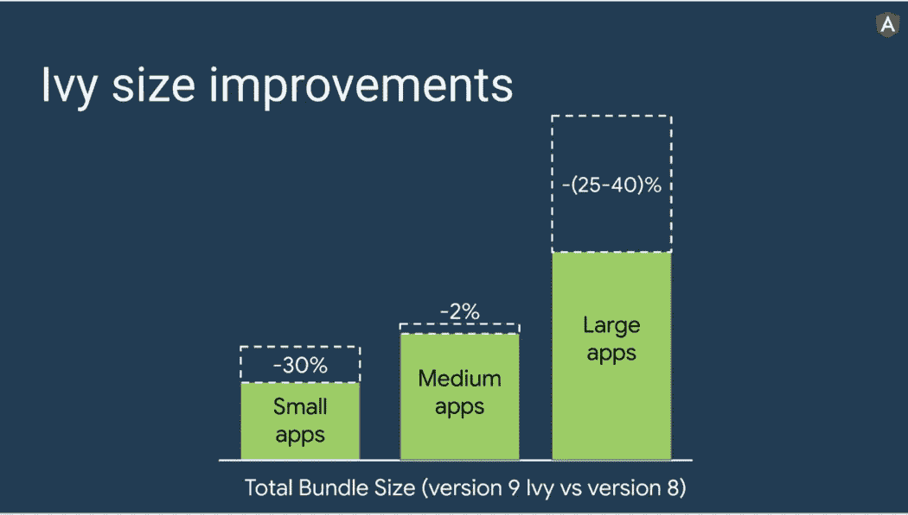

# 当你是一个有角度的开发者时，避免这些不好的实践

> 原文：<https://medium.com/codex/avoid-these-bad-practices-when-you-are-an-angular-developer-135323db74c7?source=collection_archive---------1----------------------->

自从第一次出现以来，Angular 带来了一整套新功能，使 web 开发人员的生活更加轻松，也降低了创建应用程序的成本。在这些特性中，该框架具有基于 MVC 的更清晰的体系结构、由 ivy 项目加强的高速和优化的性能、类型脚本兼容性、集成的路由系统和有效的数据绑定方式等。…

由于这些因素，Angular 在 web 应用程序领域获得了巨大的优势，因为许多企业和团队都在他们的项目中采用它。但是就像任何强大的工具一样，如果使用不当，它会给使用者带来一些伤害。因此，在本文中，我们将强调开发人员所犯的常见错误，并提出解决方案来纠正这些错误。

## **你应该了解你正在使用的工具**

Angular 最重要的优势之一是它的架构，这使得编写干净的代码比开发人员前些年编写的经典 JQuery spaghettis 代码容易得多。

这种架构有一组构建模块，如服务(帮助我们组织业务逻辑，如数据操作、与外部 API 的交互)和组件(显示应用程序的数据并捕获用户交互)、管道、指令等

Angular 应用程序上最常见的不良实践与违反关注点分离原则有关，这可能是由于缺乏框架知识或忽视干净的代码或急于尽快交付项目。有很多例子可以说明这种不好的做法，但是我们举了一个简单的例子来说明它

**在组件内部编写外部系统交互**

最好在服务中编写外部 API 调用和数据操作，因为它就是为此而设计的。让我们看看下面的代码

这段代码有两个主要缺陷:

*   我们用一些不应该存在的业务逻辑污染了构造函数。一般来说，构造函数应该只包含初始化。
*   我们在组件中编写了连接到 Github API 的代码，这是放置这种代码的一个不好的地方。在我们的例子中，我们只是简单地调用了一个 URL，而没有为准备请求做太多的工作，但是一旦我们想要创建一个更复杂的请求，问题就会更加突出。组件应该处理用户交互并显示数据，而不携带请求本身(端点、头等)。其次，通过这样的实践，我们降低了其他组件对该代码的可重用性，这些组件必须重新创建连接到 API 的逻辑。

所以这样的组件应该被重构为这样:

我们创建了一个名为 Repository 的类，它将包含 API 返回的 JSON 的序列化(我们将在本文后面讨论 typescript)，然后我们将 API 交互移动到一个特定的服务中，之后我们从我们的组件中调用它。

**误用或不使用某些角度特征**

如前所述，Angular ecosystem 有许多组件可以帮助开发人员，但其中许多根本没有被开发人员使用或误用。最常见的不良使用实践主要涉及指令和管道。

**指令:**是简单的类，用新的功能扩展 HTML 元素，并对它们应用定制代码([文档](https://angular.io/guide/built-in-directives))。

在许多情况下，开发人员倾向于编写无用的指令，可以用简单的 CSS 选择器来代替，尤其是样式丰富的选择器。

在其他情况下，我们看到一些指令具有复杂的逻辑来检索和操作数据，这违背了它们呈现数据的目的(以简单或复杂的方式)。因此，我们需要将这样的逻辑分离成单独的服务。

**管道:**它们被定义为将输入转换为所需格式的函数，它们直接应用于模板。让我们看看下面的代码，用户必须输入一个以字节为单位的文件大小，然后我们的程序将它转换成一个以兆字节为单位的更可读的人类格式

这段代码的主要问题是，如果我们想在任何其他组件中重用文件大小格式化的逻辑，那么我们必须复制它，或者我们可以在一个单独的函数中提取它，但幸运的是，有更好的方法来使用管道重构这段代码:)

首先，我们必须创建我们的管道

然后我们可以在我们想要格式化文件大小的任何地方调用组件内部的管道。

我们可以通过允许每个调用者指定大小单位(GB、TB 等)来增强我们的管道，但我们只是使用示例来演示如何使用管道来重构我们的代码，而无需输入管道细节。

# **别忘了退订**

在 Angular 应用程序中，我们总是需要连接服务来获取数据。但是如果这些订阅管理不善，它们会导致内存泄漏。让我们以一个简单的应用程序为例，该应用程序包含一个定期推送值的服务，以及一个订阅该服务并在控制台上记录该值的组件:

这段代码似乎没什么问题！我们可以看到控制台上显示的发射值。

惊喜！！当我们导航到另一个组件时，我们可以在控制台上看到订阅仍处于活动状态并发出值，当我们再次返回时，一个新的订阅与旧的订阅一起创建，这在给定的时刻会导致内存泄漏问题。

所以，当你使用完 Observable 后，请不要忘记退订。有许多方法可以做到:

*   通过手动调用 unsubscribe()函数。
*   使用 takeWhile()运算符[ [Documentation](https://www.learnrxjs.io/learn-rxjs/operators/filtering/takewhile) ]。
*   -或者使用我个人在管理这些行为时使用的 takeUntil()操作符[ [文档](https://www.learnrxjs.io/learn-rxjs/operators/filtering/takeuntil)

# **摇一摇你的代码**

angular team 自其第 9 版以来提供的最重要的优势之一是 **ivy** ，它允许提供更小的包，这意味着加载应用程序的时间更少，并且它促进了调试和测试。

图片来自 Angular.io 博客

从版本 12 开始，Ivy 甚至是渲染 angular 应用程序的唯一选项，但是如果它是基于 Angular 9 或更高版本，您可以通过遵循官方的[文档](https://angular.io/guide/ivy)在您的应用程序中实现这样的特性

【typescript 怎么样？

typescript 最重要的优势之一是使代码更清晰、更易于阅读和维护，因为它将 OOP 的强大功能引入了前端世界。

许多开发人员发现键入数据和编写接口代码是一项耗时的任务，因此他们通常使用神奇的 **any** 关键字，这在许多情况下会产生早期开发阶段无法发现的异常。我们可以以下面的代码为例

这段代码编译正确，但是当我们试图运行它时，控制台上显示了一个**未定义的**，因为传递给参数的用户变量没有名为 identifier 的属性。但是如果我们用用户类型改变 any 关键字，我们将得到一个编译错误，这样我们可以更早地识别问题，然后我们将在运行时有更少的未定义。

**遗言**

在本文中，我们快速浏览了 Angular 上一些常见的不良做法。如果你在你的团队中发现了其他人来丰富上面的列表，请告诉我们。

感谢阅读，

法迪