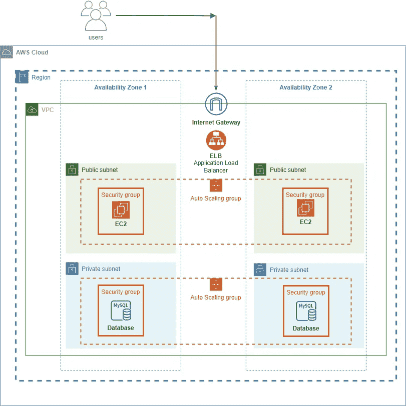

# AWS:面向绝对初学者的简单解决方案架构

> 原文：<https://medium.com/codex/aws-a-simple-solution-architecture-for-absolute-beginner-a73f5e213b1b?source=collection_archive---------0----------------------->

**问题陈述:**

接受来自互联网的流量/请求的 web 应用程序。客户端可以使用 web 应用程序发送数据查询请求。来自 web 应用程序的请求向 MySQL 数据库发送查询，并将数据返回给客户端。

***免责声明*** :这个解决方案可以用几种方式架构，这是其中一种方式。

**网络流量如何流经不同的 AWS 组件？**

客户端可以通过连接到 **VPC** 的**互联网网关**连接到网络应用。请求由 **ELB** 接收，它将流量分配给不同**可用区域**上托管的 **EC2 实例**。面向 web 的 EC2 实例在**公共子网**下。

附属于实例的**自动缩放组**根据互联网流量的上升和下降来管理缩放。公共子网的安全性由附属于它的**安全组**控制。该安全组只允许来自 Internet 网关的流量。

EC2 实例依次与托管在不同**可用性区域**上的 **MySQL 数据库**进行通信，并通过相同的通道将响应共享回客户端。

MySQL 数据库在一个**私有子网**下，远离直接的互联网访问。

附属于数据库的**自动缩放组**根据 EC2 流量的上升和下降来管理缩放。

私有子网的安全性由附属于它的**安全组**控制。该安全组仅允许来自 EC2 实例的安全组的流量。

实例放在**高可用性**的 VPC 中配置的 **2 个可用性区域**下，VPS 放在单个**区域**下。

通过设计，**互联网网关**和**应用负载平衡器**具有可扩展性和高可用性。因此，他们可以根据进入解决方案的 web 流量自动扩展。

