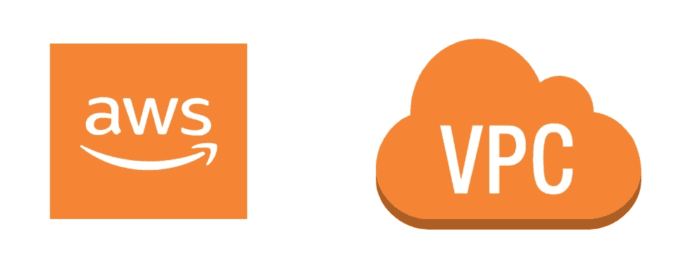

# AWS 学院简介(AWS01) — VPC(虚拟私有云)

> 原文：<https://medium.com/codex/aws-academy-introduction-aws01-vpc-virtual-private-cloud-ae3665ac8789?source=collection_archive---------8----------------------->

图 1: **AWS VPC**

**AWS** 云是一个**巨型**云，我保证你会或者已经听说过 AWS 云。我已经提到过这个列表会以不同的方式介绍 AWS 及其服务。我会在第一部分从技术上呈现服务，第二部分用你日常使用或者日常生活中能看到的东西来解释服务。这是足够的介绍，所以让我们跳到…