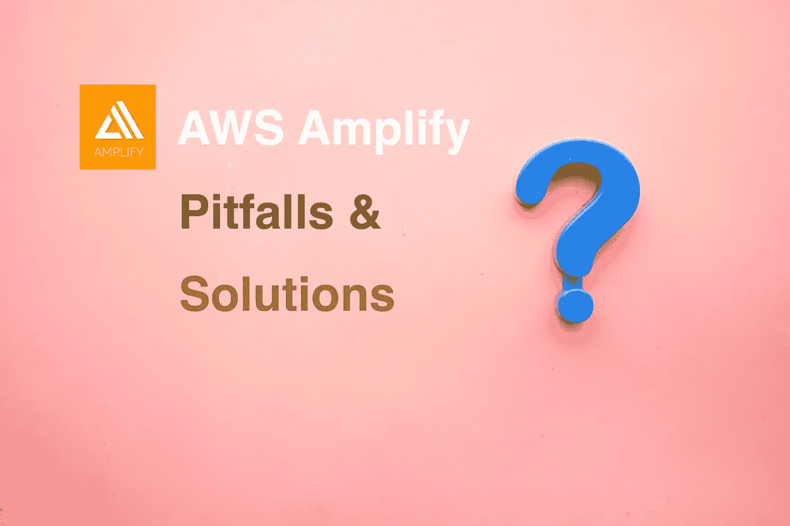

# AWS 放大了陷阱和解决方案

> 原文：<https://medium.com/codex/aws-amplify-pitfalls-and-solutions-e011621a65e0?source=collection_archive---------13----------------------->

AWS 放大了陷阱和解决方案

# 背景

在过去的一年里，我一直在使用 [AWS Amplify](https://aws.amazon.com/amplify/) 来建立一个网站。我第一次被 AWS Amplify 吸引是因为它的简单、高效和高维护性。除了它带来的所有好东西，目前版本的 AWS Amplify 也有一些限制。

我将分享我的一些经验，并希望这些可以帮助您决定是否要完全依靠 AWS Amplify 来开发自己的产品。

# 小心删除

这个技巧可以应用于所有类型的开发工具，但是让我们更多地了解 AWS Amplify 中的删除操作。

## 后端删除

目前，AWS Amplify 本身并不支持为资源配置`DeletionPolicy: Retain`。所以当你删除了 Amplify 后端，一切都将不复存在。

还有一点，删除操作是不可取消的。我询问了 AWS Amplify 支持团队，他们说一旦提交了删除请求，他们就无能为力了。

**解决**。强烈建议您自己进行备份。对于 DynamoDB，您可以使用定期备份。对于 S3 存储桶，您可以启用版本控制，或者将数据备份到不属于 AWS Amplify 的另一个 S3 存储桶。

## 前端删除

从 AWS Amplify 中删除前端主机后，所有的后端资源仍然存在。但是，您将丢失所有的域配置和存储库挂钩。这将导致您的网站不可用，直到您再次设置前端托管。

**解决方案**。对于所有的前端配置，总有办法在不删除 app 的情况下进行修改。

# Cognito 的备份

从我的调查来看，没有什么好的方法可以完全备份你的 AWS Cognito 数据。

亚马逊发布了一个开源工具来备份 Cognito 数据: [**Cognito 用户配置文件导出参考架构**](https://docs.aws.amazon.com/solutions/latest/cognito-user-profiles-export-reference-architecture/welcome.html) **。**但是导出的数据不包含哈希用户密码。这意味着如果您需要将身份验证数据迁移到另一个地区，您必须想办法通知客户重新设置密码。

**解决方案**。一种方法是开发您自己的认证平台，并通过 [Cognito OIDC](https://docs.aws.amazon.com/cognito/latest/developerguide/cognito-user-pools-oidc-idp.html) 将您的认证平台与 Cognito 相连。

# AWS 放大导入

当使用 amplify-cli 创建资源时，amplify 还会将所有 CloudFormation 配置写入 JSON 文件。这些基础设施配置文件支持轻松迁移和修改，甚至可以迁移到 AWS Amplify 之外。开发人员还可以使用 amplify-cli 命令轻松更改配置。

另一方面，我们也可以导入现有的 AWS 资源来放大 app。但是对于那些导入的资源，将没有匹配的 CloudFormation 文件，并且它们不能用 amplify-cli 改变。

**解决方案**。避免导入资源，而是使用 amplify-cli 创建资源，并将数据迁移到新资源。

# 面向 S3 接入的 CDN

对于使用 amplify-cli 创建的 S3 存储桶，默认情况下没有连接 CDN。目前，AWS Amplify 尚未将 CDN 纳入其管理面板。如果您需要加速对 S3 资源的访问，您必须为您的 S3 bucket 和 path 手动设置 CloudFront endpoint。

**解**。在 AWS Amplify 之外创建和管理您自己的 CDN 端点。

# 遗言

尽管存在上述不便，但 AWS Amplify 确实提高了我的开发效率。AWS Amplify 也在快速迭代和更新产品，希望它们能覆盖越来越多的方面。