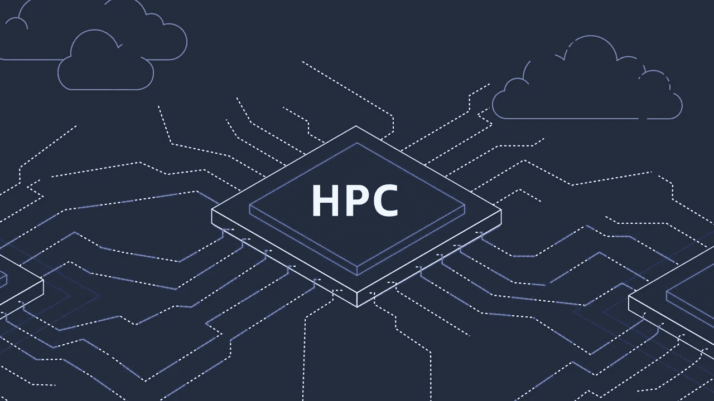
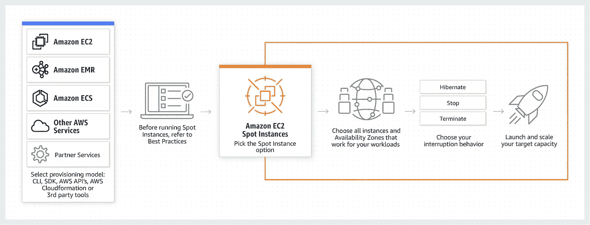
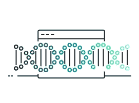

# AWS 认证解决方案架构师专家—计算— EC2 和高性能计算

> 原文：<https://medium.com/codex/aws-certified-solutions-architect-professional-compute-ec2-and-high-performance-computing-e9bba673f8cc?source=collection_archive---------10----------------------->

关于 AWS EC2 和高性能计算的简短说明。

AWS 提供的图像

# EC2

AWS EC2 是 AWS 上最古老、最受欢迎的服务。EC2 代表亚马逊弹性计算云。

Amazon EC2 在 AWS 云中提供可扩展的计算能力。使用 Amazon EC2 消除了前期硬件投资的需要，因此您可以更快地开发和部署应用程序。

您可以使用 Amazon EC2 启动任意数量的虚拟服务器，配置安全性和网络，以及管理存储。

AWS 提供的图像

亚马逊 EC2 提供了以下特性:

*   虚拟计算环境，称为*实例。*
*   为您的实例预先配置的模板，称为*亚马逊机器映像(AMIs)* ，它打包了您的服务器所需的位(包括操作系统和附加软件)。
*   实例的 CPU、内存、存储和网络容量的各种配置被称为*实例类型。*
*   使用*密钥对*保护实例的登录信息(AWS 存储公钥，您将私钥存储在安全的地方)。
*   停止、休眠或终止实例时删除的临时数据的存储卷，称为*实例存储卷。*
*   使用亚马逊弹性块存储(Amazon EBS)为您的数据提供持久存储卷，称为*亚马逊 EBS 卷。*
*   资源的多个物理位置，比如实例和 Amazon EBS 卷，被称为*区域*和*可用性区域。*
*   一个防火墙，使您能够使用*安全组指定可以到达您的实例的协议、端口和源 IP 范围。*
*   动态云计算的静态 IPv4 地址被称为*弹性 IP 地址。*
*   元数据被称为*标签*，你可以创建并分配给你的 Amazon EC2 资源。
*   您可以创建与 AWS 云的其余部分逻辑隔离的虚拟网络，并且您可以选择连接到您自己的网络，称为*虚拟专用云* (VPCs)。

借助 AWS EC2，您可以轻松运行高性能计算。

# 高性能计算

云是执行 HPC 的最佳场所，因为您可以在短时间内创建大量资源。

AWS 为您提供各种服务来运行大型、复杂的模拟和深度学习工作负载，具有几乎无限的计算能力、高性能文件系统和高吞吐量网络。

AWS 高性能计算服务:

[EC2](https://aws.amazon.com/ec2/) :借助亚马逊弹性云计算(EC2)和最新一代处理器的安全、可调整的计算能力，支持几乎任何工作负载。

[Elastic Fabric Adapter](https://aws.amazon.com/hpc/efa/) :使用 Elastic Fabric Adapter (EFA)大规模运行 HPC 应用程序，这是一个用于 Amazon EC2 实例的网络，具有高级节点间通信功能。

[AWS ParallelCluster:](https://aws.amazon.com/hpc/parallelcluster/) 使用 AWS ParallelCluster 快速构建 HPC 计算环境，这是一款开源工具，可简化 HPC 集群的部署和管理。

[AWS Batch](https://aws.amazon.com/batch/) :使用 AWS Batch，一个云原生批处理调度程序，跨所有 AWS 计算服务和功能扩展成千上万的计算任务。

[Amazon FSx for Lustre](https://aws.amazon.com/fsx/lustre/) :借助 Amazon FSx for Lustre 快速按需处理大规模数据集，这是一种具有亚毫秒级延迟的高性能文件系统。

[尼斯 DCV](https://aws.amazon.com/hpc/dcv/) :通过尼斯 DCV(一种带宽高效的高性能流媒体协议)交付高性能远程桌面和 3D 应用图形。

# **高性能计算使用案例**

**更快地构建设计**

AWS 提供的图像

减少计算流体动力学(CFD)模拟的挂钟时间。横向扩展模拟作业，以试验更多可调参数，从而获得更快、更准确的结果。

**快速药物发现**

AWS 提供的图像

通过即时访问几乎无限的计算资源，加快基于结构的药物设计。提高虚拟筛选、量子力学、分子动力学和 3D 结构解决方案的速度、准确性和规模。

**揭开基因组洞见**

AWS 提供的图像

构建并运行预测性、实时性或追溯性数据应用程序，以更快获得洞察力。将数据处理时间从数周减少到数小时，以便对癌症、囊性纤维化和阿尔茨海默氏症等疾病进行更深入的研究。

**优化风险分析**

AWS 提供的图像

快速进行网格计算模拟，以识别产品组合风险、对冲机会和优化领域。为更好的决策建立假设投资组合变化影响的模型。

# 结束

结束关于 AWS EC2 和高性能计算的简短说明。