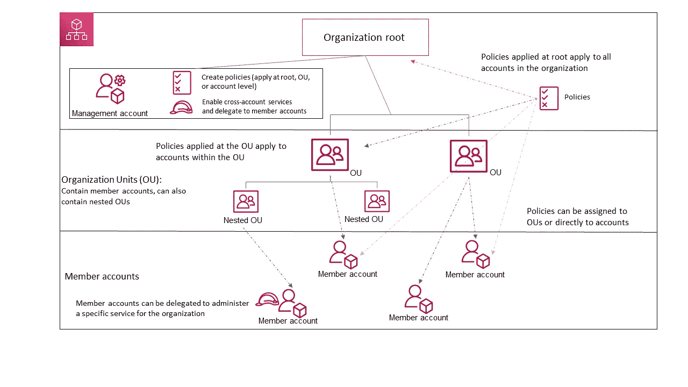
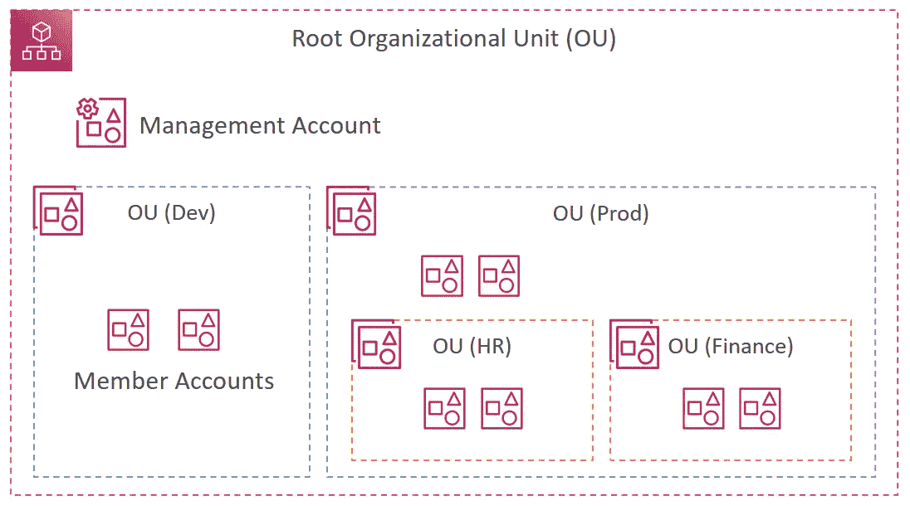
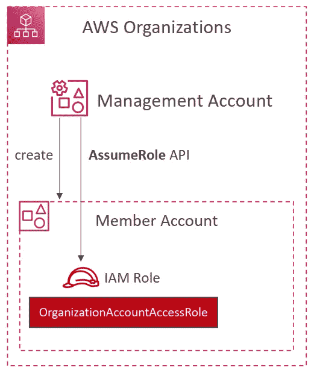
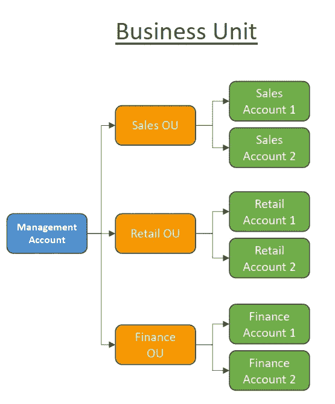
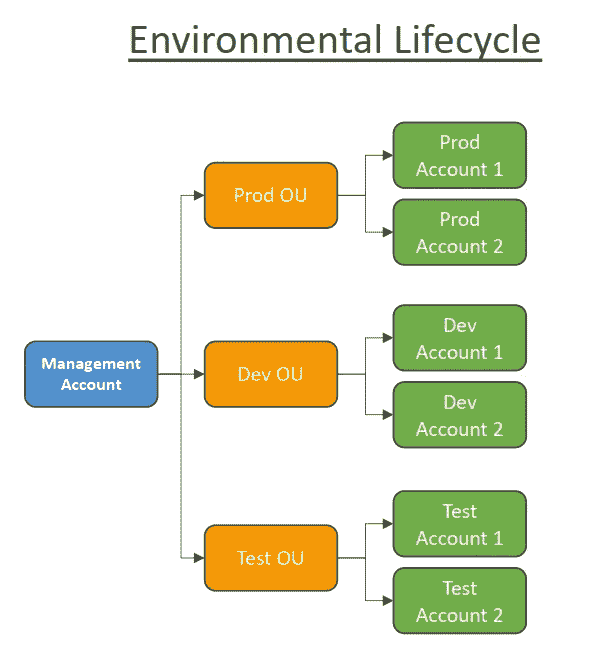
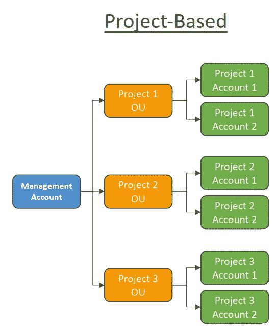

# AWS 认证解决方案架构师专家-身份联盟- AWS 组织

> 原文：<https://medium.com/codex/aws-certified-solutions-architect-professional-identity-federation-aws-organizations-dd63cd701a72?source=collection_archive---------5----------------------->

关于 AWS 组织的简要说明。这篇文章是由夏羽·马瑞克教授的《终极 AWS 认证解决方案架构师》课程的一个简要说明。这个帖子的唯一目的是一个总结，如果你想要详细的学习，请购买夏羽·马雷克的课程。

图片来自 AWS

# AWS 组织

AWS Organizations 是一种帐户管理服务，允许您管理一个组织中的多个 AWS 帐户。您可以创建成员帐户并邀请现有帐户加入您的组织，将这些帐户组织成组并附加基于策略的控制。

AWS 组织可以按层次结构组织帐户，根位于顶部，组织单位嵌套在根下。

图片来自夏羽·马雷克

**根**

贵组织所有帐户的父容器。如果您将策略应用于根，它将应用于组织中的所有组织单位(ou)和帐户。

**管理账户**

根目录包含我们的管理帐户，该帐户将用于所有管理目的:

*   在组织中创建帐户。
*   邀请其他现有客户加入组织。
*   从组织中删除帐户。
*   管理邀请。
*   将策略应用于组织内的实体(根、ou 或帐户)。

**组织单元(OU)**

根目录中帐户的容器。一个组织单位还可以包含其他组织单位，使您能够创建一个类似于根在顶部的倒置树的层次结构。

当您将策略附加到一个 ou 时，它会向下流动并影响所有嵌套的 OU。

**会员账户**

成员帐户是 AWS 帐户。一个帐户一次只能是一个组织的成员。您可以将策略附加到帐户，以便仅对该帐户应用控制。

# 组织帐户访问角色

当您使用 AWS 组织控制台创建成员帐户时，AWS 组织会自动在帐户中创建一个名为`OrganizationAccountAccessRole`的 IAM 角色。该角色在成员帐户中拥有完全的管理权限。

但是，您邀请加入您的组织**的成员帐户不会**自动创建管理员角色。您必须手动完成此操作，请参见[在被邀请成员中创建 OrganizationAccountAccessRole](https://docs.aws.amazon.com/organizations/latest/userguide/orgs_manage_accounts_access.html#orgs_manage_accounts_create-cross-account-role)。

图片来自夏羽·马雷克

# 多账户策略

基于监管限制(使用 SCP)，按照**部门**，按照**成本中心**，按照**开发/测试/生产**，
创建账户，为了更好的资源
隔离(例如:VPC)，具有单独的每个账户服务限制，隔离
账户用于记录。

使用标签标准进行计费。

在所有帐户上启用 CloudTrail，并将日志发送到中央 S3 帐户。

将 CloudWatch 日志发送到中央日志记录帐户。

创建安全帐户的策略。

比如说。

1.  我们有一个 OU 类型的业务单元来管理每个**部门的客户。**

图片来自夏羽·马雷克

2.我们有一个环境单元类型 OU，它管理每个环境的帐户。

图片来自夏羽·马雷克

3.我们有一个 OU 项目单元类型，用于管理每个项目的帐户。

图片来自夏羽·马雷克

# 特征模式

对于该示例，您需要了解 AWS 组织的两种功能模式。

整合计费功能:

*   所有帐户的合并帐单-单一付款方式。
*   总使用量带来的定价优势(EC2、S3……的批量折扣)。

所有功能(默认):

*   包括统一计费功能，SCP。
*   被邀请的帐户必须批准启用所有功能。
*   能够应用 SCP 来防止成员帐户离开组织。
*   无法切换回仅合并计费功能。

# AWS 组织中的保留实例

出于计费目的，AWS 组织的合并计费功能
将组织中的所有账户视为一个账户。

这意味着组织中的所有帐户都可以获得由任何其他帐户购买的保留实例的每小时成本
。

组织的付款人账户(管理账户)可以关闭该组织中任何
账户的
保留实例(RI)折扣和储蓄计划折扣共享，包括付款人账户。

这意味着 RIs 和储蓄计划折扣不会在任何关闭共享的
账户之间共享。

要与一个帐户共享 RI 或储蓄计划折扣，两个帐户都必须
打开共享。

# 结束

关于 AWS 组织的结束注释。

关于身份联盟的所有帖子:

1.  [身份&联邦— IAM](/codex/aws-certified-solutions-architect-professional-identity-federation-iam-c67d0259ac90) 。
2.  [身份&联邦— STS 承担角色](/codex/aws-certified-solutions-architect-professional-identity-federation-sts-to-assume-a-role-1ca67105b81a)。
3.  [身份联合会&认知组织](/codex/aws-certified-solutions-architect-professional-identity-federation-cognito-ec80783c3fd1)。
4.  [身份联盟—目录服务](/codex/aws-certified-solutions-architect-professional-identity-federation-directory-services-895807d86497)。
5.  [身份联盟— AWS 组织](/codex/aws-certified-solutions-architect-professional-identity-federation-aws-organizations-dd63cd701a72)。
6.  [身份联盟—组织服务控制策略](/codex/aws-certified-solutions-architect-professional-identity-federation-organizations-service-6192fab06d98)。
7.  [身份联盟——单点登录](/codex/aws-certified-solutions-architect-professional-identity-federation-single-sign-on-7731df09e9a5)。

下一个[安全— CloudTrail](/codex/aws-certified-solutions-architect-professional-security-cloudtrail-850006168acb) 。