# AWS 认证解决方案架构师专家—身份联盟和认知

> 原文：<https://medium.com/codex/aws-certified-solutions-architect-professional-identity-federation-cognito-ec80783c3fd1?source=collection_archive---------15----------------------->

# 介绍

关于 AWS 身份联邦& Cognito 的一个简短说明。这篇文章是由夏羽·马瑞克教授的《终极 AWS 认证解决方案架构师》课程的一个简要说明。这个帖子的唯一目的是一个总结，如果你想要详细的学习，请购买夏羽·马瑞克的课程。

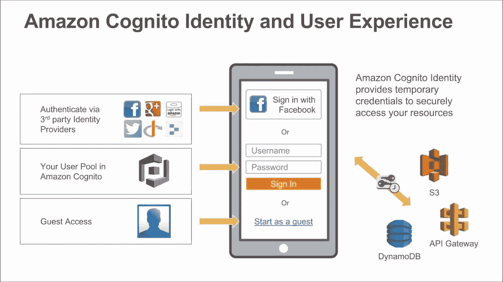

图片来自 AWS

# 身份联盟

授予 AWS 以外的用户访问您帐户中的 AWS 资源的权限。我们不需要创建 IAM 用户，因为我们想要管理 AWS 之外的用户。

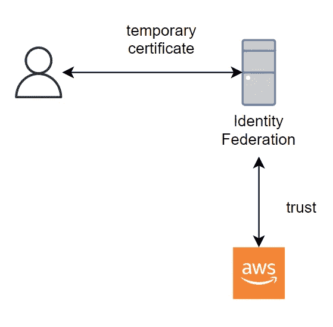

身份联盟工作方式如下:

*   首先，我们设置身份提供者和 AWS 之间的信任关系。我们告诉 AWS，可以从这个提供者那里获得一个身份。
*   然后，用户登录身份提供者，并接收 AWS 的临时凭据。
*   用户将使用这些临时凭证访问 AWS。

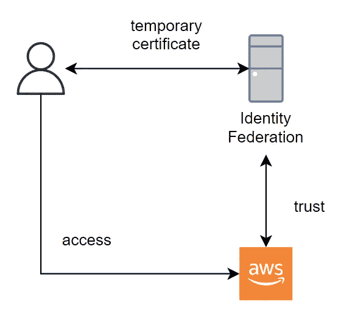

## 用例

我们构建需要访问 AWS 资源的应用程序(web/app)。例如，我们需要建立一个 web 应用程序，只允许登录用户可以上传文件到 AWS S3 桶。

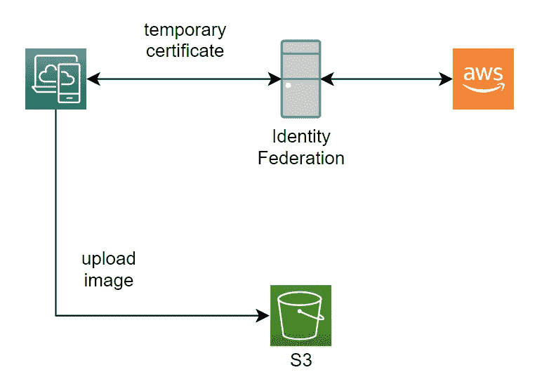

一个公司有它的身份系统，他们想使用它的系统。例如，一家公司使用 window 服务器，并有一个活动目录身份系统。

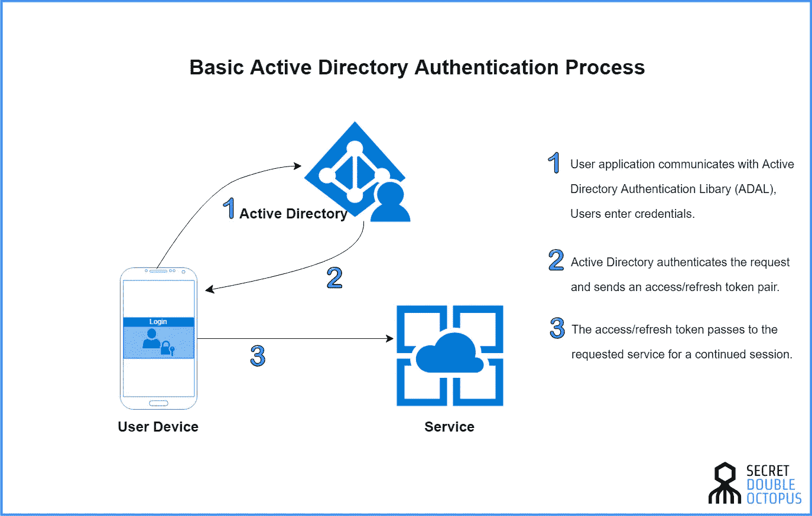

## 身份联盟实现

身份联盟有一些实现方式:

*   SAML 2.0 联邦。
*   自定义身份代理。
*   Web 身份联盟。
*   单点登录(SSO)。

# SAML 2.0 联盟

SAML 代表安全声明标记语言 2.0 (SAML 2.0)。它在在线安全方面的主要作用是使您能够使用一组登录凭据访问多个 web 应用程序。

支持与 Microsoft Active Directory 联合身份验证服务(ADFS)或任何与 AWS 身份提供者(IdP)兼容的 SAML 2.0 集成。

为了接收临时凭证，身份提供者使用 STS API AssumeRoleWithSAML。

注意，SAML 是旧的方式，而 AWS SSO Federation 是更简单的新方式。这个我们以后再说。

## 使用 SAML 2.0 联合来接收 AWS API 访问的凭据

例如，登录到身份提供者的用户使用 SAML 2.0 并接收临时凭据以访问 S3 存储桶。

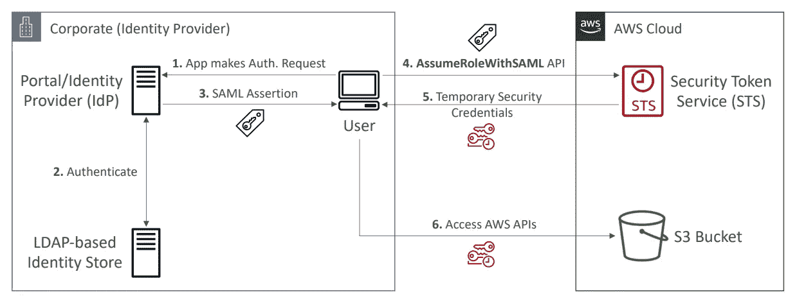

图片来自夏羽·马雷克

1.  用户对 IdP 执行身份验证。
2.  IdP 将通过身份存储验证用户。
3.  如果登录成功，返回 SAML 断言。
4.  用户可以调用 STS API AssumeRoleWithSAML，如果断言可信，STS 将验证断言并返回临时凭证。
5.  用户可以使用临时凭证访问 S3 存储桶。

## 使用 SAML 2.0 联合接收 AWS 控制台访问的凭据

左边和上面的例子差不多，但是右边有一点不同。我们使用 SAML 2.0 联邦来访问 AWS 控制台。

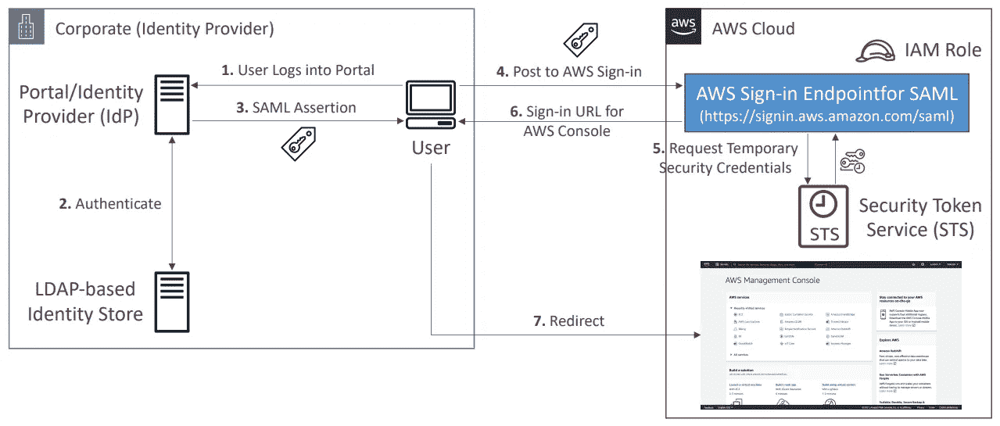

图片来自夏羽·马雷克

1.  用户对 IdP 执行身份验证。
2.  IdP 将通过身份存储验证用户。
3.  如果登录成功，返回 SAML 断言。
4.  用户发布到以`/saml`结尾的 AWS 登录 URL。
5.  请求临时凭据。
6.  向用户返回一个登录 URL。
7.  用户重定向到 AWS 控制台。

## 将 SAML 2.0 联合用于 Active Directory

右边和上面的例子差不多，但是左边有一点不同。我们使用 SAML 2.0 Federation 和 Active Directory 来访问 AWS 控制台。

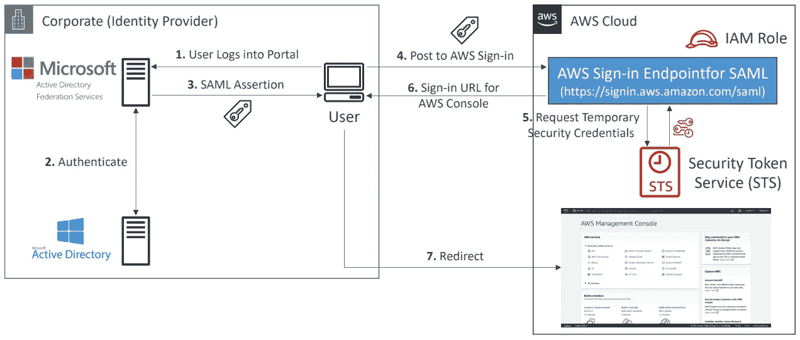

图片来自夏羽·马雷克

# 自定义身份代理

仅当身份提供者与 SAML 2.0 不兼容时使用，代理应用程序对用户进行身份验证，向 AWS 请求用户的临时凭据，然后向用户提供这些凭据以访问 AWS 资源。

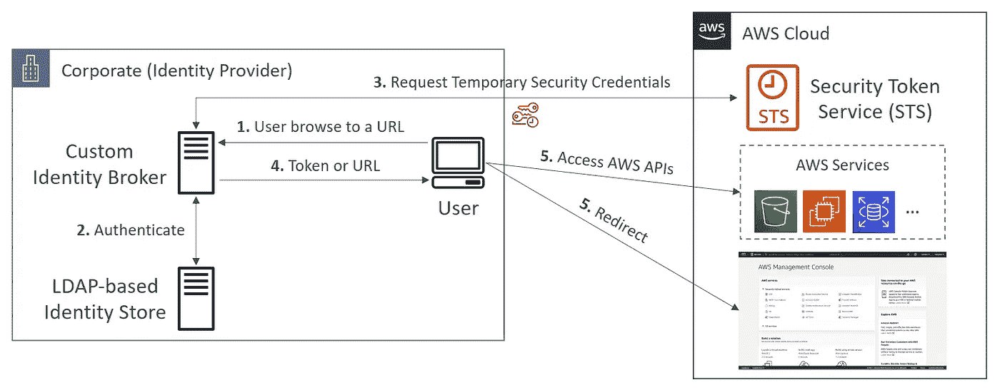

图片来自夏羽·马雷克

1.  用户浏览到一个 URL 并访问自定义身份代理。
2.  身份代理对用户进行身份验证。
3.  如果用户可以登录，Identity Broker 将请求临时凭据。
4.  Identity Broker 将令牌或 URL 返回给用户。
5.  用户使用令牌或 URL 来访问 AWS 资源。

这个场景与前一个场景(使用自定义身份验证系统的移动应用程序)类似，只是需要访问 AWS 资源的应用程序都在公司网络内运行，并且公司有一个现有的身份验证系统。

**请注意，自定义身份代理是旧方法，而 AWS SSO 联合是更简单的新方法。**

# Web 身份联盟

有了 web identity federation，您无需创建自定义登录代码或管理自己的用户身份。相反，应用程序的用户可以使用知名的外部身份提供商(IdP)登录，例如使用亚马逊、脸书、谷歌或任何其他 OpenID Connect 兼容的 IdP 登录。

## 不带 cogn ITO(AWS 不推荐)

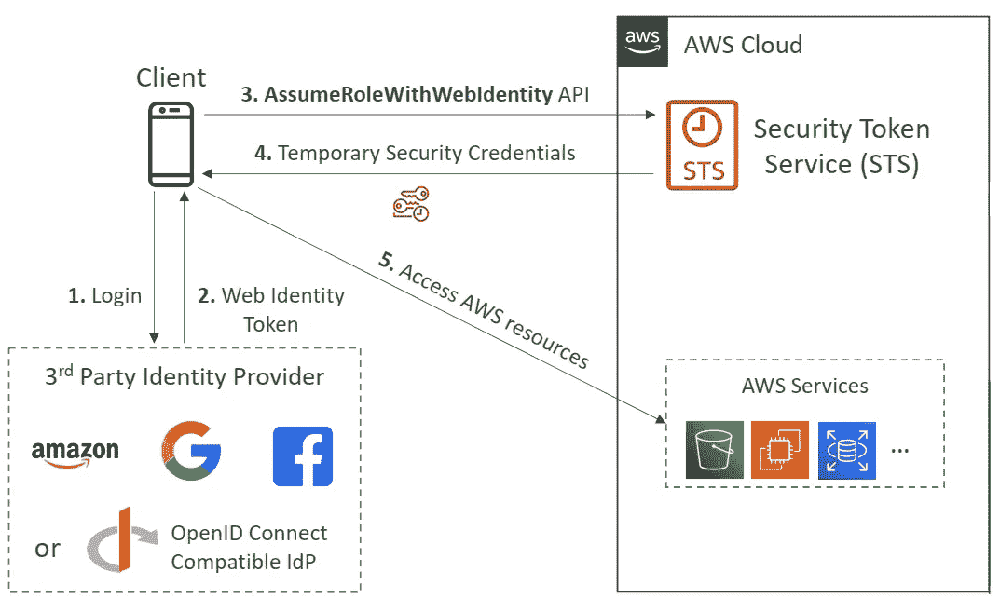

图片来自夏羽·马雷克

1.  客户端登录到第三方身份提供者。
2.  Web 身份令牌返回给客户端。
3.  客户端将使用 Web 标识令牌调用 STS AssumeRoleWithWebIdentity API 来接收临时凭据。
4.  STS 向客户端返回临时凭证。
5.  客户端访问 AWS 资源。

## 带 cogn ITO(AWS 推荐)

有了 Cognito，它更安全、更简单。

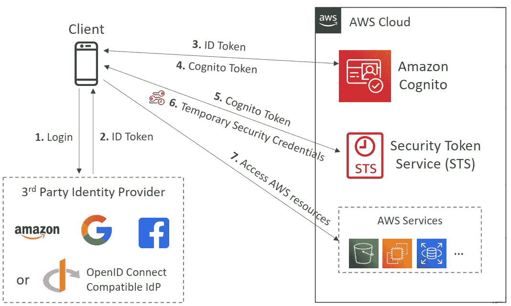

图片来自夏羽·马雷克

1.  客户端登录到第三方身份提供者。
2.  ID 令牌返回给客户端。
3.  该应用程序使用 Amazon Cognito API 操作来交换 ID 令牌的登录。
4.  Amazon Cognito 向客户端返回 Cognito 令牌。
5.  该应用程序向 AWS STS 请求临时安全凭证，传递 Amazon Cognito 令牌。
6.  STS 向客户端返回临时凭据。
7.  应用程序可以使用临时安全凭据来访问任何 AWS 资源。

# 结束

结束关于 AWS 身份联盟& Cognito 的快速说明。

关于身份联盟的所有帖子:

1.  [身份&联邦——IAM](/codex/aws-certified-solutions-architect-professional-identity-federation-iam-c67d0259ac90)。
2.  [身份&联邦— STS 承担角色](/codex/aws-certified-solutions-architect-professional-identity-federation-sts-to-assume-a-role-1ca67105b81a)。
3.  [身份联盟&认知联盟](/codex/aws-certified-solutions-architect-professional-identity-federation-cognito-ec80783c3fd1)。
4.  [身份联盟—目录服务](/codex/aws-certified-solutions-architect-professional-identity-federation-directory-services-895807d86497)。
5.  [身份联盟— AWS 组织](/codex/aws-certified-solutions-architect-professional-identity-federation-aws-organizations-dd63cd701a72)。
6.  [身份联盟—组织服务控制策略](/codex/aws-certified-solutions-architect-professional-identity-federation-organizations-service-6192fab06d98)。
7.  [身份联盟—单点登录](/codex/aws-certified-solutions-architect-professional-identity-federation-single-sign-on-7731df09e9a5)。

下一个[安全— CloudTrail](/codex/aws-certified-solutions-architect-professional-security-cloudtrail-850006168acb) 。