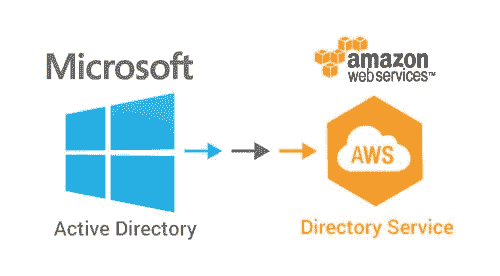
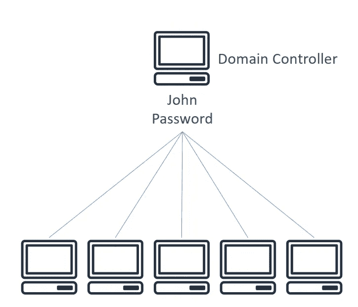
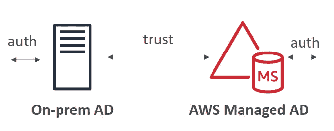
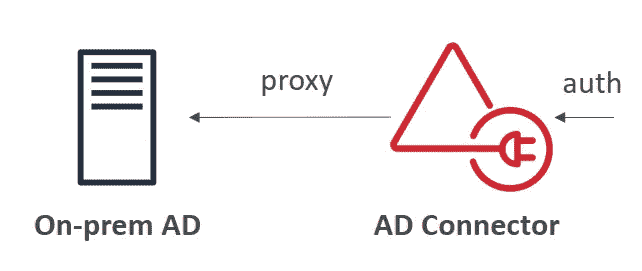
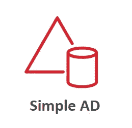
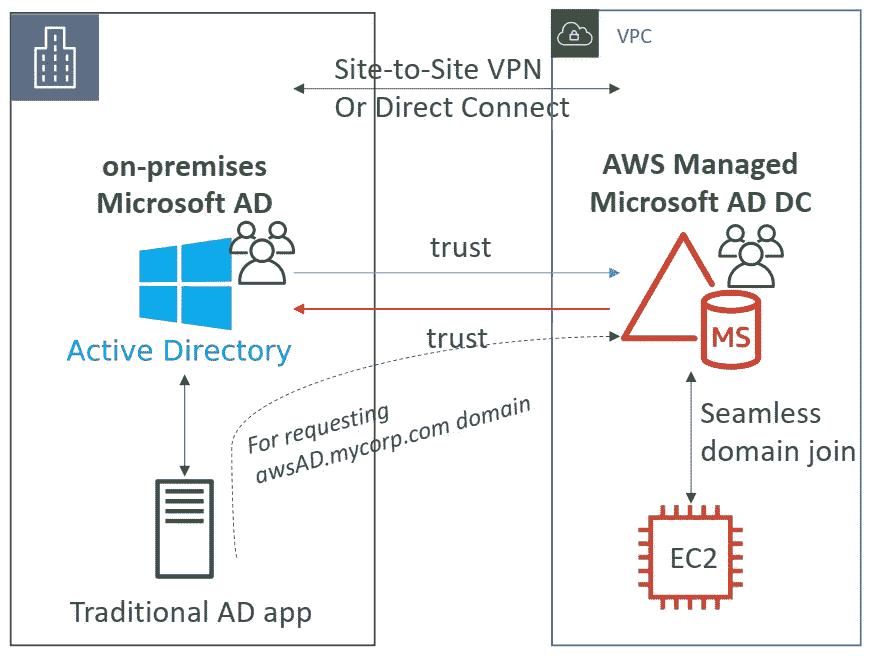
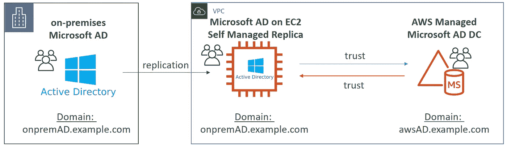
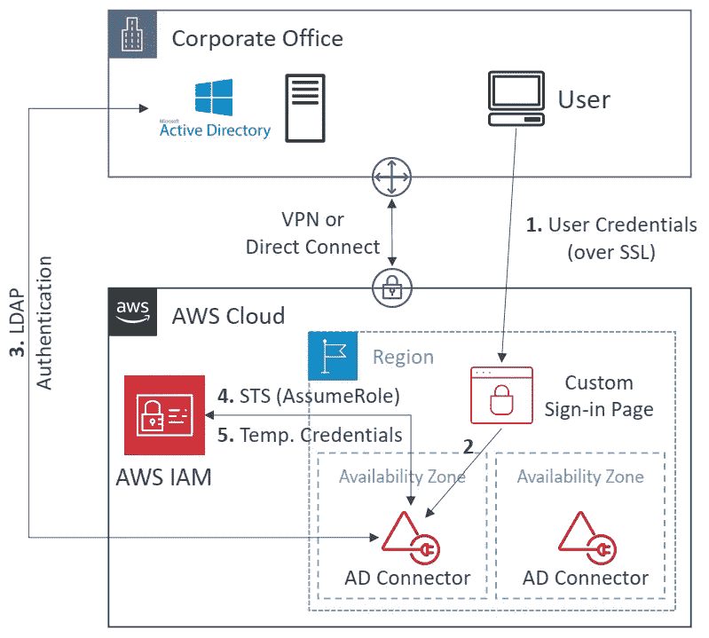

# AWS 认证解决方案架构师专家-身份联盟-目录服务

> 原文：<https://medium.com/codex/aws-certified-solutions-architect-professional-identity-federation-directory-services-895807d86497?source=collection_archive---------6----------------------->

关于 AWS 目录服务的简要说明。这篇文章是由夏羽·马瑞克教授的《终极 AWS 认证解决方案架构师》课程的一个简要说明。这个帖子的唯一目的是一个总结，如果你想要详细的学习，请购买夏羽·马雷克的课程。

图片来自 [Stratacore](https://www.stratacore.com/the-advisor/diraas-user-admin-in-cloud)

# 微软活动目录

您可以在任何具有 AD 域服务的 Windows 服务器上找到 Microsoft Active Directory。

这是一个对象数据库:用户、帐户、计算机、打印机和安全组。

集中安全管理，创建帐户，分配权限。通过登录身份验证和对目录中对象的访问控制，安全性与 Active Directory 集成在一起。

在活动目录中，对象被组织在**树**中。一群树就是一片**森林**。

例如

图片来自夏羽·马瑞克

我们有一个接受 John 身份验证的域控制器和另一台连接到该域控制器的机器。现在，我们可以使用 John 的登录身份验证来访问另一台机器的资源。

# AWS 目录服务

AWS 提供了三种支持目录服务的服务。

## AWS 管理的 Microsoft AD

使用 AWS 管理的 Microsoft AD，您可以在 AWS 中创建您的广告，在本地管理用户，并支持 MFA。

AWS 目录服务可以轻松地在 AWS 云中设置和运行目录，或者将您的 AWS 资源与现有的内部 Microsoft Active Directory 连接起来。

图片来自夏羽·马瑞克

用户可以在内部 AD 中的右侧或 AWS 云中的左侧进行身份验证。

## AWS AD 连接器

AD Connector 是一个目录网关，您可以使用它将目录请求重定向到您的内部 Microsoft Active Directory，而无需在云中缓存任何信息。

用户通过内部 AD 进行管理。

AD Connector 具有以下优势:

*   最终用户可以使用他们现有的公司凭据登录 AWS 应用程序。
*   无论用户是在您的内部基础架构中还是在 AWS 云中访问资源，您都可以一致地实施现有的安全策略。
*   支持 MFA。

图片来自夏羽·马瑞克

## AWS 简单活动目录

这不是微软的广告，这是一个广告兼容的 API，叫做 Samba。

它不能与内部 AD 结合。

简单 AD 提供 AWS 管理的 Microsoft AD 所提供功能的子集，包括管理用户帐户和组成员资格、创建和应用组策略以及安全连接到 Amazon EC2 实例的能力，**但它不支持 MFA** 。

图片来自夏羽·马瑞克

# AWS 管理的 Microsoft AD

## 连接 AWS 托管 AD 和内部 AD

能够将您的内部广告连接到 AWS 管理的 Microsoft 广告。为此，您需要在两者之间建立直接连接或 VPN 连接。

图片来自夏羽·马瑞克

左侧是我们的本地 AD，它管理本地用户；右侧是 AWS Manage AD，它也将管理 AWS 上的用户。因此，您可以设置三种森林信任:

1.  单向信任:AWS = >内部部署。
2.  单向信任:内部=> AWS。
3.  双向森林信任:AWS <=>内部部署。

## 活动目录复制

您可能希望在 AWS 上创建一个本地 AD 的副本，以便在直连或 VPN 关闭时最大限度地减少延迟。

图片来自夏羽·马瑞克

要设置副本，您需要在 EC2 Windows 实例上部署 AD，并且必须在本地 AD 和 EC2 Windows 实例之间设置复制。

最后，我们可以在 EC2 实例和 AWS Manage AD 之间建立双向森林信任。

# AD 连接器

AD Connector 是一个目录网关，用于将目录请求重定向到您的内部 Microsoft Active Directory。

没有缓存功能。

仅在内部管理用户，不可能建立信任。

使用 VPN 或直接连接建立连接

图片来自夏羽·马瑞克

# AWS 简单广告

简单 AD 是一种廉价的 Active Directory 兼容服务，具有通用目录功能。

支持加入 EC2 实例，管理用户和组。

不支持 MFA、RDS SQL Server 或 AWS SSO。

小型:500 个用户，大型:5000 个用户。

由 Samba 4 驱动，兼容微软 AD。

低成本、小规模、基本 AD 兼容或 LDAP 兼容。

没有信任关系。

# 结束

关于 AWS 目录服务的结束说明。

关于身份联盟的所有帖子:

1.  [身份&联邦——IAM](/codex/aws-certified-solutions-architect-professional-identity-federation-iam-c67d0259ac90)。
2.  [身份&联邦——STS 承担角色](/codex/aws-certified-solutions-architect-professional-identity-federation-sts-to-assume-a-role-1ca67105b81a)。
3.  [身份联盟&认知联盟](/codex/aws-certified-solutions-architect-professional-identity-federation-cognito-ec80783c3fd1)。
4.  [身份联盟—目录服务](/codex/aws-certified-solutions-architect-professional-identity-federation-directory-services-895807d86497)。
5.  [身份联盟— AWS 组织](/codex/aws-certified-solutions-architect-professional-identity-federation-aws-organizations-dd63cd701a72)。
6.  [身份联盟—组织服务控制策略](/codex/aws-certified-solutions-architect-professional-identity-federation-organizations-service-6192fab06d98)。
7.  [身份联盟—单点登录](/codex/aws-certified-solutions-architect-professional-identity-federation-single-sign-on-7731df09e9a5)。

下一个[安全——云迹](/codex/aws-certified-solutions-architect-professional-security-cloudtrail-850006168acb)。