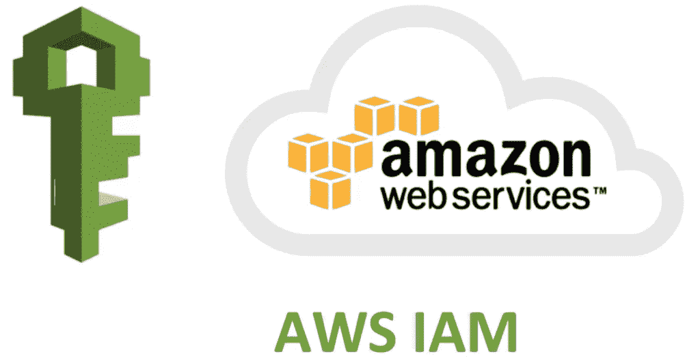
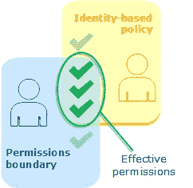

# AWS 认证解决方案架构师专家—身份和联盟— IAM

> 原文：<https://medium.com/codex/aws-certified-solutions-architect-professional-identity-federation-iam-c67d0259ac90?source=collection_archive---------20----------------------->

关于我的一个简短说明，你应该知道这个例子。这篇文章是由夏羽·马瑞克教授的《终极 AWS 认证解决方案架构师》课程的一个简要说明。这个帖子的唯一目的是一个总结，如果你想要详细的学习，请购买夏羽·马瑞克的课程。



AWS IAM

# InternationalAssociationofMachinists 国际机械师协会

用户:长期凭据。

组:将用户分配到组。

角色是短期凭证，使用 STS，我们已经看到了一些角色:

*   EC2 实例角色:使用 EC2 元数据服务，并获取 EC2 实例的临时证书。每个实例一次一个角色，EC2 使用这个临时证书访问其他 AWS 服务，而不需要在 EC2 上设置 AWS 凭证。
*   服务角色:直接分配给服务，允许此服务对其他 AWS 服务执行操作。示例:Lambda 对自动缩放组执行操作。
*   交叉帐户角色:允许在另一个帐户中执行操作。

策略以三种方式定义角色或用户可以做什么:

*   AWS 管理的:由 AWS 定义的策略。
*   客户管理:您创建的策略可以在用户或角色之间共享。
*   内联策略:分配给一个特定用户或角色的策略不能在用户或角色之间共享。

基于资源的政策(S3·巴特、SQS 等)

## IAM 策略深入

JSON 文档对策略进行了剖析，包括:

*   Sid(可选)。
*   效果。
*   行动。
*   资源。
*   条件。
*   政策变量。

比如说。

```
{
    "Version": "2012-10-17",
    "Statement": [
        {
            "Sid": "ListAndDescribe",
            "Effect": "Allow",
            "Action": [
                "dynamodb:List*",
                "dynamodb:DescribeReservedCapacity*",
                "dynamodb:DescribeLimits",
                "dynamodb:DescribeTimeToLive"
            ],
            "Resource": "*"
        },
        {
            "Sid": "SpecificTable",
            "Effect": "Allow",
            "Action": [
                "dynamodb:BatchGet*",
                "dynamodb:DescribeStream",
                "dynamodb:DescribeTable",
                "dynamodb:Get*",
                "dynamodb:Query",
                "dynamodb:Scan",
                "dynamodb:BatchWrite*",
                "dynamodb:CreateTable",
                "dynamodb:Delete*",
                "dynamodb:Update*",
                "dynamodb:PutItem"
            ],
            "Resource": "arn:aws:dynamodb:*:*:table/MyTable"
        }
    ]
}
```

默认情况下，所有服务都被拒绝。最佳实践是使用最少的特权来获得最大的安全性。

## IAM AWS 托管策略

任何资源都应该允许 AdministratorAccess。

```
{
    "Version": "2012-10-17",
    "Statement": [
        {
            "Effect": "Allow",
            "Action": "*",
            "Resource": "*"
        }
    ]
}
```

PowerUserAccess 提供对 AWS 服务和资源的完全访问权限，但不允许管理用户和组。

```
{
    "Version": "2012-10-17",
    "Statement": [
        {
            "Effect": "Allow",
            "NotAction": [
                "iam:*",
                "organizations:*",
                "account:*"
            ],
            "Resource": "*"
        },
        {
            "Effect": "Allow",
            "Action": [
                "iam:CreateServiceLinkedRole",
                "iam:DeleteServiceLinkedRole",
                "iam:ListRoles",
                "organizations:DescribeOrganization",
                "account:ListRegions"
            ],
            "Resource": "*"
        }
    ]
}
```

## IAM 策略和条件

条件块允许您指定策略生效的条件。

```
"Condition" : { "{condition-operator}" : { "{condition-key}" : "{condition-value}" }}
```

条件键可以是`global condition`键或`service-specific condition`键。

*   全局条件关键字有`aws:`前缀。
*   特定于服务的条件关键字具有服务的前缀，例如`ec2:InstanceType`。

条件运算符可以是。

1.  **字符串条件运算符:** StringEquals，StringNotEquals，StringEqualsIgnoreCase，StringNotEqualsIgnoreCase，StringLike，StringNotLike。

例如，以下条件包含 StringEquals 运算符，以确保只有 hoang-phuc 发出的请求匹配。

```
"Condition": { "StringEquals": { "aws:username": "hoang-phuc" } }
```

**2。数值条件运算符** : NumericEquals、NumericNotEquals、NumericLessThan、NumericLessThanEquals、NumericGreaterThan、NumericGreaterThanEquals。

例如，允许访问请求者最多可以列出 10 个对象的任何存储桶。

```
{
  "Version": "2012-10-17",
  "Statement": {
    "Effect": "Allow",
    "Action": "s3:ListBucket",
    "Resource": "arn:aws:s3:::*",
    "Condition": {"NumericLessThanEquals": {"s3:max-keys": "10"}}
  }
}
```

**3。日期条件运算符** : DateEquals、DateNotEquals、DateLessThan、DateLessThanEquals、DateGreaterThan、DateGreaterThanEquals。

例如，此条件指定用于发出请求的临时安全凭据在 2020 年颁发。

```
{
  "Version": "2012-10-17",
  "Statement": {
    "Effect": "Allow",
    "Action": "iam:*AccessKey*",
    "Resource": "arn:aws:iam::account-id:user/*",
    "Condition": {"DateGreaterThan": {"aws:TokenIssueTime": "2020-01-01T00:00:01Z"}}
  }
}
```

**4。布尔条件运算符** : Bool。

示例拒绝所有 s3 请求内容不通过 SSL。

```
{
  "Version": "2012-10-17",
  "Statement": [
    {
      "Sid": "BooleanExample",
      "Action": "s3:*",
      "Effect": "Deny",
      "Resource": [
        "arn:aws:s3:::DOC-EXAMPLE-BUCKET",
        "arn:aws:s3:::DOC-EXAMPLE-BUCKET/*"
      ],
      "Condition": {
        "Bool": {
          "aws:SecureTransport": "false"
        }
      }
    }
  ]
}
```

**5。IP 地址条件操作符**:根据密钥与 IPv4 或 IPv6 地址或 IP 地址范围的比较来限制访问。

IpAddress:指定的 IP 地址或范围。

NotIpAddressAll IP:指定 IP 地址或范围以外的地址。

例如，只允许来自 IP 范围 203.0.113.0 到 203.0.113.255 的请求。

```
{
  "Version": "2012-10-17",
  "Statement": {
    "Effect": "Allow",
    "Action": "iam:*AccessKey*",
    "Resource": "arn:aws:iam::account-id:user/*",
    "Condition": {"IpAddress": {"aws:SourceIp": "203.0.113.0/24"}}
  }
}
```

## IAM 策略变量和标记

当您在编写策略时不知道资源或条件键的确切值时，请使用策略变量作为占位符。

例如，编写允许每个用户访问他或她在亚马逊 S3 存储桶中的对象的策略，但是您不希望为每个用户创建单独的策略。

```
{
  "Version": "2012-10-17",
  "Statement": [
    {
      "Action": ["s3:ListBucket"],
      "Effect": "Allow",
      "Resource": ["arn:aws:s3:::mybucket"],
      "Condition": {"StringLike": {"s3:prefix": ["${aws:username}/*"]}}
    },
    {
      "Action": [
        "s3:GetObject",
        "s3:PutObject"
      ],
      "Effect": "Allow",
      "Resource": ["arn:aws:s3:::mybucket/${aws:username}/*"]
    }
  ]
}
```

使用`${aws:username}`访问每个用户的用户名。

当您希望允许基于自定义属性访问您的资源时，请使用基于标记。例如，如果使用资源标记 env=dev。

```
{
  "Version": "2012-10-17",
  "Statement": [
    {
      "Action": ["s3:ListBucket"],
      "Effect": "Allow",
      "Resource": ["arn:aws:s3:::mybucket"],
      "Condition": {"StringLike": {"aws:ResourceTag/env": "dev"}}
    }
  ]
}
```

# IAM 角色与基于资源的策略

AWS 允许授予对 AWS 资源的跨帐户访问权限，这可以使用 IAM 角色或基于资源的策略来完成。

通过 IAM 角色，您可以使用角色作为代理来访问资源。

基于资源的策略允许您将策略直接附加到要共享的资源，而不是使用角色作为代理。

一些资源支持基于资源的策略:

*   亚马逊 S3 桶。
*   亚马逊简单通知服务(Amazon SNS)主题。
*   亚马逊简单队列服务(亚马逊 SQS)队列。

# IAM 权限边界

对用户和角色(而不是组)的支持。这是一项高级功能，用于设置 IAM 实体可以获得的最大权限。

实体的权限边界允许它只执行基于身份的策略和权限边界都允许的操作。基于身份的策略向实体授予权限，权限边界限制这些权限。



图片来自 AWS

# 结束

关于 IAM 的结束注释。

关于身份联盟的所有帖子:

1.  [身份&联盟— IAM](/codex/aws-certified-solutions-architect-professional-identity-federation-iam-c67d0259ac90) 。
2.  [身份&联盟— STS 承担角色](/codex/aws-certified-solutions-architect-professional-identity-federation-sts-to-assume-a-role-1ca67105b81a)。
3.  [身份联盟&认知联盟](/codex/aws-certified-solutions-architect-professional-identity-federation-cognito-ec80783c3fd1)。
4.  [身份联盟—目录服务](/codex/aws-certified-solutions-architect-professional-identity-federation-directory-services-895807d86497)。
5.  [身份联盟— AWS 组织](/codex/aws-certified-solutions-architect-professional-identity-federation-aws-organizations-dd63cd701a72)。
6.  [身份联盟—组织服务控制策略](/codex/aws-certified-solutions-architect-professional-identity-federation-organizations-service-6192fab06d98)。
7.  [身份联盟——单点登录](/codex/aws-certified-solutions-architect-professional-identity-federation-single-sign-on-7731df09e9a5)。

下一个[安全— CloudTrail](/codex/aws-certified-solutions-architect-professional-security-cloudtrail-850006168acb) 。