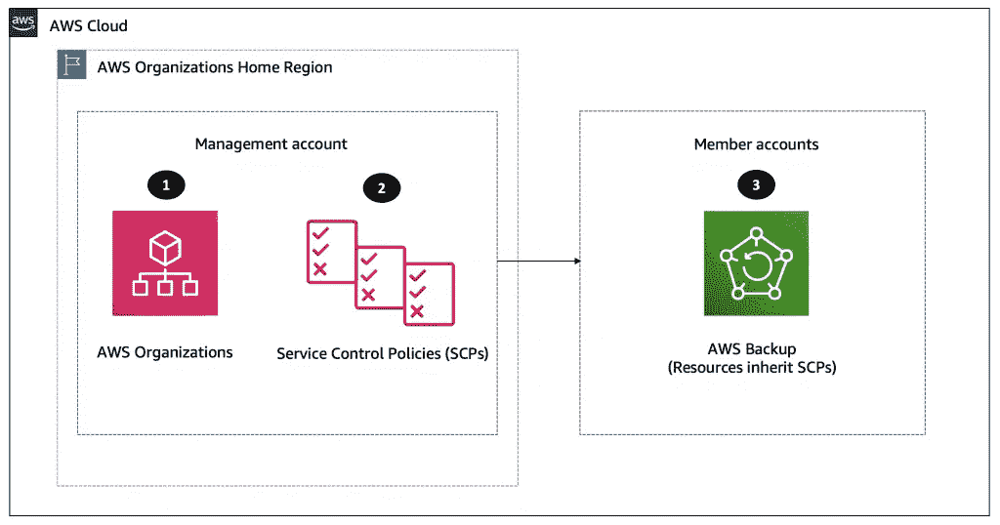
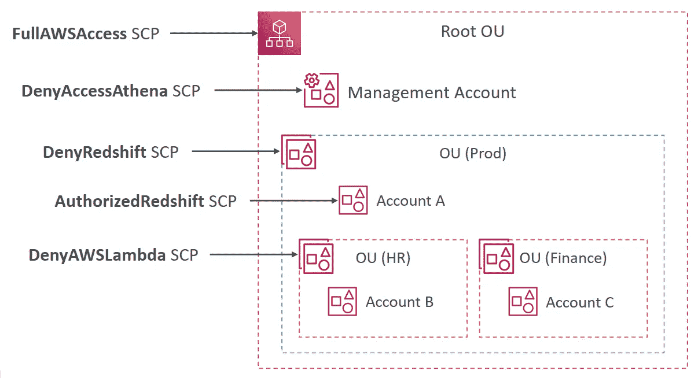
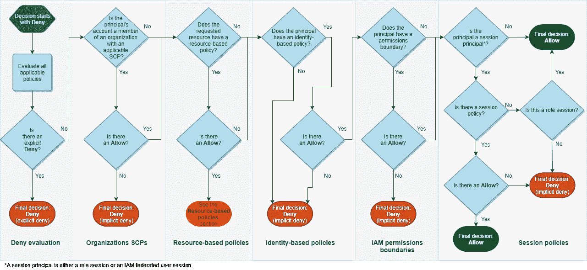

# AWS 认证解决方案架构师专家—身份联盟—组织服务控制策略

> 原文：<https://medium.com/codex/aws-certified-solutions-architect-professional-identity-federation-organizations-service-6192fab06d98?source=collection_archive---------9----------------------->

关于 AWS 组织服务控制策略的简要说明。这篇文章是由夏羽·马瑞克教授的《终极 AWS 认证解决方案架构师》课程的一个简要说明。这个帖子的唯一目的是一个总结，如果你想要详细的学习，请购买夏羽·马雷克的课程。



图片来自 AWS

# 服务控制策略

服务控制策略(scp)是一种组织策略，可用于管理组织中的权限。

scp 对您组织中所有帐户的最大可用权限进行集中控制。

**SCP 仅适用于 OU 或账户级别，不适用于管理账户**。

SCP 适用于帐户中的所有用户和角色，包括 Root 用户。SCP 不影响与服务相关的角色。

使用案例:

*   限制对某些服务的访问。
*   根据请求的 AWS 区域拒绝对 AWS 的访问。
*   阻止根用户的服务访问。

# SCP 层次继承

您可以将策略附加到组织中的组织实体(根 ou、组织单位(OU)或帐户):

*   当您将策略附加到根 ou 时，组织中的所有 OU 和帐户都会继承该策略。
*   您不能将策略附加到管理帐户。
*   当您将策略附加到特定 ou 时，直接位于该 OU 或任何子 OU 下的帐户将继承该策略。
*   当您将策略附加到特定帐户时，它只会影响该帐户。

例如，我们下面有一个 AWS 组织。



图片来自夏羽·马雷克

管理账户

*   无所不能。
*   (不适用 SCP)。

账户 A

*   无所不能。
*   除了访问红移(从 Prod OU 显式拒绝)。

账户 B

*   无所不能。
*   除了访问红移(从 Prod OU 显式拒绝)。
*   除了访问 Lambda(来自 HR OU 的显式拒绝)。

账户 C

*   无所不能。
*   除了访问红移(从 Prod OU 显式拒绝)。

# 使用 scp 的策略

您可以将组织中的服务控制策略(scp)配置为以下任一方式:

*   拒绝列表:默认情况下允许操作，您可以指定禁止哪些服务和操作。
*   允许列表:默认情况下禁止操作，您可以指定允许哪些服务和操作。

例如，拒绝列表策略。

```
{
    "Version": "2012-10-17",
    "Statement": [
        {
            "Sid": "AllowsAllActions",
            "Effect": "Allow",
            "Action": "*",
            "Resource": "*"
        },
        {
            "Sid": "DenyDynamoDB", 
            "Effect": "Deny",
            "Action": "dynamodb:*",
            "Resource": "*"
        }
    ]
}
```

此策略启用除 DynamoDB 之外的帐户的完全权限。

允许列表策略示例。

```
{
    "Version": "2012-10-17",
    "Statement": [
        {
            "Effect": "Allow",
            "Action": [
                "ec2:*",
                "cloudwatch:*"
            ],
            "Resource": "*"
        }
    ]
}
```

此策略允许帐户访问 EC2 和 Cloudwatch。

# IAM 策略评估逻辑



图片来自 AWS

**拒绝评估:**默认情况下，所有请求都会被拒绝。这被称为隐式拒绝。

**组织 scp:**然后代码评估应用于请求的 AWS 组织服务控制策略(scp)。如果强制代码在 scp 中没有找到任何适用的`Allow`语句，则请求被隐式拒绝。代码返回**拒绝**的最终决定。如果没有 SCP，或者 SCP 允许所请求的动作，则代码继续。

**基于资源的策略:**根据主体的类型，基于资源的策略中的`Allow`可以导致`Allow`的最终决定，即使基于身份的策略、权限边界或会话策略中存在隐式拒绝。

**基于身份的策略:**代码然后检查主体的基于身份的策略。如果没有基于身份的策略或基于身份的策略中没有允许所请求的操作的语句，则该请求被隐式拒绝，并且代码返回最终决定 **Deny** 。如果任何适用的基于身份的策略中的任何语句允许所请求的操作，则代码继续执行。

**IAM 权限边界:**然后，代码检查主体使用的 IAM 实体是否有权限边界。如果用于设置权限边界的策略不允许所请求的操作，则该请求会被隐式拒绝。

**会话策略:**然后代码检查主体是否是会话主体。

# 使用 IAM 策略限制标记

您可以限制 AWS 资源上的特定标记。使用 **aws:TagKeys** 条件键。

例如，仅当 EBS 卷具有“Env”和“CostCenter”标记时，才允许 IAM 用户创建 EBS 卷。使用 ForAllValues(必须包含所有键)或 ForAnyValue(必须至少包含这些键中的任何一个)。

ForAllValues。

```
{
    "Version": "2012-10-17",
    "Statement": [{
        "Effect": "Allow",
        "Action": "ec2:CreateVolume",
        "Resource": "*",
        "Condition": {"ForAllValues:StringEquals": {"aws:TagKeys": ["Env", "CostCenter"]}}
    }]
}
```

ForAnyValue。

```
{
    "Version": "2012-10-17",
    "Statement": [{
        "Effect": "Allow",
        "Action": "ec2:CreateVolume",
        "Resource": "*",
        "Condition": {"ForAnyValue:StringEquals": {"aws:TagKeys": ["Env", "CostCenter"]}}
    }]
}
```

# 使用 SCP 来限制创建资源

如果受影响的成员帐户中的 IAM 用户/角色没有特定的标记，您可以阻止他们创建资源。

例如，如果 EBS 卷没有“成本中心”标记，则限制 IAM 用户创建 EBS 卷。

```
{
    "Version": "2012-10-17",
    "Statement": [{
        "Effect": "Deny",
        "Action": "ec2:CreateVolume",
        "Resource": "*",
        "Condition": {"Null": {"aws:RequestTag": "true"}}
    }]
}
```

# 标签策略

帮助您在 AWS 组织中跨资源标准化标记。确保一致的标记，审核标记的资源，并维护正确的资源分类。

您可以定义标记键及其允许值。帮助 AWS 成本分配标签和基于属性的访问控制。

# 备份策略

AWS 备份使您能够创建定义如何备份 AWS 资源的备份计划。AWS 组织中的备份策略将所有这些部分合并到 JSON 文本文档中。

您可以将备份策略附加到组织结构中的任何元素，如根、组织单位(ou)和个人帐户。

备份策略使您能够在组织要求的任何级别上对资源备份进行精细控制。例如，您可以在附加到组织根目录的策略中指定必须备份所有 Amazon DynamoDB 表。

组织中每个 AWS 帐户的有效备份计划在 AWS 备份控制台中显示为该帐户的不可变计划(仅供查看)。

# 结束

结束关于 AWS 组织服务控制策略的简短说明。

关于身份联盟的所有帖子:

1.  [身份&联盟— IAM](/codex/aws-certified-solutions-architect-professional-identity-federation-iam-c67d0259ac90) 。
2.  [身份&联邦— STS 担当](/codex/aws-certified-solutions-architect-professional-identity-federation-sts-to-assume-a-role-1ca67105b81a)。
3.  [身份联盟&认知联盟](/codex/aws-certified-solutions-architect-professional-identity-federation-cognito-ec80783c3fd1)。
4.  [身份联盟—目录服务](/codex/aws-certified-solutions-architect-professional-identity-federation-directory-services-895807d86497)。
5.  [身份联盟— AWS 组织](/codex/aws-certified-solutions-architect-professional-identity-federation-aws-organizations-dd63cd701a72)。
6.  [身份联盟—组织服务控制策略](/codex/aws-certified-solutions-architect-professional-identity-federation-organizations-service-6192fab06d98)。
7.  [身份联盟—单点登录](/codex/aws-certified-solutions-architect-professional-identity-federation-single-sign-on-7731df09e9a5)。

下一个[安全— CloudTrail](/codex/aws-certified-solutions-architect-professional-security-cloudtrail-850006168acb) 。