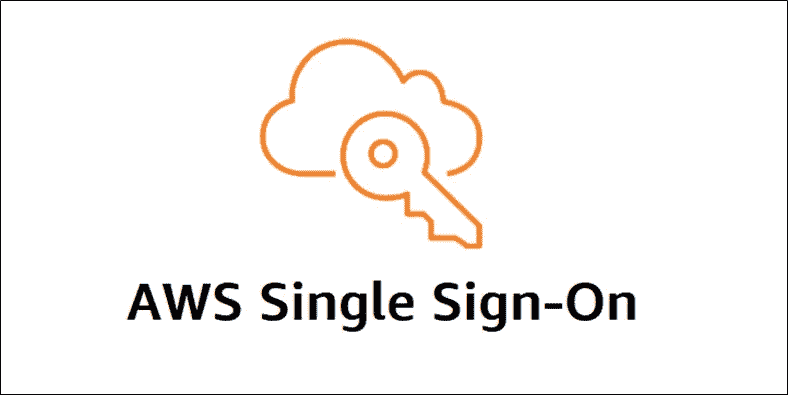
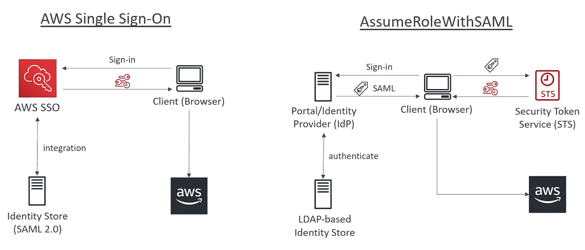
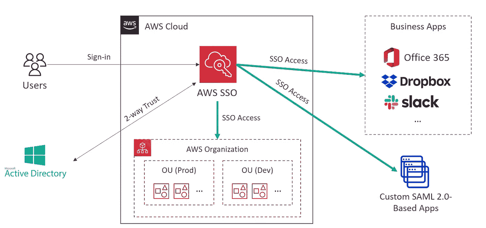

# AWS 认证解决方案架构师专家—身份联盟—单点登录

> 原文：<https://medium.com/codex/aws-certified-solutions-architect-professional-identity-federation-single-sign-on-7731df09e9a5?source=collection_archive---------12----------------------->

关于 AWS 单点登录的简要说明。这篇文章是由夏羽·马瑞克教授的《终极 AWS 认证解决方案架构师》课程的一个简要说明。这个帖子的唯一目的是一个总结，如果你想要详细的学习，请购买夏羽·马雷克的课程。

图片来自 AWS

# AWS 单点登录

AWS 单点登录是一种基于云的单点登录(SSO)服务，可以轻松地集中管理对所有 AWS 帐户和云应用程序的单点登录访问。

与使用 SAML 2.0 联合的旧方法相比，使用 AWS SSO，您可以很容易地获得访问 AWS 资源的临时凭证。比如说。

图片来自夏羽·马雷克

在右边，我们使用 SAML 2.0 联邦，它看起来更复杂。

1.  用户对 IdP 执行身份验证。
2.  IdP 将通过身份存储验证用户。
3.  如果登录成功，返回 SAML 断言。
4.  用户可以调用 STS API AssumeRoleWithSAML，如果断言可信，STS 将验证断言并返回临时凭证。
5.  用户可以使用临时凭据访问 AWS 资源。

在左侧，我们使用 AWS SSO 来集成身份存储，然后我们的客户端将登录 SSO，然后我们将在验证登录后直接从 SOO 检索凭据，然后客户端可以访问 AWS 资源。AWS SSO 隐藏了幕后发生的许多复杂情况。

# AWS 单点登录功能

**与 AWS 组织整合**

AWS SSO 与 AWS 组织和 AWS API 操作深度集成，它帮助您管理 AWS 组织中所有 AWS 帐户的 SSO 访问和用户权限。

**单点登录访问您的 AWS 账户和云应用**

AWS SSO 使您能够轻松管理所有 AWS 帐户、云应用程序、AWS SSO 集成应用程序和基于 SAML 2.0 的自定义应用程序的 SSO，无需自定义脚本或第三方 SSO 解决方案。

**在 AWS SSO 中创建和管理用户和组**

当您第一次启用服务时，我们会在 AWS SSO 中为您创建一个默认商店。您可以使用此存储直接在控制台中管理您的用户和组，并且可以快速创建用户，然后轻松地将他们组织到新的组中，所有这些都在控制台中完成。

如果您愿意，可以连接到现有的 AWS 管理的 Microsoft AD 目录，并使用 Windows Server 中提供的标准 Active Directory 管理工具来管理您的用户。

**兼容常用云应用**

AWS SSO 支持 Salesforce、Box、Office 365 等常用云应用。通过提供应用程序集成说明，这减少了为 SSO 设置这些应用程序所需的时间。

# 带 AD 的 AWS SSO

示例 AWS SSO 与 Active Directory 集成。

图片来自夏羽·马雷克

1.  在 AWS SSO 和 AD 之间建立双向信任。
2.  用户登录 SSO 门户，并确保他们登录到您的 AD。
3.  用户获得 SSO 来访问您的组织或业务应用程序中的帐户。

**结束**

结束关于 AWS 单点登录的简短说明。

关于身份联盟的所有帖子:

1.  [身份&联邦——IAM](/codex/aws-certified-solutions-architect-professional-identity-federation-iam-c67d0259ac90)。
2.  [身份&联邦— STS 担当](/codex/aws-certified-solutions-architect-professional-identity-federation-sts-to-assume-a-role-1ca67105b81a)。
3.  [身份联盟&认知联盟](/codex/aws-certified-solutions-architect-professional-identity-federation-cognito-ec80783c3fd1)。
4.  [身份联盟—目录服务](/codex/aws-certified-solutions-architect-professional-identity-federation-directory-services-895807d86497)。
5.  [身份联盟— AWS 组织](/codex/aws-certified-solutions-architect-professional-identity-federation-aws-organizations-dd63cd701a72)。
6.  [身份联盟—组织服务控制策略](/codex/aws-certified-solutions-architect-professional-identity-federation-organizations-service-6192fab06d98)。
7.  [身份联盟—单点登录](/codex/aws-certified-solutions-architect-professional-identity-federation-single-sign-on-7731df09e9a5)。

下一个[安全— CloudTrail](/codex/aws-certified-solutions-architect-professional-security-cloudtrail-850006168acb) 。