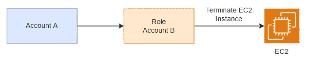

# AWS 认证解决方案架构师专家—身份和联盟— STS 承担一个角色

> 原文：<https://medium.com/codex/aws-certified-solutions-architect-professional-identity-federation-sts-to-assume-a-role-1ca67105b81a?source=collection_archive---------23----------------------->

你应该知道的 STS 的一个例子。这篇文章是夏羽·马雷克的终极 AWS 认证解决方案架构师专业课程的一个快速笔记。这个帖子的唯一目的是总结，如果你想学习细节，请购买夏羽·马瑞克的课程。


图片来自 AWS

# 成钢

AWS 安全令牌服务(AWS STS)是 AWS 中非常重要的服务，它允许 IAM 用户或联合用户通过请求临时凭证来访问您的 AWS 资源。

AWS STS 是一个 web 服务，您可以通过 API 调用它来获取临时凭证，然后显式地使用它们来调用 AWS 服务。

## 使用临时凭据的好处

您不必在应用程序中分发或嵌入长期 AWS 安全凭据。

您可以向用户提供对 AWS 资源的访问，而不必为他们定义 AWS 身份。

临时安全凭据有一个有限的生命周期，在临时安全凭据过期后，它们将无法重复使用，用户可以请求新的凭据。

## AWS STS 和 AWS 区域

AWS STS 是一个全局服务，在`https://sts.amazonaws.com`有一个默认端点，但是您可以使用区域 AWS STS 端点而不是全局端点来减少延迟，例如`[https://sts.us-west-2.amazonaws.com](https://sts.us-west-2.amazonaws.com.)` [。](https://sts.us-west-2.amazonaws.com.)

## 使用 STS 获取临时凭证

首先，我们在您的客户或我们希望担任角色的交叉客户中定义 IAM 角色。


AWS 角色

然后我们定义哪些主体可以访问这个 IAM 角色。例如，该规则只允许 lambda 和 edgelambda 承担角色。

```
{
    "Version" : "2012-10-17",
    "Statement" : [
      {
        "Effect" : "Allow",
        "Principal" : {
          "Service" : [
            "edgelambda.amazonaws.com",
            "lambda.amazonaws.com",
          ]
        },
        "Action" : "sts:AssumeRole",
      }
    ]
}
```

然后使用 AWS STS API 通过 AssumeRole API 检索凭据。例如，通过 AssumeRole API 调用传递的会话策略。

```
{
  "Version": "2012-10-17",
  "Statement": [
    {
      "Effect": "Allow",
      "Action": "s3:ListBucket",
      "Resource": "*"
    }
  ]
}
```

然后 lamda 将检索临时凭证，该凭证可以列出 AWS 资源中的所有 S3 存储桶。临时证书的有效期在 15 分钟到 12 小时之间。


STS AssumeRole

# 情境使用 STS

为一个 AWS 帐户中 IAM 用户提供访问权限，以访问您同时拥有的另一个帐户中的资源。

为第三方拥有的 AWS 帐户中的 IAM 用户提供访问权限。

为 AWS 服务提供对其他 AWS 资源的访问。

为经过外部身份验证的用户提供访问(身份联合)。

## 为一个 AWS 帐户中 IAM 用户提供访问权限，以访问您同时拥有的另一个帐户中的资源

示例我们希望帐户 A 可以拥有终止帐户 b 中 EC2 实例的权限。



首先，我们在帐户 B 中定义角色，然后我们定义哪个主体可以访问这个 IAM 角色，即帐户 A，然后帐户 A 调用 STS API 来检索临时凭证，以便在帐户 B 中终止 EC2 实例。

## 为第三方拥有的 AWS 帐户中的 IAM 用户提供访问权限

当第三方需要访问您组织的 AWS 资源时，您可以使用角色来委派对他们的访问，您可以授予这些第三方对您的 AWS 资源的访问权限，而无需共享您的 AWS 安全凭据。


图片来自 AWS

第三方必须为您提供以下信息:

*   第三方的 AWS 帐户 ID，当您为角色定义信任策略时，我们将他们的 AWS 帐户 ID 指定为主体。
*   与角色唯一关联的外部 ID。外部 ID 可以是您和第三方都知道的任何秘密标识符。
*   第三方使用您的 AWS 资源所需的权限。

比如说。

```
{
  "Version": "2012-10-17",
  "Statement": {
    "Effect": "Allow",
    "Principal": {
      "AWS": "Example Corp's AWS Account ID"
    },
    "Action": "sts:AssumeRole",
    "Condition": {
      "StringEquals": {
        "sts:ExternalId": "12345"
      }
    }
  }
}
```

**请阅读关于** [**的困惑副题**](https://docs.aws.amazon.com/IAM/latest/UserGuide/confused-deputy.html) **。**

# STS 重要 API

1.  AssumeRole API:访问您的帐户或交叉帐户中的角色。
2.  AssumeRoleWithSAML:返回使用 SAML 登录的用户的临时凭据。
3.  AssumeRoleWithWebIdentity:返回登录到具有 web 身份提供者的移动或 web 应用程序的用户的临时凭据。
4.  GetSessionToken:对于来自用户或 AWS 帐户根用户的 MFA。
5.  GetFederationToken:返回联合用户的临时凭证，通常是一个代理应用程序，它代表企业网络内的分布式应用程序获取临时安全凭证。

# 结束

关于 STS 的结束注释。

关于身份联盟的所有帖子:

1.  [身份&联邦——IAM](/codex/aws-certified-solutions-architect-professional-identity-federation-iam-c67d0259ac90)。
2.  [身份&联邦— STS 承担角色](/codex/aws-certified-solutions-architect-professional-identity-federation-sts-to-assume-a-role-1ca67105b81a)。
3.  [身份联盟&认知联盟](/codex/aws-certified-solutions-architect-professional-identity-federation-cognito-ec80783c3fd1)。
4.  [身份联盟—目录服务](/codex/aws-certified-solutions-architect-professional-identity-federation-directory-services-895807d86497)。
5.  [身份联盟— AWS 组织](/codex/aws-certified-solutions-architect-professional-identity-federation-aws-organizations-dd63cd701a72)。
6.  [身份联盟—组织服务控制策略](/codex/aws-certified-solutions-architect-professional-identity-federation-organizations-service-6192fab06d98)。
7.  [身份联盟——单点登录](/codex/aws-certified-solutions-architect-professional-identity-federation-single-sign-on-7731df09e9a5)。

下一个[安全— CloudTrail](/codex/aws-certified-solutions-architect-professional-security-cloudtrail-850006168acb) 。