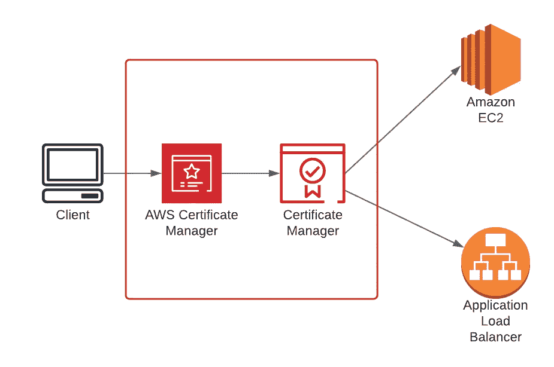
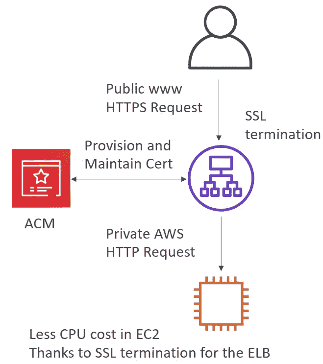

# AWS 认证解决方案架构师专家—安全— AWS 证书管理员

> 原文：<https://medium.com/codex/aws-certified-solutions-architect-professional-security-aws-certificate-manager-58f89dedaec?source=collection_archive---------12----------------------->

关于 AWS 证书管理器的简要说明。这篇文章是夏羽·玛瑞克的《终极 AWS 认证解决方案架构师》课程的一个简短记录。这个帖子的唯一目的是一个总结，如果你想要详细的学习，请购买夏羽·马雷克的课程。

图片由 [Cloudnation](https://daf-docs.lzaas.aws.cloudnation.nl/user-guide/services/certificate-manager.html) 提供

# AWS 证书管理器

AWS 证书管理器(ACM)处理创建、存储和更新保护您的 AWS 网站和应用程序的公共和私有 SSL/TLS 证书和密钥的复杂性。

ACM 证书可以保护单个域名、多个特定域名、通配符域或它们的组合。ACM 通配符证书可以保护无限数量的子域。

# **期权证书经理**

AWS 为部署托管证书的客户提供了两种选择:

*   **AWS 证书管理器(ACM)** —该服务面向需要使用 TLS 的安全网络存在的企业客户。
*   **ACM Private CA** —该服务面向在 AWS 云中构建公钥基础设施(PKI)的企业客户，旨在供组织内部私人使用。

# 与 ACM 集成的服务

AWS 证书管理器在以下集成中加载 SSL 证书:

*   **弹性负载均衡:** ACM 与弹性负载均衡集成，在负载均衡器上部署 ACM 证书。有关负载平衡的更多信息，请参见[弹性负载平衡用户指南](https://docs.aws.amazon.com/elasticloadbalancing/latest/userguide/)。

图片作者:夏羽·马雷克

*   **Amazon CloudFront:** ACM 与 CloudFront 集成，在 CloudFront 发行版上部署 ACM 证书。有关 CloudFront 的更多信息，请参见[亚马逊 CloudFront 开发者指南](https://docs.aws.amazon.com/AmazonCloudFront/latest/DeveloperGuide/)。
*   **Amazon API Gateway:** 要为 AWS API Gateway 设置自定义域名，必须提供 SSL/TLS 证书。您可以使用 ACM 来生成或导入证书。有关亚马逊 API 网关的更多信息，请参见[亚马逊 API 网关开发者指南](https://docs.aws.amazon.com/apigateway/latest/developerguide/)。

其他[集成 AWS 服务](https://docs.aws.amazon.com/acm/latest/userguide/acm-services.html)。

# ACM -很高兴知道

创建公共证书的可能性:

*   必须验证公共 DNS。
*   必须由受信任的公共证书颁发机构(CA)颁发。

创建私有证书的可能性:

*   供您内部使用。
*   您创建自己的私有 CA。
*   您的应用程序必须信任您的私有 CA。

证书续订:

*   如果由 ACM 生成并提供，则自动完成。
*   任何手动上传的证书都必须手动续订并重新上传。

ACM 是一项**区域性**服务:

*   要使用一个全局应用程序(例如多个 ALB)，您需要在部署应用程序的每个区域发布一个 SSL 证书。
*   您不能跨地区复制证书。

# 结束

结束关于 AWS 证书管理器的简短说明。

所有关于安全的帖子:

1.  [安全——云迹](/codex/aws-certified-solutions-architect-professional-security-cloudtrail-850006168acb)。
2.  [安全— CloudTrail 解决方案架构师](/codex/aws-certified-solutions-architect-professional-security-cloudtrail-solution-architect-9014311a3af5)。
3.  [安全—密钥管理服务](/@hmquan08011996/aws-certified-solutions-architect-professional-security-key-management-service-2da9f983a58a)。
4.  [安全性— AWS 系统管理器参数存储](/@hmquan08011996/aws-certified-solutions-architect-professional-security-ssm-parameter-store-11875fd32c6d)。
5.  [安全—机密管理器](/codex/aws-certified-solutions-architect-professional-security-secrets-manager-f39137c72211)。
6.  [安全— AWS 证书管理器](/codex/aws-certified-solutions-architect-professional-security-aws-certificate-manager-58f89dedaec)。
7.  [安全——S3 安全](/@hmquan08011996/aws-certified-solutions-architect-professional-security-s3-security-36b84d9968e0)。
8.  [安全— S3 配置](/@hmquan08011996/aws-certified-solutions-architect-professional-security-s3-config-e659beba0f88)。