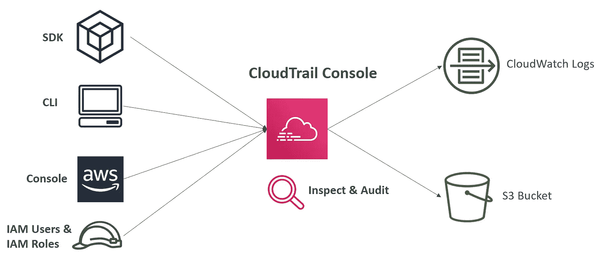
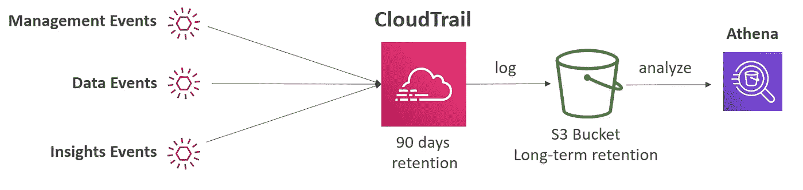

# AWS 认证解决方案架构师专家—安全— CloudTrail

> 原文：<https://medium.com/codex/aws-certified-solutions-architect-professional-security-cloudtrail-850006168acb?source=collection_archive---------8----------------------->

关于 AWS CloudTrail 的简短说明。这篇文章是由夏羽·马瑞克教授的《终极 AWS 认证解决方案架构师》课程的一个简要说明。这个帖子的唯一目的是一个总结，如果你想要详细的学习，请购买夏羽·马雷克的课程。

图片来自 AWS

# AWS 云迹

跟踪 AWS 帐户中的用户活动和 API 使用情况。AWS CloudTrail 默认启用。

AWS CloudTrail 通过以下方式监控和记录您的 AWS 帐户中的事件或 API 调用的历史记录:

*   安慰
*   软件开发工具包(Software Development Kit)
*   硬币指示器 （coin-levelindicator 的缩写）命令行界面（Command Line Interface for batch scripting）
*   AWS 服务

可以将 CloudTrail 中的日志放到 CloudWatch 日志或 S3 中。轨迹可以应用于所有区域(默认)或单个区域。

图片作者:夏羽·马雷克

CloudTrail 非常有用，比如在 AWS 中删除了一个资源，先调查 CloudTrail。

# CloudTrail 事件

CloudTrail 有三种事件。

**管理事件**

管理事件提供了对 AWS 帐户中的资源执行的管理操作的可见性。例如:

*   配置安全性(例如，IAM `AttachRolePolicy` API 操作)。
*   注册设备(例如，Amazon EC2 `CreateDefaultVpc` API 操作)。
*   配置路由数据的规则(例如，Amazon EC2 `CreateSubnet` API 操作)。
*   设置日志记录(例如，AWS CloudTrail `CreateTrail` API 操作)。

默认情况下，跟踪被配置为记录管理事件。

您可以将读取事件(不修改资源)与写入事件(可能修改资源)分开。

**数据事件**

默认情况下，跟踪不记录数据事件(因为大量的操作)。数据事件需要支付额外费用。

数据事件提供了对在资源上或资源内执行的资源操作的可见性。

数据事件资源类型:

*   亚马逊 S3 对桶和桶中对象的对象级 API 活动(例如，`GetObject`、`DeleteObject`和`PutObject` API 操作)。
*   AWS Lambda 函数执行活动(`Invoke` API)。
*   Amazon DynamoDB 对象级 API 在表上的活动(例如，`PutItem`、`DeleteItem`和`UpdateItem` API 操作)。

**洞察事件**

CloudTrail Insights 通过持续监控和分析 CloudTrail 管理事件，帮助您检测 AWS 帐户中的异常活动。

图片作者:夏羽·马雷克

异常活动可能是以下情况之一:

*   资源供应不准确。
*   达到服务极限。
*   AWS IAM 动作的突发。

如果您启用了 CloudTrail Insights，并且 CloudTrail 检测到异常活动，则 Insights 事件将被发送到您的踪迹的目标 S3 存储桶、CloudTrail 控制台或 EventBridge 事件。

# CloudTrail 事件保留

事件在 CloudTrail 中存储 90 天。

要使事件更持久，请将它们记录到 S3 或云观察。

图片作者:夏羽·马雷克

# 结束

结束一个关于 AWS CloudTrail 的快速说明。

所有关于安全的帖子:

1.  [安全——云迹](/codex/aws-certified-solutions-architect-professional-security-cloudtrail-850006168acb)。
2.  [安全— CloudTrail 解决方案架构师](/codex/aws-certified-solutions-architect-professional-security-cloudtrail-solution-architect-9014311a3af5)。
3.  [安全—密钥管理服务](/@hmquan08011996/aws-certified-solutions-architect-professional-security-key-management-service-2da9f983a58a)。
4.  [安全性— AWS 系统管理器参数存储](/@hmquan08011996/aws-certified-solutions-architect-professional-security-ssm-parameter-store-11875fd32c6d)。