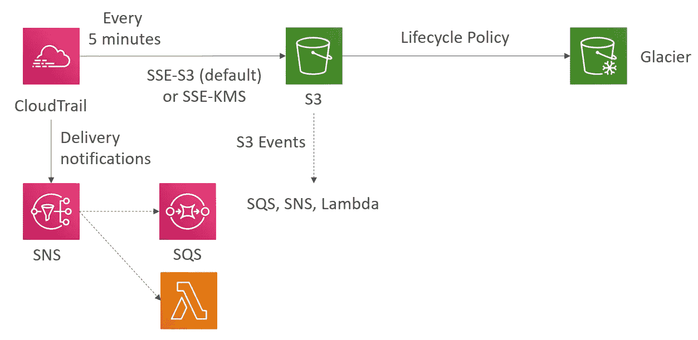
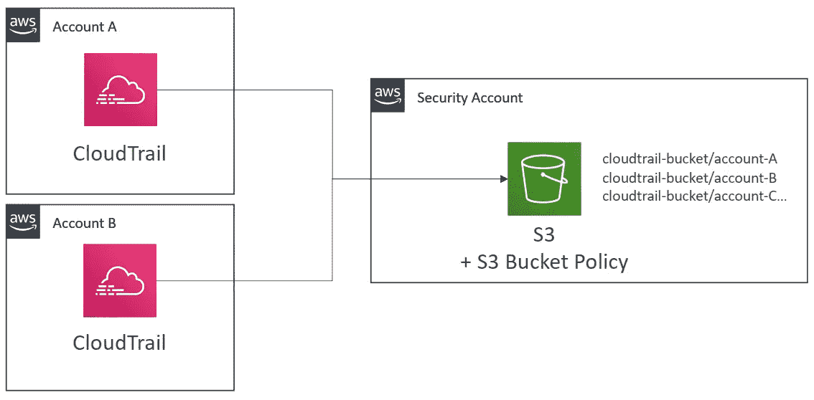
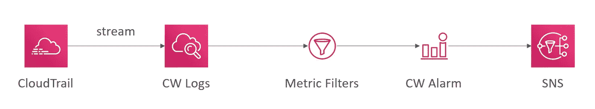

# AWS 认证解决方案架构师专家—安全— CloudTrail 解决方案架构师

> 原文：<https://medium.com/codex/aws-certified-solutions-architect-professional-security-cloudtrail-solution-architect-9014311a3af5?source=collection_archive---------7----------------------->

关于 AWS CloudTrail 解决方案架构师的简短说明。这篇文章是由夏羽·马瑞克教授的《终极 AWS 认证解决方案架构师》课程的一个简要说明。这个帖子的唯一目的是一个总结，如果你想要详细的学习，请购买夏羽·马雷克的课程。

# CloudTrail 解决方案架构师——交付给 S3

解决方案架构师示例的第一个用例。CloudTrail 将日志文件交付给 S3 存储桶。

图片作者:夏羽·马雷克

你可以每五分钟向亚马逊 S3 发送一次活动副本。默认情况下，亚马逊 S3 存储桶和对象是私有的，您需要修改亚马逊 S3 存储桶来接收组织跟踪的日志文件。

从 CloudTrail 发送的日志文件将被加密，默认为 SSE-S3，但您可以手动设置 SSE-KMS。

为了优化和节省成本，您可以在 S3 存储桶上设置一个生命周期策略，将对象转移到 **S3 冰川。**

如果您需要在 S3 时段接收对象时得到通知，可以启用 S3 事件来通知 SQS、SNS 或 Lambda 函数。

你也可以让 CloudTrail 直接向 SNS 发送通知，从 SNS 你可以调用 SQS 或 Lambda。

AWS 根据案例为您提供不同的方法。

# CloudTrail 解决方案架构师—多帐户、多地区日志记录

解决方案架构师示例的第二个用例。交叉帐户监控架构师。

图片作者:夏羽·马雷克

在上图中，我们有两个帐户，帐户 A 和帐户 B，我们有一个安全帐户，我们需要向其中发送日志。

在这两个帐户中，我们有 CloudTrail，我们将在安全帐户中设置一个 S3 存储桶来保存所有这些 CloudTrail 的日志。

我们将日志文件交付到安全帐户中的 S3 存储桶的唯一方法是定义 S3 存储桶策略，S3 存储桶策略应该允许 CloudTrail 将文件交付到 S3。

# API 调用警报

解决方案架构师示例的第三个用例。某些 API 调用的警报已完成。

图片作者:夏羽·马雷克

从 CloudTrail 中，您可以将所有这些事件流式传输到 CloudWtach 日志中，从 CloudWatch 日志中，您可以打开一堆用例。

通过上图，在 CloudWatch Logs 从 CloudTrail 接收日志文件后，您可以创建一个度量过滤器和警报来监控日志文件中的事件。

例如，你可以指定一个事件，比如 Amazon EC2 `RunInstances`操作，当事件发生时，CloudWatch 会向 SNS 发送通知，你可以从 SNS 调用 SQS 或 Lambda。

# CloudTrail:如何最快地对事件做出反应？

总体而言，CloudTrail 可能需要 15 分钟来交付事件，但您可以将 CloudTrail 与其他工具结合使用，以更快地对事件做出反应。

第一种也是最快、最具反应性的方法是使用 CloudWatch 事件，CloudTrail 中的任何 API 调用都可以触发该事件，您可以通过创建一个 Trail 来设置它。

第二种方式是使用 CloudTrail 交付给 CloudWatch 日志，事件是流式的。

第三种方式是使用 CloudTrail 传送到 S3，事件每五分钟传送一次。

你可以有不同的解决方案，要么是 CloudWatch 事件，要么是 CloudWatch 日志，要么是 S3，它们都没有好坏之分，只是取决于你想达到什么目的。

# 结束

结束关于 AWS CloudTrail 解决方案架构师用例的快速说明。

所有关于安全的帖子:

1.  [安全——云迹](/codex/aws-certified-solutions-architect-professional-security-cloudtrail-850006168acb)。
2.  [安全— CloudTrail 解决方案架构师](/codex/aws-certified-solutions-architect-professional-security-cloudtrail-solution-architect-9014311a3af5)。
3.  [安全—密钥管理服务](/@hmquan08011996/aws-certified-solutions-architect-professional-security-key-management-service-2da9f983a58a)。
4.  [安全性— AWS 系统管理器参数存储](/@hmquan08011996/aws-certified-solutions-architect-professional-security-ssm-parameter-store-11875fd32c6d)。