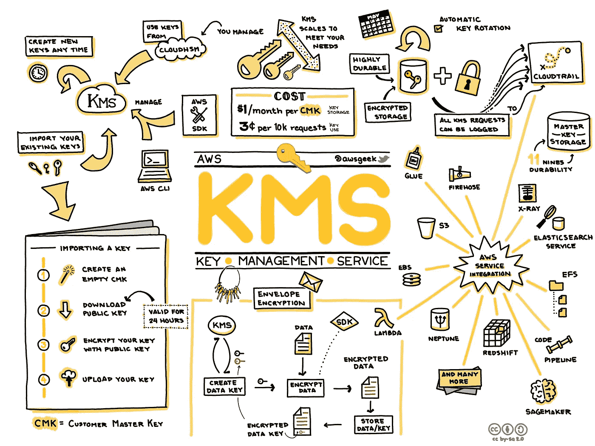
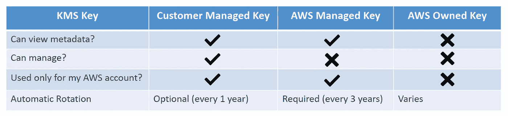

# AWS 认证解决方案架构师专家—安全—密钥管理服务

> 原文：<https://medium.com/codex/aws-certified-solutions-architect-professional-security-key-management-service-2da9f983a58a?source=collection_archive---------12----------------------->

关于 AWS 密钥管理服务的简要说明。这篇文章是夏羽·玛瑞克教授的《终极 AWS 认证解决方案架构师》课程中的一篇短文。这个帖子的唯一目的是一个总结，如果你想要详细的学习，请购买夏羽·马雷克的课程。

图片由 [**杰里·哈格罗夫**](https://www.awsgeek.com/AWS-KMS/)

# 密钥管理服务

每当您听说 AWS 服务的“加密”时，想想 AWS 密钥管理服务。AWS KMS 是一项托管服务，使您可以轻松创建和控制用于保护数据的加密密钥。

许多 AWS 服务使用 AWS KMS 来支持数据加密:

*   [亚马逊 EBS](https://docs.aws.amazon.com/kms/latest/developerguide/services-ebs.html)
*   [亚马逊 RDS](https://docs.aws.amazon.com/kms/latest/developerguide/services-rds.html)
*   [亚马逊 DynamoDB](https://docs.aws.amazon.com/kms/latest/developerguide/services-dynamodb.html)
*   [亚马逊 S3](https://docs.aws.amazon.com/kms/latest/developerguide/services-s3.html)
*   [AWS 秘密管理器](https://docs.aws.amazon.com/kms/latest/developerguide/services-secrets-manager.html)
*   等等…

# KMS 键类型

在 AWS 中，有两种类型的密钥:对称密钥和非对称密钥。

**对称(AES-256 密钥)**

默认情况下，当您创建一个 AWS KMS 密钥时，您将获得一个用于对称加密的 KMS 密钥。

对称加密密钥使用相同的密钥进行加密和解密。所有与 KMS 集成的 AWS 服务都使用对称 KMS 密钥。

**非对称(公钥和私钥对)**

非对称 KMS 密钥使用公钥加密，使用私钥解密。

公钥是可下载的，可以在 AWS KMS 之外使用，但是您不能访问未加密的私钥，要使用私钥，您必须调用 AWS KMS API。

# KMS 键的类型

AWS 有四种 KMS 键

**客户管理的密钥**

*   这是您直接在 AWS 中创建的密钥。您可以创建、管理、启用或禁用它们。
*   轮换策略的可能性(每年生成新密钥，保留旧密钥)。

**AWS 托管密钥**

*   由 AWS 服务(RDS、EBS、S3 等)使用。
*   由 AWS 管理(每 3 年自动轮换一次)。

**AWS 拥有的密钥**

*   由 AWS 创建和管理，由一些 AWS 服务用来保护您的资源。
*   在多个 AWS 帐户中使用，但不在您的 AWS 帐户中。
*   您不能查看、使用、跟踪或审核。

图片作者:夏羽·马雷克

# 多区域键

AWS KMS 支持可互换使用的*多区域键*。每组*相关的*多区域密钥都有相同的密钥材料和密钥 ID，所以你可以在一个 AWS 区域加密数据，在不同的 AWS 区域解密。

多区域键不是全局的。您创建一个多区域主键，然后将其复制到您在 AWS 分区中选择的区域中。一次只能有一个主键，但是您可以将副本提升为它们自己的主键。

多区域密钥是数据安全场景的强大解决方案:灾难恢复、全局数据管理、分布式签名应用程序、跨多个区域的主动-主动应用程序等

# 结束

结束关于 AWS 密钥管理服务的简短说明。

所有关于安全的帖子:

1.  [安全——云迹](/codex/aws-certified-solutions-architect-professional-security-cloudtrail-850006168acb)。
2.  [安全性— CloudTrail 解决方案架构师](/codex/aws-certified-solutions-architect-professional-security-cloudtrail-solution-architect-9014311a3af5)。
3.  [安全—密钥管理服务](/@hmquan08011996/aws-certified-solutions-architect-professional-security-key-management-service-2da9f983a58a)。
4.  [安全性— AWS 系统管理器参数存储](/@hmquan08011996/aws-certified-solutions-architect-professional-security-ssm-parameter-store-11875fd32c6d)。