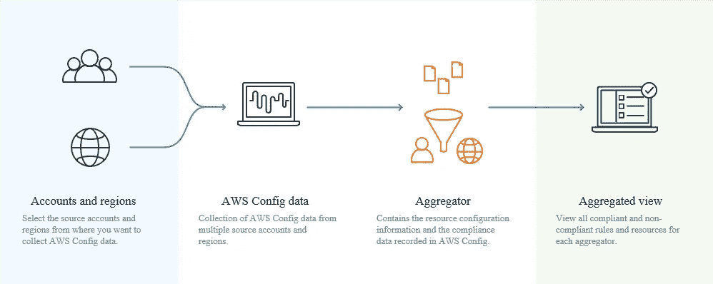
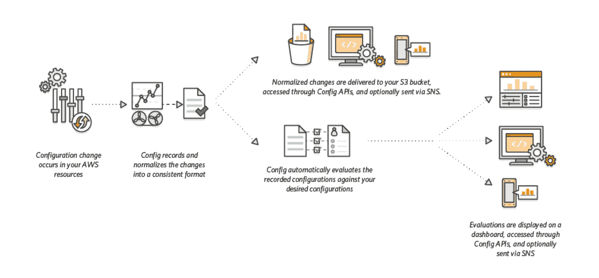

# AWS 认证解决方案架构师专家—安全— AWS 配置

> 原文：<https://medium.com/codex/aws-certified-solutions-architect-professional-security-s3-config-e659beba0f88?source=collection_archive---------9----------------------->

关于 AWS 配置的快速说明。这篇文章是夏羽·玛瑞克的《终极 AWS 认证解决方案架构师》课程的一个简短记录。这个帖子的唯一目的是一个总结，如果你想要详细的学习，请购买夏羽·马雷克的课程。

AWS 提供的图像

# AWS 配置

当您在 AWS 上运行应用程序时，您通常会使用 AWS 资源，您必须共同创建和管理这些资源。随着应用程序需求的不断增长，您也需要跟踪 AWS 资源的配置。

AWS Config 提供了 AWS 帐户中 AWS 资源配置的详细视图。使用 AWS 配置，您可以执行以下操作:

*   评估所需设置的 AWS 资源配置。
*   检索您的帐户中存在的一个或多个资源的配置。
*   检索一个或多个资源的历史配置。
*   每当创建、修改或删除资源时接收通知。
*   查看资源之间的关系。例如，您可能希望查找使用特定安全组的所有资源。

**AWS 配置是一项基于地区的服务。**

# AWS 配置的使用方法

AWS Config 旨在帮助您在以下场景中监督应用程序资源

## **资源管理局**

您可以使用 AWS 配置规则来评估 AWS 资源的配置设置。当 AWS Config 检测到某个资源违反了您的某个规则中的条件时，AWS Config 会将该资源标记为不符合，并发送通知。

## **审计与合规**

您可能正在处理需要频繁审计的数据，以确保符合内部策略和最佳实践。为了证明合规性，您需要访问资源的历史配置。AWS 配置提供了这些信息。

## **管理和排除配置变更故障**

当您使用多个相互依赖的 AWS 资源时，一个资源的配置更改可能会对相关资源产生意想不到的后果。使用 AWS Config，您可以查看要修改的资源与其他资源的关系，并评估更改的影响。

## **安全分析**

您可以使用 AWS Config 查看在记录 AWS Config 的任何时间分配给 IAM 用户、组或角色的 IAM 策略。这些信息可以帮助您确定在特定时间属于某个用户的权限。

# AWS 配置规则

您可以创建 AWS 配置规则来评估 AWS 资源的配置设置。AWS 配置支持[配置管理规则](https://docs.aws.amazon.com/config/latest/developerguide/evaluate-config_use-managed-rules.html)和[配置自定义规则](https://docs.aws.amazon.com/config/latest/developerguide/evaluate-config_develop-rules.html)。托管规则是由 AWS Config 创建的预定义、可自定义的规则。

可以评估/触发规则:

*   对于每次配置更改。
*   和/或:以规则的时间间隔。
*   如果规则不符合(与 Lambda 链接)，可以触发 CloudWatch 事件。

规则可以自动修正:

*   如果资源不合规，您可以触发自动补救。
*   通过 SSM 自动化定义补救措施。
*   例如:修正安全组规则，停止带有未批准标记的实例。

# AWS 配置如何工作

如果您正在使用 AWS 配置规则，AWS 配置会不断评估您的 AWS 资源配置以获得所需的设置。根据规则的不同，AWS Config 将评估您的资源，以响应配置更改或定期评估。每个规则都与一个 AWS Lambda 函数相关联，该函数包含规则的评估逻辑。当 AWS Config 评估您的资源时，它调用规则的 AWS Lambda 函数。该函数返回被评估资源的符合性状态。如果资源违反了规则的条件，AWS Config 会将资源和规则标记为不符合。当资源的合规状态发生变化时，AWS Config 会向您的 Amazon SNS 主题发送通知。

AWS 提供的图像

# 结束

结束关于 AWS S3 安全的简短说明。其他人发布关于安全性的帖子:

1.  [安全——云迹](/codex/aws-certified-solutions-architect-professional-security-cloudtrail-850006168acb)。
2.  [安全性— CloudTrail 解决方案架构师](/codex/aws-certified-solutions-architect-professional-security-cloudtrail-solution-architect-9014311a3af5)。
3.  [安全—密钥管理服务](/@hmquan08011996/aws-certified-solutions-architect-professional-security-key-management-service-2da9f983a58a)。
4.  [安全性— AWS 系统管理器参数存储](/@hmquan08011996/aws-certified-solutions-architect-professional-security-ssm-parameter-store-11875fd32c6d)。
5.  [安全—机密管理器](/codex/aws-certified-solutions-architect-professional-security-secrets-manager-f39137c72211)。
6.  [安全— AWS 证书管理器](/codex/aws-certified-solutions-architect-professional-security-aws-certificate-manager-58f89dedaec)。
7.  [安全——S3 安全](/@hmquan08011996/aws-certified-solutions-architect-professional-security-s3-security-36b84d9968e0)。
8.  [安全— S3 配置](/@hmquan08011996/aws-certified-solutions-architect-professional-security-s3-config-e659beba0f88)。