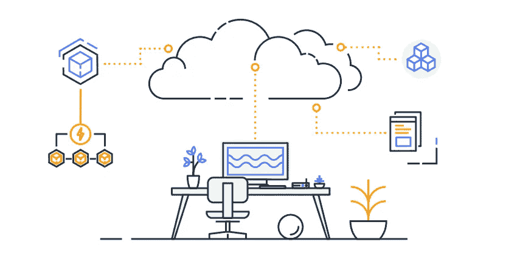

# AWS 认证解决方案架构师专家—安全— S3 安全

> 原文：<https://medium.com/codex/aws-certified-solutions-architect-professional-security-s3-security-36b84d9968e0?source=collection_archive---------12----------------------->

关于 AWS S3 安全的简要说明。这篇文章是夏羽·玛瑞克的《终极 AWS 认证解决方案架构师》课程的一个简短记录。这个帖子的唯一目的是一个总结，如果你想要详细的学习，请购买夏羽·马雷克的课程。

AWS 提供的图像

# 数据保护

数据保护指的是保护传输中的数据(当数据往返于亚马逊 S3 时)和静态数据(当数据存储在亚马逊 S3 数据中心的磁盘上时)。

## 保护静态数据

在亚马逊 S3 有两种保护静态数据的方法:

**服务器端加密**

要求亚马逊 S3 在将你的对象保存在数据中心的磁盘上之前对其进行加密，然后在你下载这些东西时对其进行解密。有 3 种服务器端加密方法:

*   SSE-S3:使用 AWS 处理和管理的密钥加密 S3 对象。
*   SSE-KMS:利用 AWS 密钥管理服务来管理加密密钥。
*   SSE-C:当你想管理自己的加密密钥时。

**客户端加密**

在客户端加密数据，并将加密的数据上传到亚马逊 S3。在这种情况下，您管理加密过程、加密密钥和相关工具。

## 保护传输中的数据

您可以使用安全套接字层/传输层安全性(SSL/TLS)来保护传输中的数据。

AWS S3 揭露:

*   HTTP 端点:未加密。
*   HTTPS 端点:飞行中的加密。

您可以自由使用您想要的端点，但建议使用 HTTPS。

# S3 访问日志

您可以为 S3 启用服务器访问日志记录，它会提供对存储桶所做请求的详细记录。

访问日志信息在安全和访问审计中很有用。它还可以帮助你了解你的客户群，理解你的亚马逊 S3 账单。

值得一提的是:

*   日志可能需要几个小时才能送达。
*   日志可能不完整(尽最大努力)。

# S3 安全

默认情况下，所有亚马逊 S3 资源都是私有的。亚马逊 S3 提供访问策略选项，大致分为基于资源的策略和用户策略。

通过*用户策略，您可以使用 IAM 策略将访问策略附加到您帐户中的用户。*

使用*基于资源的策略(S3 存储桶策略)，*您可以将访问策略附加到您的资源(存储桶和对象)。

您还可以使用访问控制列表(ACL)向其他 AWS 帐户授予基本的读写权限。

## S3 水桶政策

使用 S3 策略时段可以:

*   授予桶的公共访问权限。
*   上传时强制加密对象。
*   授予对另一个帐户的访问权限(交叉帐户)。

可选条件:

*   公有 IP 或者弹性 IP **(不在私有 IP 上)。**
*   源 VPC 或源 VPC 端点—仅适用于 VPC 端点。
*   CloudFront 源标识。
*   MFA。

# S3 预签名网址

可以使用 SDK 或 CLI 生成预签名的 URL:

*   用于下载(简单，可以使用 CLI)。
*   用于上传(更难，必须使用 SDK)。

默认 3600 秒有效，可通过`--expires-in [TIME_BY_SECONDS]`参数改变超时。

获得预签名 URL 的用户继承了为 GET/PUT 生成 URL 的人的权限。

使用案例:

*   仅允许登录用户在您的 S3 桶上下载优质视频。
*   通过动态生成 URL，允许不断变化的用户列表下载文件。
*   暂时允许一个用户上传一个文件到一个精确的位置。

# 结束

结束关于 AWS S3 安全的简短说明。

1.  [安全——云迹](/codex/aws-certified-solutions-architect-professional-security-cloudtrail-850006168acb)。
2.  [安全性— CloudTrail 解决方案架构师](/codex/aws-certified-solutions-architect-professional-security-cloudtrail-solution-architect-9014311a3af5)。
3.  [安全—密钥管理服务](/@hmquan08011996/aws-certified-solutions-architect-professional-security-key-management-service-2da9f983a58a)。
4.  [安全性— AWS 系统管理器参数存储](/@hmquan08011996/aws-certified-solutions-architect-professional-security-ssm-parameter-store-11875fd32c6d)。
5.  [安全—秘密管理器](/codex/aws-certified-solutions-architect-professional-security-secrets-manager-f39137c72211)。
6.  [安全— AWS 证书管理器](/codex/aws-certified-solutions-architect-professional-security-aws-certificate-manager-58f89dedaec)。
7.  [安全——S3 安全](/@hmquan08011996/aws-certified-solutions-architect-professional-security-s3-security-36b84d9968e0)。
8.  [安全— S3 配置](/@hmquan08011996/aws-certified-solutions-architect-professional-security-s3-config-e659beba0f88)。