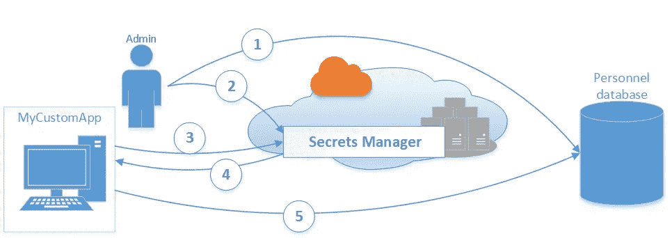
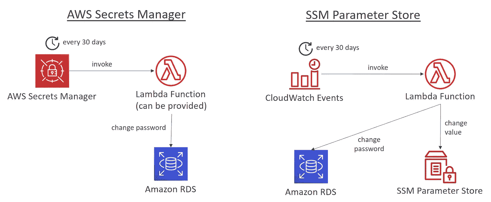

# AWS 认证解决方案架构师专家—安全—机密经理

> 原文：<https://medium.com/codex/aws-certified-solutions-architect-professional-security-secrets-manager-f39137c72211?source=collection_archive---------9----------------------->

关于 AWS Secrets Manager 的简短说明。这篇文章是夏羽·玛瑞克教授的《终极 AWS 认证解决方案架构师》课程中的一篇短文。这个帖子的唯一目的是一个总结，如果你想要详细的学习，请购买夏羽·马雷克的课程。

# AWS 机密管理器

AWS Secrets Manager 帮助您存储和保护访问其他应用程序所需的机密。该服务使您能够在整个生命周期中轻松地轮换、管理和检索数据库凭证、API 密钥和其他机密。

您可以随时调用 Secrets Manager 来检索您的凭据，而不是在应用程序中硬编码凭据。

通过 Secrets Manager，您可以使用 IAM 策略和基于资源的策略来管理对机密的访问。例如，您可以创建一个策略，使开发人员能够仅在将某些机密用于开发环境时检索它们。

# 基本场景

例如，图表显示您可以在 Secrets Manager 中存储数据库的凭据，然后应用程序检索这些凭据来访问数据库。

AWS 提供的图像

1.  您为数据库创建了一组凭据。
2.  您将凭据作为秘密存储在 Secrets Manager 中。
3.  当您的应用程序访问数据库时，应用程序会向机密管理器查询机密。
4.  Secrets Manager 通过安全(带 TLS 的 HTTPS)通道将密码返回给客户端应用程序。
5.  客户端应用程序解析凭证，然后使用该信息访问数据库服务器。

# 机密管理器功能

**自动旋转你的秘密**

您可以将 Secrets Manager 配置为使用 AWS Lambda 函数自动旋转。该函数定义了 Secrets Manager 如何执行以下任务:

*   创建秘密的新版本。
*   将机密存储在机密管理器中。
*   将受保护的服务配置为使用新版本。
*   验证新版本。
*   将新版本标记为生产就绪。

**原生支持 RDS**

Secrets Manager 本身支持以下 Amazon RDS:

*   亚马逊 RDS 上的亚马逊极光
*   亚马逊 RDS 上的 MySQL
*   亚马逊 RDS 上的 PostgreSQL
*   亚马逊 RDS 上的 Oracle
*   亚马逊 RDS 上的 MariaDB
*   Amazon RDS 上的 Microsoft SQL Server

# 机密管理员配额

每个区域最多可以存储 500，000 个秘密。

一个秘密的最大版本大约是 100。

秘密的最大长度是 65，536 字节。

基于资源的策略(JSON 文本)的长度为 20，480 个字符。

# SSM 参数存储 vs 机密管理器

机密管理器:

*   成本更高。
*   自动旋转的秘密与 AWS。
*   为 RDS、Redshift 和 DocumentDB 提供了 Lambda 函数。
*   KMS 加密是强制性的。

SSM 参数存储:

*   成本更低。
*   简单的 API。
*   无秘密旋转(可以使用由 CW 事件触发的 Lambda 启用旋转)。
*   KMS 加密是可选的。

# SSM 参数存储与机密管理器轮换

图片作者:夏羽·马雷克

# 结束

结束关于 AWS Secrets Manager 的简短说明。

所有关于安全的帖子:

1.  [安全——云迹](/codex/aws-certified-solutions-architect-professional-security-cloudtrail-850006168acb)。
2.  [安全— CloudTrail 解决方案架构师](/codex/aws-certified-solutions-architect-professional-security-cloudtrail-solution-architect-9014311a3af5)。
3.  [安全—密钥管理服务](/@hmquan08011996/aws-certified-solutions-architect-professional-security-key-management-service-2da9f983a58a)。
4.  [安全性— AWS 系统管理器参数存储](/@hmquan08011996/aws-certified-solutions-architect-professional-security-ssm-parameter-store-11875fd32c6d)。
5.  S [安全—秘密管理器](/codex/aws-certified-solutions-architect-professional-security-secrets-manager-f39137c72211)。
6.  [安全— AWS 证书管理器](/codex/aws-certified-solutions-architect-professional-security-aws-certificate-manager-58f89dedaec)。
7.  [安全——S3 安全](/@hmquan08011996/aws-certified-solutions-architect-professional-security-s3-security-36b84d9968e0)。