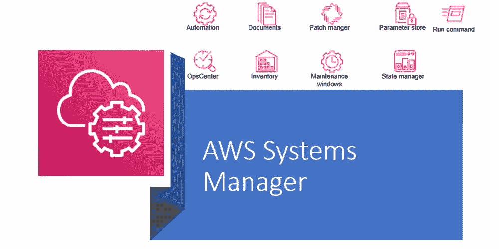
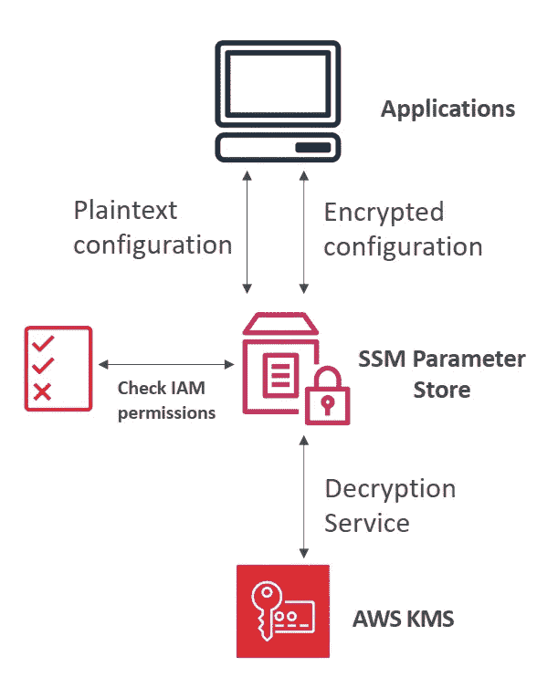
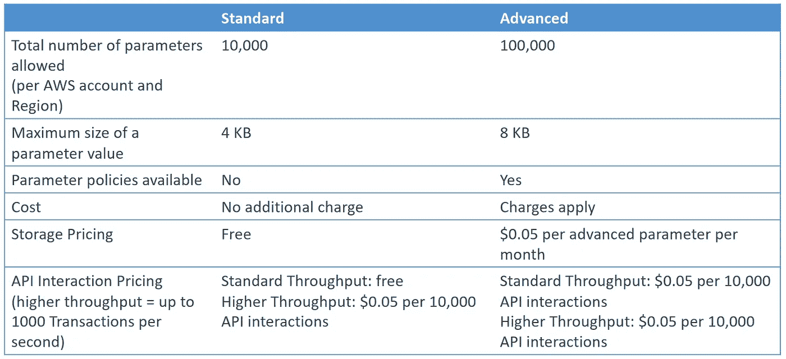

# AWS 认证解决方案架构师专家—安全— SSM 参数存储

> 原文：<https://medium.com/codex/aws-certified-solutions-architect-professional-security-ssm-parameter-store-11875fd32c6d?source=collection_archive---------10----------------------->

关于 AWS 系统管理器参数存储的简要说明。这篇文章是由夏羽·马瑞克教授的《终极 AWS 认证解决方案架构师》课程的一个简要说明。这个帖子的唯一目的是一个总结，如果你想要详细的学习，请购买夏羽·马雷克的课程。



图片由 [sunilkumarmedium](https://dev.to/sunilkumarmedium) 提供

# AWS 系统管理器参数存储

AWS 服务为配置和机密提供安全存储。您可以将密码、数据库字符串和许可证代码等数据存储为参数值。

存储在参数存储中的数据可以用 AWS KMS 加密。

参数存储提供了以下好处:

*   提高您的安全性。
*   无服务器。
*   配置和机密的版本跟踪。
*   可靠地存储参数。
*   在粒度级别控制和审核访问。

例如如何在应用程序中使用 SSM 参数存储。



图片作者:夏羽·马雷克

1.  在 SSM 中，数据以明文或加密字符串的形式存储。
2.  您的应用程序通过使用 SDK 来检索参数。
3.  参数存储将检查 IAM 权限，以确保我们可以获得它们。
4.  参数存储向您返回数据。

# 参数类型

参数存储支持三种类型的参数:`String`、`StringList`和`SecureString`。

**字符串**

默认情况下，数据存储为字符串，`String`参数由您输入的任何文本块组成，例如:

*   `xyzabc`
*   `Hoàng Phúc International`
*   ``

**字符串列表**

`StringList`参数包含逗号分隔的值列表，如下例所示。

*   `June,July,August`
*   `ElasticSearch, Logtash, Kibana`

**固定**

`SecureString` 参数是任何需要以加密格式存储的敏感数据。SecureString 数据使用 AWS KMS 密钥进行加密和解密。

# 标准和高级参数层

参数库中有两层参数，包括*标准参数*和*高级参数。*



图片作者:夏羽·马雷克

标准参数共有 10，000 个参数。至于高级参数是 10 万。

标准参数的最大值是 4KB，而高级参数的最大值是 double。

标准参数没有存储定价。

**您可以随时将标准参数更改为高级参数，但不能将高级参数恢复为标准参数。**这是因为将高级参数恢复为标准参数会导致系统将参数大小从 8 KB 截断为 4 KB，从而导致数据丢失。

高级参数已经与参数策略相集成。

# 参数策略(用于高级参数)

允许为参数(到期日期)分配 TTL，以强制更新或删除敏感数据，如密码。

可以一次分配多个策略。

参数存储有三种类型的策略:`Expiration`、`ExpirationNotification`和`NoChangeNotification`。

**到期**

该策略删除参数。例如，您可以使用`ISO_INSTANT`格式或`ISO_OFFSET_DATE_TIME`格式来指定特定的日期和时间。

```
{
    "Type": "Expiration",
    "Version": "1.0",
    "Attributes": {
        "Timestamp": "2018-12-02T21:34:33.000Z"
    }
}
```

**无变更通知**

此策略会通知您过期时间。通过使用此策略，您可以在到期时间到达之前收到通知，例如，以天或小时为单位。

```
{
    "Type": "ExpirationNotification",
    "Version": "1.0",
    "Attributes": {
        "Before": "15",
        "Unit": "Days"
    }
}
```

**无变更通知**

该策略通知参数是否在指定时间段内*未*被修改。例如，当需要在一段时间内更改密码时，此策略类型非常有用。

```
{
    "Type": "NoChangeNotification",
    "Version": "1.0",
    "Attributes": {
        "After": "20",
        "Unit": "Days"
    }
}
```

# 结束

结束关于 AWS 系统管理器参数存储的快速注释

所有关于安全的帖子:

1.  [安全—云迹](/codex/aws-certified-solutions-architect-professional-security-cloudtrail-850006168acb)。
2.  [安全性— CloudTrail 解决方案架构师](/codex/aws-certified-solutions-architect-professional-security-cloudtrail-solution-architect-9014311a3af5)。
3.  [安全—密钥管理服务](/@hmquan08011996/aws-certified-solutions-architect-professional-security-key-management-service-2da9f983a58a)。
4.  [安全— AWS 系统管理器参数存储](/@hmquan08011996/aws-certified-solutions-architect-professional-security-ssm-parameter-store-11875fd32c6d)。
5.  [安全—机密管理器](/@hmquan08011996/aws-certified-solutions-architect-professional-security-secrets-manager-f39137c72211)。