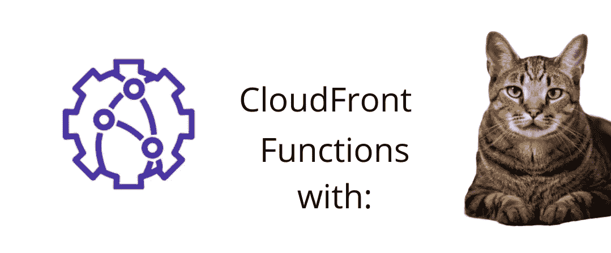
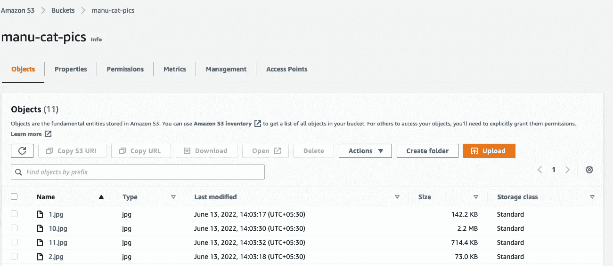
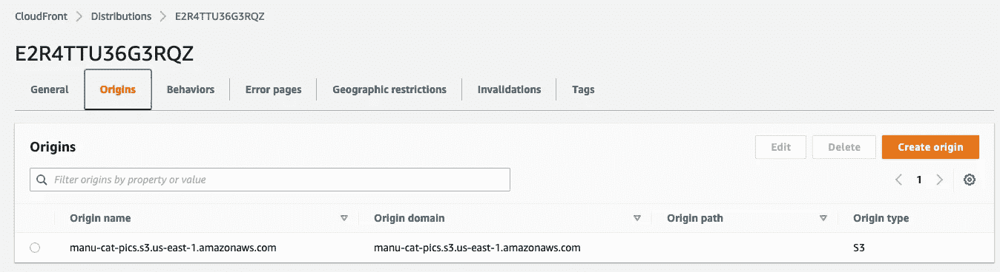
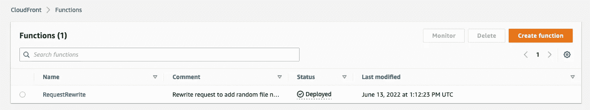
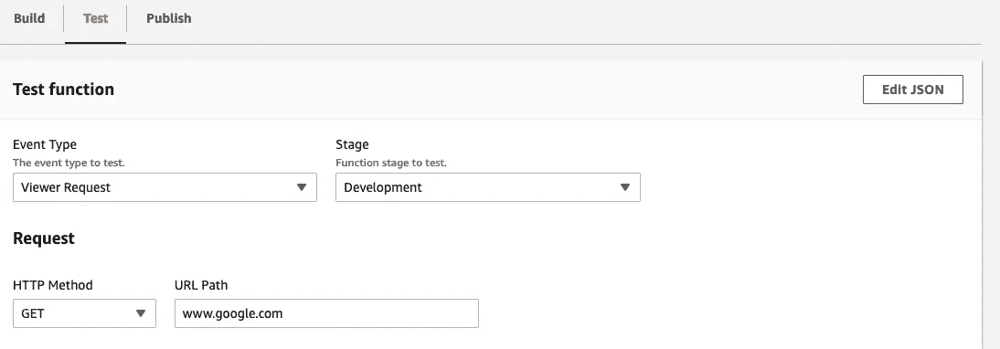
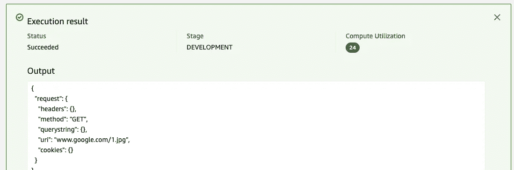
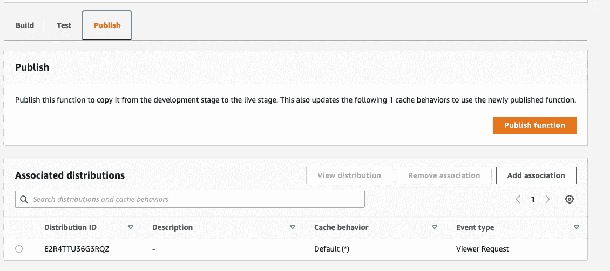
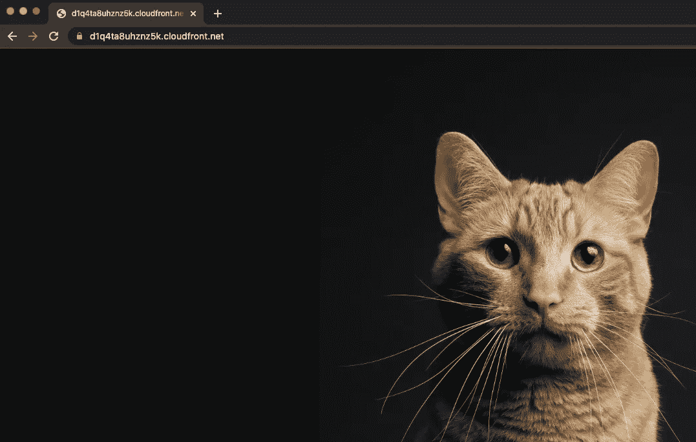
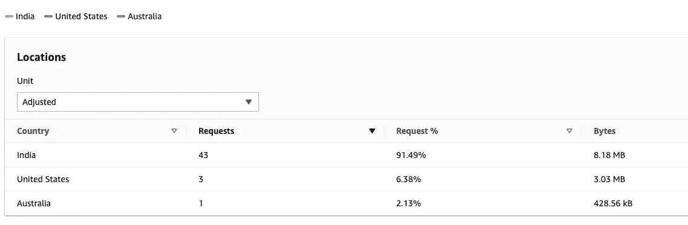

# AWS CloudFront 函数

> 原文：<https://medium.com/codex/aws-cloudfront-functions-a1dc3cea9c1a?source=collection_archive---------33----------------------->



CloudFront 是来自 AWS 的 CDN 产品，帮助您减少从您的应用程序向世界任何地方的用户提供 web 内容的延迟。世界各地的边缘服务器缓存内容，因此，用户从比原始服务器更靠近他们的服务器获取内容。

CloudFront 函数提供了向其中添加一些边缘计算的功能。在请求发送之前，或者在请求返回查看器之前，可以在 Javascript(目前只有 JS)中添加一个小逻辑。

这是一个 CloudFront 函数的 POC，用来重写从 origin 请求的 URL。

我们创建了一个 S3 桶(默认:私人)并上传了一些猫的照片。



现在我们在此基础上创建一个 CloudFront 发行版。

原始域:从下拉列表中选择 S3 时段名

S3 桶访问:是的，使用 OAI(这允许 CloudFront 访问 S3，而公共访问在桶上被阻止)

单击创建新 OAI，动态创建 OAI。

存储桶策略:是，更新存储桶策略

限制查看者访问:否



您可以在我的另一篇文章中看到更多关于创建和访问 CloudFront 发行版的内容。这里唯一的不同是，我们这次不做签名 cookies 或 URL。

[](/@manu.digital/signed-urls-and-signed-cookies-in-aws-cloudfront-using-python-4a8a6609e7) [## 使用 Python 在 AWS CloudFront 中签名的 URL 和签名的 Cookies

### AWS 云锋

使用 Python AWS CloudFrontmedium.com](/@manu.digital/signed-urls-and-signed-cookies-in-aws-cloudfront-using-python-4a8a6609e7) 

当我们等待发行版被部署时，创建 CloudFront 函数。CloudFront 控制台—功能—创建功能。在开发窗口中输入以下代码。如您所见，这更像是一个快速 n-dirty 代码，而不是生产级别的代码。

```
function handler(event) {
    var request = event.request;
    var uri = request.uri;
    var file_name = Math.floor((Math.random() * 10) + 1)+ '.jpg'
    var no_dots = 0

    // Check whether the URI is missing a file name.
    if (request.uri.endsWith('/')) {
        request.uri += file_name;
    } 
    // Check whether the URI is missing a file extension.
    else {
        no_dots = (request.uri.split(".").length - 1) //3
        if (no_dots == 2)

        request.uri = request.uri + '/' + file_name;
    }

    return request;
}
```



单击“测试”来测试该功能。正如你所看到的，它选择了随机数 1，我们用 1.jpg 更新了 url。每次都会随机选择这个文件名。



正如你所看到的，所有的代码都在 handler 中，我们可以在这个函数中访问请求(和响应)头。我们可以更新网址，添加/更新标题等。计算机利用率是%。上图中的 24 表示该函数使用了 24%的计算量。函数最多只能执行一毫秒，使用 2MB 内存，大小不能超过 10KB。但是对于一个智能开发人员来说，这足以根据用户使用的设备或用户的地理位置(CloudFront 中的 HTTP 头)来显示内容

您可以从功能屏幕或分配屏幕将功能与分配相关联。下图显示了从功能屏幕。

单击发布功能，将其从开发阶段移至现场阶段。单击 Add Association 以关联到 CloudFront 发行版。



等待发行版被部署。现在转到 CloudFront 发行版的域 URL。每次刷新都会出现一只新的猫。



顺便问一下，您知道我们可以从报告和分析查看器中看到 CloudFront 分发的访问模式吗？为了模拟全球的观众，我用我的 VPN 把我的位置改成了美国和澳大利亚。



这就结束了我和猫在 CloudFront 的愚蠢旅行。希望这对你有帮助。