# 有云形成的自动气象站

> 原文：<https://medium.com/codex/aws-devops-with-cloudformation-365c806e46c?source=collection_archive---------1----------------------->

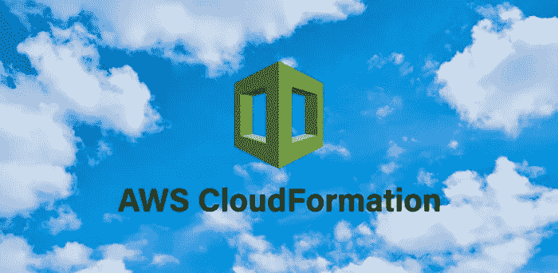

CloudFormation 是 AWS 的一个工具，用于使用基础设施即代码模型在 AWS 中自动提供基础设施。该工具是免费的，所有 CloudFormation 功能都是免费使用的，但用户将为通过 CloudFormation 创建的所有 AWS 资源付费。主要优势是，作为一个 AWS 产品，您可以随时获得与 AWS 资源的最新兼容性。

# 模板

开发人员将在云形成模板文件中使用 JSON 或 YAML 语法来建模他们的 AWS 基础设施。文件扩展名可以是你想要的任何东西。

每个模板都可以包含以下部分。资源是唯一必需的部分。

*   **AWSTemplateFormatVersion:**“2010–09–09”——cloud formation 模板版本。唯一可接受的值是“2010 年 9 月 9 日”
*   **描述:**使您能够包含关于您的模板的任意注释。(可选)例如:“此模板将创建 EC2”
*   **映射:**可以用来设置值的键-值对的集合。(可选)例如:每个 AWS 区域的 AMI Ids 列表
*   **Resources:** 声明您想要包含在堆栈中的 AWS 资源。(必需的)例如:EC2 实例、安全组
*   **参数:**参数允许您在每次创建或更新堆栈时向模板输入自定义值。(可选)例如:登录 EC2 的 SSH 密钥。
*   **Outputs:** 声明输出值，您可以将其导入到其他堆栈中，作为响应返回，或者在 AWS CloudFormation 控制台上查看。(可选)例如:创建的 EC2 实例的 IP 地址。

每个模板中可以声明一个或多个资源。它们可以相互依赖，cloudformation 将确保首先创建独立的资源，然后创建依赖于它的资源。

# 堆

当您使用模板中的 cloudformation 部署一些基础设施时，就会创建一个堆栈。想象一下，您首先创建了一个 docker 映像，当您使用 docker run 运行该映像时，您创建了一个容器。一旦你有了一个模板的栈，栈中的所有资源都会被一起跟踪。如果云的形成是成功的，那么栈中的所有东西都会被创建。即使一个资源失败，所有资源都会失败(任何已经创建的资源都将回滚)

# CF 演示 1

现在让我们使用 CloudFormation 创建一个 EC2 实例。

云形成模板的标准格式如下。

```
AWSTemplateFormatVersion: "2010-09-09"
Description: "Description"
Resources:
  LogicalIDForTheResource:
    Type:
    Properties:
```

完整的代码是:

```
AWSTemplateFormatVersion: "2010-09-09"
Description: Create EC2 with CF
Resources:
  TestInstance: *#Create a resource with the ID TestInstance*
    Type: AWS::EC2::Instance *# Resource is of type EC2 instance*
    Properties: *# Resource Properties given below*
      ImageId: ami-090fa75af13c156b4 *#AMI ID for EC2(Amazon Linux2)*
      InstanceType: t2.micro *#EC2 instance type in AWS*
```

让我们将它保存为 ec2.yaml (Cloudformation 不关心文件扩展名，而是将 yaml 保存为。yaml 将有助于任何语法高亮显示和文本编辑器中可能有的其他功能，如 VS 代码)

我们可以使用 aws CLI 从 AWS 控制台或终端运行 cloudformation。在这两个地方，请确保您使用的 IAM 用户拥有创建 EC2 实例所需的权限，该实例具有模板中给定的属性，并且您的帐户没有超出限制。注意:应该从 AWS 中的 us-east-1 地区使用该文件，因为模板中的 AMI ID 存在于该地区。

从控制台:

云形成—使用新资源创建堆栈

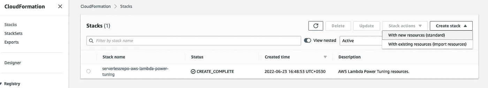

模板准备好—导入文件。选择创建的文件。

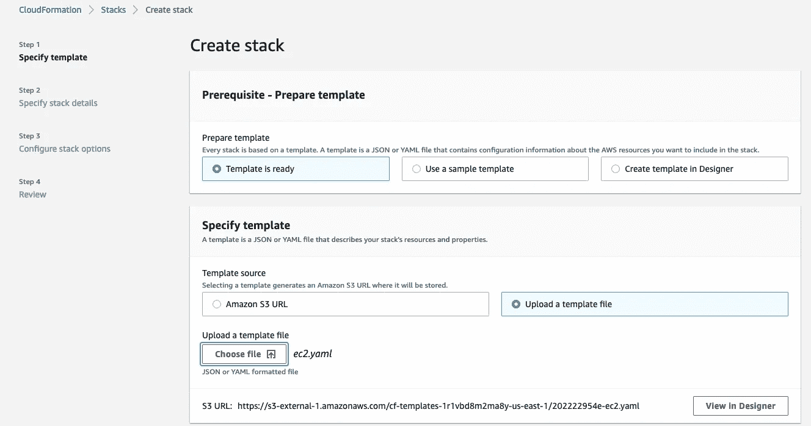

输入堆栈名称。我们在这个模板中没有任何参数。单击下一步。

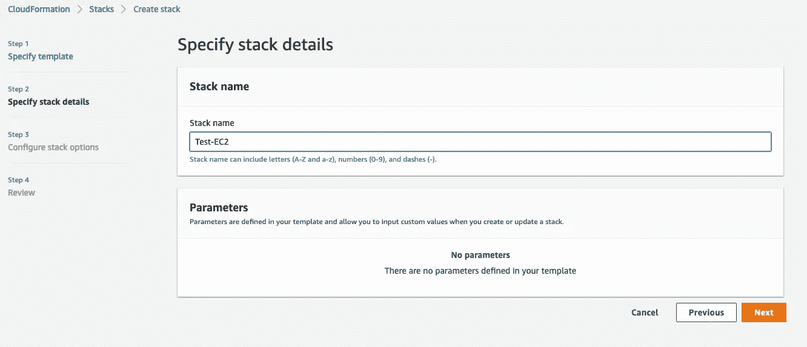

保留所有其他选项的默认值，然后单击“创建堆栈”。一段时间后，创作完成。显示了云形成过程的时间线。

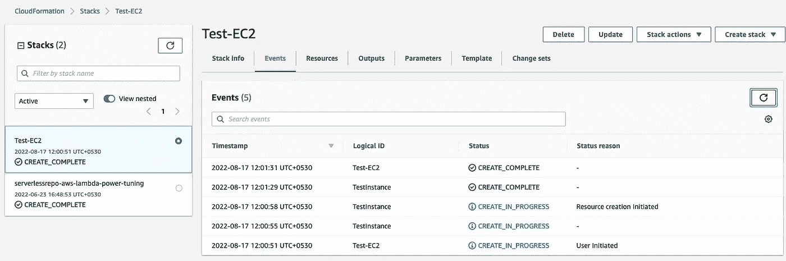

在 resources 选项卡中，您可以看到创建的资源。物理 ID 显示 EC2 控制台中资源的链接。

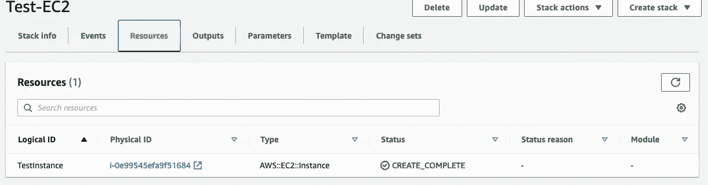

恭喜你！您已经使用 cloudformation 在 AWS 中创建了第一个资源。

要从 CLI 执行同样的操作，您可以运行以下命令:

```
aws cloudformation create-stack --template-body file://ec2.yaml --stack-name Test-EC2
```

现在，如果您从 cloudformation 堆栈控制台删除堆栈，它不仅会删除 cloudformation 中的条目，还会删除资源。记住——Stack =模板中部署的资源。

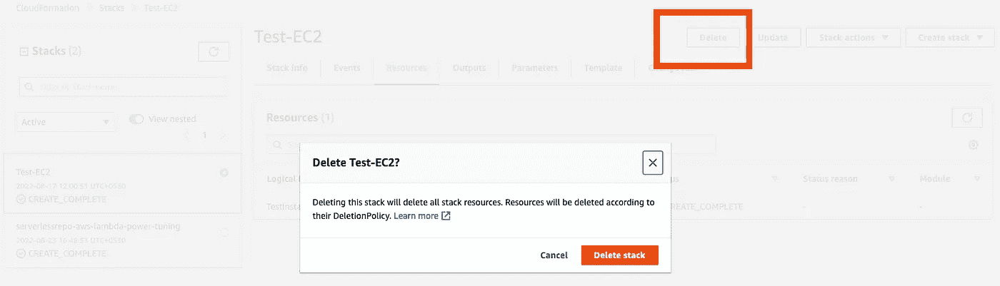

要从 CLI 中删除:

```
aws cloudformation delete-stack --stack-name Test-EC2
```

# CF 演示 2 —更多特性

## 映射

请注意，对于这个简单的示例，我们已经对 AMI ID 进行了硬编码，我们事先确认了该 AMI ID 在我们使用的地区(us-east-1)可用，并且我们确保在该地区运行 cloudformation。实际上，情况可能并非如此。我们如何确保云结构总是选择存在于该区域的 AMI，而不管它运行在哪个区域？

映射将在这里帮助我们。

映射有助于在模板中以表格形式添加键值对，并使用一个或多个键从中选择和使用一个值。

示例映射部分可能如下所示:

```
Mappings:
  AnExampleMap:
    TopLevelKey01:
      Key01: Value01
      Key02: Value02

    TopLevelKey02:
      AnotherKey: AnExampleValue

    TopLevelKey03:
      AFinalKey: ADifferentValue
```

在这个映射中，通过指定映射名称(AnExampleMap)和顶级键(TopLevelKey01)和二级键(Key01)，我们可以导出 Value01。为此，我们使用 cloudformation 固有函数 FindInMap 和 Ref。FindInMap 接受地图名称，Ref 接受一个键作为参数。

出于我们的目的，让我们有一个有效 AMI IDs 的地图，(在这个练习中，我们将它限制在美国地区)

```
Mappings:
  AWSAMIRegionMap:
    us-east-1:
      AmazonLinux2: ami-090fa75af13c156b4
    us-east-2:
      AmazonLinux2: ami-051dfed8f67f095f5
    us-west-1:
      AmazonLinux2: ami-0e4d9ed95865f3b40
    us-west-2:
      AmazonLinux2: ami-0cea098ed2ac54925
```

这里的地图名称是 AWSAMIRegionMap，顶级键是 AWS 区域(我们将很快从 CF 环境中获取它),二级键是字符串 AmazonLinux2。

现在我们将使用 Region 获取 ImageID，而不是硬编码。

```
ImageId: 
        Fn::FindInMap:  *#Look in a  map* 
        - AWSAMIRegionMap *# Map name is given*
        - Ref: AWS::Region *# Look for this key first* 
        - AmazonLinux2 *# Inside that key, look for this key*
```

AWS::Region 是一个伪参数，它将始终包含当前会话 AWS 区域。它由 CloudFormation 服务设置。我们使用 Ref: function 来获取该值。

所有这些参数都记录在这里:

[](https://docs.aws.amazon.com/AWSCloudFormation/latest/UserGuide/pseudo-parameter-reference.html) [## 伪参数引用

### 伪参数是由 AWS CloudFormation 预定义的参数。你没有在你的模板中声明它们…

docs.aws.amazon.com](https://docs.aws.amazon.com/AWSCloudFormation/latest/UserGuide/pseudo-parameter-reference.html) 

这里记录了所有内部函数:

[](https://docs.aws.amazon.com/AWSCloudFormation/latest/UserGuide/intrinsic-function-reference.html) [## 内在函数引用

### 您只能在模板的特定部分使用内部函数。目前，您可以在…中使用内部函数

docs.aws.amazon.com](https://docs.aws.amazon.com/AWSCloudFormation/latest/UserGuide/intrinsic-function-reference.html) 

带有映射的完整代码如下所示:

```
AWSTemplateFormatVersion: "2010-09-09"
Description: Create EC2 with CF v2.0
Resources:
  TestInstance:
    Type: AWS::EC2::Instance
    Properties:
      ImageId: 
        Fn::FindInMap:
        - AWSAMIRegionMap
        - Ref: AWS::Region
        - AmazonLinux2
      InstanceType: t2.micro
Mappings:
  AWSAMIRegionMap:
    us-east-1:
      AmazonLinux2: ami-090fa75af13c156b4
    us-east-2:
      AmazonLinux2: ami-051dfed8f67f095f5
    us-west-1:
      AmazonLinux2: ami-0e4d9ed95865f3b40
    us-west-2:
      AmazonLinux2: ami-0cea098ed2ac54925
```

## 因素

现在，假设我们想提示用户输入一个标记值作为名称(不是真正的生产案例，标记通常是受控的和自动化的),我们可以为此使用参数。

我们如何知道使用云结构可以在 AWS 资源上设置哪些属性？以下是文档:

 [## AWS::EC2::实例

### 此属性保留供内部使用。如果使用它，堆栈将失败，并显示以下错误:错误的属性集:[测试…

docs.aws.amazon.com](https://docs.aws.amazon.com/AWSCloudFormation/latest/UserGuide/aws-properties-ec2-instance.html) 

我们可以通过以下方式添加一个参数来输入标签:

```
Parameters:
  EC2NameTag:
    Description: Name Tag
    Type: String
```

这导致在云形成运行期间提示输入参数。

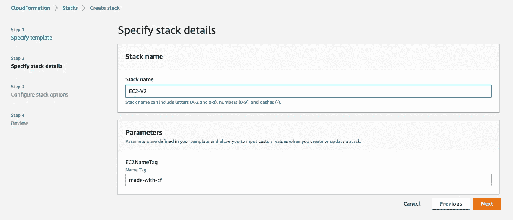

可以使用 Ref: Parameter 语法提取参数值，并将其分配给 tag:

```
Tags: 
      - Key: Name
        Value: 
          Ref: EC2NameTag
```

## 输出

如果我们想打印 EC2 实例的 IP 地址，该怎么办？输出将在这里帮助我们。GetAtt 内部函数可用于访问所创建的 AWS 资源的属性。

下面给出的代码将输出创建的 EC2 的 PublicIP 属性。注意，我们在函数中使用了资源的逻辑 ID(test instance)。

```
Outputs:
  InstanceIP:
    Value:
      Fn::GetAtt:
      - TestInstance
      - PublicIp
    Description: Instance IP
```

这里给出了完整的模板:

[](https://github.com/manumaan/CloudFormationDemos/blob/main/demo2/EC2-v2.yaml) [## 主菜单上的 CloudFormationDemos/EC2-v2 . YAML/CloudFormationDemos

### 此文件包含双向 Unicode 文本，其解释或编译可能与下面显示的不同…

github.com](https://github.com/manumaan/CloudFormationDemos/blob/main/demo2/EC2-v2.yaml) 

当我们在 us-east-1 中运行它时，它会选择为 us-east-1 定义的 AMI ID，当我们在 us-west-2 中运行它时，它会选择 us-west-2 的 AMI。通过参数提供的标签也反映了。

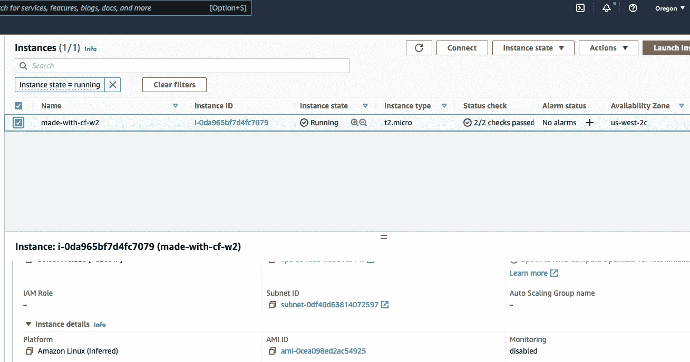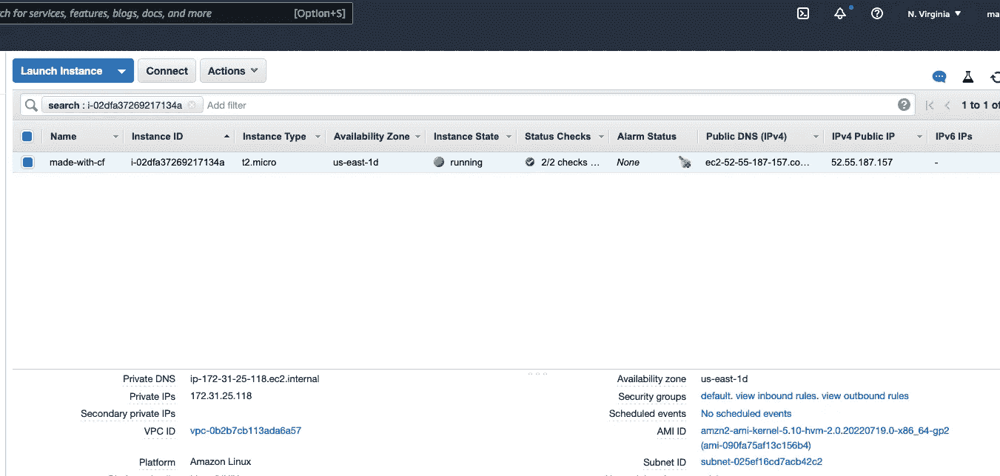

它在输出选项卡中打印公共 IP:

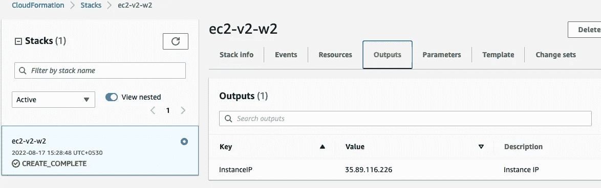

# 嵌套堆栈

如果您有一个用于不同应用程序的 RDS 数据库，并且希望将它的模板和堆栈与使用它的应用程序堆栈分开，该怎么办？或者您想在模板中实现模块化或代码重用？在所有这些情况下，我们都可以通过使用嵌套堆栈来实现。嵌套的栈通常有一个“根”模板/栈，它从那里调用所有其他的“子”模板/栈。

模板中的嵌套堆栈资源如下所示:

```
Resources:
  Stack1:
    Type: AWS::CloudFormation::Stack
    Properties:
      TemplateURL: 'Path/To/Template' #Path where templates are
      Parameters: #Parameters  sent from root to child Stack1
        ExampleKey: ExampleValue  
        Type: String
  Stack2:
    Type: AWS::CloudFormation::Stack
    Properties:
      TemplateURL: 'Path/To/Template' #Path where templates are
      Parameters: #Parameters  sent from root to child Stack2
        ExampleKey: ExampleValue
```

请注意 AWS::CloudFormation::堆栈类型。嵌套的堆栈模板将定义不止一个堆栈类型，而不是一个或多个资源。每个堆栈将指向保存实际模板文件的路径。

您可能想知道，我如何在子模板之间发送数据？输出和参数对此有所帮助。

例如:我们想要创建一个安全组，并将 EC2 关联到该安全组。这在嵌套组中是如何工作的:

1.  根模板调用安全组模板。安全组模板定义了一个输出:

```
Outputs:
  SGID:
    Value:
      Fn::GetAtt:
      - ec2sg
      - GroupId
    Description: SG Id
```

2.现在回到根模板，我们可以使用 GetAtt 语法获得 SGID 中的值(即安全组 ID ):

```
!GetAtt SGStack.Outputs.SGID
```

3.注意栈名的用法。因此，当我们从 root 调用 EC2 模板来创建 EC2 时，我们可以发送安全组 ID:

```
Resources:
  EC2Stack:
    Type: AWS::CloudFormation::Stack
    Properties:
      TemplateURL: !Sub https://${S3BucketName}.s3.amazonaws.com/ec2.yaml
      TimeoutInMinutes: 20
      Parameters:
        SecurityGroupIds: !GetAtt SGStack.Outputs.SGID
        Tags: 
          Ref: EC2NameTag
```

要在 EC2 模板中接收这个参数，我们应该用相同的名称定义参数，并确保实际使用它。

```
Parameters:
  SecurityGroupIds:
    Description: Security Group ID
    Type: String
```

因为安全组 ID 是单个字符串，而安全组 ID 的参数需要一个字符串列表，所以我们使用 split 函数来创建一个包含一个项目的列表。

```
Resources:
  TestInstance:
    Type: AWS::EC2::Instance
    Properties:
      ImageId: 
        Fn::FindInMap:
        - AWSAMIRegionMap
        - Ref: AWS::Region
        - AmazonLinux2
      InstanceType: t2.micro
      SecurityGroupIds: 
        Fn::Split: [",", Ref: SecurityGroupIds]
```

对于嵌套模板，所有模板都应该在 S3 存储桶内。我们如何将 S3 桶传递给模板？在根模板中使用参数。

还记得我们曾经为 EC2 的名称标签设置了一个参数。这也成为根模板中的一个参数。

这两者都可以用 Ref 函数传递给需要它的子模板。例如:

```
Resources:
  EC2Stack:
    Type: AWS::CloudFormation::Stack
    Properties:
      TemplateURL: !Sub https://${S3BucketName}.s3.amazonaws.com/ec2.yaml
      TimeoutInMinutes: 20
      Parameters:
        SecurityGroupIds: !GetAtt SGStack.Outputs.SGID
        Tags: 
          Ref: EC2NameTag
```

# CF 演示 3 —嵌套堆栈

嵌套模板演示的完整代码保存在这里:

[](https://github.com/manumaan/CloudFormationDemos/tree/main/demo3) [## 主 manumaan/CloudFormationDemos 处的 CloudFormationDemos/demo3

### 云形成演示。通过在 GitHub 上创建帐户，为 manumaan/CloudFormationDemos 开发做出贡献。

github.com](https://github.com/manumaan/CloudFormationDemos/tree/main/demo3) 

我们上传所有的模板文件到一个 S3 桶。

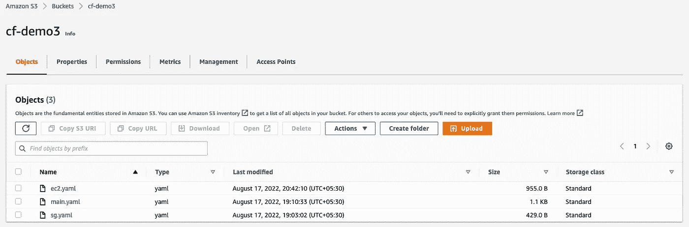

main.yaml 是根模板。提供进入云层的路径。

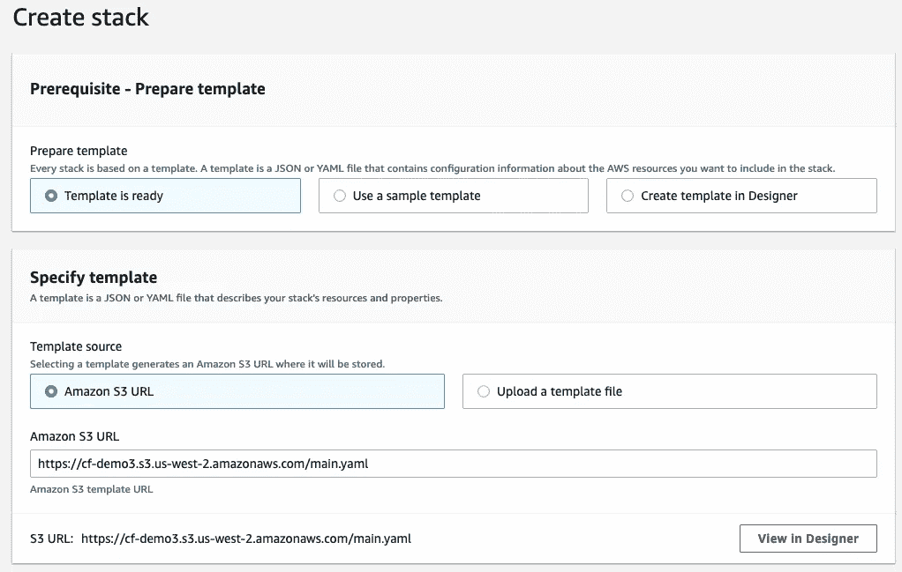

输入 EC2 名称标签、时段名称参数值。

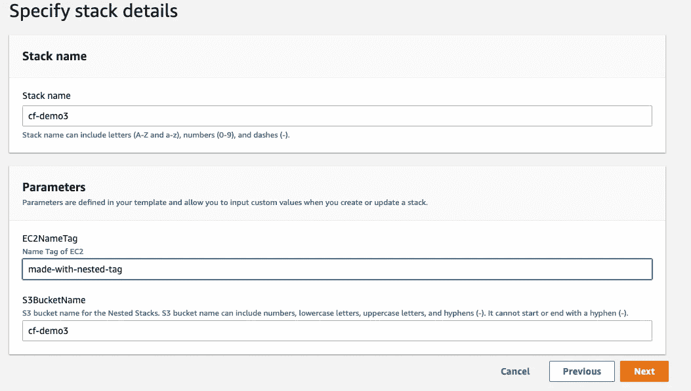

因为我们是在栈中创建栈，所以我们需要承认这些能力。检查那些。

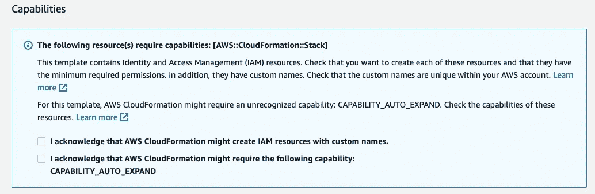

堆栈创建完成后，您可以在左侧看到一个普通堆栈和两个嵌套堆栈。可以单独检查事件、输出等。

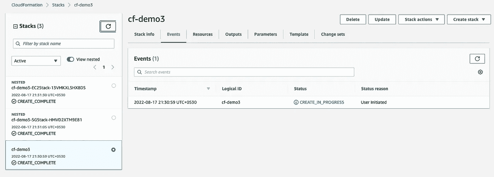

输出值:EC2 IP 地址

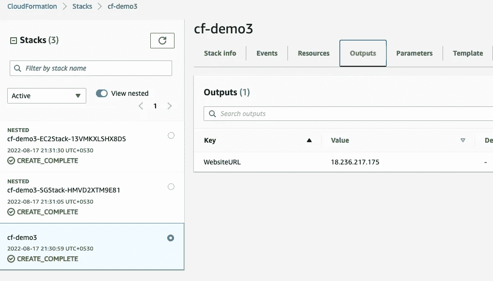

实例已创建。它具有预期的名称标签，并且与所创建的安全组相关联。

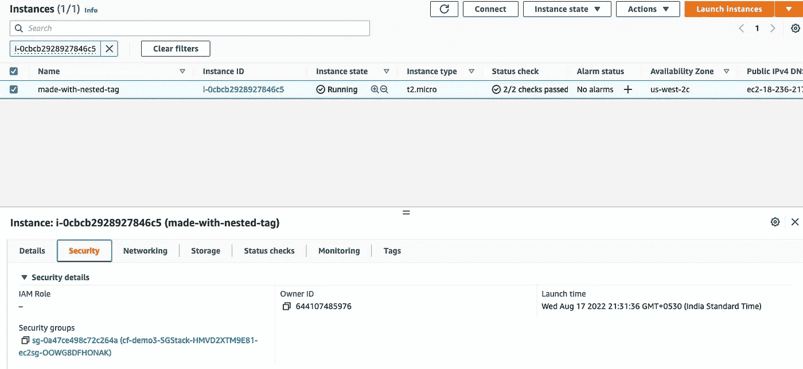

要从嵌套堆栈中删除资源，请确保单击根堆栈上的 delete。

AWS 云的形成是一个很大的话题，我们已经在这篇文章中介绍了它的要点。你可以期待更多关于这个主题的帖子，我会在这方面做更多的介绍，比如:

希望这是有帮助的！