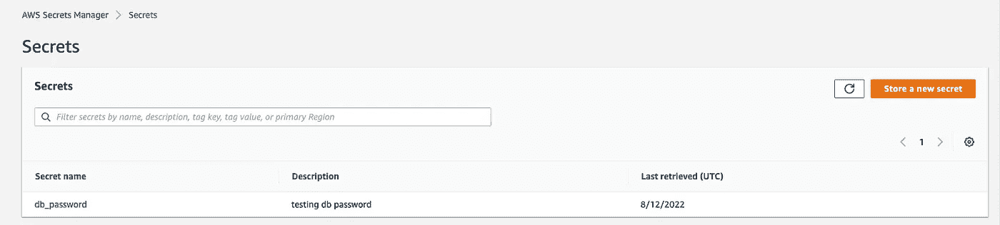

# 带地形的 AWS DevOps

> 原文：<https://medium.com/codex/aws-devops-with-terraform-7d81ced6b9d6?source=collection_archive---------8----------------------->


Terraform 是一个基础设施即代码工具，用于在云或内部部署和拆除基础设施。Terraform 由 Hashicorp 开发，您可以在 terraform 文件中声明性地指定所需基础设施状态的“配置”。地形(。tf)文件将由 Terraform 读取，它将执行所需的步骤(创建、读取、更新、删除)，以使基础架构与配置中指定的内容保持同步。tf)文件。

让我们弄清楚一些术语:

# **地形术语**

**提供者** —提供与基础架构提供者集成的插件(例如:AWS 提供者将用于在 AWS 上创建基础架构)

**资源** —基础设施资源平台将提供资源，如 AWS EC2

**模块** —为了代码模块化，您可以将用于特定目的的代码分组到一个模块中，就像开发实例的所有代码一样。

**输入** —在地形中输入变量。要在运行时获得动态值，可以传递一个输入变量。如果你有一个变量 xyz，它在代码中被称为 var.xyz。

**输出**—以地形形式输出变量。这些可用于获取创建 infra 时创建的值，例如 AWS 创建的 EC2 的 IP 地址。这要等到 terraform 完成运行后才能知道。

**局部变量** —运行时使用 terraform 上下文中的可用值创建的局部变量。这适用于您希望使用仅在运行时可用的值来定义新变量的情况。如果您有一个名为 xyz 的本地，它将被称为 local.xyz

**数据** —允许查询从提供者发出的数据。像 aws 的 aws_availability_zones 列表

以下步骤将在 Mac 上安装 Terraform

```
 brew tap hashicorp/tap
 brew install hashicorp/tap/terraform
 brew update
 brew upgrade hashicorp/tap/terraform #validate the installation
 terraform -version
```

所有操作系统的安装说明:[https://learn.hashicorp.com/tutorials/terraform/install-cli](https://learn.hashicorp.com/tutorials/terraform/install-cli)

现在，让我们使用 Terraform 创建一些 AWS 基础设施！

设置以下环境变量。这些将包含 AWS 访问密钥和 IAM 用户的秘密密钥，该用户具有创建 Infra 所需的访问权限。

```
export AWS_ACCESS_KEY_ID=(access key)
export AWS_SECRET_ACCESS_KEY=(secret access key)
```

将以下内容另存为 aws.tf

```
provider "aws" {
  region = "us-east-1"
}
```

在这里，我们已经告诉 Terraform，我们将使用 AWS 提供商，并将使用 us-east-1 地区。

在我们的第一个演示中，我们将使用 AMI ID AMI-090 fa 75 af 13 c 156 b 4(Amazon Linux 的 AWS AMI 目录中的 AMI ID)和实例类型 t2-micro 创建 EC2。

在我们使用 Terraform 创建基础设施之前，让我们先快速介绍一下最基本的 Terraform 命令:

# **地形命令**

terraform init —检查当前文件夹，初始化后端(存储所有配置和提供程序的地方),它将安装配置中提到的尚未提供的任何提供程序。

地形计划—根据创建执行计划。tf 文件。这将基础架构的当前状态与所需状态进行了比较，并显示了如果我们应用该配置将会发生什么。

terraform apply —应用配置(提供基础设施— CRUD 操作)

terraform destroy —拆除配置

# Terraform 演示- 1

下面给出了这个演示的代码:另存为 ec2.tf

 [## GitHub-manu maan/terraformdemo 1:Terraform 简单演示

### 此时您不能执行该操作。您已使用另一个标签页或窗口登录。您已在另一个选项卡中注销，或者…

github.com](https://github.com/manumaan/TerraformDemo1) 

```
provider "aws" {
  region = "us-east-1"
}

resource "aws_instance" "instance" {
  ami = "ami-090fa75af13c156b4"
  instance_type = "t2.micro"

  tags = {
    Name = "dev-instance"
  }
}
```

1.  在保存的文件夹中运行 terraform init 命令。tf 文件


2.运行 terraform 计划以创建执行计划。输出显示了运行“应用”时将执行的所有步骤


3.运行 terraform apply。这将要求确认。


输入 yes 继续。(注意:您可以使用 terraform 应用-自动批准来避免要求确认)


4.在 AWS 控制台中检查 EC2 是否创建成功。


恭喜你！您使用 Terraform 创建了第一个 EC2。

# Terraform 演示- 2

现在，让我们为基础架构资源调配增加一些额外要求。

1.  我想打印从 Terraform 创建的 EC2 的 IP 地址(我们可以使用输出)

2.添加两个新标签，必须从文件中读取:项目名和环境名。(我们可以为此使用输入变量)

3.名称标签必须是动态的。它必须结合项目，环境(我们将使用本地的)

4.查询该地区的可用区域，并打印它们的列表。(我们将为此使用数据)

为了模块化，我们将输入保存在一个单独的文件(variables.tf)中，输出保存在另一个文件(outputs.tf)中

更新后的代码如下所示:

 [## GitHub-manu maan/terraformdemo 2:terraformdemo 2

### 此时您不能执行该操作。您已使用另一个标签页或窗口登录。您已在另一个选项卡中注销，或者…

github.com](https://github.com/manumaan/TerraformDemo2) 

变量. tf

我们在这里定义了两个变量，我们使用 var.name 语法在 ec2.tf 中引用它们。

```
variable "project_name" {
  description = "Name of the project."
  type        = string
  default     = "my-project"
}

variable "environment" {
  description = "Name of the environment."
  type        = string
  default     = "dev"
}
```

ec2.tf

这里你可以看到我们使用 variables.tf 中的变量来设置标签。此外，我们正在向 AWS 提供商查询可用性区域。

```
provider "aws" {
  region = "us-east-1"
}locals {
  name_tag = "${var.project_name}-${var.environment}"
} resource "aws_instance" "instance" {
  ami = "ami-090fa75af13c156b4"
  instance_type = "t2.micro" tags = {
    project_name = var.project_name
    environment_name = var.environment
    Name = local.name_tag
  }
}data "aws_availability_zones" "available" {
  state = "available"
}
```

outputs.tf

可以使用下面给出的 resourcename.xyz 符号来访问正在创建的 aws_instance 资源的属性。我们可以通过这种方式访问公共 IP。

ec2.tf 有一个数据部分，它将从 AWS provider 查询 AWS 区域的可用性区域，我们还可以使用 data.xyz 符号将它打印到输出中

```
output "dev_public_ip" {
  description = "Public IP of the instance"
  value = aws_instance.instance.*.public_ip
}

output "aws_availability_zones" {
  description = "Available AZs"
  value = data.aws_availability_zones.available.names
}
```

将文件保存在一个目录中，并运行该文件夹中的 terraform init，plan，apply 命令。

来自 AWS 控制台的结果:请注意，标签是根据需要设置的。


同样在终端中，我们可以看到输出值:


# Terraform 演示 3

现在让我们用模块把它带到下一个级别。假设我们需要一个配置用于开发，另一个配置用于 QA。我们没有把它们都放在一组文件中，而是放在两个不同的文件夹中，每个文件夹都是 Terraform 中的一个模块。

下面给出的是文件夹结构:

```
RootFolder/ec2.tf
RootFolder/outputs.tf
RootFolder/variables.tf
RootFolder/modules/dev/ec2.tf
RootFolder/modules/dev/outputs.tf
RootFolder/modules/dev/variables.tf
RootFolder/modules/QA/ec2.tf
RootFolder/modules/QA/outputs.tf
RootFolder/modules/QA/variables.tf
```

这里，根级配置 tf 文件将声明模块。例如，我们将 dev_server 模块定义为:

```
module "dev_server" {
  source = "./modules/dev"
  project_name = var.project_name

}
```

这告诉 terraform 在/modules/dev 下的文件夹中扫描名为 dev_server 的模块。第一个斜杠前面的点意味着这个路径必须从当前目录开始存在。

根文件夹中定义的任何变量都将被传递给下面的模块。所有需要的是，在模块内部，也有一个用相同名称定义的变量，并用空值初始化。

模块中定义的任何输出都需要在根中，才能出现在 terraform 输出中。

该代码可在 github 上获得:

 [## GitHub-manu maan/Terraform-demo 3:terraformdemo 3

### 此时您不能执行该操作。您已使用另一个标签页或窗口登录。您已在另一个选项卡中注销，或者…

github.com](https://github.com/manumaan/Terraform-Demo3) 

现在你可以做:

```
terraform initterraform planterraform apply -auto-approve
```


现在我们已经使用 Terraform 以模块化的方式在 AWS 上创建了 infra。

要拆除(删除)我们通过 Terraform 创建的所有基础架构，您可以使用以下命令:

```
terraform destroy
```

# Terraform 故障排除

如何排除 Terraform 故障？您可以使用下面的命令:

```
terraform fmt — Formats the .tf files properly terraform validate — Validates syntax of .tf files
```

如果要记录 terraform 运行，可以设置以下环境变量:

TF_LOG_CORE =告诉 terraform 记录核心进程。可能的值有:`TRACE`、`DEBUG`、`INFO`、`WARN`或`ERROR`

TF_LOG_PROVIDER =告诉 terraform 记录提供者进程(例如:AWS)可能的值有:`TRACE`、`DEBUG`、`INFO`、`WARN`或`ERROR`

TF_LOG_PATH =告诉 terraform 保存日志文件的位置。

# Terraform 中的敏感值

对于像密码这样的敏感值，您可以将变量定义为 sensitive，这将编辑 terraform 输出中的值。

```
variable “db_password” {
 type = string
 **sensitive = true**
}
```


这些值可以从. tfvars 文件或以 TF_VAR 开头的环境变量中读取。

包括敏感变量值在内的所有变量在 terraform 状态下存储为纯文本，因此状态应该是安全的。(tf.state 文件)。状态可以远程存储在 S3，如果我们的配置。tf 包含如下一行。这需要一个 S3 存储桶来保存状态，并需要一个 Dynamo DB 表来保存状态锁。

```
terraform {
  backend "s3" {
    # Replace this with your bucket name!
    bucket         = "terraform-state"
    key            = "global/s3/terraform.tfstate"
    region         = "us-east-1" # Replace this with your DynamoDB table name! table will hold the state locks.     dynamodb_table = "terraform-locks"
    encrypt        = true
  }
}
```

敏感值可以从 Hashicorp Vault 或 AWS Secret Manager 等安全系统中读取，并注入到 terraform 要读取的本地变量中。

AWS 机密管理器中的机密值示例:



我们之前看到了如何使用数据从 AWS 查询数据。我们将使用数据查询 AWS Secret Manager，并将其存储在一个本地变量中，以便在 terraform 中使用:

```
#secret_id has the secret name from AWS
data "aws_secretsmanager_secret_version" "creds" {
  secret_id = "db_password"
}#secret_string attribute has the value from secret.jsondecode converts to JSONlocals {
  password_tag = jsondecode(data.aws_secretsmanager_secret_version.creds.secret_string)
}
```

由于该值来自 Secret Manager，即使您在输出中使用它，Terraform 也不会打印它，并且会抱怨它是一个敏感值。保护！

所有这些都很好，但是你如何测试这个值是否被正确提取？您可以在 local_exec 中使用 null_resource。空资源是一种特殊的资源，它不会创建任何基础设施，只是允许您在 terraform 运行时进行任意处理。本地执行意味着它将在本地运行。所以你可以用它来运行一个 linux 命令，运行一个外部 python 程序，等等。

例如:下面的代码将运行 linux 命令并将秘密值打印到名为 secret_value.txt 的本地文件中

```
#Since we converted to JSON, and API_Token is the key name in JSON, #we can  get the value for that key. resource "null_resource" "secret_print" {
  provisioner "local-exec" {
    when    = create
    command = "echo ${local.password_tag.API_Token} >> secret_value.txt"
  }
}
```

希望这是有帮助的！