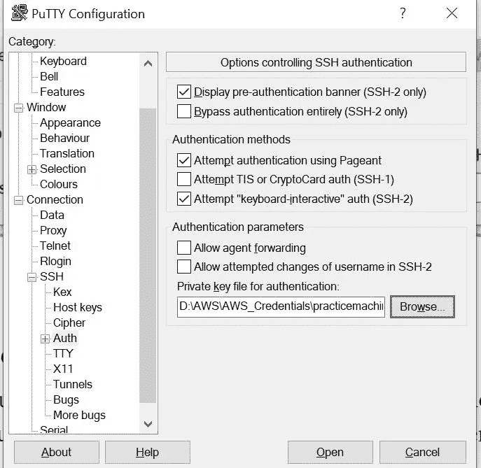
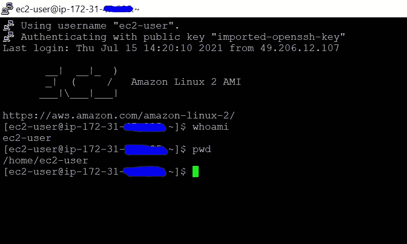

# AWS EC2 实践

> 原文：<https://medium.com/codex/aws-ec2-hands-on-fa851006f355?source=collection_archive---------14----------------------->

## 在我们下面的博客中阅读什么是 EC2、可用的类型及其定价模型。

[https://yogendrahj.medium.com/429f92f6ed8b](https://yogendrahj.medium.com/429f92f6ed8b)

在本文中，我们将对 EC2 的创建、使用 EC2 时要考虑的技术方面、不同类型、OS 支持的 AMI (Amazon 机器映像)和快照进行纯实践操作。我们开始吧！

EC2 实例可以多种方式启动，例如使用控制台(这是一种基本方法),另一种方式是使用 CLI 命令，或者使用 Lambda (API 函数),还有一种方式是使用基础设施作为代码服务，即云信息服务。

您的 EC2 实例可以有两种类型，一种是公共实例，另一种是私有实例。

公共实例具有公共 IP，可以从您的网络外部访问，而私有实例只有私有 IP，无法从您定义的网络外部访问。当您停止和启动公共实例时，其 IP 地址将会更改，而在私有实例中，其 IP 地址保持不变。

## ***下面是使用控制台启动一台亚马逊 Linux EC2 机器的步骤。***

1.  登录到控制台，选择 EC2 向导，然后单击启动实例。这里，我们选择的是亚马逊 Linux 2 AMI。

AMI 是包含启动实例所需的软件配置(操作系统、应用服务器和应用程序)的模板。您可以选择 AWS、用户社区或 AWS Marketplace 提供的 AMI。或者您可以选择一个自己的 ami。

2.选择所需的实例类型(实例类型将在我们的另一篇文章中讨论)。这里，我们选择 t2.micro 通用实例，因为它在免费层中可用。

3.此步骤允许您配置实例详细信息，如 VPC、子网、公共 IP、IAM 角色和其他一些预定义的参数。这里，我们将 1 个 t2.micro 实例启动到默认 VPC 和公共子网中。(我们将在接下来的博客中详细讨论 VPC)。

4.在这一步中，我们将选择所需的存储容量以及卷类型。一般来说，Linux 机器的根卷将是“/dev/xvda”，对于 Windows，它将是“/dev/sda”。如果需要，我们可以添加额外的存储以及数据加密。

5.按照遵循的标准添加标签。标记由区分大小写的键值对组成。当您基于标签定义任何 API 函数时，这些非常有用。

6.安全组是一组控制实例流量的防火墙规则。在此页面上，您可以添加规则以允许特定流量到达您的实例。您可以选择现有安全组，也可以定义自己的安全组。我们在这里使用默认值，因为端口 22 是允许从互联网连接的，这足以连接到这台机器。

7.在这一步中，我们将验证所有参数，并选择连接到该实例的密钥对。

一个密钥对由 AWS 存储的**公钥**和您存储的**私钥文件**组成。它们一起允许您安全地连接到您的实例。对于 Windows AMIs，需要私钥文件来获取用于登录实例的密码。对于 Linux AMIs，私有密钥文件允许您安全地 SSH 到您的实例。

8.单击启动后，您的实例将在不到一分钟的时间内启动并准备好连接。

## **如何皈依。pem ssh 密钥。ppk 格式？**

1.  当您在启动实例的最后阶段创建密钥对时，该密钥将被创建为。pem 文件，您需要将其转换为。ppk 文件来连接您的实例。
2.  单击加载并找到您的。pem 文件，一旦您选择它，密钥将被导入，并单击保存私钥，现在将被转换为。您需要用来连接实例的 ppk 格式。

## 如何使用 putty 和？ppk 文件？

1.  启动 putty 会话，并输入该实例的用户名和公共 IP。默认情况下，用户名为“ec2-user ”,例如 ec2-user@publicip。
2.  现在选择“ssh”>“Auth”并浏览您的。ppk 文件。

3.单击 open 并选择 yes 以连接到您的实例。

## 启动时在 Linux 实例上运行命令

当您在 Amazon EC2 中启动一个实例时，您可以选择将用户数据传递给实例，这些数据可用于执行常见的自动化配置任务，甚至在实例启动后运行脚本。您可以向 Amazon EC2 传递两种类型的用户数据:shell 脚本和 cloud-init 指令。您还可以将这些数据以纯文本、文件(这对于使用命令行工具启动实例很有用)或 base64 编码的文本(对于 API 调用)的形式传递到启动向导中。

它有一个先决条件，即您的实例应该有一个可以从 internet 访问的公共 DNS 名称。您还必须配置您的安全组，以允许 SSH(端口 22)、HTTP(端口 80)和 HTTPS(端口 443)连接。

您可以在启动实例时指定实例用户数据。如果实例的根卷是 EBS 卷，您还可以停止实例并更新其用户数据。

在 AWS 官方页面阅读更多关于用户数据的信息。

 [## 启动时在 Linux 实例上运行命令

### 当您在 Amazon EC2 中启动一个实例时，您可以选择将用户数据传递给该实例，这些数据可用于…

docs.aws.amazon.com](https://docs.aws.amazon.com/AWSEC2/latest/UserGuide/user-data.html) 

*   使用 CLI 启动 EC2 实例-

*" AWS ec2 run-instances-image-id ami-xxxxx-count 1-instance-type T2 . micro-key-name<<mykey pair>>-security-group-ids SG-xxxxx-subnet-id subnet-xxxxx "*

*   显示您的 AWS EC2 密钥对-

*“AWS ec2 describe-key-pairs-key-name mykey pair”*

*   删除您的密钥对-

*“AWS ec2 delete-key-pair-key-name mykey pair”*

## 结论

AWS 弹性计算云(EC2)为我们提供了最简单快捷的方式来启动虚拟服务器和主机应用程序或网站，从而在最短的时间内运营我们的业务。其种类繁多的实例类型和可行的定价模型是业界最好的，可以选择以满足从小型到企业级业务的要求。