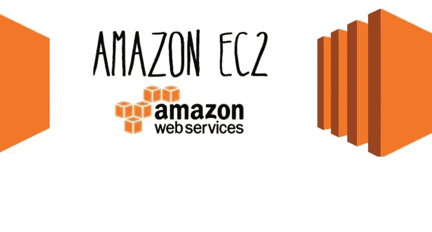

# AWS EC2 —云中的虚拟服务器

> 原文：<https://medium.com/codex/aws-ec2-virtual-servers-in-the-cloud-429f92f6ed8b?source=collection_archive---------23----------------------->

在本文中，我们将讨论最古老、最流行、最广泛使用的 AWS 计算服务之一 EC2——弹性计算云。让我们了解一下什么是 EC2？为什么它是自动气象站最重要的服务之一？它有哪些类型？如何推出和使用？和很少的其他特征。

***【EC2(弹性计算云)*** *是一种在云中提供安全、可调整计算能力的 web 服务。它被设计为 IaaS(基础设施即服务),为您提供对计算资源的完全控制，并让您在亚马逊成熟的计算环境中运行。*

与其他云服务提供商 IaaS 相比，AWS EC2 有何独特之处？

Amazon EC2 提供了最广泛、最深入的实例选择，构建于最新的计算、存储和网络技术之上，专为高性能和安全性而设计。

几乎可满足所有业务需求的近 400 个实例，唯一支持 macOS 的云提供商，全球 24 个地区和 77 个可用区域，英特尔、AMD 和基于 Arm 的处理器等多种选择。

借助 AWS Nitro 系统、处理器选择、高性能存储、增强的网络和购买模式选择，实现更快的创新和更高的安全性。

现在让我们关注 EC2 服务的技术方面:

*每个 Amazon EC2 地区 99.99%可用性的 SLA 承诺。每个区域由至少 3 个可用性区域组成(可用性区域被称为 AZ，是一个区域内的逻辑数据中心)。*

**基于需求的不同实例类型**，例如通用、计算优化、内存优化、加速计算和存储优化。

## ***通用***

通用实例提供了计算、内存和网络资源的平衡，可用于各种不同的工作负载。这些实例非常适合于同等使用这些资源的应用程序，比如 web 服务器和代码仓库。

这里提供的变体有 *Mac、T4g、T3、T3a、T2、M6g、M5、M5a、M5n、M5zn、M4 和 A1。*

## ***计算优化***

计算优化实例非常适合受益于高性能处理器的计算密集型应用。属于该系列的实例非常适合批处理工作负载、媒体代码转换、高性能 web 服务器、高性能计算(HPC)、科学建模、专用游戏服务器和广告服务器引擎、机器学习推理以及其他计算密集型应用。

这里提供的变体是 *C6g、C6gn、C5、C5a、C5n 和 C4。*

## ***内存优化***

内存优化实例旨在为在内存中处理大型数据集的工作负载提供快速性能。

这里提供的变体有 *R6g、R5、R5a、R5b、R5n、R4、X2gd、X1e、X1、高内存和 z1d。*

## ***加速计算***

加速计算实例使用硬件加速器或协处理器来执行功能，如浮点数计算、图形处理或数据模式匹配，比运行在 CPU 上的软件更有效。

这里提供的变体有 *P4、P3、P2、Inf1、G4dn、G4ad、G3 和 f1。*

## ***存储优化***

存储优化实例专为需要对本地存储上的超大型数据集进行高度、顺序读写访问的工作负载而设计。它们经过优化，可为应用提供每秒数万次的低延迟随机 I/O 操作(IOPS)。

这里提供的变体有 *I3、I3en、D2、D3、D3en 和 H1。*

在下面的 AWS 官方文章中详细研究所有类型的实例。

[](https://aws.amazon.com/ec2/instance-types/?trkCampaign=acq_paid_search_brand&sc_channel=PS&sc_campaign=acquisition_IN&sc_publisher=Google&sc_category=Cloud%20Computing&sc_country=IN&sc_geo=APAC&sc_outcome=acq&sc_detail=aws%20ec2%20instance%20types&sc_content=%7Bad%20group%7D&sc_matchtype=e&sc_segment=489978426477&sc_medium=ACQ-P|PS-GO|Brand|Desktop|SU|Cloud%20Computing|EC2|IN|EN|Sitelink&s_kwcid=AL!4422!3!489978426477!e!!g!!aws%20ec2%20instance%20types&ef_id=CjwKCAjwruSHBhAtEiwA_qCpplOlpLLg3WEY3T2ZIO9Aj_Ht1vvzNSYccV_dfcLXe0a8FoKd359ZUxoCU9EQAvD_BwE:G:s&s_kwcid=AL!4422!3!489978426477!e!!g!!aws%20ec2%20instance%20types) [## Amazon EC2 实例类型- Amazon Web Services

### Amazon EC2 提供了广泛的实例类型选择，并针对不同的用例进行了优化。实例类型包括…

aws.amazon.com](https://aws.amazon.com/ec2/instance-types/?trkCampaign=acq_paid_search_brand&sc_channel=PS&sc_campaign=acquisition_IN&sc_publisher=Google&sc_category=Cloud%20Computing&sc_country=IN&sc_geo=APAC&sc_outcome=acq&sc_detail=aws%20ec2%20instance%20types&sc_content=%7Bad%20group%7D&sc_matchtype=e&sc_segment=489978426477&sc_medium=ACQ-P|PS-GO|Brand|Desktop|SU|Cloud%20Computing|EC2|IN|EN|Sitelink&s_kwcid=AL!4422!3!489978426477!e!!g!!aws%20ec2%20instance%20types&ef_id=CjwKCAjwruSHBhAtEiwA_qCpplOlpLLg3WEY3T2ZIO9Aj_Ht1vvzNSYccV_dfcLXe0a8FoKd359ZUxoCU9EQAvD_BwE:G:s&s_kwcid=AL!4422!3!489978426477!e!!g!!aws%20ec2%20instance%20types) 

# **亚马逊 EC2 定价**

亚马逊根据需求和用途为您提供不同类型的定价模式，以节省成本并充分利用计算能力。

## ***按需***

对于按需实例，您可以根据运行的实例按小时或秒支付计算容量费用。

建议按需实例用于:

*   喜欢 Amazon EC2 的低成本和灵活性的用户，无需任何预付或长期承诺。
*   无法中断的短期、峰值或不可预测工作负载的应用程序。
*   首次在 Amazon EC2 上开发或测试的应用程序。

## ***光斑实例***

Amazon EC2 Spot 实例允许您以高达 90%的按需价格请求备用 Amazon EC2 计算能力。Spot 实例是 AWS 云中未使用的 EC2 容量，比其他类型低 90%。

建议将定点实例用于:

*   具有灵活的开始和结束时间的应用程序。
*   只有在非常低的计算价格下才可行的应用程序。
*   迫切需要大量额外容量的用户。

## ***储蓄计划***

节约计划是一种灵活的定价模式，为 EC2 和 Fargate 的使用提供低价，交换条件是承诺在 1 年或 3 年内保持一致的使用量(以美元/小时为单位)。

## ***专用主机***

专用主机是专用于您的物理 EC2 服务器。专用主机允许您使用现有的服务器绑定软件许可证，包括 Windows Server、SQL Server 和 SUSE Linux Enterprise Server(根据您的许可条款)，从而帮助您降低成本，还可以帮助您满足合规性要求。

*   可以按需购买(每小时)。
*   可作为预订购买，价格比点播价格低 70%。

# 每秒计费

通过按秒计费，您只需为您使用的内容付费。它将一小时内未使用的分钟和秒钟的成本从账单中扣除，因此您可以专注于改进您的应用程序，而不是最大限度地提高一小时的使用率。特别是，如果您管理不定期运行的实例，如开发/测试、数据处理、分析、批处理和游戏应用程序，会从中受益。

EC2 的使用以一秒为单位计费，最少 60 秒。同样，为 EBS 卷调配的存储将以每秒为增量计费，最少 60 秒。每秒计费适用于在以下位置启动的实例:

*   按需、预留和现场表单
*   所有区域和可用性区域
*   亚马逊 Linux、Windows 和 Ubuntu

EC2 实例可以通过多种方式启动，例如使用控制台，这是一种基本方法；另一种方式是使用 CLI 命令；还有一种方式是使用 Cloudformation，这是一种作为代码服务的基础架构。

在我们的另一个博客[https://yogendrahj.medium.com/aws-ec2-hands-on-fa851006f355](https://yogendrahj.medium.com/aws-ec2-hands-on-fa851006f355)中，深入了解如何启动和使用 EC2 实例，它的好处和常见问题。