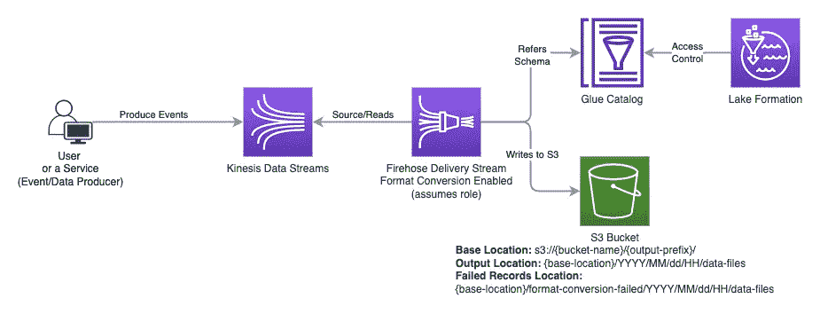
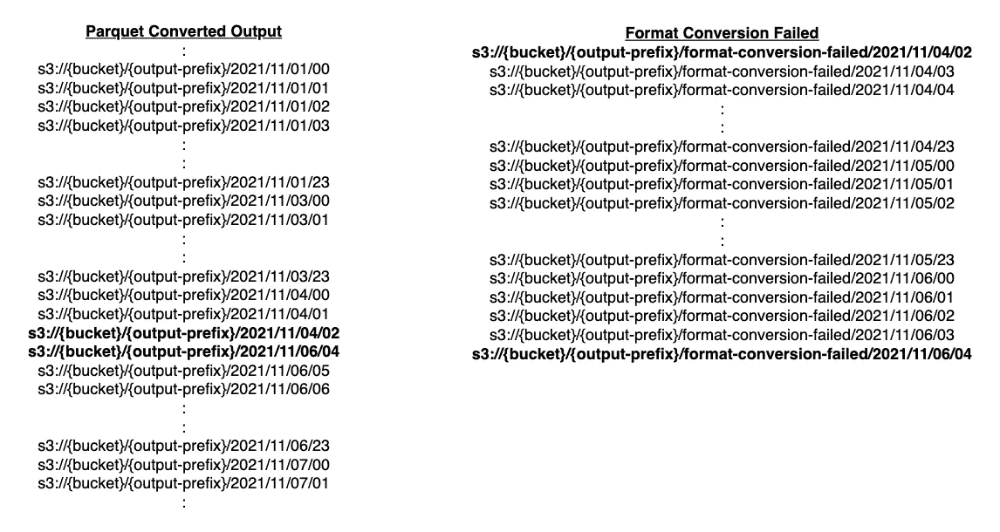

# AWS 消防软管数据格式转换—失败的记录重新处理

> 原文：<https://medium.com/codex/aws-firehose-data-format-conversion-failed-records-reprocessing-ddc06e5c568d?source=collection_archive---------3----------------------->

最近，我将我们的 [AWS Glue 目录权限](https://docs.aws.amazon.com/glue/latest/dg/access-control-overview.html)迁移到 AWS Lake Formation 进行管理。 [AWS Lake Formation](https://docs.aws.amazon.com/lake-formation/latest/dg/what-is-lake-formation.html) 增加了一层安全性，允许[细粒度权限](https://docs.aws.amazon.com/lake-formation/latest/dg/lf-permissions-reference.html)，管理数据湖[资源位置](https://docs.aws.amazon.com/lake-formation/latest/dg/granting-location-permissions.html) (s3)以及通过[标签(LF-Tag)](https://docs.aws.amazon.com/lake-formation/latest/dg/tag-based-access-control.html) 的控制权限，以及对 IAM 用户、角色、交叉帐户和 SAML 或 QuickSight 用户 ARN 的列级权限管理。AWS Lake Formation 是在 AWS Glue Catalog 服务之后添加的，为了继续支持[向后兼容性](https://docs.aws.amazon.com/lake-formation/latest/dg/getting-started-setup.html#setup-change-cat-settings)，Lake Formation 默认授予`IAMAllowedPrincipals`(基本上不评估权限)对 Glue Catalog 资源的访问权限，只要主体具有适当的 IAM 策略。

# 设置

产生事件/消息并发送到 Kinesis 数据流的服务集，由带有[记录格式转换](https://docs.aws.amazon.com/firehose/latest/dev/record-format-conversion.html)的 Firehose 交付流读取，能够将 JSON 格式数据从 Kinesis 流转换为压缩的 Parquet(纵列)格式，以便使用 Athena(和其他工具)查询数据在成本和速度方面得到优化。在这个设置中，数据库、表和模式是在 Glue Catalog 中配置的，Firehose 引用它来将 JSON 转换为 Parquet。



带有格式转换的消防软管引用胶水目录中的模式的示例设置

# 我们错过了什么

我们确实注意向用户和用户承担的角色授予适当的权限，但是，我们只有少量 AWS Kinesis Data Firehose 流，这些流支持数据格式转换，将 JSON 转换为 Parquet，引用 Glue Catalog 中注册的模式和表。不幸的是，我们忘记了在湖泊形成许可中包括消防软管承担的角色。当我们意识到 Firehose 无法将文件写入 S3，因为它无法再从目录中读取 Glue Table 时，我们继续通过将 Glue Table 上的`SELECT`权限授予 Firehose 承担的角色来修复这个问题。

由于这一事件，我们在 S3 出现了数据缺口。由于 Firehose 基于流(5-15 分钟的批次或批次大小)工作，在窗口期间，当 Firehose 角色没有权限粘合表时，由于权限问题而无法写入的数据在 parquet 转换的输出位置不可用。对于任何合法的格式转换问题，firehose 将失败的记录写入 S3 的子文件夹，除非您覆盖，否则它将在您的目标 S3 位置的`format-conversion-failed`文件夹中(桶+前缀)。

# S3 的数据(有失败记录)

S3 有定期流入的拼花转换数据，但是，突出显示的时间范围 *2021/11/04/02* 和 *2021/11/06/04* 之间存在间隙。

数据现在在 parquet 转换后的输出位置显示为 parquet，我们发现那些文件作为`raw data` (json)存在于`format-conversion-failed`子目录(前缀)中的 S3。



# 解决办法

我们在 format-conversion-failed 子目录中有原始数据，我们需要将其转换为 parquet 并放在 parquet 输出目录下，这样我们就可以填补权限问题造成的空白，这持续了大约两天。

1.  读取 Glue schema，它也被 Firehose 用于格式转换
2.  在我们发现问题的日期/时间范围内，从`format-conversion-failed`子目录中一次读取一个文件
3.  使用从步骤 1 下载的模式，将每个 JSON 转换成 parquet
4.  将拼花文件写入各自的 S3 拼花输出目录

## 从 S3 下载失败的 JSON 文件

```
# date when issue started - just for local storage
ISSUE_DATE=20211104
ERROR_PREFIX=format-conversion-failed# Create local directory - change `/tmp` prefix as appropriate
mkdir -p "/tmp/${ISSUE_DATE}/${FIREHOSE_OUTPUT_PATH}"
cd "/tmp/${ISSUE_DATE}/${FIREHOSE_OUTPUT_PATH}"# Download failed files from S3 to local
aws s3 --profile ${aws-profile} cp --recursive "s3://${BUCKET}/${FIREHOSE_OUTPUT_PATH}/${ERROR_PREFIX}/" "./${ERROR_PREFIX}"# Count all downloaded failed files
find "./${ERROR_PREFIX}" -type f | wc -l
```

## **从失败的 JSON 文件中提取**`**rawData**`

**Bash 使用`rawData`转换来自`format-conversion-failed`出错对象的出错文件(base64 编码)，并进行 base64 解码和写入。/json”目录。**

```
mkdir json# Loop through each JSON file, grab rawData fields from each object, and perform base64 decode and write to a separate JSON file
for f in $(find ./${ERROR_PREFIX} -type f | sort); do 
   json=$(echo $f | sed "s/format-conversion-failed/json/g");
   dir=$(echo "${json%/*}"); mkdir -p $dir;
   for r in $(cat $f | jq '.rawData' -r); do echo $r | base64 -d; done > $json
   echo $f:$(cat $f | wc -l):$json:$(cat $json | wc -l) | tee -a /tmp/failed-to-json-counts
done# Count number of files with actual JSON extracted (and base64 decoded) from rawData field
find "./json" -type f | sort | wc -l
```

## **为 Spark 准备 JSON 文件列表**

**从`./json`目录中，列出所有文件，按名称(包括路径)排序，并写入文件。(注意，我们也可以在 spark 中执行相同的步骤)**

```
find ./json -type f | sort > files.txt
```

## **下载消防软管使用的粘合模式**

**从 Glue 目录中复制 JSON 格式的 Avro 模式到一个模式文件，`schema.json`**

## **使用`schema.json`将 JSON 转换成 Parquet 的 Spark 代码**

**通过应用`schema.json`，用拼花文件从`./json`读取数据到`./parquet`**

****启动火花外壳****

```
spark-shell — packages org.apache.spark:spark-avro_2.12:3.1.1
```

****火花码****

```
import spark.implicits._
import org.apache.spark.sql.functions.unbase64
import java.io._
import java.nio.file._
import org.apache.spark.sql.avro.functions._
import org.apache.spark.sql.types._
import org.apache.spark.sql.avro._
import scala.reflect.io.Directorydef getListOfFiles(dir: File, extensions: List[String]): List[File] = {
    dir.listFiles.filter(_.isFile).toList.filter { file =>
        extensions.exists(file.getName.endsWith(_))
    }
}val SCHEMA_FILE = "{path-to-schema.json}"
val jsonSchema = new String(Files.readAllBytes(Paths.get(SCHEMA_FILE)))
val schema = spark.read.format("avro").option("avroSchema", jsonSchema).load().schemaval filesDF = spark.read.text("files.txt")
filesDF.show
filesDF.countfilesDF.take(filesDF.count.asInstanceOf[Int]).foreach { 
 row => {
  //row.toSeq.foreach{col => println(col + " = " + col.asInstanceOf[String])}
  val jsonFile = row.get(0).asInstanceOf[String]
  val parquetDir = jsonFile.replace("./json/", "./parquet/")
  println(jsonFile + " = " + parquetDir)

  val df = spark.read.schema(schema).json(jsonFile)
  val numRecords = df.count()df.coalesce(1).write.option("compression", "snappy").mode("overwrite").parquet(parquetDir)  

  val parquetFile = getListOfFiles(new File(parquetDir), List("parquet"))(0)

  println("Source: " + jsonFile + ", outputFile: " + parquetFile.toPath + " renamed to " + parquetDir + ".parquet" + ", numRecords: " + numRecords)
  Files.move(parquetFile.toPath, new File(parquetDir + ".parquet").toPath, StandardCopyOption.ATOMIC_MOVE)
  new Directory(new File(parquetDir)).deleteRecursively()
 } 
}
```

****计算拼花文件的数量****

```
find ./parquet -type f | sort | wc -l
```

## **验证 JSON 和 Parquet 文件中的计数**

```
# Count of records per JSON file
for f in $(find ./json -type f | sort); do echo $f: $(cat $f | wc -l); done > /tmp/json.counts # Count of records per Parquet file
for f in $(find ./parquet -type f | sort); do echo $f: $(parquet-tools rowcount $f | awk -F':' '{print $2}'); done | sed 's/parquet\//json\//g' | sed 's/.parquet//g' > /tmp/parquet.counts# Compare two files, each having counts from JSON and Parquet file
# Both files must have matching number of JSON and Parquet records
diff /tmp/json.counts /tmp/parquet.counts
```

## **上传拼花文件到 S3**

```
# Dry run to upload Parquet files
aws s3 --profile ${aws-profile} cp --recursive --dryrun parquet/ "s3://${BUCKET}/${FIREHOSE_OUTPUT_PATH}/"# Upload files after verifying Dry Run output
aws s3 --profile ${aws-profile} cp --recursive parquet/ "s3://${BUCKET}/${FIREHOSE_OUTPUT_PATH}/"
```

**应用上述所有步骤后，S3 中用于拼花输出的文件中的间隙应该不再存在。**

**注意，可以将 bash 脚本步骤转换成 Spark。我刚刚概述了解决丢失数据问题的步骤。当我将这些步骤整合到一个 Spark 脚本中时，我将在这里更新它。如果你已经解决了这个问题，请告诉我，我可以在这里反映。**

**一如既往，如果你遇到了这样的问题，并提出了更好的解决方法，请分享。**