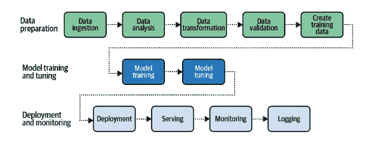

# 对于一个依赖数据科学的世界来说，自动气象站是至关重要的基础设施

> 原文：<https://medium.com/codex/aws-is-critical-infrastructure-for-a-world-increasingly-reliant-on-data-science-d1ff458efe24?source=collection_archive---------13----------------------->

当我偶然发现一个令人惊讶的统计数据时，我对 AWS 的兴趣被激起了。这是几年前，在新冠肺炎加速亚马逊的增长之前，但即使在那时，亚马逊也是电子商务中 800 磅重的大猩猩，收集了大约 50%的在线销售。亚马逊在电子商务领域的主导地位并不令人惊讶，这是众所周知的。我震惊地发现，尽管亚马逊在电子商务领域占据主导地位，但他们一半的运营利润来自另一个部门 AWS。

AWS 是亚马逊的子公司，也是世界上最大的云计算运营商，为个人、公司和政府提供按需付费的计算服务。毫不夸张地说，AWS 为大部分互联网提供了动力。

由于 AWS 在云计算领域的主导地位、它的一系列数据科学应用以及它所拥有的数据量，AWS 在企业和政府运营中的作用只会越来越大。

# 自动气象站的历史

像其他价值数十亿美元的亚马逊子公司一样(想想亚马逊全球物流公司，它现在拥有并租赁穿越全球的巨大货船上的空间)，AWS 最初是为了服务亚马逊自己的内部需求，并从那时起发展到主导整个市场。

早在 21 世纪初，亚马逊运营着世界上最大的在线商店，这带来了对计算能力和数据存储的巨大需求。为了节省工程时间，专注于面向消费者的创新，而不是后端基础设施，亚马逊创建了一个“共享 IT 平台”，最初旨在为亚马逊团队标准化基础设施。2002 年，这个共享的 IT 平台被剥离到 Amazon Web Services 中，并被产品化为一项服务，提供给希望利用 Amazon 卓越计算能力的客户。这一早期 AWS 服务的后续部门提供计算能力和数据存储，被称为 EC2，尽管细节尚不清楚，但分析师认为它仍占 AWS 收入的一半以上。当你考虑到云计算对几乎每一种可以想象的业务类型越来越重要的好处时，特别是如果它依赖于数据科学工具，就很容易理解这些相对基本的计算功能对 AWS 的价值主张为何如此重要。

# 通过 Amazon Web Services 的 EC2 获得云计算的优势

AWS 的 EC2 允许企业按需部署 IT 资源。从 Amazon 租用计算空间的好处是增加了灵活性，可以根据需要进行扩展和缩减，而无需投资自己服务器的物理基础设施。亚马逊让计算能力按需可用，就像你的电力公司轻轻一按开关就能提供能源一样。当你需要更多的能量时，你只需要消耗更多。你的能源需求在一年中会有波动，因为你在夏天依赖空调，在冬天依赖暖气，但你只需为你每月使用的能源向电力公司付费。企业对计算能力的需求比任何个人对能源的需求波动更大。举个例子，一家非盈利公司需要准备在每年 11 月的感恩节那天网站流量增加 60%。全年携带额外的容量是低效的，因此迁移到云以及按需付费模式是一个有吸引力的替代方案。

# AWS 对数据科学应用的益处

对于数据科学，云的有效无限容量允许需要大带宽的定期操作，如对数据进行质量检查或测试新库。如果您的数据科学相关计算需求是可预测的，您的企业可以通过使用 Amazon EC2 Spot 实例提前预留所需的计算能力来利用额外的节省。

对于提供数据科学服务的 SAS 企业来说，计算能力可能是最大的运营成本之一。云计算将资本支出转变为可变的 COGS 支出，这有利于预算预测。这种灵活性使 SAS 公司能够线性或指数(理想情况下)扩展运营，而不是以步进方式扩展，这种方式的特点是增长依赖于构建物理服务器容量。

通过遍布全球的服务器，利用亚马逊云计算的企业可以在需要的地方部署数据科学工具，减少延迟。这对于需要本地接收和部署数据的数据科学工具尤为重要。我曾供职于一家为从以色列到新加坡的大型电子商务零售商提供产品推荐的公司。至关重要的是，在本国购物的最终用户，无论他们可能在哪里，在购物网站时都不会遇到延迟。这家公司能够处理实时客户购物数据，执行机器学习过程，然后在网站上零延迟地返回和显示推荐的产品，部分原因是亚马逊广泛的服务器网络。

# 数据科学工具的协作和部署

开发和发布像机器学习模型这样的数据科学工具的工作流是复杂的，并且是跨学科的，需要许多团队之间的协作，每个团队都在自己的本地笔记本上工作，但贡献并依赖于分散在许多服务器上的代码和数据。

仅仅运行一次这个工作流是不够的，新的数据会不断地被收集，并且需要反馈到模型中，一次又一次地开始这个循环。

弗雷格利，c .，&巴斯，A. (2021)。AWS 上的数据科学:实现端到端、连续的人工智能和机器学习管道(第 1 版。).奥莱利媒体。

亚马逊拥有自动编排这些工作流程步骤的工具，包括当亚马逊发现其性能开始下降时，甚至自动重新训练算法。

# AWS 的预建数据科学工具

你可能已经注意到亚马逊产品的一个趋势，它们从服务于亚马逊的内部需求开始，最终成为大多数企业的首选。亚马逊将其成本转化为产品，而且做得非常出色。我已经指出了 AWS EC2 和亚马逊全球物流的这种演变。这种模式对亚马逊来说非常有效，因为他们内部需求的巨大规模让他们在竞争中占据了优势。这一点在亚马逊网站对数据科学工具的需求上体现得最为明显。

想想 Amazon.com 作为世界上最大的在线商店部署的所有数据科学工具；产品推荐、需求预测、搜索分析、图像和视频分析以及自然语言处理等等。这些可能都是亚马逊做生意的成本，但他们已经将它们变成了一套产品，企业可以通过许可来解决自己的数据科学问题。流经 Amazon.com 的海量消费者数据训练了其算法，使其成为世界级的，对大多数竞争对手而言遥不可及。

# 结论

AWS 已经提供了互联网的主干，但随着对数据科学工具的需求增加，该公司在企业和政府运作中的关键作用只会增加。考虑到 AWS 在云计算市场的主导地位及其坐拥海量消费者数据的优势地位，很难看到任何竞争对手取代 AWS 成为未来最重要的数字基础设施。