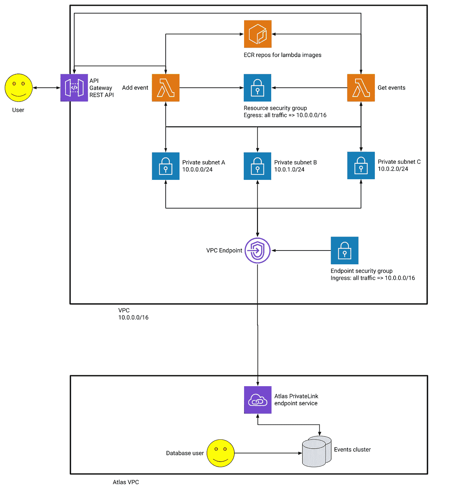
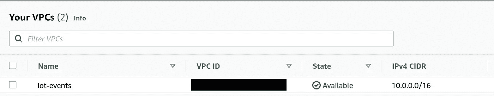
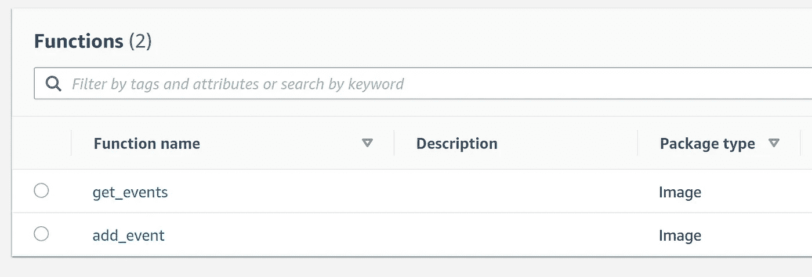
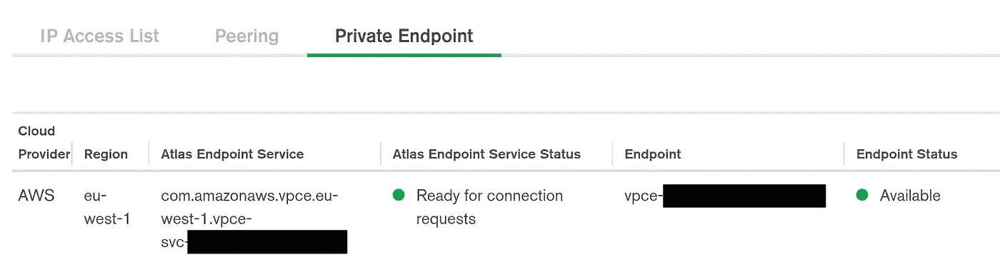

# AWS Lambda 和 MongoDB Atlas 微服务:从本地到现场

> 原文：<https://medium.com/codex/aws-lambda-and-mongodb-atlas-microservices-from-local-to-live-8967738d6f13?source=collection_archive---------4----------------------->

由 [SpaceX](https://unsplash.com/@spacex?utm_source=unsplash&utm_medium=referral&utm_content=creditCopyText) 在 [Unsplash](https://unsplash.com/?utm_source=unsplash&utm_medium=referral&utm_content=creditCopyText) 拍摄的照片

由于各种原因，为云构建软件令人望而生畏，特别的困难超出了选择基本方法和底层服务的范围；以确定的、可重复的方式提供良好的本地开发人员体验和供应基础设施本身也带来了相当大的挑战。

作为我最近调查 [MongoDB Atlas](https://www.mongodb.com/cloud/atlas) 的一部分，这是一个用于运行和扩展同名 NoSQL 数据库的托管云服务，我构建了[一个 REST API，用于存储和检索从物联网设备](https://github.com/jamesseanwright/iot-events-api)发送的事件。我的目标是构建一个微服务:

*   当周期性面临不可预见的流量高峰时，自动扩展
*   可以在本地运行，不依赖云基础架构
*   使用单一基础设施作为代码工具，在 AWS 和 MongoDB Atlas 之间提供所需的云资源
*   在 AWS 和 Atlas 之间建立连接时，遵循安全最佳实践

这篇文章不会作为实现上述目标的一步一步的教程，而是提供我的项目的一个高层次的概述，允许人们在[资源库](https://github.com/jamesseanwright/iot-events-api)中更深入地挖掘，甚至将它部署到自己的 AWS 和 Atlas 帐户中。

# 该产品

REST API 提供了支持两种操作的单个`/events`端点。

## 添加事件

冰箱和智能手表等物联网设备可以向终端发出 HTTP POST 请求，以报告任意事件和相关值，如当前内部温度或步数，并使用唯一的设备 ID 来标识自己:

## 检索事件

还可以用 GET 请求检索不同设备 ID 的事件；这主要用于前端应用程序，如监控仪表板，以及故障排除和一般审计:

# 关键技术

尽管 AWS Lambda 和 MongoDB Atlas 是该解决方案的核心，但我使用了其他技术来实现上述目标，并提供良好的开发人员体验:

*   Docker，to[container 化我们的 lambda 函数以部署到 AWS](https://aws.amazon.com/blogs/aws/new-for-aws-lambda-container-image-support/) 并在本地运行它们，在您的机器和云中提供一致的执行环境。我们的函数是用 Node.js 编写的
*   Docker Compose，在本地开发的单个虚拟网络中运行我们的 lambdas 以及本地 MongoDB 和 NGINX 容器——后者用于模拟 Amazon API Gateway
*   Terraform，使用一种通用的配置语言来自动化我们在 AWS 和 MongoDB Atlas 上的整个基础设施
*   大量的 AWS 服务，我将在下一节中介绍

# 体系结构

在详细阐述本地开发人员体验之前提供架构的概述可能看起来不太直观，但是对系统如何整合的高层次理解将更好地证明我在设计所述本地 DX 时所做的决定。

入口点是 API Gateway REST API，允许用户通过 HTTP 抽象与私有资源间接交互；这个网关与我们的处理程序集成在一起，分别跨 HTTP GET 和 POST 动词检索和添加事件。lambdas 的映像被推送到弹性容器注册中心，当它们第一次被提供时，它们被部署到它们相应的功能。除了能够使用将在云中固有地使用的相同运行时和环境在本地调用所述功能之外，容器是比传统 zip 文件更有效的传输机制；鉴于 [Docker 图像层被缓存](https://dzone.com/articles/docker-layers-explained)，人们只需要构建并推送对图像所做的更改，而不是每次都上传所有内容。

为了与 Atlas 集群通信，该解决方案使用了一个 VPC 端点和附带的 PrivateLink 端点服务。正如我将在后面介绍的，我们可以将我们的 Atlas 实体配置为驻留在与我们所在区域相同的 Atlas 管理的 VPC 中，这意味着我们的 lambdas 可以与我们的数据库进行通信，而不会有任何流量离开我们的网络，更不用说通过互联网进行往返(这多酷啊？！);除了明显的性能提升，这还是一个巨大的安全胜利。端点和我们的 lambdas 都连接到我们的 VPC 内的公共子网，并具有各自的安全组，以允许这些私有资源之间的通信。

# 兰姆达斯

如架构图所示，该解决方案包含两个 lambdas:一个用于向数据库添加事件，另一个用于检索事件。这两个函数共享一个公共的 docker 文件，允许将特定的处理程序内容指定为构建参数:

除了复制处理程序模块之外，生成的映像还包括`common`目录，其中存储了两个 lambdas 共享的代码。本质上，lambdas 与 MongoDB 数据库交互，并基于该操作返回一些数据，正如在`get-events`函数中可以看到的:

该函数使用[聚合管道](https://docs.mongodb.com/manual/core/aggregation-pipeline/)按照提供的日期和设备 ID 过滤[分桶](https://www.mongodb.com/blog/post/building-with-patterns-the-bucket-pattern)事件，并将相关事件投射到 JSON-serializable 数组中。

# 本地开发者体验

为我们的函数使用官方 AWS Lambda 容器映像的结果是，我们可以通过向提供的`/2015–03–31/functions/function/invocations`集成端点发出 HTTP POST 请求来本地测试它们。从健全性测试的角度来看，直接调用这个路径是好的，但是当运行多个容器化的 lambdass 时，证明是笨拙的，每个容器化的 lambda 通常暴露在单独的端口上。同样值得注意的是，这个调用 URL 用 lambda 逐字返回的数据进行响应，这是可以理解的；在我们的例子中，我们返回一个 Amazon API Gateway integration 响应，所以 HTTP 200 总是会出现，尽管`statusCode`属性可能是非 2xx 代码。

另一个难点是，我们的函数需要一个共享的 MongoDB 实例，因为我们希望验证，当分别调用`add-event`和`get-event`处理程序时，我们可以端到端地读写数据库。

我们可以使用 [Docker Compose](https://docs.docker.com/compose/) 创建终极开发人员体验，为我们的处理程序定义服务，以及基于[官方 MongoDB 映像](https://hub.docker.com/_/mongo)的数据库服务和使用[官方 NGINX 映像](https://hub.docker.com/_/nginx)的 API 网关服务，所有这些都驻留在同一个网络中:

`api-gateway`服务是我们进入整个应用程序的入口点，所以我们在端口 8080 上向主机系统公开它；其他服务不被直接调用，因此保留在内部。

由于我们使用两个独立的 HTTP 方法(GET 和 POST)在单个路径(`/events`)上操作，所以我们提供了一个小的 NGINX 配置，它在构建时被挂载到服务的文件系统中:

在收到对`/events`的请求时，我们将 HTTP 方法映射到 Docker 组合服务名——即主机名——它包含相应的函数。然后，我们使用 JavaScript 的子集 [njs](https://nginx.org/en/docs/njs/) 来调用我们的内部`/integration`位置，该位置又调用函数的集成端点。njs 包括标准的 JavaScript `JSON` global，这对于解析 Amazon API Gateway integration 响应以及通过适当的 HTTP 响应元素显示主体和元数据(如标题和状态代码)来说是非常宝贵的:

通过一个`docker-compose up`，我们可以在本地运行整个微服务，向本地 API 网关发送与部署的应用兼容的请求:

请注意，我们的本地设置缺少生产应用程序通过各种托管服务处理的一些特性，比如请求验证；我们可以推出自己的产品，但为了当地的发展，我认为没有必要。

# 部署到云

虽然我们可以手动供应我们的 AWS 和 MongoDB Atlas 实体，但在多个 AWS 帐户和 Atlas 组织之间复制我们的基础架构(这是预生产环境需求中常见的需求)将非常耗时且容易出错。相反，我们应该将我们的基础设施声明为代码，使它可以从单一的真实来源中重现。

AWS 提供自己的基础设施作为代码工具，CloudFormation，但自然只支持 AWS 资源；因为我们的数据库基础设施位于 Atlas 中，所以我们需要一个能够自动化多个云平台的解决方案。有了 [Terraform](https://www.terraform.io/) ，我们可以用一种通用的配置语言集成多个提供商。除了为我们的 lambdas 提供 IAM 角色之外，我们的主模块还集成了其他四个定制模块:

首先，我们的 VPC 模块(`./tf-modules/vpc`)为我们的微服务创建了一个专用的虚拟私有云，它定义了我们将 AWS 资源连接到的私有子网和安全组:

由于我们所有的子网都是私有的，我们的任何资源都无法与更广泛的互联网通信，也无法与 VPC 以外的实体联系。但是，我们的 lambdas 需要连接到我们 VPC 支持的 Atlas 集群，因此我们创建了单独的安全组，以允许在我们整个网络的边界内实现这种连接。

我们带入主模块的下一个模块定义了我们的 Atlas 资源(`./tf-modules/atlas`):

该模块通过[官方](https://registry.terraform.io/providers/mongodb/mongodbatlas/latest) `[mongodbatlas](https://registry.terraform.io/providers/mongodb/mongodbatlas/latest)` [提供方](https://registry.terraform.io/providers/mongodb/mongodbatlas/latest)创建所需的图集资源。通过将`"AWS"`指定为我们集群的`provider_name`，Atlas 将在为`provider_region_name`参数指定的区域中的托管 VPC 上提供我们的 MongoDB 副本集，允许我们配置 VPC 端点和相应的端点服务；这些是允许我们的 VPC 单方面连接到 Atlas VPC 和查询集群而不通过更广泛的互联网路由所需要的。我应该强调的是，我们使用`[random](https://registry.terraform.io/providers/hashicorp/random/latest/docs)`[提供者](https://registry.terraform.io/providers/hashicorp/random/latest/docs)为数据库用户生成一个高熵密码，该密码作为模块输出返回，并被 lambda 模块引用。

多么精彩的一幕。ECR Lambda 模块(`./tf-modules/ecr-lambda`)为函数的映像声明了一个 Amazon ECR 存储库，该存储库随后被部署到 AWS Lambda:

当存储库被创建时，我们使用`local-exec` provisioner 为给定的函数构建和推送 Docker 映像；这些命令仅在第一次调配时调用，因此对映像的后续更改必须手动构建并推送到 ECR。注意，我们还创建了一个`aws_lambda_permission`资源，以便我们的 lambda 可以被我们的 Amazon API Gateway REST API 调用。

我真的太擅长这些片段了。我们最终的定制模块定义了一个 API Gateway REST API，HTTP 请求将被发送到该 API，以便与我们的微服务(`./tf-modules/rest-api`)进行交互:

总的来说，该模块中声明的资源类似于我们的 NGINX 服务和本地开发设置中的配置，尽管具有请求验证和 API 密钥，可以在部署时提供给 Terraform。

我们几乎已经准备好将我们的微服务部署到云了，但是除了导出`MONGODB_ATLAS_PUBLIC_KEY`和`MONGODB_ATLAS_PRIVATE_KEY`环境变量，我们还需要为我们的根模块的输入变量提供一些值(这些可以在使用`-var`选项运行`terraform apply`时指定，但是我个人一直使用一个[根](https://www.terraform.io/docs/language/values/variables.html#variable-definitions-tfvars-files) `[.tfvars](https://www.terraform.io/docs/language/values/variables.html#variable-definitions-tfvars-files)` [文件](https://www.terraform.io/docs/language/values/variables.html#variable-definitions-tfvars-files)):

应用我们的配置之前的最后一步是根据 ECR 认证 Docker:

我们现在可以运行`terraform apply`，在此基础上，我们将看到一个 Terraform 将创建的资源计划，该计划将在用`yes`响应时提交给 AWS 和 Atlas 请注意，配置 Atlas 集群可能需要 10 分钟的时间。

完成后，我们应该会在 AWS 帐户中看到 Terraform 生成的各种原语:

我们还应该在 Atlas 项目的*网络访问*部分观察到私有端点是可用的，并且相应的端点服务为请求做好了准备:

然后，我们可以像本地 NGINX 网关一样，向我们的生产 API 网关发送请求:

我们甚至可以通过删除查询参数和主体属性，或者通过提供一个给定属性不支持其数据类型的值来验证我们的请求验证:

# 结束语

无服务器技术极大地降低了构建软件的成本和维护开销，并消除了管理和扩展内部服务器场的需要。相反，考虑到它们对云的依赖，在本地运行它们可能会很棘手；在这方面，官方容器映像是一个游戏改变者，因为它们提供了一个一致的执行环境，可以集成到 Docker Compose 配置中。也就是说，实现良好的开发人员体验并随后将新功能集成到该设置中所需的样板文件有些麻烦。

除此之外，AWS Lambda 并不总是某些应用程序的最佳用例；承受持续稳定负载的服务可能会受益于使用一般的应用服务器来消除冷启动。另一方面，对于面临不定期、不可预测的负载的微服务，无服务器方法可能足够高效，并且成本效益更高。