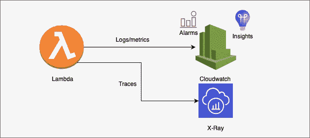
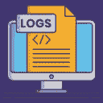

# AWS Lambda 日志记录工具和最佳实践 Python

> 原文：<https://medium.com/codex/aws-lambda-logging-tools-and-best-practices-python-e156a76f52a7?source=collection_archive---------0----------------------->



## [法典](http://medium.com/codex)

有几篇文章讨论了无服务器日志(主要是 Lambda)和最佳实践。在本文中，我将尝试涵盖 AWS 无服务器工作负载日志(**可观察性**)的工具和实践，以及它们从良好架构框架(AWS-WA framework)的角度提供的构建、规划和扩展可靠架构的关键见解。

在我们进入细节之前，简单回顾一下 AWS 提供的日志、指标和事件之间的基本区别。



**日志**可以包含多条数据。


**指标**专门关注他们测量的一个数据点。


**每当 AWS 服务发生变化时，就会生成事件**

AWS 为可观察性推荐了几个最佳实践，例如

*   结构化日志记录，
*   分布式跟踪，以及
*   度量的监控。

更多细节可以在[这里](https://d1.awsstatic.com/whitepapers/architecture/AWS-Serverless-Applications-Lens.pdf)找到。

本文的重点是工具本身，而不是理论原则。因此，我强烈建议使用以下工具来监控应用程序状态:

1.  [AWS-lambda-power tools-python](https://github.com/awslabs/aws-lambda-powertools-python)—记录和跟踪您的关键事件。以下是 powertools 日志记录层的一些重要方面:

*   [日志记录](https://awslabs.github.io/aws-lambda-powertools-python/core/logger/) —结构化日志记录变得更加简单，decorator 用关键的 Lambda 上下文细节丰富了结构化日志记录
*   [指标](https://awslabs.github.io/aws-lambda-powertools-python/core/metrics/) —通过 CloudWatch 嵌入式指标格式(EMF)异步创建的自定义指标
*   [跟踪](https://awslabs.github.io/aws-lambda-powertools-python/core/tracer/) —跟踪 Lambda 函数处理程序以及同步和异步函数的装饰器和实用程序
*   自带中间件 —装饰工厂创建你自己的中间件，在每次 Lambda 调用之前和之后运行逻辑

[2。AWS-lambda-power-tuning](https://github.com/alexcasalboni/aws-lambda-power-tuning)-调整 lambda 函数的大小

也许你必须回答的最重要的问题是"**我需要记录什么？**“我建议配置以下由 [BRIAN CLINE](https://www.brcline.com/blog/author/admin) 提供的记录和分析区域，并加入电动工具的味道:

*   **使用日志库**

```
# use powertools
from aws_lambda_powertools import Logger 
logger = Logger()
```

作为最佳实践，AWS Lambda Powertools 日志记录语句被禁止。使用 *set_package_logger* 将其启用:

```
from aws_lambda_powertools.logging.logger import set_package_logger  set_package_logger()
```

*   **在日志事件中包含识别信息**

```
from aws_lambda_powertools import Logger
logger = Logger()  
def handler(event, context):  
  order_id = event.get("order_id") # to know which order failed and why
  logger.structure_logs(append=True, order_id=order_id)
  logger.info("Collecting payment")
```

*   **记录错误/异常**

```
from aws_lambda_powertools import Logger 
logger = Logger() try:      
   raise ValueError("something went wrong") 
except Exception:      
   logger.exception("Received an exception")
```

*   **测井时保持一致**

powertools 的 cloudwatch 示例

*   **花时间真正了解 CloudWatch &日志**
*   **设置 CloudWatch 警报**

这些配置的详细描述可在[这里](https://www.brcline.com/blog/best-practices-for-aws-lambda-logging)找到

了解 Powertools 后的最后一步，日志记录实践是配置一个。这是一个用 Lambda 函数配置 powertools 的逐步教程

# 附加 Powertools Lambda 层

第一步:

只需部署以下应用程序，它将自动为您的 lambda 函数创建 powertools 层

[AWS-lambda-power tools-python-layer](https://serverlessrepo.aws.amazon.com/applications/eu-west-1/057560766410/aws-lambda-powertools-python-layer)

**第二步:**

使用以下 arn 将层附加到 lambda 函数

```
arn:aws:serverlessrepo:eu-west-1:057560766410:applications/aws-lambda-powertools-python-layer
```

# 荣誉奖

我认为阅读 AWS 日志的人应该已经知道 AWS-WA 框架的 5 个支柱。因此，为了给这些工具一个新的视角，我将每个工具都归因于 AWS-WA 框架中的一个支柱。开始了。

*   用于整体日志和跟踪的强大工具—卓越的运营和高效的性能
*   功率调谐—可靠性和成本优化
*   AWS-x 射线—卓越运营

# 保护日志信息

正如 AWS 一直建议的那样，日志记录设施和日志信息必须受到保护，以防篡改和未经授权的访问。管理员和操作员日志通常是清除活动痕迹的目标。

保护日志信息的常见控件包括:

1.  使用 Cloudtrail 验证系统组件的审计跟踪是否已启用且处于活动状态
2.  实施 PoLP，通过对 IAM 用户使用细粒度的访问权限，确保只有与工作相关的个人才能查看审计跟踪文件
3.  通过访问控制机制、物理隔离和/或网络隔离，使用 IAM 用户的细粒度访问，确认当前的审计跟踪文件受到保护，不会被未经授权的修改
4.  确保将当前的审核跟踪文件及时备份到难以更改的集中日志服务器或介质上—使用备份 s3 存储桶和 Athena 查询来审核日志存储和分析
5.  验证面向外部的技术(例如，无线、防火墙、DNS、邮件)的日志是否被卸载或复制到安全的集中式内部日志服务器或介质上—使用备份 s3 存储桶和 Athena 查询来审核日志存储和分析
6.  验证是否对所有系统组件执行了定期日志审查
7.  确保安全策略和程序包括审核日志保留策略，并要求审核日志保留一段时间，由业务和法规遵从性要求定义