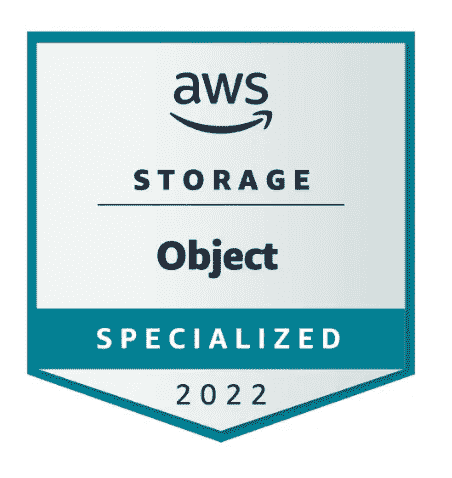

# AWS 对象存储专门化。你需要知道的(+10 个问题)。

> 原文：<https://medium.com/codex/aws-object-storage-specialized-what-you-need-to-know-10-questions-cffe7802d3c0?source=collection_archive---------0----------------------->

图 1 — AWS 学习:对象存储

在当今世界，来自亚马逊、微软或谷歌等公司的云是众所周知的，并被许多公司最大限度地使用。云服务是不断更新的，因此我们每个人都必须不断改进和学习新信息。12 月初，我收到信息，AWS 提供 5 个完全免费的认证。我没有…