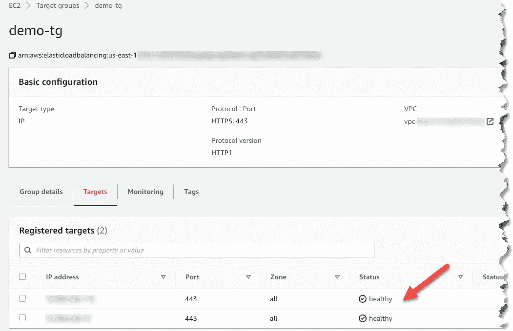

# 带有自定义域名的 AWS 私有 API 网关

> 原文：<https://medium.com/codex/aws-private-api-gateway-with-custom-domain-names-350fee48b406?source=collection_archive---------0----------------------->

## **使用自定义 DNS 创建私有 REST 端点的分步指南**

API gateway 在公开 API 方面非常棒，你会发现很多关于它的博客和视频。然而，大多数组织希望定义私有 API，供组织内的其他子系统使用。在学习如何用自定义 DNS 定义私有 API 时，我经历了很多挣扎。本文给出了如何实现这一点的分步指南。下面是我们在本文末尾将要实现的目标的描述。


**第一步:创建一个接口 VPC 端点**

登录到您的 AWS 控制台并选择 VPC 服务。从左侧导航窗格中选择“端点”,然后点击“创建端点”按钮。在 AWS 服务列表中，选择*com . Amazon AWS . com .[地区]。执行-api。*确保选择正确的 VPC、子网和安全组，允许端口 80 和 443 上的流量。您还可以根据需要定义自定义策略，或者将其保留为“完全访问”创建后，记下 VPC 端点 ID。我们将在步骤 3 中用到它。还要记下子网选项卡中的 IPV4 地址。当我们创建一个内部负载平衡器时，这些是需要的。


**第二步:在 VPC 中创建一个 lambda 函数**

选择 lambda 服务并在 VPC 中创建 Lambda 函数。你可以用自己选择的编程语言创建一个简单的函数，返回“你好，来自 VPC·拉姆达”。创建函数时需要注意的几件事:

> a.创建一个 IAM 执行角色，该角色附加了***awslambdabasiceexecutionrole***和***AWSLambdaVPCAccessExecutionRole***策略。创建 lambda 函数时选择此角色。(更改默认执行角色→使用现有角色)
> 
> a.在**高级设置**中，确保选择您为 VPC 端点创建选择的相同子网。


**步骤 3:在 API 网关中创建私有 REST API**

选择 API 网关服务并创建新的 API。选择 API 为***Rest API Private***。提供 API 名称和描述，并在*端点类型*中选择“私有”。在“VPC 端点 ID”中输入步骤 1 中的 VPC 端点 ID，然后单击添加。点击*创建 API* 。这就创建了新的私有 REST API。


创建 API 后，单击左侧导航窗格中的**资源策略**并输入下面的资源策略。*【注意:将 vpce- < id >替换为 VPC 端点 Id】*

```
{
    "Version": "2012-10-17",
    "Statement": [
        {
            "Effect": "Deny",
            "Principal": "*",
            "Action": "execute-api:Invoke",
            "Resource": "execute-api:/*/*/*",
            "Condition": {
                "StringNotEquals": {
                    "aws:sourceVpce": "**vpce-<id>**"
                }
            }
        },
        {
            "Effect": "Allow",
            "Principal": "*",
            "Action": "execute-api:Invoke",
            "Resource": "execute-api:/*/*/*"
        }
    ]
}
```

**第四步:将 Lambda 功能与 API 网关集成，部署并测试**

选择新创建的 API，并从**动作**菜单中选择“GET”方法。选择**积分类型**作为*λ函数*，并选择步骤 2 中创建的λ函数。


从**动作**菜单中，选择**部署 API。**选择**部署状态**为*【新阶段】*，给**阶段名称**为*dev。*一旦部署了 API，点击左侧导航窗格中的**阶段**，并选择 ***开发阶段。*** 你会在右手边看到 API URL。尝试从 VPC 以外的浏览器访问该 URL。您将无法访问该 API，因为它是私有的。出于测试的目的，在 VPC 中创建一个 EC2 实例，并尝试使用 curl 命令测试带有 stage URL 的 API。这应该很好，因为它是在 VPC 内定义的。


**步骤 5:创建 SSL 证书并上传到 AWS 证书管理器**

这是下一个重要的步骤。因为您正在定义一个私有的 https REST API，所以您必须提供 SSL 证书来访问该 API。我不能在这里详述这个步骤，因为您的组织将有生成 SSL 证书的方法。如果您只是在探索，可以使用 openssl 命令来生成自签名证书。生成证书后，进入 AWS 中的**证书管理器**，点击*“导入证书”*提供详细信息并导入证书。记下创建证书时给出的域名。在配置 API 网关自定义域名时，我们将需要此域名。

**步骤 6:应用程序负载平衡器和目标组**

AWS 不支持私有 API 的自定义域名。因此，这是一个需要通过自定义域名访问 API 的解决方案。

在顶部搜索栏中选择 EC2 服务。在左侧导航窗格中，选择 ***负载平衡器*** ，然后在右侧视图中点击 ***创建负载平衡器*** 。选择 ***应用负载平衡器*** 并点击 ***创建。*** 按照以下步骤完成负载平衡器创建向导:

***注意:这将是一个有点长的过程，必须准确完成。请小心地做这件事。***

1.  **配置负载均衡器**

a.选择方案为*内部*

b.监听器→添加 HTTPS(默认端口是 443)

c.VPC 和子网→确保选择创建 VPC 端点的正确 VPC，并确保选择相同的子网集。


**2。配置安全设置**

a.证书类型→从 ACM 中选择一个证书

b.证书名称→从下拉列表中选择证书的名称

c.安全策略→保留默认设置(*ELBSecurityPolicy-2016–08*


**3。配置安全组**

分配安全组→创建新的安全组→提供名称和描述，并确保从下拉列表中选择 HTTPS


**4。配置路由**

a.目标组→ *【新目标组】*

b.目标类型→ IP

c.礼宾→ HTTPS

d.健康检查→协议→ HTTPS

e.高级健康检查设置→端口→ *【流量端口】*

f.高级健康检查设置→成功代码→ [200，403]

将其他值保留为默认值。


**5。注册目标**

网络下拉菜单→其他私有 IP 地址→输入步骤 1 中记录的 IPV4 地址，然后点击*添加到列表*

> 负载平衡器的目标应该是 VPC 端点创建的 Eni 的 IP 地址。这些是在步骤 1 中完成的。您可以通过选择您的 VPC 端点并打开“子网”选项卡来找到这些 Eni。


单击 Review 并创建负载平衡器。创建负载平衡器后，从左侧导航窗格打开**目标组**，并打开您在创建负载平衡器时创建的目标组。单击“Targets”选项卡，确保两个 IP 的运行状况检查显示为正常。这可能需要一些时间，但是如果您已经正确地配置了所有的东西，它应该在创建后不久就显示 healthy。



**步骤 7:在 53 号公路上创建私人托管区域**

下一步是设置私有托管区域，并将其指向应用程序负载平衡器。选择 Route 53 服务。点击托管区域→创建托管区域。按照以下步骤创建托管区域:

a.域名→*us-east-1 . custom domain . AWS*

b.类型→私有托管区域

c.地区→美国东部-1

d.VPC ID → VPC ID，在这里您配置了所有资源。


创建托管区域后，点击*创建记录*并输入以下详细信息:

a.记录名称→ test_api

b.记录类型→ A

c.别名→启用别名，以便您可以选择负载平衡器

d.路由流量→应用和传统负载平衡器的别名

e.地区→美国东部-1

f.从下拉列表中选择负载平衡器。(开头是 *dualstack.internal…* )

将*路由策略*和*评估目标健康*保留为默认值，并点击*创建记录。*


**步骤 8:配置 API 网关自定义域名**

选择 API 网关服务并点击左侧导航窗格中的**自定义域名**。在右侧视图中点击“创建”,输入如下详细信息:

a.域名→在此提供域名。请注意，这必须与您在步骤 5 中创建 SSL 证书时给出的域名相匹配。

b.TLS 版本→ 1.2

c.端点类型→区域

d.ACM 证书→选择在步骤 5 中创建的证书。


创建域名后，选择域名并单击 API mappings 选项卡。在 API 映射窗口中，从下拉列表中选择 API 和阶段，然后单击保存。将*路径*字段留空。这样，如果您在 API 中创建资源，您可以使用相同的域名和路径后缀访问所有资源。


配置完成后，请确保再次部署 API，否则您将无法使用自定义域名调用 API。

就是这样。现在所有的配置都已完成，您应该能够从 VPC 内部测试 API(域名为 test _ API . us-east-1 . custom domain . AWS)。

这是一种迂回的做法，但它确实减少了使用晦涩的 API 名称的麻烦，并且也有助于灾难恢复策略。

我花了很长时间才把它修好。希望这对别人有帮助。如果你在某个地方遇到困难，请留下你的评论，我会随时帮助你。