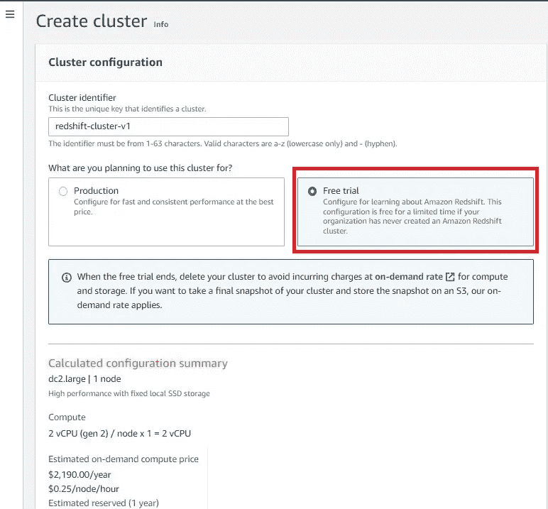

# AWS 红移与 Python 连接第 1 部分-使用 Python 设置红移连接。

> 原文：<https://medium.com/codex/aws-redshift-connects-with-python-part-1-setup-a-redshift-connection-with-python-b9f6a1fa49f0?source=collection_archive---------4----------------------->

欢迎阅读*亚马逊红移集群管理指南*。Amazon Redshift 是一个完全托管的、Pb 级的数据仓库服务。您可以从几百千兆字节的数据开始，然后扩展到十亿字节或更多。

您可以在网站上了解更多详情:[https://docs . AWS . Amazon . com/redshift/latest/mgmt/welcome . html](https://docs.aws.amazon.com/redshift/latest/mgmt/welcome.html)

我们将从 AWS 开始一步一步地进行设置。

我希望你们已经创建了 AWS 帐户，我们登录了 AWS 红移帐户。页面如下所示。

在 AWS 红移页面的上方，有一个名为“创建集群”的选项。我们必须点击它并继续前进。

单击“创建集群”后，我们需要给出名称集群标识符，我给出了“红移-集群-v1 ”,然后单击免费试用选项。我上面展示的红色盒子在右手边。

之后，我们向下滚动，看到我们必须给出数据库名称、端口号和密码。但是我选择保持默认值不变。但是我们必须给出我们的密码。

输入管理员用户名和密码后，单击 Create cluster。

单击“创建集群”后，页面将自动导航到集群主页，它将显示您的集群的状态，这需要时间。

上图显示了群集的状态，状态为“正在修改正在创建”。

创建集群后，状态将显示“可用”。

现在，我们的集群是用数据库中的一些演示数据创建的。

之后，我们必须在 VPC 安全组中进行更改，以便在 Python 和 redshift 之间进行通信。

首先，我们必须单击我们的红移星团名称，然后单击“Properties”选项卡。

在“Properties”选项卡中，我们将看到“Network and Security settings”，单击“VPC 安全组”下面的链接，该组位于下图中提到的蓝框中。

单击蓝色链接后，我们将重定向到安全组页面。我们必须搜索“入站规则”

入站规则显示在屏幕底部，即我在上面的图片中显示的绿色方框。

单击“入站规则”后，我们将看到各种入站规则的列表，我们单击“编辑入站规则”。我们会改变一些属性。

之后点击“添加规则”，这将提示新的数据，我们需要修改它。

我们需要修改下面提到的图像和绿色框内的领域。

通过设置 VPC 安全组，我们将把 AWS 红移连接到 python。

现在，只剩下一件事，就是我们必须让我们的集群可以公开访问。因此，我们来到群集主页，单击该群集的复选框。

选择完群集后，转到操作，找到修改可公开访问的设置。将出现一个提示窗口，我们必须启用它。

单击“启用”并保存更改。现在我们的红移为 python 做好了准备。

我将在下一篇文章第 2 部分中发布 python 的代码。