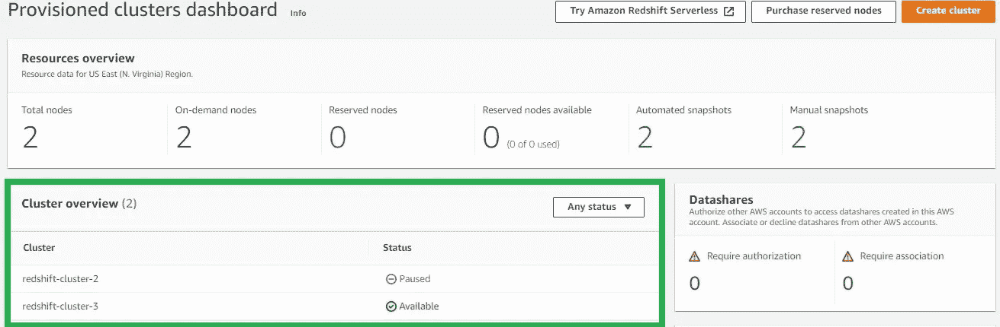
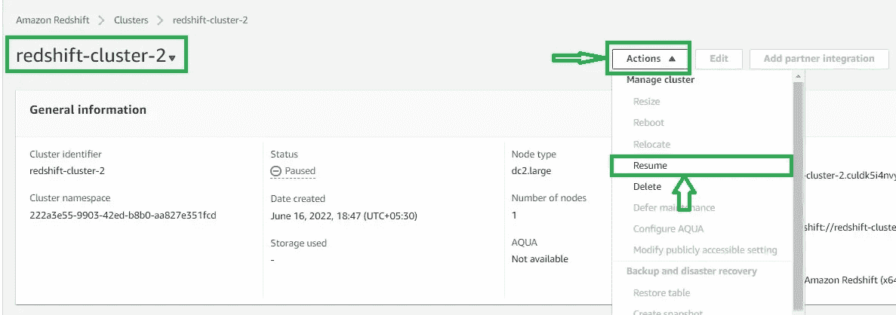
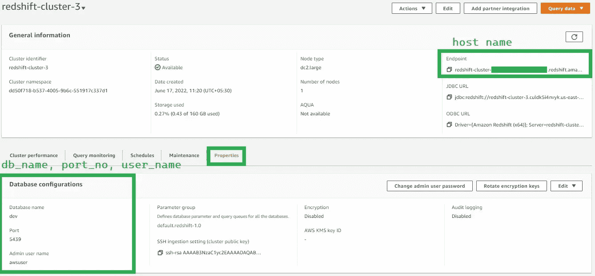
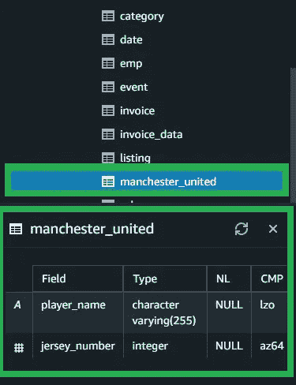
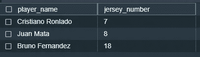

# AWS 红移与 Python 连接第 2 部分-连接 AWS 红移的 Python 代码

> 原文：<https://medium.com/codex/aws-redshift-connects-with-python-part-2-python-code-to-connect-aws-redshift-96f81523a733?source=collection_archive---------10----------------------->

在第 1 部分会议中，我们设置了 AWS 红移帐户来连接外部世界。

在本次会议中，我将演示一些代码，这些代码将被设置并连接到 python world to AWS Redshift。

我的主要目标是在 AWS 红移上传一个熊猫的数据帧。

首次登录 AWS 红移会话，或者我们可以转到红移仪表板。

访问控制面板页面后，我们将在集群概述会话中看到集群列表。

现在，我们看到我创建了两个群集，一个是活动的，即“可用”，另一个是非活动的，即“暂停”。我将使用红移-星团-3。

我还将向您展示如何激活或我们可以说如何使红移-集群-2 可用。

单击“redshift-cluster-2”名称或您的集群名称，它会重定向到集群页面，单击“Action”，它会显示一个下拉菜单。

在菜单里，你会看到“简历”，请点击它。单击后，需要几分钟时间来激活群集。因此，您将在 AWS 红移集群仪表板上看到集群的状态，消息将为“Resume Modifying ”,过一段时间后，它将变为可用。

一旦我们的集群“可用”，现在，让我们开始使用 python 代码。

我们将通过运行下面给出的命令来安装红移连接器。

> pip 安装红移连接器

为了通过 python 连接 AWS Redshift，我们需要某些凭证，如主机名、数据库名、端口号、用户和密码。

如果我们在群集端，我们将转到“Properties ”,我们将看到我们正在寻找的凭据。

现在我们将运行 python 中的查询来创建一个关于红移的表。

在此之前，让我们创建一个样本数据帧

现在，我们将在 AWS 红移集群中创建一个表。

我们将看到表被创建。

现在，我们将在表中插入 DataFrame。

现在，在查询编辑器中，我们将看到我们的表已经创建，并在表中填充了数据。

整个示例演示了如何创建 AWS 红移集群以及如何插入 pandas 数据帧。

我们可以在红移集群的数据帧中上传 n 个数据。