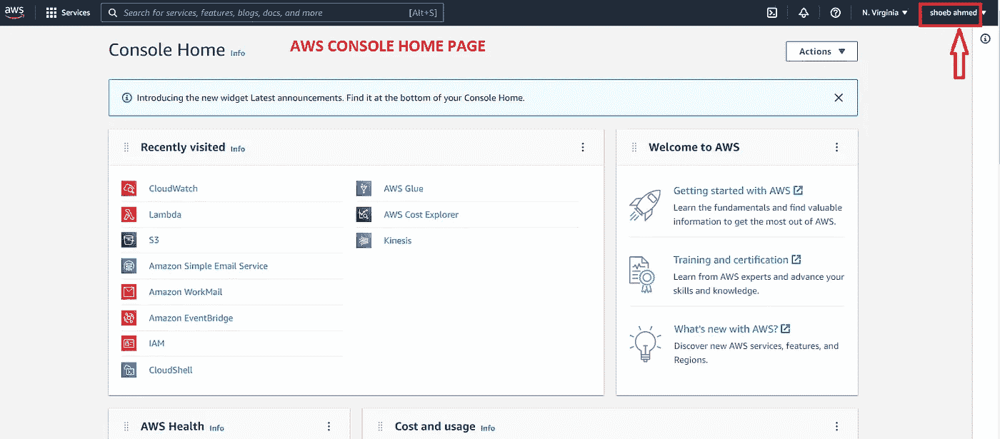
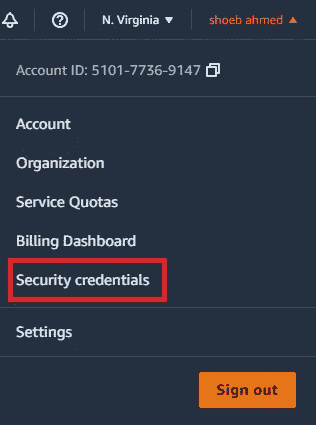
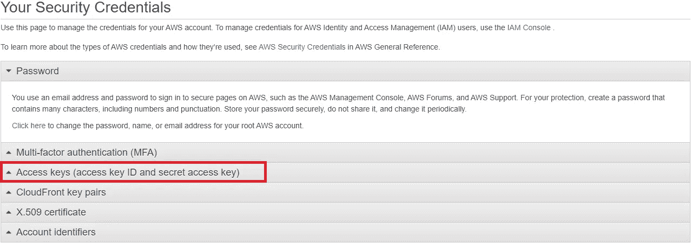
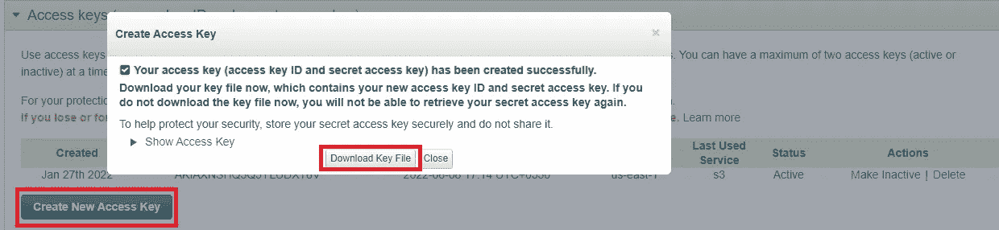
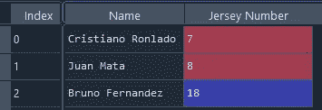
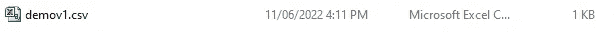
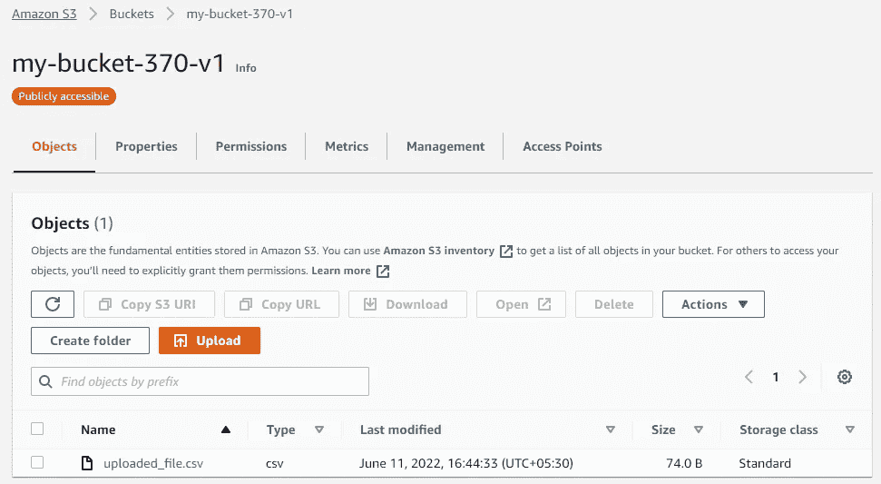
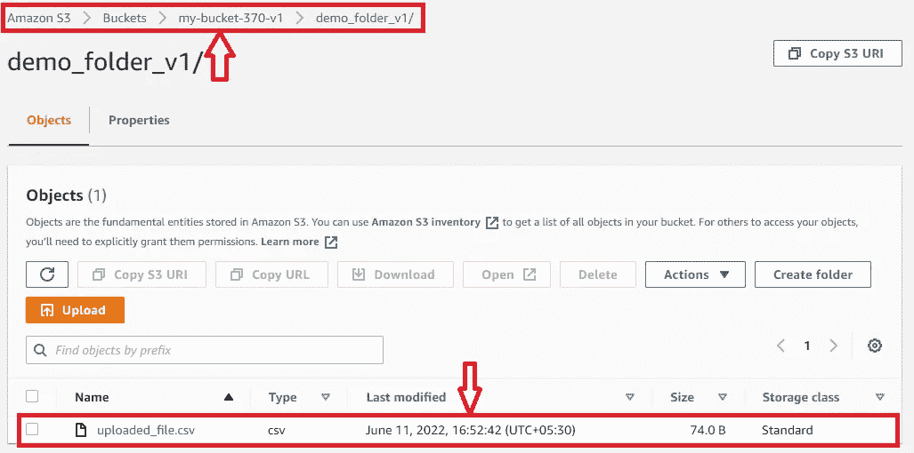
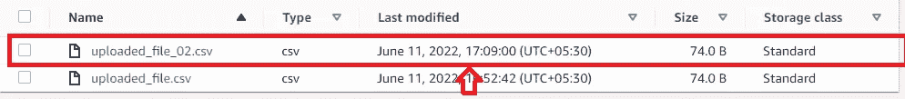
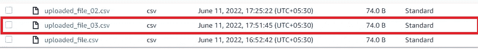

# 1.使用 Python 的 AWS S3-Shoeb Ahmed

> 原文：<https://medium.com/codex/aws-s3-with-python-by-shoeb-ahmed-923c1cf47110?source=collection_archive---------6----------------------->

Amazon Web Services 是一个在线平台，提供可扩展且经济高效的云计算解决方案。

在这里，我们将探索 boto3 包中的所有方法(函数),我们将访问 S3 资源。

我将跳过许多理论概念，一步一步来。

确保我们有一个 AWS 帐户和一个根用户。

登录后，我们只需要一个访问密钥就可以从 AWS 和 python 获得连接。

我们需要做的是，转到主控制台，在右上角点击您的用户名，如下所示:

单击下拉菜单后，单击安全凭据。

单击安全凭据后，我们将重定向到安全页面，并单击访问密钥。

点击访问密钥后，点击“创建新的访问密钥”，弹出窗口，点击“下载密钥文件”。

将下载 Excel 表格文件，我们要做的是复制 AWS 访问密钥 ID 和 AWS 密钥 ID。

我的目标是探索 S3 桶中的所有函数(方法)。

开始编码吧。

虽然我打算只做熊猫数据框的任务。如果你想要任何其他文件格式，请进入我的个人资料，找到我的电子邮件 id，给我发消息或写评论。

运行代码后，您会发现您的新 bucket 是在 S3 创建的。

现在我们要做的是，我们将在 S3 桶上传 csv 文件。

首先，我们将创建一个简单的数据帧

现在，我们将上传一个 CSV 文件，该文件存储在本地系统中，无需在 bucket 中创建文件夹。

现在，我们将在 bucket 中创建一个文件夹，在该文件夹中，我们将上传代码。

如果你有一个类似字节的文件(即二进制文件)或流文件，那么我们可以使用 uploadfileobj 函数。

我们也可以通过使用 PutObject 请求来上传，你必须在你的 IAM 权限中拥有 s3:PutObject。

