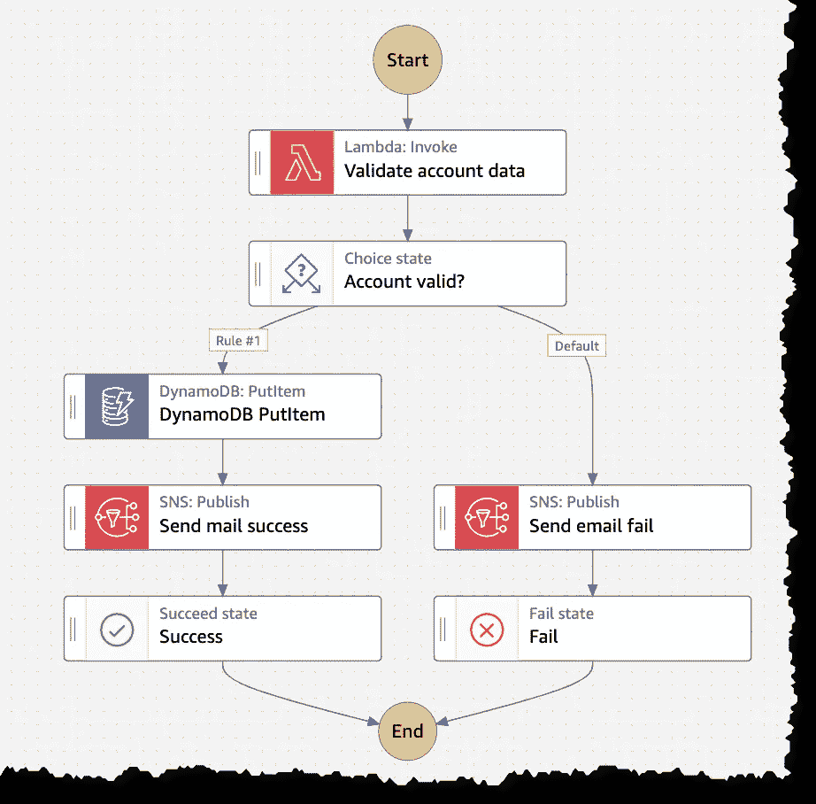
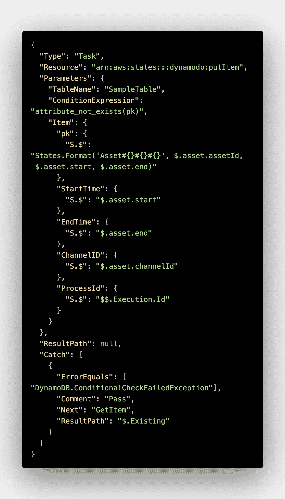
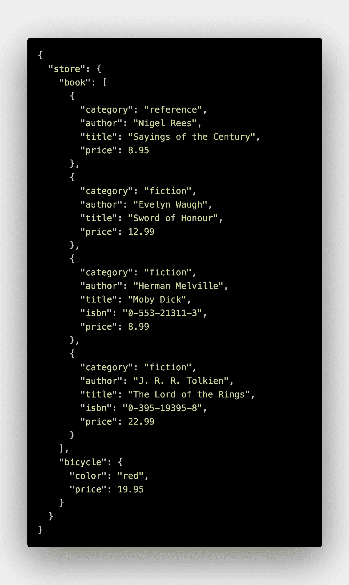
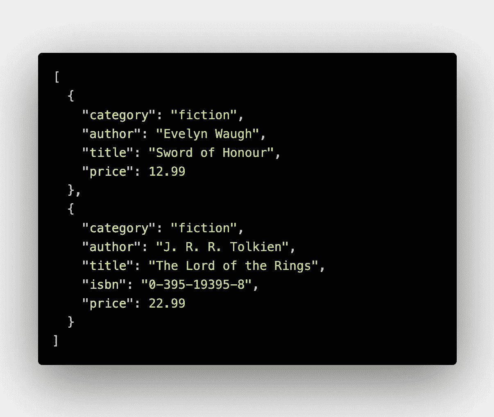
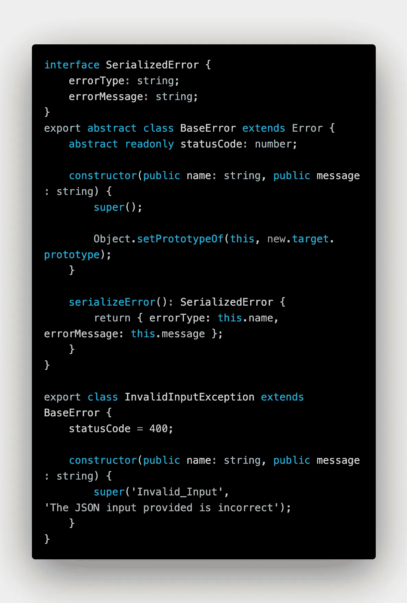

# AWS 步骤功能:提升工作流程的 5 种具体方法

> 原文：<https://medium.com/codex/aws-step-functions-5-specific-ways-to-level-up-your-workflows-f5679d197d10?source=collection_archive---------8----------------------->

几年前，我第一次接触阶跃函数和状态机，老实说，我第一次编写状态机时，感觉它不是很直观，有点笨拙。专有语言(ASL，[亚马逊国家语言](https://docs.aws.amazon.com/step-functions/latest/dg/concepts-amazon-states-language.html))对我来说并不自然。

想来想去，我就是爱写代码。用 VsCode 编写一些优秀的旧 JavaScript/TypeScript 有一种神奇和安慰的感觉，我相信我们许多开发人员都有这种感觉！从表面上看，从编写命令式代码到编写有效的专有 YAML 有点奇怪，很多时候这让我觉得我是一个专业的 YAMLer！

底线是，我们大多数人习惯于通过代码同步表达思想和解决复杂的业务问题。但是随着 Step 函数的出现，感觉就像是一个巨大的转变，变成了非常可视化和富于表现力的状态机和工作流。

多年来，AWS 步骤功能已经成为我最喜欢的 AWS 服务。自从编写我的第一个工作流以来，已经添加了许多特性，极大地改善了开发人员的体验。

从 workflow studio 到服务集成，再到内部功能，一直到与 VsCode 的集成。感觉 AWS 的团队已经找到了成功的阶梯函数配方！这项服务现在感觉不那么笨重了，非常容易使用，并且适合任何你可以扔给它的用例！

为了从这篇文章中获得最大的收获，你需要对什么是 AWS 步骤功能有一个基本的了解，以及一些关于服务的[基本术语](https://docs.aws.amazon.com/step-functions/latest/dg/welcome.html)。因此，废话不多说，这里有五个具体的方法来提高你的步骤功能工作流程游戏！

# I .使用 workflow studio 启动状态机工作

AWS Step Functions workflow studio 于 2021 年 6 月首次发布。像我们许多人一样，我对低代码/无代码工具持怀疑态度。但是有一天我开车去上班，我看到了杰瑞米·戴利的*无服务器聊天*中的[一集](https://www.serverlesschats.com/116/)，在这一集里，他有几个来自 AWS 的客人在谈论使用 workflow studio 有效地与客户合作并解决复杂的问题。它让我着迷，我不得不亲自尝试一下——剧透，从那以后我就没有停止过！

workflow studio 是 AWS 控制台中 Step Functions 服务内的一个可视化工具。它允许你不用写一行 YAML 就能组装状态机！仔细想想，你最终编写的 YAML 代码是重复的，很多时候感觉像样板文件，所以为什么不把它交给工作室呢？studio 的最大特点是，只要你愿意，你可以通过点击一个按钮来生成所有的 YAML 样板文件。

Workflow Studio 片段，摘自这篇 [AWS 博客](https://aws.amazon.com/blogs/aws/new-aws-step-functions-workflow-studio-a-low-code-visual-tool-for-building-state-machines/)文章

不言而喻，在 workflow studio 中单独开发的状态机还不能用于生产。这样做不是生产工作负载所需的可预测和可重复的过程。但是在使用 studio 生成所有样板文件之后，使用 CloudFormation 中的 GetAtt 和 Ref 之类的东西将硬编码值替换为动态参数值就变得非常容易了。这方面的一个例子是:DynamoDB 表名、SNS 主题 ARNs、Lambda 函数名等等。

例如，我喜欢使用无服务器框架，并为我所有的状态机使用[无服务器步骤函数](https://www.serverless.com/plugins/serverless-step-functions)插件。

# 二。比起定制代码，更喜欢服务集成

给定状态机中的服务集成步骤意味着直接与 AWS APIs 交互，而不是像 Lambda 那样使用自定义代码来使用 SDK。

如果退一步讲，我们使用 AWS、状态机或其他方式构建的任何给定工作流中的许多步骤都涉及调用 AWS 服务，并将一些(无服务器！)碎片在一起。比如向 DynamoDB 写入一个条目，或者向 SQS 队列写入一条消息，或者向 SNS 主题发布一条消息，等等。

您可以在代码中做的任何事情都在服务集成中得到原生支持。你想给这个电话加一个试接球吗？它在那里！您想要添加基于特定条件的重试机制吗？它在那里！是否要过滤和调整来自 AWS APIs 的响应？好了，你明白要点了，当 AWS 去年秋天宣布你现在可以使用服务集成调用超过 200 个服务时，锦上添花。

下面是一个代码片段，它使用 PutItem DynamoDB API 格式化来自传入输入数据的 API 有效负载，并将其传递给 DynamoDB:

有趣的是，通过[内部函数](https://docs.aws.amazon.com/step-functions/latest/dg/amazon-states-language-intrinsic-functions.html)，你可以复制代码行为。在这种情况下，我使用国家。DynamoDB 表的分区键上的 Format()函数，用于连接输入数据对象的三个属性:StartTime、EndTime 和 ChannelID。这就是你要向 DynamoDB 写一个项目所需要的全部内容，很棒的东西！

这个状态机还在同一个项目中写入状态机执行 id，它是赋予某个状态机执行的唯一标识符。您可以从执行的[上下文对象](https://docs.aws.amazon.com/step-functions/latest/dg/input-output-contextobject.html)中访问执行 id 和其他有用的属性。

最后，如果 DynamoDB 抛出一个异常，表明该项已经存在，那么工作流将捕获该异常，并进入一个新的状态，检索现有的项。所有这些都是通过步骤函数完成的，不需要任何代码。

# 三。熟悉 JSONPath 处理

AWS Step 函数非常依赖于 JsonPath 数据处理。JsonPath 是一种操作、查询和编写 Json 数据的便捷方式。它非常强大，可以做很多你可能认为只能通过代码才能完成的事情。

让我们解开 JsonPath 符号的一些要点:

*   符号中随处可见的' $ '是根对象
*   “.”符号是给定节点的内部属性($。名字将是对象根级别的名字属性)
*   “*”获取节点的所有元素，而不指定名称
*   什么？()”符号主要用于筛选数组。它类似于本机 JavaScript 数组方法 Array.prototype.filter()

您可以使用 JsonPath 根据条件从状态中过滤掉不需要的数据，或者从状态中获取特定的属性，并丢弃其余的。这对于使用 InputPath 对状态使用的数据进行整形，以及使用 ResultPath 将输出传递给下一个状态特别有用。

我最喜欢使用并获得即时 JsonPath 反馈的工具是 [Jayway JsonPath 评估工具](https://jsonpath.herokuapp.com/)。在大多数情况下，我会测试一个符号，确认结果，然后将它直接插入状态机。

举例来说，给定以下状态输入数据:

国家只需要一系列“小说”类的书，而且价格要高于 10 英镑。合适的 JsonPath 符号应该是:

> $.store.book[？(@.价格> 10 && @。category == '虚构')]

该符号将返回以下数组，我们可以将该数组提供给状态:

这个真的很强大，可以解决绝大多数的数据处理问题！

# 四。考虑和计划故障状态

这比你第一眼看到的更重要。当您特别开始考虑自定义失败状态时，它会迫使您考虑工作流中可能出错的所有事情。

在运行时，工作流中可能会出现许多问题。就像接收格式不正确的输入数据一样，lambda 函数中的一些定制业务逻辑会抛出异常，比如 DynamoDB 异常等等。在我认为任何工作流生产准备就绪之前，我总是记录并解释所有可能出错的事情，并将它们映射到适当的失败状态。毕竟，每件事都会失败，对吗？

如果在工作流中使用 Lambda，一定要抛出自定义错误对象，而不是抛出一般错误。原因是，如果您抛出一个自定义错误，那么您将能够在工作流中捕捉到该错误，并进入适当的失败状态。

用 TypeScript 编写的自定义错误对象的示例:

# 动词 （verb 的缩写）支持对您的状态机采用可观察性和度量驱动的方法

这种方式我见得太多了，状态机既没有日志记录也没有跟踪。AWS 让可观察性变得如此简单，以至于你可能会把所有好东西都放在你的工作流中。 [CloudWatch](https://aws.amazon.com/cloudwatch/) 和 [X 射线](https://aws.amazon.com/xray/)都与 step 功能无缝集成。你所要做的只是启用这两者，你就走在正确的道路上了。

有了 CloudWatch，你将能够记录你的工作流经历的所有状态，最重要的是，你将能够看到我们在第 4 项中谈到的定制失败状态。这意味着当事情出错时，你将能够理解，相信我它会发生，什么出错了，什么是罪魁祸首。

另一方面，x 射线允许您测量工作流的粒度指标，最重要的是延迟。您将能够看到哪些任务花费了最多的时间，以及哪些地方可能需要改进。在事件驱动的应用中，X 射线大放异彩。假设您必须分离属于不同服务的工作流，这些服务通过事件总线异步通信，如 [EventBridge](https://aws.amazon.com/eventbridge/) ，X-Ray 将从第一个工作流到第二个工作流保持跟踪，这意味着您可以无缝地获得端到端延迟和其他指标！

最后，考虑使用 [Amazon Grafana](https://aws.amazon.com/grafana/) 为您构建的每个工作流可视化并构建仪表板。Amazon Grafana 拥有 CloudWatch 和 X-Ray 的原生插件，这意味着您可以在一个地方获得真正可观测性所需的所有指标。