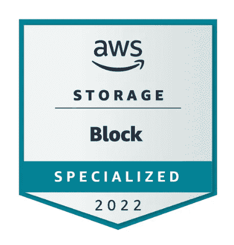

# AWS 存储学习计划:块存储。你需要知道的(+10 个问题)。

> 原文：<https://medium.com/codex/aws-storage-learning-plan-block-storage-what-you-need-to-know-10-questions-9083359ae9d5?source=collection_archive---------1----------------------->

图 1: AWS 学习:块存储徽章

在当今世界，来自亚马逊、微软或谷歌等公司的云是众所周知的，并被许多公司最大限度地使用。云服务是不断更新的，因此我们每个人都必须不断改进和学习新信息。12 月初，我收到信息，AWS 提供了 5 个完全…