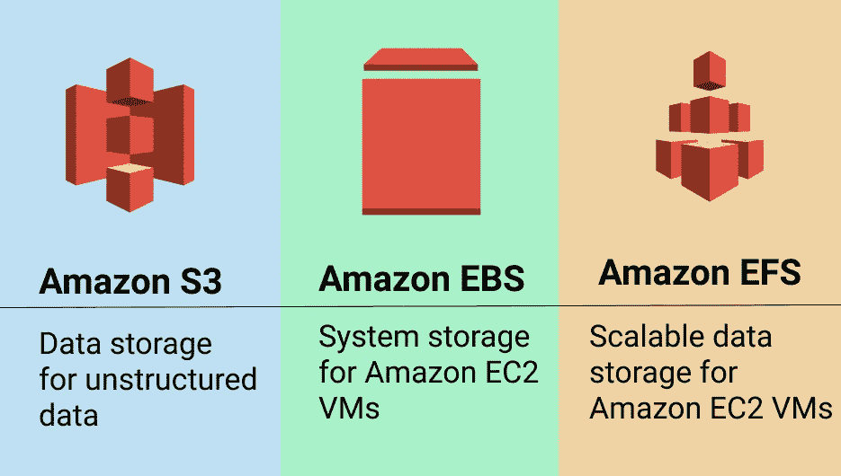

# AWS 存储类型

> 原文：<https://medium.com/codex/aws-storage-types-d7e8b847936d?source=collection_archive---------6----------------------->

选择最佳存储选项对您获得的性能以及您将花费的成本起着重要作用。

在本文中，我们将探索 AWS 提供的不同存储类型，即[亚马逊简单存储服务(亚马逊 S3)](https://aws.amazon.com/s3/) 、[亚马逊弹性块存储(亚马逊 EBS)](https://aws.amazon.com/ebs/) 和[亚马逊弹性文件系统(亚马逊 EFS)](https://aws.amazon.com/efs/) ，并了解每个解决方案的独特优势和使用案例。这将有助于选择最佳解决方案来支持您的业务目标和存储需求。

***AWS S3 -简单存储服务*** 是对象级存储，当您希望数据一次写入多次读取(WORM)时，这是首选。

每个对象都有自己唯一的标识符或键，可以从任何位置通过 web 请求进行访问。S3 还支持静态网页内容托管，可以从 S3 桶或 AWS CloudFront 访问。S3 非常安全，提供“11 个 9”的数据持久性，即 99.999999999。S3 是可扩展的，不需要规划规模，并驻留在区域级别，其名称是全球性的和独特的。

S3 数据不仅限于 EC2，存储在 S3 的文件可以通过编程或直接从 AWS CloudFront 等服务中访问。许多网站使用 S3 来存储它们的图像和静态内容。 *S3 不适合托管操作系统或数据库。*

## **AWS S3 优势:**

1.  *行业领先的性能、可扩展性、可用性和耐用性* -扩展和缩减您的存储资源以满足不断变化的需求，无需前期投资或资源采购周期。亚马逊 S3 旨在实现 99.999999999% (11 个 9)的数据持久性，因为它会自动创建和存储跨多个系统的所有 S3 对象的副本。
2.  *经济高效的存储类别* -通过选择正确的存储类别来节省存储数据的成本。您可以使用 S3 存储类别分析来发现应该根据访问模式转移到低成本存储类别的数据，并配置 S3 生命周期策略来执行转移。

点击这里[https://aws.amazon.com/s3/storage-classes/](https://aws.amazon.com/s3/storage-classes/)了解更多关于 S3 储物课程的信息。

3.*无与伦比的安全性、合规性和审计能力* -通过阻止公共访问、使用不同的加密选项对数据进行加密，以及定义策略以提供对存储桶的细粒度访问，来保护您的 S3 数据。

## **AWS S3 使用案例:**

1.  *备份和恢复* -与亚马逊 S3 一起构建可扩展、持久、安全的备份和恢复解决方案。AWS 和 APN 合作伙伴可以帮助您满足恢复时间目标(RTO)、恢复点目标(RPO)和法规遵从性要求。
2.  *灾难恢复*——借助亚马逊 S3 存储、S3 跨区域复制和其他 AWS 计算、网络和数据库服务，您可以保护运行在 AWS 云或您的内部环境中的关键数据、应用程序和 IT 系统，而不会产生第二个物理站点的费用。
3.  *数据湖和大数据分析* -通过在 S3 建立数据湖来加速您的创新，并使用就地查询、分析和机器学习工具提取有价值的见解。

***AWS EBS-Elastic Block Storage***是连接到您的 EC2 实例的虚拟硬盘。亚马逊 EBS 为[亚马逊弹性计算云(EC2)](https://aws.amazon.com/ec2/) 实例提供高可用性块级存储卷。它将数据存储在一个文件系统中，该文件系统在 EC2 实例关闭后仍然保留。这些卷按照大小进行配置，并以类似于物理机上本地磁盘驱动器的方式连接到 EC2 实例。

各种各样的工作负载，如关系和非关系数据库、企业应用程序、容器化应用程序、大数据分析引擎、文件系统和媒体工作流，都广泛部署在 Amazon EBS 上。

*AWS EBS 卷类型* -固态硬盘(SSD)、硬盘(HDD)和前代产品。

## AWS EBS 的优势:

1.  *适用于任何工作负载的性能* -配备不同驱动器的硬盘和 SDD 可为您提供最高性能。
2.  *高可用性和耐用性* - EBS 卷旨在通过在可用性区域(AZ)内复制来防止故障，提供 99.999%的可用性。EBS 为需要 99.999%耐用性的客户提供高耐用性卷(io2)，尤其是针对他们的业务关键型应用程序。
3.  *虚拟无限扩展* - EBS 使您能够在不中断关键工作负载的情况下增加存储，只需点击几下鼠标即可从 GB 增加到 PB。快照可用于跨区域的可用性分区快速恢复新卷，从而实现快速扩展。

## AWS EBS 使用案例:

1.  *企业应用* - Amazon EBS 提供高可用性和高耐用性的块存储，以便在 AWS 上的 VMware Cloud 上可靠地运行任务关键型应用，如 Oracle、SAP、Microsoft Exchange、Microsoft SharePoint 和 VMware 应用。
2.  *关系数据库* - Amazon EBS 随着您的性能需求而扩展，SAP HANA、Oracle、Microsoft SQL Server、MySQL 和 PostgreSQL 等数据库广泛部署在 Amazon EBS 上。
3.  *NoSql 数据库*——亚马逊 EBS 卷为运行 Cassandra、MongoDB 和 CouchDB 等 NoSql 数据库提供了一致的低延迟性能。

***AWS EFS -弹性文件系统*** 是一个存储系统，让您无需配置或管理存储即可共享文件数据。

亚马逊 EFS 提供可扩展的文件存储，也针对 EC2 进行了优化。它可以用作在多个实例上运行的任何应用程序或工作负载的公共数据源。使用 EFS 文件系统，您可以配置实例来挂载文件系统。

EFS 可用于您的云资源以及内部资源。有了亚马逊 EFS，您可以在添加和删除文件时自动扩展和收缩文件系统，无需为适应增长而调配和管理容量。我们可以将 EFS 比作本地技术中的 NFS(网络文件共享)。

*亚马逊 EFS 提供四种存储类别:*两种标准存储类别，亚马逊 EFS 标准和[亚马逊 EFS 标准-非频繁访问](https://aws.amazon.com/efs/features/infrequent-access/) (EFS 标准-IA)，以及两种单区域存储类别，亚马逊 EFS 单区域和[亚马逊 EFS 单区域-非频繁访问](https://aws.amazon.com/efs/features/infrequent-access/) (EFS 单区域-IA)。

## AWS EFS 的优势:

1.  *可扩展性能* -亚马逊 EFS 旨在根据工作负载提供高吞吐量、IOPS 和低延迟。它可以支持超过 10gb/秒和超过 500，000 IOPS 的性能。
2.  *动态弹性* -当您在 EFS 系统中添加或删除文件时，它会自动缩放以满足需求。您只需创建文件系统并开始添加文件，而无需提前调配存储。
3.  *安全性和合规性* -亚马逊 EFS 允许您使用现有的安全基础设施安全地访问您的文件。通过加密静态和传输中的数据来保护您的数据。亚马逊 EFS 还满足许多资格和合规要求，以帮助您满足您的监管需求。

## AWS 使用案例:

1.  *应用程序开发和测试*——EFS 为您在开发和测试阶段存储和共享代码及其他文件提供了最便捷的方式。只需点击几下鼠标，您就可以调配、复制、扩展或归档您的测试、开发和生产环境。
2.  *分析和机器学习* - EFS 提供机器学习和大数据分析工作负载所需的易用性、规模、性能和一致性。数据科学家和业务分析师可以使用 EFS 创建个性化的环境，主目录存储笔记本文件、培训数据和模型工件。
3.  *提升和转移应用支持*——EFS 具有弹性、可用性和可伸缩性。它使您能够轻松快速地移动企业应用程序，而无需重新设计它们。

## 结论

Amazon 提供不同类型的存储方法，客户需要根据他们寻求的优势和工作负载的使用情形来选择存储类型。对每种存储类型进行适当的研究，针对您的使用情形测试环境，并选择符合您要求的最佳类型。