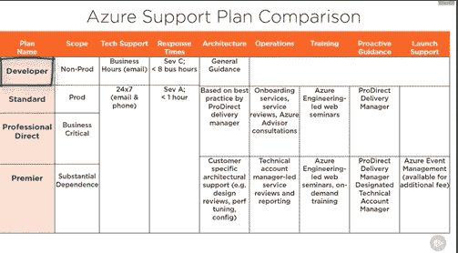

# AZ-900 Azure 基础考试笔记

> 原文：<https://medium.com/codex/az-900-azure-fundamental-exam-notes-96e6f458097a?source=collection_archive---------1----------------------->

Azure 支持计划的多视角图像

● AZ-900 Azure 基础考试笔记。这些笔记将帮助你通过 AZ-900 考试(Azure 云计算服务基础的考试)。考试措施:

●20–25%的云概念；15–20%的核心 Azure 服务；10–15%的核心解决方案和管理工具；10–15%的一般安全和网络安全；20–25%的身份、治理、隐私和法规遵从性；10–15%的成本和服务