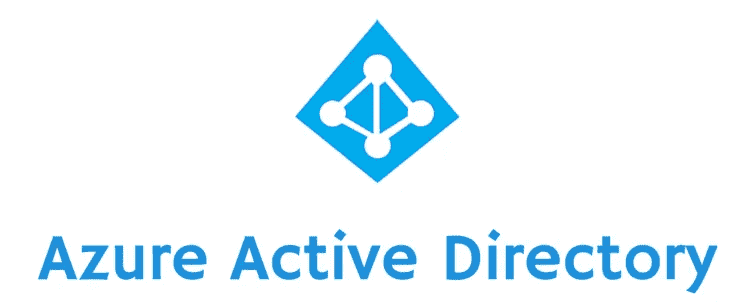

# Azure 活动目录

> 原文：<https://medium.com/codex/azure-active-directory-6f5b3b490b5?source=collection_archive---------20----------------------->

Azure Active directory 或更常见的 Azure AD 是 Azure 提供的主要身份访问管理服务，为用户提供对资源的访问。Azure AD 也可以用于内部部署、纯云以及混合系统，但是，对于混合系统，需要稍加修改以实现最佳功能，稍后将详细介绍。

为了更好地理解 Azure AD 的角色，最好确保我们熟悉域控制器。域控制器是一种服务器，它响应安全身份验证请求并验证计算机网络域中的用户。域控制器还负责确保访问凭据的安全。Azure AD 是访问 Azure 中服务的域控制器的一个例子。Azure AD 使用基于云的认证协议，如 OAuth 和 SAML。

作为一个身份验证系统，Azure AD 为其用户提供了以下好处:

*   ***集中用户管理—*** 这意味着员工不必担心为他们使用的所有服务记住多个密码。它们只需要一个可以应用于所有 Azure 服务的用户 id 和密码，对服务的访问由系统管理员提供。
*   ***组策略的应用—*** 组策略可以根据用户在组织中的角色直接应用和分配给用户，具有相同角色的员工通常会使用相同的服务，从而通过实施定义好的预定义组策略来减少入职员工的访问配置工作。
*   ***加密的用户凭证***—Azure AD 存储的所有用户信息都经过加密，如果管理员对当前的 Azure 安全策略不满意，还可以应用额外的安全层。
*   ***消除了与域控制器设置相关的问题*** — Azure AD 作为一个完全托管的解决方案，像大多数其他 Azure 服务一样，消除了对硬件和安装成本以及与管理员实现其域控制器相关的其他成本的需求。

尽管有上述好处，Azure AD 仍然有潜在的风险，例如:

*   ***网络攻击企图*** —集中用户访问管理凭证会刺激黑客和其他第三方恶意尝试访问 Azure AD 存储的记录。正如我们之前提到的，Azure AD 确保了数据的安全性。
*   ***受 Azure 宕机影响*** —像所有其他 Azure 服务一样，它依赖于 Azure 不会面临任何中断。如果停电影响到用户所在的区域，可能的解决方法是利用分发和复制选项。
*   ***操作系统更新影响*** —如果 Azure 停止支持它可能逐步淘汰的某些 Windows 操作系统，可能会出现身份验证问题。这是一种罕见的事件，可能在极端情况下发生，例如，如果发现操作系统中存在安全漏洞，但却找不到解决方案。

如前所述，当运行纯 Azure 云环境时，Azure AD 是最佳选择，将满足少数边缘情况之外的大多数管理员需求。运行混合云系统时，与本地网络和云数据的访问相关的数据可能无法简化，这可能会导致身份验证问题。对于混合实现，最好包括 Azure AD Connect，它可以同步 Azure AD 中的数据，从而确保本地和云访问上的身份验证不会出现问题。