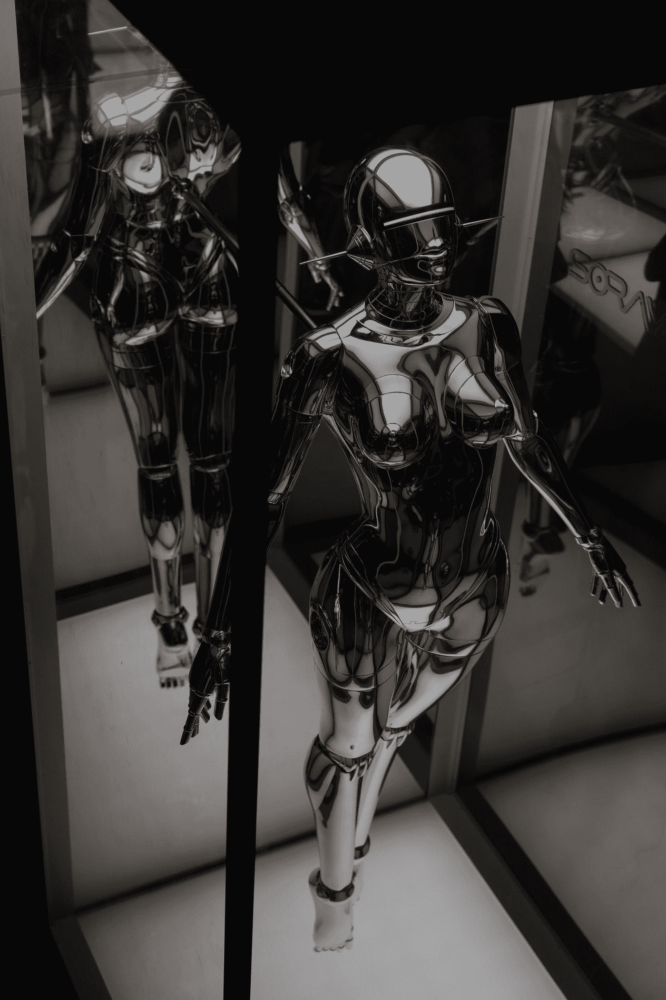

# Azure AI 基础知识-计算机视觉和机器学习

> 原文：<https://medium.com/codex/azure-ai-fundamentals-computer-vision-and-machine-learning-b666ee2aad08?source=collection_archive---------13----------------------->

这是一个关于人工智能如何与微软提供的名为 Azure 的云计算服务相结合的故事。人工智能可以改善医疗保健等领域，增强智能基础设施，并有助于娱乐体验& Azure 允许开发者从云服务中充分利用人工智能的力量。人工…