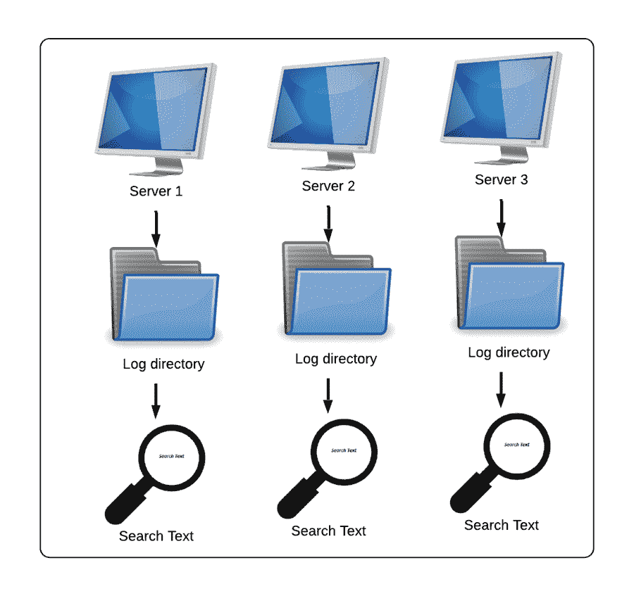
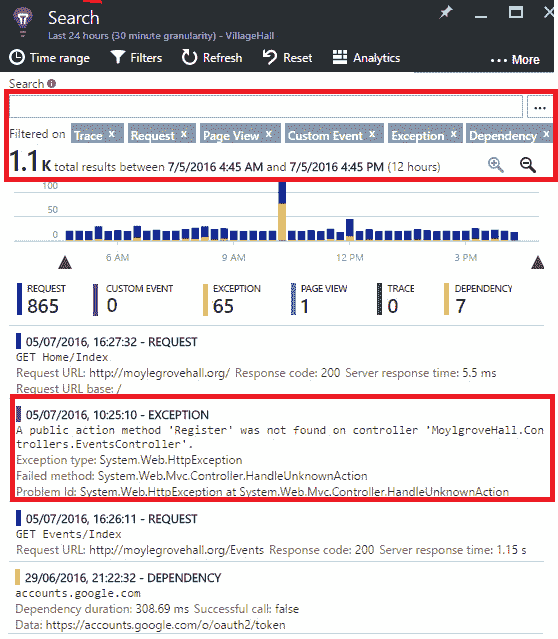

# Sitecore 应用中的 Azure 应用洞察

> 原文：<https://medium.com/codex/azure-application-insights-in-sitecore-applications-c5d52aee7668?source=collection_archive---------22----------------------->

## [法典](http://medium.com/codex)

在现代社会，用户体验通过增加网站的重复用户数量，在推动销售方面发挥着重要作用。如果你是一个用户，如果网站以最佳性能运行，你通常会认为你的网站体验是一流的。换句话说，网站的最优性能对决定一个网站的用户体验起着关键作用。现在重要的问题是——如何衡量一个网站的表现，以及我们如何改善它。

想象一下健身房里的私人教练。这里有一个人监督我们的表现，并建议我们所需的锻炼和饮食计划。同样，我们的网站需要一个私人教练。有人可以监控我们的应用程序，提供性能异常，并提供一些分析的基础上。

Azure 对此有一个答案——Azure Application Insights。它广泛用于测量应用程序的性能。让我们从什么是 Azure Application Insights 开始，到如何在 Sitecore 应用程序中使用 **Azure Application Insights，来深入了解细节。**

**目录**

1.  什么是 Azure Application Insights？
2.  使用 Sitecore 日志的难点
3.  Sitecore 的应用洞察
4.  基于日志的应用洞察
5.  包扎

# 什么是 Azure Application Insights？

Application Insights 是微软 Azure 提供的平台即服务(PaaS)产品。这是一个轻量级的 web 应用程序性能管理服务。它用于监控实时应用程序，自动检测性能异常，甚至提供分析工具来诊断问题和了解 web 应用程序的使用模式。

它支持多种平台，包括 Java、.NET、Node.js 和 Python。借助所有这些内置功能，应用洞察将能够及时解决问题，并提供持续改进的机会。

# 使用 Sitecore 日志时遇到的棘手问题

与定制的应用程序相比，使用 Sitecore 的优势在于 Sitecore 提供了许多内置特性，其中之一就是日志记录。

默认情况下，Sitecore 提供基于 Log4Net 的日志记录。它不仅提供了将数据写入日志文件的能力，还提供了删除旧日志文件的内置逻辑，旧日志文件会阻止服务器硬盘被填满。

然而，在大型网站解决方案中，标准日志往往会变得庞大，每当我们注意到安装问题时，找到准确的跟踪信息就成了一项繁琐的任务。我们将在本文的后面部分再次讨论这个问题。

# Sitecore 的应用洞察

到目前为止，您已经看到了最常见的棘手问题，即在需要时从日志中找出错误。因此，它自动导致一个问题——“如何克服这一点，我们如何提供错误的更新或警告它正在网站上发生”。

应用洞察在这里派上了用场。从问题的角度来看，我们希望 Sitecore 向 Application Insights 发送错误、警告和信息日志。除了应用洞察之外，它还捕获服务器响应时间、页面加载时间、失败的请求、收到的请求以及所有连接组件的应用图。

这是我们从应用洞察中获得的大量信息。但是，它将如何帮助仍然试图在日志中找到错误的技术支持团队，找出问题并解决问题呢？

# 基于日志的应用洞察

要了解使用 application insights 优于日志的优势，请考虑这样一个场景:网站上的一个页面抛出 500 个错误，技术支持人员正在试图找出错误。

如果使用日志，技术支持团队必须获得出错页面的信息以及出错的日期。然后，团队必须转到日志目录并找到用户提到的日期的日志(如果用户与服务器来自同一个时区，那么我们可以直接检查提供时间的日志，否则团队必须将其转换为服务器的时区并检查相关的日志)。

一旦确定了所需数据的日志文件，团队就必须使用任何文本编辑器或查看日志的特定工具打开它，并搜索文件的关键字来确定错误。如果搜索结果没有提供任何结果，则必须对更多不同时间戳的日志文件重复相同的操作(并非所有报告问题的用户都提供了问题发生的确切日期和时间)。

有时，当我们实现一个负载平衡器并拥有多个 Sitecore 应用程序实例时，用户提供的时间戳不足以一次性解决问题。这是因为团队必须首先找出用户使用了应用程序的哪个实例，并在特定日期的日志中搜索所需的文本。

一旦确定了搜索关键字，就必须从日志中找出错误描述或堆栈跟踪，以确定错误的根本原因。看起来是不是一个繁琐又费力的过程？肯定是的。让我们看看如何利用应用洞察实现同样的目标。

对于 Application Insights，要从 Sitecore 的所有实例中提取信息，可以应用“角色”过滤器从 Sitecore 的所有交付实例中获取事件。下一步是过滤掉异常。现在，我们可以应用添加了缓冲时间的日期时间过滤器，以避免用户错误。您只需遵循上述步骤，application insights 将提供在规定时间内所有实例中发生的错误列表。

*图片来源:微软*

看起来是不是很简单？与查看日志的传统方式相比，这难道不是一种更快的方法吗？

# 包扎

现在你已经看到了如何在 Sitecore 应用程序中使用 **Azure Application Insights，你会意识到当它与 Sitecore 结合时，Azure Application Insights 是一个真正的宝石。有趣的是，它不仅仅局限于 Sitecore，它几乎可以与当前运行的任何 web 应用程序捆绑在一起。它还可以立即提供一些关于应用程序的很酷的分析见解。**

*原载于*[*https://www . partech . nl*](https://www.partech.nl/nl/publicaties/2020/10/azure-application-insights-in-sitecore-applications)*。*