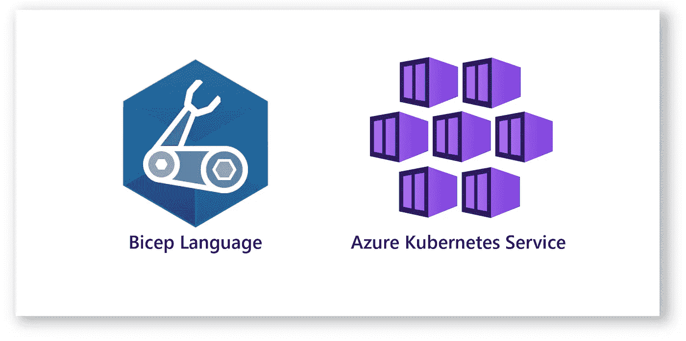
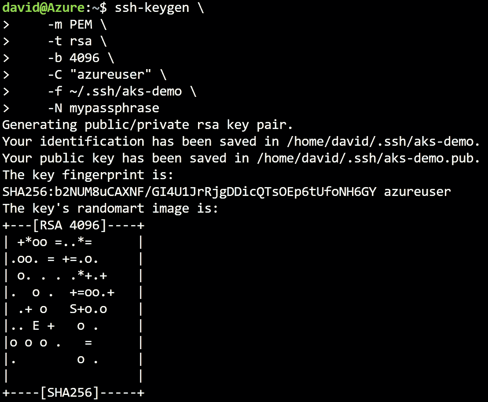
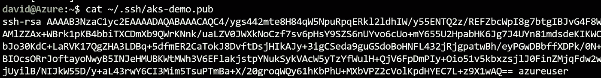
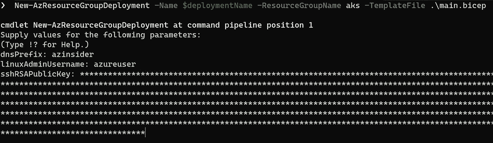
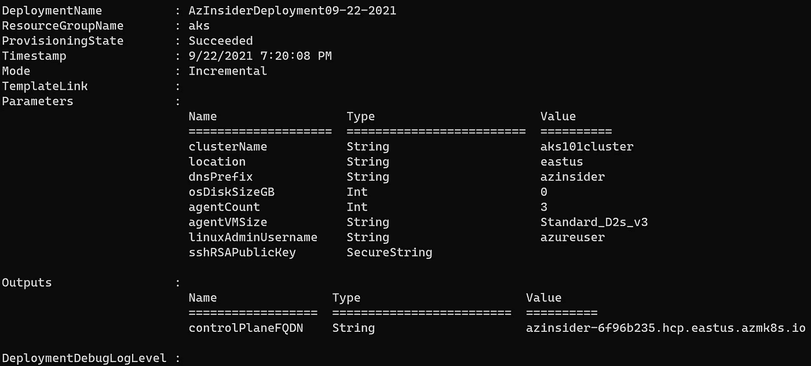
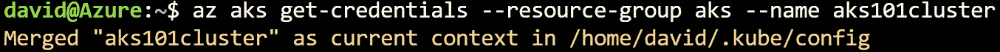
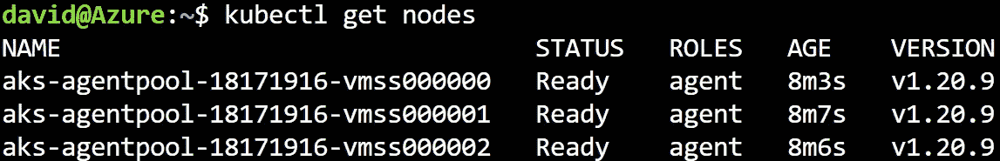

# 💪☸Azure Bicep:部署 Azure Kubernetes 集群—模板

> 原文：<https://medium.com/codex/azure-bicep-deploy-azure-kubernetes-cluster-template-f076b05c390b?source=collection_archive---------3----------------------->

使用 Azure Bicep 部署 Azure Kubernetes 集群的快速指南。

在本文中，我们将回顾如何使用 Azure Bicep 模板部署 AKS 集群。在本文结束时，您将拥有一个完全可用的 Bicep 模板来部署 Azure Kubernetes 集群。



Azure Bicep —部署 Azure Kubernetes 集群

## 先决条件。

*   有效的 Azure 订阅
*   具有所有者/贡献者角色的帐户
*   资源组
*   SSH 密钥

我们将执行以下步骤:

*   创建 SSH 密钥
*   复习二头肌模板
*   部署 AKS 集群

让我们从创建 SSH 密钥开始。

# 用 ssh-keygen 生成密钥

首先，我们将使用 Azure Cloud Shell 创建 SSH 密钥。在 Azure 门户网站中，你可以申请一个新的云外壳，或者前往[https://shell.azure.com](https://shell.azure.com)在你的浏览器中打开云外壳。

以下示例显示了如何创建 SSH RSA 密钥对:

```
ssh-keygen \
    -m PEM \
    -t rsa \
    -b 4096 \
    -C "azureuser" \
    -f ~/.ssh/aks-demo \
    -N mypassphrase
```

如果当前位置存在 SSH 密钥对，这些文件将被覆盖。默认情况下，SSH 密钥保存在~/中。ssh 目录。

# ssh-keygen 示例

下图显示了 SSH 密钥的创建。



Azure — SSH 密钥

运行' *cat* ，替换' *~/，就可以看到你的公钥。ssh/id_rsa.pub* '以及您自己的公钥文件位置，在本例中为' *cat ~/。ssh/aks-demo.pub* ，如下图所示:



Azure — SSH 公钥

现在我们有了 SSH 密钥，下一步是使用 Bicep 模板。

# 使用 Azure Bicep 模板部署 Azure Kubernetes 服务群集。

## Azure 二头肌模板-参数

让我们定义参数。下面的代码显示了参数的定义。我们将使用一些装饰器来提供描述并控制参数的长度:

```
[@description](http://twitter.com/description)('The name of the Managed Cluster resource.')
param clusterName string = 'aks101cluster'[@description](http://twitter.com/description)('The location of the Managed Cluster resource.')
param location string = resourceGroup().location[@description](http://twitter.com/description)('Optional DNS prefix to use with hosted Kubernetes API server FQDN.')
param dnsPrefix string[@minValue](http://twitter.com/minValue)(0)
[@maxValue](http://twitter.com/maxValue)(1023)
[@description](http://twitter.com/description)('Disk size (in GB) to provision for each of the agent pool nodes. This value ranges from 0 to 1023\. Specifying 0 will apply the default disk size for that agentVMSize.')
param osDiskSizeGB int = 0[@minValue](http://twitter.com/minValue)(1)
[@maxValue](http://twitter.com/maxValue)(50)
[@description](http://twitter.com/description)('The number of nodes for the cluster.')
param agentCount int = 3[@description](http://twitter.com/description)('The size of the Virtual Machine.')
param agentVMSize string = 'Standard_D2s_v3'[@description](http://twitter.com/description)('User name for the Linux Virtual Machines.')
param linuxAdminUsername string[@description](http://twitter.com/description)('Configure all linux machines with the SSH RSA public key string. Your key should include three parts, for example \'ssh-rsa AAAAUcyupgH azureuser@linuxvm\'')
[@secure](http://twitter.com/secure)()
param sshRSAPublicKey string
```

在上面的代码中，我们还使用' *@secure()'* decorator 来传递 SSH 密钥。这个装饰器将帮助我们传递 SSH 密钥，而不会暴露值，也不会记录在部署历史中。

## Azure 二头肌模板—资源

下一步是用下面的代码定义托管集群:

```
resource clusterName_resource 'Microsoft.ContainerService/managedClusters@2020-09-01' = {
  name: clusterName
  location: location
  identity: {
    type: 'SystemAssigned'
  }
  properties: {
    dnsPrefix: dnsPrefix
    agentPoolProfiles: [
      {
        name: 'agentpool'
        osDiskSizeGB: osDiskSizeGB
        count: agentCount
        vmSize: agentVMSize
        osType: 'Linux'
        mode: 'System'
      }
    ]
    linuxProfile: {
      adminUsername: linuxAdminUsername
      ssh: {
        publicKeys: [
          {
            keyData: sshRSAPublicKey
          }
        ]
      }
    }
  }
}
```

最后，我们包含了 FQDN 的输出，代码如下:

```
output controlPlaneFQDN string = clusterName_resource.properties.fqdn
```

这是完整的二头肌模板。

```
[@description](http://twitter.com/description)('The name of the Managed Cluster resource.')
param clusterName string = 'aks101cluster'[@description](http://twitter.com/description)('The location of the Managed Cluster resource.')
param location string = resourceGroup().location[@description](http://twitter.com/description)('Optional DNS prefix to use with hosted Kubernetes API server FQDN.')
param dnsPrefix string[@minValue](http://twitter.com/minValue)(0)
[@maxValue](http://twitter.com/maxValue)(1023)
[@description](http://twitter.com/description)('Disk size (in GB) to provision for each of the agent pool nodes. This value ranges from 0 to 1023\. Specifying 0 will apply the default disk size for that agentVMSize.')
param osDiskSizeGB int = 0[@minValue](http://twitter.com/minValue)(1)
[@maxValue](http://twitter.com/maxValue)(50)
[@description](http://twitter.com/description)('The number of nodes for the cluster.')
param agentCount int = 3[@description](http://twitter.com/description)('The size of the Virtual Machine.')
param agentVMSize string = 'Standard_D2s_v3'[@description](http://twitter.com/description)('User name for the Linux Virtual Machines.')
param linuxAdminUsername string[@description](http://twitter.com/description)('Configure all linux machines with the SSH RSA public key string. Your key should include three parts, for example \'ssh-rsa AAAAB...snip...UcyupgH azureuser@linuxvm\'')
[@secure](http://twitter.com/secure)()
param sshRSAPublicKey stringresource clusterName_resource 'Microsoft.ContainerService/managedClusters@2020-09-01' = {
  name: clusterName
  location: location
  identity: {
    type: 'SystemAssigned'
  }
  properties: {
    dnsPrefix: dnsPrefix
    agentPoolProfiles: [
      {
        name: 'agentpool'
        osDiskSizeGB: osDiskSizeGB
        count: agentCount
        vmSize: agentVMSize
        osType: 'Linux'
        mode: 'System'
      }
    ]
    linuxProfile: {
      adminUsername: linuxAdminUsername
      ssh: {
        publicKeys: [
          {
            keyData: sshRSAPublicKey
          }
        ]
      }
    }
  }
}output controlPlaneFQDN string =clusterName_resource.properties.fqdn
```

现在我们有了二头肌模板，下一步是部署二头肌模板。我们之前在 Azure 订阅中创建了一个资源组。

现在我们将使用下面的代码部署 Bicep 模板:

```
New-AzResourceGroupDeployment -Name $deploymentName -ResourceGroupName aks -TemplateFile .\main.bicep
```

上面的代码将部署定位到名为“aks”的资源组，并提供名为“main.bicep”的模板文件。

下图显示了该资源的部署:



正如您在上面看到的，我们提供了' *dnsPrefix* '、*linuxdadminusername*'和 SSH 密钥的值。

几分钟后，您应该会看到如下所示的部署输出:



天蓝色二头肌——天蓝色 Kubernetes 集群

现在让我们验证部署。

# 验证部署

在您的 Azure Cloud Shell 中，使用以下命令获取凭据:

```
az aks get-credentials --resource-group aks --name aks101cluster
```

下图显示了上面命令的输出:



Azure Kubernetes 集群—获取凭据

现在，让我们使用下面的命令来获取节点列表:

```
kubectl get nodes
```

下图显示了上面命令的输出:



Azure Kubernetes 集群节点

上面的输出显示了在 Azure Kubernetes 集群中创建的节点。

如你所见，使用 Azure Bicep 非常简单。

请随意测试上面的 Bice 模板来部署 Azure Kubernetes 集群，并在评论中提供您的反馈。

[*在此加入****azin sider****邮箱列表。*](http://eepurl.com/gKmLdf)

*-戴夫·r·*